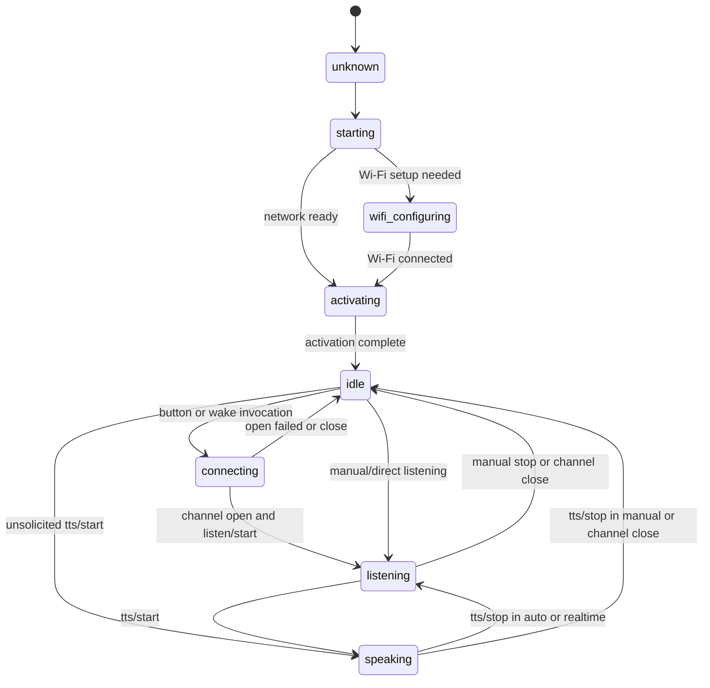

# Phase 0 — Khảo sát hai repo tham chiếu

> Trạng thái: snapshot Phase 0 đã hoàn tất và từng được dừng ở phase gate; Phase 1
> sau đó đã được chủ dự án duyệt.  
> Ngày chụp: 2026-08-03.  
> Firmware: `xiaozhi-esp32@dd99da00dc4c89ed4ab07fcec038c03f13f4de50`.  
> Server/manager: `xiaozhi-esp32-server@de45f73efdd24e9343427a56b5d22f857b6bb7a7`.

## 0. Phạm vi và cách đọc tài liệu

Tài liệu này ghi lại hành vi quan sát được trực tiếp từ hai snapshot trong `references/`; không coi chúng là codebase để fork và không thiết kế chi tiết sản phẩm Veetee ở Phase 0. Mỗi nhận định về repo tham chiếu đều đi kèm vị trí `path:line-line`. Các đoạn JSON chỉ minh họa hình dạng wire tối thiểu, không sao chép nguyên khối implementation.

Quy ước:

- **C → S**: device/firmware gửi lên server.
- **S → C**: server gửi xuống device/firmware.
- **Direct WebSocket**: firmware nối thẳng tới Python backend.
- **MQTT/UDP**: MQTT mang control JSON, UDP mang audio; Python backend trong snapshot không trực tiếp terminate hai transport này.
- **Observed contract**: hành vi code thực tế. Khi documentation/default config và code path khác nhau, tài liệu ghi cả hai, không tự chọn một phía làm “đúng”.

Giới hạn bằng chứng quan trọng: source của `xiaozhi-mqtt-gateway` và `mcp-endpoint-server` không nằm trong hai repo được giao; tài liệu server chỉ dẫn clone các repo ngoài (`references/xiaozhi-esp32-server/docs/mqtt-gateway-integration.md:3-10`, `references/xiaozhi-esp32-server/docs/mcp-endpoint-enable.md:8-20`). Vì vậy, firmware cho biết chính xác packet MQTT/UDP mà nó tạo/nhận; backend Python chỉ cho biết frame WebSocket nội bộ giữa gateway và backend, không đủ để suy ra toàn bộ mapping ở giữa.

### 0.1 Ranh giới naming của dự án đích

Tên repo tham chiếu chỉ xuất hiện trong **tài liệu khảo sát này**, đường dẫn citation và literal wire được quan sát; đó là provenance bắt buộc để kiểm chứng Phase 0. Dự án đích không được kế thừa brand, namespace, package, database prefix, API resource name hay UI copy của source: bốn thành phần chỉ dùng `veetee-*` hoặc tên trung tính.

Endpoint path được firmware cấp bằng config, còn Python reference không route-guard `/xiaozhi/v1/` (`references/xiaozhi-esp32/main/protocols/websocket_protocol.cc:79-106`, `references/xiaozhi-esp32-server/main/xiaozhi-server/core/websocket_server.py:71-79`). Vì vậy Phase 1 có thể dùng route trung tính như `/veetee/v1/`; compatibility test/adapter giữ legacy endpoint dưới dạng cấu hình fixture khi thật sự cần nối peer cũ, không đưa brand tham chiếu vào domain model hay public naming của Veetee.

### 0.2 Mô hình thực thi AI-first

Chủ dự án xác định phần lớn implementation sẽ do AI coding model(s) thực hiện,
tuỳ tình huống có thể tuần tự hoặc phối hợp. Vì vậy các tài liệu Phase 1/2 phải
đóng vai trò **executable specification**: tên và boundary ổn định;
input/output/error/cancellation rõ; schema versioned; wire golden fixtures; state
transition table; test oracle; resource/latency budget; và Definition of Done có
lệnh kiểm chứng. Không để quyết định quan trọng tồn tại dưới dạng ngầm hiểu;
milestone là acceptance gate, phần trăm tiến độ nếu có chỉ là thông tin và không
được gắn thành lịch ngày hoàn thành từng phần.

Skill chỉ là procedural aid, không phải nguồn chân lý kiến trúc. Project docs, ADR đã duyệt, protocol fixtures và test evidence luôn ưu tiên cao hơn hướng dẫn generic của skill; điều này đặc biệt quan trọng với timing/owner-task quirks của ESP-IDF và compatibility behavior đã ghi trong tài liệu này. Không cần chia branch/worktree để áp dụng các tài liệu này.

---

## 1. Repo tham chiếu #1 — `xiaozhi-esp32`

### 1.1 Cây thư mục cấp 1–2

```text
xiaozhi-esp32/
├── .github/workflows/        CI build/test theo board variant
├── docs/                     protocol, MCP, custom board, migration
├── main/
│   ├── assets/               locale, sound, font/model assets
│   ├── audio/                codec I/O, engines, wake word, Opus queues
│   ├── boards/               common abstractions + implementation từng board
│   ├── display/              display/OLED/LCD/LVGL abstraction
│   ├── led/                  LED abstraction theo state
│   ├── protocols/            common Protocol, WebSocket, MQTT/UDP
│   ├── application.*         orchestration và main event loop
│   ├── device_state*         state machine có kiểm tra transition
│   ├── mcp_server.*          device-side MCP registry/dispatcher
│   ├── ota.*                 activation/OTA và transport config
│   └── settings.*            typed NVS settings
├── partitions/v1,v2/         flash/OTA/assets layouts
└── scripts/                  build matrix và asset/build utilities
```

`app_main` chỉ chuẩn bị NVS rồi giao vòng đời cho `Application::Initialize()` và `Application::Run()`; `Run()` là vòng lặp không trả về (`references/xiaozhi-esp32/main/main.cc:14-28`). Danh sách source chính cho audio, display, protocol, MCP, OTA, settings và state machine được ghép tại build system (`references/xiaozhi-esp32/main/CMakeLists.txt:1-45`).

Các ranh giới module đáng chú ý:

- `audio/` tách codec I/O, input engine, Opus và network/playback queues; các execution task cũng được ghi rõ trong tài liệu nội bộ (`references/xiaozhi-esp32/main/audio/README.md:1-20`, `references/xiaozhi-esp32/main/audio/README.md:64-72`).
- `boards/` dùng `Board` factory/singleton với interface cho audio, display, LED, camera, network, battery và power mode (`references/xiaozhi-esp32/main/boards/common/board.h:46-90`). Display và LED dùng abstraction/null-object để capability có thể vắng mặt (`references/xiaozhi-esp32/main/display/display.h:32-85`, `references/xiaozhi-esp32/main/led/led.h:4-15`).
- Board vật lý được chọn ở compile time bằng Kconfig; CMake chỉ đưa source của `BOARD_DIR` đã chọn vào build (`references/xiaozhi-esp32/main/Kconfig.projbuild:120-132`, `references/xiaozhi-esp32/main/CMakeLists.txt:834-872`). Đây là board architecture, không phải runtime plugin system.
- Assets có thể chứa model, font, sound và theme; partition v2 dành vùng riêng cho các asset này (`references/xiaozhi-esp32/main/assets.h:31-67`, `references/xiaozhi-esp32/partitions/v2/README.md:1-22`).
- CI chọn variant theo diff, chạy unit test tooling và build board matrix (`references/xiaozhi-esp32/.github/workflows/build.yml:15-35`, `references/xiaozhi-esp32/.github/workflows/build.yml:67-92`).

### 1.2 Cách chọn board, config và transport

Mỗi board có `config.json` mô tả chip target, release variants và phần `sdkconfig_append`; build script resolve `CONFIG_BOARD_TYPE_*`, tái tạo sdkconfig và giữ `BOARD_NAME` tương thích (`references/xiaozhi-esp32/main/boards/bread-compact-wifi/config.json:1-17`, `references/xiaozhi-esp32/scripts/build.py:889-955`, `references/xiaozhi-esp32/scripts/build.py:976-1015`). Settings runtime là key/value typed theo namespace NVS (`references/xiaozhi-esp32/main/settings.h:7-25`, `references/xiaozhi-esp32/main/settings.cc:8-18`).

OTA response có thể ghi WebSocket hoặc MQTT config vào NVS. Nếu response có cả hai, MQTT được ưu tiên; khi runtime transport lỗi, snapshot không có automatic failover MQTT ↔ WebSocket (`references/xiaozhi-esp32/main/ota.cc:146-185`, `references/xiaozhi-esp32/main/application.cc:495-509`).

---

## 2. Repo tham chiếu #2 — `xiaozhi-esp32-server`

### 2.1 Cây thư mục cấp 1–2

```text
xiaozhi-esp32-server/
├── docs/                    deployment và hướng dẫn tích hợp
└── main/
    ├── xiaozhi-server/      Python realtime data plane
    ├── manager-api/         Java/Spring management control plane
    ├── manager-web/         Vue dashboard
    ├── manager-mobile/      uni-app/Vue mobile console
    └── digital-human/       browser client + wake-word test runtime
```

Repo tự mô tả năm thành phần, stack và port của chúng tại `references/xiaozhi-esp32-server/main/README_en.md:87-94`. Trong đó `xiaozhi-server` có cấu trúc chính:

```text
xiaozhi-server/
├── app.py                   process entrypoint
├── config.yaml              base config và provider catalog
├── config/                  config/API loading, logging, manager client
├── core/
│   ├── api/                 OTA và vision HTTP handlers
│   ├── handle/              JSON/audio message handlers
│   ├── providers/           ASR/VAD/LLM/TTS/Intent/Memory/VLLM/Tools
│   ├── utils/               codecs, pacing, factories, dialogue helpers
│   ├── websocket_server.py
│   ├── connection.py
│   └── http_server.py
├── plugins_func/            server-side function plugins
├── models/                  bundled local model assets
└── performance_tester/      provider benchmarks
```

Các vai trò trên khớp mô tả module của repo (`references/xiaozhi-esp32-server/main/README_en.md:100-143`). `app.py` chạy WebSocket server và auxiliary HTTP server trong cùng asyncio event loop (`references/xiaozhi-esp32-server/main/xiaozhi-server/app.py:46-76`); HTTP phụ đăng ký OTA và vision routes (`references/xiaozhi-esp32-server/main/xiaozhi-server/core/http_server.py:35-86`).

### 2.2 Manager API và manager web

`manager-api` là Spring Boot application (`references/xiaozhi-esp32-server/main/manager-api/src/main/java/xiaozhi/AdminApplication.java:1-12`). Các package/controller chính bao phủ agent, device, model/provider và runtime config (`references/xiaozhi-esp32-server/main/manager-api/src/main/java/xiaozhi/modules/agent/controller/AgentController.java:60-139`, `references/xiaozhi-esp32-server/main/manager-api/src/main/java/xiaozhi/modules/device/controller/DeviceController.java:134-177`, `references/xiaozhi-esp32-server/main/manager-api/src/main/java/xiaozhi/modules/model/controller/ModelController.java:35-104`, `references/xiaozhi-esp32-server/main/manager-api/src/main/java/xiaozhi/modules/config/controller/ConfigController.java:20-54`).

`manager-web` dùng Vue 2.6, Element UI, Vue Router, Vuex và Vue I18n (`references/xiaozhi-esp32-server/main/manager-web/package.json:13-41`). Web có locale Vietnamese cùng Chinese, English, German và Portuguese; mỗi API request gắn `Accept-Language` và bearer token user (`references/xiaozhi-esp32-server/main/manager-web/src/i18n/index.js:1-55`, `references/xiaozhi-esp32-server/main/manager-web/src/apis/httpRequest.js:30-49`).

Cây source cấp 1–2 liên quan trực tiếp tới control plane:

```text
manager-api/src/
├── main/java/xiaozhi/
│   ├── common/              cross-cutting framework/utilities
│   └── modules/             agent, device, model, config, security, ...
└── main/resources/
    ├── mapper/              MyBatis mappings
    ├── db/changelog/        Liquibase migrations
    └── i18n/                API message catalogs

manager-web/src/
├── apis/                    typed-by-domain HTTP clients
├── components/              reusable dialogs/forms
├── views/                   dashboard feature pages
├── router/                  route table
├── store/                   Vuex state
└── i18n/                    locale loading/fallback
```

Module domains được phản ánh trong agent/device/model/config controllers đã dẫn ở trên; Liquibase master yêu cầu tiến hóa schema bằng change set mới (`references/xiaozhi-esp32-server/main/manager-api/src/main/resources/db/changelog/db.changelog-master.yaml:1-18`). Web tách API client theo domain và route các màn hình device, model/provider, system, knowledge, OTA và voice features (`references/xiaozhi-esp32-server/main/manager-web/src/apis/api.js:1-48`, `references/xiaozhi-esp32-server/main/manager-web/src/router/index.js:56-209`).

---

## 3. Hợp đồng protocol quan sát được

### 3.1 Các bất biến audio cần tách theo chiều

| Thuộc tính | Uplink C → S | Downlink S → C |
|---|---|---|
| Codec | Opus | Opus |
| PCM logical | signed 16-bit, mono | mono, firmware resample nếu codec output khác |
| Sample rate | **16 kHz** | firmware mặc định coi server là **24 kHz**, sau đó nhận override từ server hello |
| Frame duration | **60 ms** | **60 ms** mặc định |
| Samples/frame | 960 ở 16 kHz | 1,440 ở 24 kHz nếu dùng default 24 kHz |
| Compressed bytes/frame | biến đổi; không có fixed size | biến đổi; không có fixed size |

Firmware encoder contract là PCM mono 16 kHz, 960 samples/60 ms; Opus dùng VBR/DTX nên payload biến đổi (`references/xiaozhi-esp32/main/audio/audio_service.h:39-43`, `references/xiaozhi-esp32/main/audio/audio_service.h:65-76`). Firmware giữ default server sample rate 24 kHz/60 ms và resample downlink khi cần (`references/xiaozhi-esp32/main/protocols/protocol.h:77-80`, `references/xiaozhi-esp32/main/audio/audio_service.cc:375-440`). Python direct-WebSocket decoder khởi tạo 16 kHz mono và gọi decode với frame-size ceiling 960; source không tự validate rằng mỗi packet luôn giải mã ra đúng 960 samples. Firmware hiện là phía phát 960 samples/60 ms. Cấu hình hello mặc định cho downlink là 24 kHz mono/60 ms (`references/xiaozhi-esp32-server/main/xiaozhi-server/core/connection.py:529-554`, `references/xiaozhi-esp32-server/main/xiaozhi-server/config.yaml:88-97`).

Không được rút gọn contract thành “Opus 16 kHz hai chiều”: hai chiều khác sample rate trong snapshot này.

Common `Protocol::IsTimeout()` coi audio channel hết hạn sau hơn 120 giây không có inbound packet; đây là session liveness behavior độc lập với timeout 10 giây chờ hello (`references/xiaozhi-esp32/main/protocols/protocol.cc:100-109`).

### 3.2 WebSocket: HTTP upgrade và hello

Firmware đọc `url`, `token`, `version` từ namespace NVS `websocket`; member version mặc định là `1` (`references/xiaozhi-esp32/main/protocols/websocket_protocol.h:24-31`, `references/xiaozhi-esp32/main/protocols/websocket_protocol.cc:79-86`). HTTP upgrade gửi ba header bắt buộc theo implementation và một header auth có điều kiện:

- `Authorization` — chỉ gửi khi token không rỗng; firmware tự thêm prefix `Bearer ` nếu token chưa có khoảng trắng.
- `Protocol-Version` — version lấy từ config client.
- `Device-Id` — MAC address.
- `Client-Id` — UUID ổn định lưu trong NVS.

Nguồn gửi header: `references/xiaozhi-esp32/main/protocols/websocket_protocol.cc:97-106`; cách tạo/lưu UUID: `references/xiaozhi-esp32/main/boards/common/board.cc:15-45`.

Backend công bố endpoint `/xiaozhi/v1/`, nhưng `websockets.serve` không route-guard path trong code này (`references/xiaozhi-esp32-server/main/xiaozhi-server/app.py:103-113`, `references/xiaozhi-esp32-server/main/xiaozhi-server/core/websocket_server.py:71-79`). Backend yêu cầu `device-id`; nếu header thiếu, nó thử lấy `device-id`, `client-id`, `authorization` từ query rồi đóng connection nếu vẫn thiếu device ID (`references/xiaozhi-esp32-server/main/xiaozhi-server/core/websocket_server.py:81-107`). Khi auth bật, device ngoài whitelist phải dùng bearer token gắn với client/device identity (`references/xiaozhi-esp32-server/main/xiaozhi-server/core/websocket_server.py:206-227`).

Client hello tối thiểu mà firmware hiện gửi:

```json
{
  "type": "hello",
  "version": 1,
  "features": {"mcp": true, "glyph_push": false},
  "transport": "websocket",
  "audio_params": {
    "format": "opus",
    "sample_rate": 16000,
    "channels": 1,
    "frame_duration": 60
  }
}
```

`features.aec` chỉ xuất hiện ở build dùng server AEC; MCP luôn được quảng bá. `features.glyph_push` luôn hiện diện dưới dạng boolean; object top-level `text_font` chỉ có khi glyph push được bật (`references/xiaozhi-esp32/main/protocols/websocket_protocol.cc:198-221`, `references/xiaozhi-esp32/main/protocols/protocol.cc:8-24`).

Server hello hình dạng mặc định trong config:

```json
{
  "type": "hello",
  "version": 1,
  "transport": "websocket",
  "audio_params": {
    "format": "opus",
    "sample_rate": 24000,
    "channels": 1,
    "frame_duration": 60
  },
  "session_id": "<uuid>"
}
```

Default này đến từ `config.yaml` (`references/xiaozhi-esp32-server/main/xiaozhi-server/config.yaml:88-97`). Firmware chờ tối đa 10 giây; nó yêu cầu `transport:"websocket"`, đọc optional `session_id`, `audio_params.sample_rate` và `frame_duration`, nhưng không dùng server hello để negotiate/check lại `version`, `format` hoặc `channels` (`references/xiaozhi-esp32/main/protocols/websocket_protocol.cc:175-195`, `references/xiaozhi-esp32/main/protocols/websocket_protocol.cc:224-249`).

`frame_duration` không phải số tùy ý ở decoder: macro firmware chỉ map các giá trị 5, 10, 20, 40, 60, 80, 100 hoặc 120 ms; giá trị khác trở thành enum invalid và decoder open có thể thất bại (`references/xiaozhi-esp32/main/audio/audio_service.h:55-63`, `references/xiaozhi-esp32/main/audio/audio_service.cc:16-23`, `references/xiaozhi-esp32/main/audio/audio_service.cc:500-518`).

#### Sai khác phải đóng băng bằng conformance test

Backend snapshot lấy `conn.sample_rate` từ default config trước khi nhận hello (`references/xiaozhi-esp32-server/main/xiaozhi-server/core/connection.py:242-247`). Khi client có `audio_params`, hello handler lại thay **toàn bộ** `welcome_msg.audio_params` bằng object của client rồi gửi response (`references/xiaozhi-esp32-server/main/xiaozhi-server/core/handle/helloHandle.py:42-63`), trong khi TTS encoder sau đó vẫn được tạo theo `conn.sample_rate` đã chụp trước đó (`references/xiaozhi-esp32-server/main/xiaozhi-server/core/providers/tts/base.py:304-311`). Với firmware hiện luôn quảng bá uplink 16 kHz, code path này có thể quảng bá 16 kHz trong response nhưng encode downlink theo 24 kHz default. Đây là hành vi quan sát từ source, chưa phải kết luận đã đo trên wire; Phase 1 phải đưa nó vào test fixture thay vì âm thầm “chuẩn hóa”.

### 3.3 WebSocket binary audio v1/v2/v3

Firmware định nghĩa ba binary layouts (`references/xiaozhi-esp32/main/protocols/protocol.h:10-31`):

| Version | Header | Layout chính xác |
|---|---:|---|
| v1 | 0 byte | Toàn bộ WebSocket binary payload là một Opus packet. |
| v2 | 16 byte | `uint16 version`, `uint16 type`, `uint32 reserved`, `uint32 timestamp`, `uint32 payload_size`, sau đó Opus; multibyte field dùng network byte order. |
| v3 | 4 byte | `uint8 type`, `uint8 reserved`, `uint16 payload_size`, sau đó Opus; length dùng network byte order. |

Serialization và parsing thực tế ở `references/xiaozhi-esp32/main/protocols/websocket_protocol.cc:24-53` và `references/xiaozhi-esp32/main/protocols/websocket_protocol.cc:108-139`. Firmware gửi audio với `type=0`. Mặc dù comment v2 dành `type=1` cho JSON, implementation hiện gửi JSON bằng WebSocket text frame và xử lý mọi inbound binary frame như audio, không dispatch theo `type` (`references/xiaozhi-esp32/main/protocols/protocol.h:17-24`, `references/xiaozhi-esp32/main/protocols/websocket_protocol.cc:108-157`).

Python direct-WebSocket path trong snapshot đưa **toàn bộ** inbound binary message vào Opus decoder và gửi outbound Opus raw; không có bước wrap/unwrap v2/v3 (`references/xiaozhi-esp32-server/main/xiaozhi-server/core/connection.py:365-380`, `references/xiaozhi-esp32-server/main/xiaozhi-server/core/handle/sendAudioHandle.py:258-272`). Vì firmware v2/v3 lại thêm và kỳ vọng header, hai snapshots **statically framing-incompatible** trên direct WebSocket v2/v3 nếu không có adapter. v1 raw Opus là binary layout giao nhau duy nhất (`references/xiaozhi-esp32/main/protocols/websocket_protocol.cc:24-53`, `references/xiaozhi-esp32/main/protocols/websocket_protocol.cc:108-139`).

WebSocket close của firmware chỉ reset socket, không gửi `goodbye` (`references/xiaozhi-esp32/main/protocols/websocket_protocol.cc:70-77`).

### 3.4 MQTT control + UDP audio

Firmware giữ MQTT làm control channel. Nó đọc broker endpoint, credentials, keepalive (default 240), publish topic; broker port mặc định là 8883 (`references/xiaozhi-esp32/main/protocols/mqtt_protocol.cc:71-95`, `references/xiaozhi-esp32/main/protocols/mqtt_protocol.cc:148-165`). `OpenAudioChannel()` publish client hello và chờ server hello tối đa 10 giây (`references/xiaozhi-esp32/main/protocols/mqtt_protocol.cc:239-263`).

MQTT client hello cố định `version:3`, `transport:"udp"`, giữ audio parameters Opus 16 kHz/mono/60 ms và capability tương tự WebSocket (`references/xiaozhi-esp32/main/protocols/mqtt_protocol.cc:351-375`). Server hello phải có:

```json
{
  "type": "hello",
  "transport": "udp",
  "session_id": "<optional>",
  "udp": {
    "server": "<host>",
    "port": 12345,
    "key": "<32 hex chars>",
    "nonce": "<32 hex chars>"
  }
}
```

Port `12345` ở ví dụ chỉ là giá trị minh họa; contract chỉ yêu cầu `port` nằm trong 1..65535. `key` và `nonce` phải decode đúng 16 bytes. Server hello còn có thể override optional `audio_params.sample_rate` và `frame_duration`; nếu vắng mặt, firmware giữ default downlink 24 kHz/60 ms (`references/xiaozhi-esp32/main/protocols/mqtt_protocol.cc:390-401`). Sau đó firmware import AES-128/CTR key, reset local/remote sequence về 0 rồi mới báo channel open (`references/xiaozhi-esp32/main/protocols/mqtt_protocol.cc:377-466`). UDP socket được connect tới endpoint; không có application-level UDP hello/ack riêng trong firmware snapshot (`references/xiaozhi-esp32/main/protocols/mqtt_protocol.cc:265-267`, `references/xiaozhi-esp32/main/protocols/mqtt_protocol.cc:336-348`).

#### UDP datagram chính xác phía firmware

| Offset | Size | Field |
|---:|---:|---|
| 0 | 1 | `type`; receiver firmware yêu cầu `0x01` |
| 1 | 1 | flags/template byte |
| 2 | 2 | encrypted payload length, big-endian |
| 4 | 4 | SSRC/template bytes |
| 8 | 4 | timestamp, big-endian |
| 12 | 4 | sequence, big-endian |
| 16 | N | AES-CTR encrypted Opus payload |

Parser/validation nằm tại `references/xiaozhi-esp32/main/protocols/mqtt_protocol.cc:267-295`. Sender copy nguyên 16-byte nonce template do server cấp rồi chỉ overwrite bytes `2..3`, `8..11`, `12..15`; header sau biến đổi đồng thời là AES-CTR IV, còn header vẫn clear và chỉ Opus payload bị mã hóa (`references/xiaozhi-esp32/main/protocols/mqtt_protocol.cc:180-211`). Outbound byte 0 vì vậy kế thừa từ nonce template, còn inbound firmware yêu cầu byte 0 bằng `0x01` (`references/xiaozhi-esp32/main/protocols/mqtt_protocol.cc:192-203`, `references/xiaozhi-esp32/main/protocols/mqtt_protocol.cc:278-281`). Source gateway/UDP parser phía server vắng mặt, nên chưa thể biến `nonce[0]` thành yêu cầu normative cho C → S.

Local sequence tăng trước mỗi send. Inbound packet có sequence nhỏ hơn hoặc bằng sequence đã nhận bị drop; gap chỉ được log, packet mới vẫn được decrypt/accept; remote sequence chỉ cập nhật sau decrypt thành công (`references/xiaozhi-esp32/main/protocols/mqtt_protocol.cc:192-211`, `references/xiaozhi-esp32/main/protocols/mqtt_protocol.cc:297-333`).

Client-initiated close publish `{"session_id":"...","type":"goodbye"}`. Khi nhận server `goodbye` có matching session ID, firmware đóng channel nhưng không echo để tránh ping-pong (`references/xiaozhi-esp32/main/protocols/mqtt_protocol.cc:126-140`, `references/xiaozhi-esp32/main/protocols/mqtt_protocol.cc:214-237`). Source này không lộ explicit subscribe call; inbound đi qua `OnMessage`, outbound publish vào `publish_topic` (`references/xiaozhi-esp32/main/protocols/mqtt_protocol.cc:113-146`, `references/xiaozhi-esp32/main/protocols/mqtt_protocol.cc:168-178`).

#### Ranh giới gateway — không nhầm hai header 16 byte

Python backend không terminate MQTT hoặc UDP. Deployment guide yêu cầu một repo `xiaozhi-mqtt-gateway` ngoài scope, gateway nối tiếp tới `ws://.../xiaozhi/v1/?from=mqtt_gateway` (`references/xiaozhi-esp32-server/docs/mqtt-gateway-integration.md:3-24`, `references/xiaozhi-esp32-server/docs/mqtt-gateway-integration.md:50-80`).

Backend chỉ nhận diện gateway khi path có suffix chính xác `?from=mqtt_gateway` (`references/xiaozhi-esp32-server/main/xiaozhi-server/core/connection.py:226-230`). Frame WebSocket nội bộ gateway → Python cũng có header 16 byte, nhưng Python chỉ đọc timestamp `[8:12]`, cắt Opus từ byte 16 rồi decode (`references/xiaozhi-esp32-server/main/xiaozhi-server/core/connection.py:382-407`). Chiều Python → gateway dựng header chính xác như sau (`references/xiaozhi-esp32-server/main/xiaozhi-server/core/handle/sendAudioHandle.py:103-113`):

| Offset | Size | Python → gateway bridge field |
|---:|---:|---|
| 0 | 1 | `type = 1` |
| 1 | 1 | reserved, zero |
| 2 | 2 | payload length, big-endian |
| 4 | 4 | sequence, big-endian |
| 8 | 4 | timestamp, big-endian |
| 12 | 4 | Opus length, big-endian |
| 16 | N | Opus payload |

Header bridge này **không phải bằng chứng** rằng UDP datagram phía device có cùng layout; đặc biệt bytes `[4:8]` và `[12:16]` mang nghĩa khác. Mapping, MQTT topic semantics và encryption đầy đủ nằm trong gateway ngoài scope.

### 3.5 Message matrix

#### C → S

| Message | Payload/điều kiện quan trọng | Hành vi quan sát |
|---|---|---|
| `hello` | `version`, `features`, `transport`, `audio_params` | Mở session và capability; firmware shape tại `references/xiaozhi-esp32/main/protocols/websocket_protocol.cc:198-221`, server xử lý tại `references/xiaozhi-esp32-server/main/xiaozhi-server/core/handle/helloHandle.py:42-63`. |
| binary audio | v1 raw Opus; firmware còn định nghĩa v2/v3 | Python direct path decode ngay rồi enqueue PCM (`references/xiaozhi-esp32-server/main/xiaozhi-server/core/connection.py:365-380`). |
| `listen/start` | `session_id`, `state:"start"`, `mode:"auto"|"manual"|"realtime"` | Firmware tạo payload tại `references/xiaozhi-esp32/main/protocols/protocol.cc:74-86`; server reset VAD/ASR tại `references/xiaozhi-esp32-server/main/xiaozhi-server/core/handle/textHandler/listenMessageHandler.py:29-43`. |
| `listen/stop` | `state:"stop"` | Firmware tạo payload tại `references/xiaozhi-esp32/main/protocols/protocol.cc:88-92`; server chốt streaming ASR hoặc batch utterance (`references/xiaozhi-esp32-server/main/xiaozhi-server/core/handle/textHandler/listenMessageHandler.py:44-54`). |
| `listen/detect` | `state:"detect"`, `text:<wake word>` | Firmware payload tại `references/xiaozhi-esp32/main/protocols/protocol.cc:67-72`; server route wake text tại `references/xiaozhi-esp32-server/main/xiaozhi-server/core/handle/textHandler/listenMessageHandler.py:55-115`. |
| `abort` | optional `reason:"wake_word_detected"` | Firmware chỉ thêm reason cho wake interrupt (`references/xiaozhi-esp32/main/protocols/protocol.cc:58-65`); server hiện không branch theo reason, chỉ cancel/clear/stop (`references/xiaozhi-esp32-server/main/xiaozhi-server/core/handle/abortHandle.py:9-20`). |
| `mcp` | `payload:<JSON-RPC 2.0>` | Outer envelope tại `references/xiaozhi-esp32/main/protocols/protocol.cc:94-97`; server handler tại `references/xiaozhi-esp32-server/main/xiaozhi-server/core/handle/textHandler/mcpMessageHandler.py:11-21`. |
| `iot` | legacy `descriptors` và/hoặc `states` | Server vẫn nhận để tương thích legacy (`references/xiaozhi-esp32-server/main/xiaozhi-server/core/handle/textHandler/iotMessageHandler.py:11-21`); firmware snapshot hiện đánh dấu IoT cũ deprecated (`references/xiaozhi-esp32/docs/websocket.md:441-444`). |
| `ping` | optional extension | Server có thể trả `pong` khi config cho phép (`references/xiaozhi-esp32-server/main/xiaozhi-server/core/handle/textHandler/pingMessageHandler.py:18-42`). |
| `server` | management action + secret | Extension quản trị update/restart, không phải primitive hội thoại device (`references/xiaozhi-esp32-server/main/xiaozhi-server/core/handle/textHandler/serverMessageHandler.py:18-38`). |
| `goodbye` | MQTT peer/gateway only; không vào Python registry | Close semantics tại `references/xiaozhi-esp32/main/protocols/mqtt_protocol.cc:214-237`; Python registry không có type này (`references/xiaozhi-esp32-server/main/xiaozhi-server/core/handle/textMessageType.py:4-12`). |

Registry backend chấp nhận đúng các inbound type `hello`, `abort`, `listen`, `iot`, `mcp`, `server`, `ping` (`references/xiaozhi-esp32-server/main/xiaozhi-server/core/handle/textMessageType.py:4-12`, `references/xiaozhi-esp32-server/main/xiaozhi-server/core/handle/textMessageHandlerRegistry.py:22-43`).

Firmware gửi `session_id` trong listen/abort/MCP, nhưng Python `abort`, `listen` và MCP handlers không validate/match field đó; đây là compatibility behavior quan sát được, không phải lời khuyên bỏ session guard trong Veetee (`references/xiaozhi-esp32-server/main/xiaozhi-server/core/handle/textHandler/abortMessageHandler.py:15-16`, `references/xiaozhi-esp32-server/main/xiaozhi-server/core/handle/textHandler/listenMessageHandler.py:29-58`, `references/xiaozhi-esp32-server/main/xiaozhi-server/core/handle/textHandler/mcpMessageHandler.py:18-21`).

#### S → C

| Message | Payload/điều kiện quan trọng | Hành vi firmware |
|---|---|---|
| `hello` | `transport`, optional `session_id`, `audio_params` | Parse theo `references/xiaozhi-esp32/main/protocols/websocket_protocol.cc:224-249` hoặc MQTT/UDP tại `references/xiaozhi-esp32/main/protocols/mqtt_protocol.cc:377-466`. |
| binary audio | Opus packet | Firmware chỉ enqueue khi device state là `speaking` (`references/xiaozhi-esp32/main/application.cc:518-522`). |
| `stt` | `text`, `session_id`, optional glyph | Cập nhật transcript/display; firmware handler tại `references/xiaozhi-esp32/main/application.cc:586-600`, server sender tại `references/xiaozhi-esp32-server/main/xiaozhi-server/core/handle/sendAudioHandle.py:315-343`. |
| `tts/start` | `session_id` | Chuyển device sang `speaking`; sender/receiver tại `references/xiaozhi-esp32-server/main/xiaozhi-server/core/handle/sendAudioHandle.py:279-312`, `references/xiaozhi-esp32/main/application.cc:550-569`. |
| `tts/sentence_start` | `text`, optional glyph | Cập nhật subtitle/display (`references/xiaozhi-esp32/main/application.cc:570-585`, `references/xiaozhi-esp32/main/protocols/text_glyph_payload.cc:14-63`). |
| `tts/stop` | `session_id` | Manual mode → `idle`; auto/realtime → `listening` (`references/xiaozhi-esp32/main/application.cc:550-569`). |
| `llm` | `text`, `emotion`, `session_id` | Firmware cập nhật emotion; server tạo payload tại `references/xiaozhi-esp32-server/main/xiaozhi-server/core/utils/textUtils.py:84-105`, firmware nhận tại `references/xiaozhi-esp32/main/application.cc:601-607`. |
| `mcp` | JSON-RPC payload | Dispatch tới MCP server trên firmware (`references/xiaozhi-esp32/main/application.cc:608-612`). |
| `iot` | legacy `commands` | Backend có đường điều khiển device cũ (`references/xiaozhi-esp32-server/main/xiaozhi-server/core/providers/tools/device_iot/iot_executor.py:111-133`); firmware snapshot mới không còn handler IoT (`references/xiaozhi-esp32/docs/websocket.md:441-444`). |
| `system` | hiện firmware xử lý `command:"reboot"` | Handler tại `references/xiaozhi-esp32/main/application.cc:613-623`. |
| `alert` | bắt buộc `status`, `message`, `emotion` | Handler tại `references/xiaozhi-esp32/main/application.cc:624-633`. |
| `custom` | compile-time optional | Chỉ xử lý khi bật `CONFIG_RECEIVE_CUSTOM_MESSAGE` (`references/xiaozhi-esp32/main/application.cc:634-646`). |
| `pong` | optional `timestamp` khi application ping bật | Python có thể gửi; firmware application không có branch và log unknown (`references/xiaozhi-esp32-server/main/xiaozhi-server/core/handle/textHandler/pingMessageHandler.py:26-42`, `references/xiaozhi-esp32/main/application.cc:647-649`). |
| `server` | management response `status`, `message`, optional `content` | Python có thể trả cho update/restart control; firmware application không xử lý type này (`references/xiaozhi-esp32-server/main/xiaozhi-server/core/handle/textHandler/serverMessageHandler.py:18-91`, `references/xiaozhi-esp32/main/application.cc:647-649`). |
| `goodbye` | MQTT peer/gateway only; không do Python conversational backend gửi | Session ID phải match; firmware không echo (`references/xiaozhi-esp32/main/protocols/mqtt_protocol.cc:126-140`); Python registry không có type này (`references/xiaozhi-esp32-server/main/xiaozhi-server/core/handle/textMessageType.py:4-12`). |

Trong normal ASR → chat → graceful-TTS path, server gửi theo thứ tự `stt` → `tts.start` → một hoặc nhiều `tts.sentence_start` → binary Opus → `tts.stop` (`references/xiaozhi-esp32-server/main/xiaozhi-server/core/handle/sendAudioHandle.py:21-76`, `references/xiaozhi-esp32-server/main/xiaozhi-server/core/handle/sendAudioHandle.py:279-343`). Đây không phải universal ordering: cached wake greeting có thể phát `tts.start`/audio mà không có `stt`, abort gửi `tts.stop` ngay sau cleanup, và `llm` emotion có thể interleave trước audio (`references/xiaozhi-esp32-server/main/xiaozhi-server/core/handle/helloHandle.py:87-115`, `references/xiaozhi-esp32-server/main/xiaozhi-server/core/handle/abortHandle.py:9-20`, `references/xiaozhi-esp32-server/main/xiaozhi-server/core/connection.py:1181-1187`). Browser test client có nhánh nhận `tts/sentence_end`, nhưng không tìm thấy producer tương ứng trong Python send path (`references/xiaozhi-esp32-server/main/digital-human/js/core/network/websocket.js:172-202`). Không đưa `sentence_end` vào contract bắt buộc khi chưa có thêm bằng chứng.

Python sender thường gắn `session_id` vào `stt`/`tts`/`llm`, nhưng firmware application handler không đọc hoặc match field này cho các message hội thoại; chỉ hello lưu session ID và MQTT `goodbye` kiểm tra match (`references/xiaozhi-esp32/main/application.cc:543-650`, `references/xiaozhi-esp32/main/protocols/mqtt_protocol.cc:126-140`). Vì vậy bảng ghi sender shape, không biến `session_id` thành receiver requirement ngoài những nơi code thực sự kiểm tra.

### 3.6 IoT legacy và device MCP

#### Legacy IoT

Backend vẫn hiểu descriptor dạng `name`, `description`, `properties`, `methods`; properties và method parameters có `description`/`type` (`references/xiaozhi-esp32-server/main/xiaozhi-server/core/providers/tools/device_iot/iot_descriptor.py:9-46`). Device báo state bằng `type:"iot", states:[...]`; backend type-check trước khi cập nhật (`references/xiaozhi-esp32-server/main/xiaozhi-server/core/providers/tools/device_iot/iot_handler.py:68-86`). C → S descriptor có hình dạng:

```json
{
  "type": "iot",
  "descriptors": [{
    "name": "<device>",
    "description": "<description>",
    "properties": {
      "power": {"description": "<description>", "type": "boolean"}
    },
    "methods": {
      "set_power": {
        "description": "<description>",
        "parameters": {
          "value": {"description": "<description>", "type": "boolean"}
        }
      }
    }
  }]
}
```

State report C → S là `{"type":"iot","states":[{"name":"<device>","state":{"power":true}}]}`. Hai inbound shapes được xử lý tại `references/xiaozhi-esp32-server/main/xiaozhi-server/core/providers/tools/device_iot/iot_handler.py:15-86`; keyed property/method maps được parse tại `references/xiaozhi-esp32-server/main/xiaozhi-server/core/providers/tools/device_iot/iot_descriptor.py:12-46`.

Downlink control có hình dạng:

```json
{
  "type": "iot",
  "commands": [{
    "name": "<device>",
    "method": "<method>"
  }]
}
```

`commands[].parameters` là optional: sender omit field khi method không có argument
và chỉ thêm object khi có argument. Ví dụ trên vì vậy là envelope minimal cho
no-argument method. Nguồn command:
`references/xiaozhi-esp32-server/main/xiaozhi-server/core/providers/tools/device_iot/iot_executor.py:111-133`.
Firmware snapshot mới ghi IoT cũ đã deprecated và chuyển discovery/control sang MCP
(`references/xiaozhi-esp32/docs/websocket.md:441-444`). Server Veetee về sau cần giữ
parser legacy nếu mục tiêu là tương thích firmware reference cũ, nhưng firmware
Veetee mới nên quảng bá MCP.

#### Device MCP

MCP C → S response được bọc trong reference-protocol text frame có `session_id`:

```json
{
  "session_id": "<session>",
  "type": "mcp",
  "payload": {
    "jsonrpc": "2.0",
    "id": 1,
    "result": {
      "protocolVersion": "2024-11-05",
      "capabilities": {"tools": {}},
      "serverInfo": {"name": "<board>", "version": "<firmware>"}
    }
  }
}
```

S → C request từ Python dùng shape ngắn hơn, không có `session_id`: `{"type":"mcp","payload":{"jsonrpc":"2.0","id":1,"method":"initialize","params":{...}}}`. Firmware C → S shape đến từ `references/xiaozhi-esp32/main/protocols/protocol.cc:94-97`; Python S → C shape đến từ `references/xiaozhi-esp32-server/main/xiaozhi-server/core/providers/tools/device_mcp/mcp_handler.py:103-115`; Python inbound chỉ lấy `payload` (`references/xiaozhi-esp32-server/main/xiaozhi-server/core/handle/textHandler/mcpMessageHandler.py:18-21`). Hai direction không được đồng nhất.

Flow quan sát được:

1. Firmware quảng bá `features.mcp:true`; backend gửi JSON-RPC `initialize` với MCP `protocolVersion:"2024-11-05"`, roots/sampling/vision capabilities và client info (`references/xiaozhi-esp32-server/main/xiaozhi-server/core/handle/helloHandle.py:50-58`, `references/xiaozhi-esp32-server/main/xiaozhi-server/core/providers/tools/device_mcp/mcp_handler.py:238-270`). Hello handler schedule MCP initialize trước khi `await` send welcome hello, nên source không bảo đảm strict wire ordering giữa hai message; client tương thích phải chấp nhận initialize trước hoặc sau hello response (`references/xiaozhi-esp32-server/main/xiaozhi-server/core/handle/helloHandle.py:50-63`). Nếu initialize đến trước hello response, firmware có thể trả MCP với `session_id:""` vì field chỉ được điền lúc parse server hello; Python hiện bỏ qua field này (`references/xiaozhi-esp32/main/protocols/protocol.h:77-81`, `references/xiaozhi-esp32/main/protocols/websocket_protocol.cc:231-235`, `references/xiaozhi-esp32/main/protocols/protocol.cc:94-97`).
2. Firmware bỏ qua giá trị version client gửi và hardcode response MCP `protocolVersion:"2024-11-05"`, `capabilities.tools:{}` cùng `serverInfo` từ board/firmware; đây không phải negotiation/echo (`references/xiaozhi-esp32/main/mcp_server.cc:331-348`, `references/xiaozhi-esp32/main/mcp_server.cc:384-395`). Optional `vision.url/token` từ client được gắn vào camera (`references/xiaozhi-esp32/main/mcp_server.cc:331-348`). Firmware silently ignore method có prefix `notifications` trước khi yêu cầu numeric ID, không gửi response (`references/xiaozhi-esp32/main/mcp_server.cc:350-381`).
3. Sau initialize response, backend chờ 1 giây rồi gọi `tools/list`. Pagination dùng cursor/`nextCursor`; firmware giới hạn response gần 8 KB (`references/xiaozhi-esp32-server/main/xiaozhi-server/core/providers/tools/device_mcp/mcp_handler.py:141-153`, `references/xiaozhi-esp32/main/mcp_server.cc:452-505`).
4. Mỗi tool có `name`, `description`, `inputSchema {type:"object", properties}` và optional `required`; firmware omit `required` khi danh sách rỗng. Property hiện có boolean/integer/string; integer hỗ trợ minimum/maximum/default; tool user-only thêm `annotations.audience:["user"]` (`references/xiaozhi-esp32/main/mcp_server.h:52-95`, `references/xiaozhi-esp32/main/mcp_server.h:123-155`, `references/xiaozhi-esp32/main/mcp_server.h:232-269`). `user_only` chỉ ảnh hưởng listing/annotation; `tools/call` vẫn lookup toàn registry, nên đây **không phải** access control (`references/xiaozhi-esp32/main/mcp_server.cc:471-474`, `references/xiaozhi-esp32/main/mcp_server.cc:508-518`).
5. Backend phát positive integer ID tăng dần cho `tools/call` và chờ response theo ID với timeout default 30 giây (`references/xiaozhi-esp32-server/main/xiaozhi-server/core/providers/tools/device_mcp/mcp_handler.py:19-28`, `references/xiaozhi-esp32-server/main/xiaozhi-server/core/providers/tools/device_mcp/mcp_handler.py:73-77`, `references/xiaozhi-esp32-server/main/xiaozhi-server/core/providers/tools/device_mcp/mcp_handler.py:296-315`, `references/xiaozhi-esp32-server/main/xiaozhi-server/core/providers/tools/device_mcp/mcp_handler.py:366-403`). Firmware compatibility parser chỉ kiểm tra cJSON number rồi dùng `valueint`, nên fractional/out-of-range semantics không được bảo toàn; firmware tiếp tục validate tên, required/type/range trước khi schedule mutation hardware lên application main task (`references/xiaozhi-esp32/main/mcp_server.cc:365-395`, `references/xiaozhi-esp32/main/mcp_server.cc:515-540`).
6. Success result dùng `content:[...]`, `isError:false`; content item có thể là `{type:"text",text:"..."}` hoặc `{type:"image",image:"<JSON string>"}`. Với image, field `image` là **chuỗi JSON-encoded** chứa `{type:"image",mimeType,data:<base64>}`, không phải nested object (`references/xiaozhi-esp32/main/mcp_server.h:16-45`, `references/xiaozhi-esp32/main/mcp_server.h:272-310`). Actual firmware error response chỉ có `error.message`, không có numeric JSON-RPC error `code` (`references/xiaozhi-esp32/main/mcp_server.cc:435-450`). Client tương thích phải chịu được các shape này.

Reference có tool board-specific cho robot motion/RGB LED và lamp GPIO, cùng generic
screen tools brightness/theme/get-info/snapshot/preview-image có thể nhận biết OLED
(`references/xiaozhi-esp32/main/boards/espressif/esp-hi/esp_hi.cc:302-390`,
`references/xiaozhi-esp32/main/boards/common/lamp_controller.h:13-43`,
`references/xiaozhi-esp32/main/mcp_server.cc:68-96`,
`references/xiaozhi-esp32/main/mcp_server.cc:171-282`). Không tìm thấy implementation
tham chiếu cho mmWave, IR blaster, **arbitrary OLED drawing**, Home Assistant hoặc
MQTT publish; Phase 1 chỉ được thiết kế các tool Veetee này dựa trên cùng
descriptor/call contract, không giả vờ rằng reference đã định nghĩa semantics của chúng.

#### Manager-side MCP endpoint/broker — một flow khác device MCP

Manager lấy base health URL từ `server.mcp_endpoint`, tạo địa chỉ per-agent `/mcp/?token=...`; token chứa agent-derived identifier được mã hóa theo implementation hiện tại (`references/xiaozhi-esp32-server/main/manager-api/src/main/java/xiaozhi/modules/agent/service/impl/AgentMcpAccessPointServiceImpl.java:32-50`, `references/xiaozhi-esp32-server/main/manager-api/src/main/java/xiaozhi/modules/agent/service/impl/AgentMcpAccessPointServiceImpl.java:220-233`). Khi đóng vai caller, manager đổi `/mcp/` thành `/call/`, thực hiện `initialize` → `notifications/initialized` → `tools/list` (`references/xiaozhi-esp32-server/main/manager-api/src/main/java/xiaozhi/modules/agent/service/impl/AgentMcpAccessPointServiceImpl.java:53-76`, `references/xiaozhi-esp32-server/main/manager-api/src/main/java/xiaozhi/modules/agent/service/impl/AgentMcpAccessPointServiceImpl.java:116-153`). Per-device runtime config cũng đưa caller URL `/call/` sang Python (`references/xiaozhi-esp32-server/main/manager-api/src/main/java/xiaozhi/modules/config/service/impl/ConfigServiceImpl.java:206-211`).

Đây là external broker flow, không phải MCP server chạy trong firmware và cũng không phải server-side Python function plugin. Broker implementation không nằm trong repo được giao (`references/xiaozhi-esp32-server/docs/mcp-endpoint-enable.md:8-20`), nên token validation/runtime forwarding sâu hơn vẫn là unknown.

---

## 4. Audio end-to-end: streaming và blocking

Sơ đồ dưới đây mô tả **reference hiện tại**, không phải kiến trúc Phase 1:

```mermaid
flowchart LR
    subgraph FW_UP[ESP32 uplink]
        MIC[Mic / codec input] --> RS[Resample to 16 kHz]
        RS --> AFE[AFE: WakeNet, VAD, optional AEC]
        AFE --> F60[Accumulate 60 ms PCM]
        F60 --> OE[Opus encode]
    end

    OE --> WIRE_UP[WS binary or UDP encrypted Opus]

    subgraph SERVER[Python server]
        WIRE_UP --> OD[Opus decode once]
        OD --> FIFO[PCM FIFO]
        FIFO --> VAD[VAD streaming]
        VAD --> ASR{ASR mode}
        ASR -->|batch: after endpoint| ASRF[Final transcript]
        ASR -->|stream audio; wait final text| ASRF
        ASRF --> INTENT[Intent and memory gates]
        INTENT --> LLM[LLM token generator]
        LLM --> CHUNK[Language / sentence chunker]
        CHUNK --> TTS[TTS segment or dual stream]
        TTS --> ODOWN[Opus encode 60 ms]
        ODOWN --> PACE[First packets then paced send]
    end

    PACE --> WIRE_DOWN[WS binary or gateway path]

    subgraph FW_DOWN[ESP32 downlink]
        WIRE_DOWN --> ODEC[Opus decode]
        ODEC --> ORS[Optional output resample]
        ORS --> SPK[Codec output / speaker]
    end
```



### 4.1 Firmware uplink

1. Codec input có thể chạy ở native rate khác 16 kHz; `AudioService` tạo resampler về 16 kHz (`references/xiaozhi-esp32/main/audio/audio_service.cc:55-86`).
2. `AudioInputTask` đọc 160 samples, tức 10 ms ở 16 kHz, rồi feed đúng một `AudioEngine` (`references/xiaozhi-esp32/main/audio/audio_service.cc:236-305`). ESP32-S3 chọn `AfeAudioEngine`; chip nhỏ có thể dùng lite engine (`references/xiaozhi-esp32/main/audio/audio_service.cc:25-29`, `references/xiaozhi-esp32/main/CMakeLists.txt:874-882`).
3. AFE S3 dùng một instance cho WakeNet/MultiNet, VAD và optional AEC; memory ưu tiên PSRAM (`references/xiaozhi-esp32/main/audio/README.md:6-30`, `references/xiaozhi-esp32/main/audio/engines/afe_audio_engine.cc:110-163`). Nó emit VAD transitions nhưng vẫn gom output PCM thành frame 60 ms; đoạn code này không gate toàn bộ silence (`references/xiaozhi-esp32/main/audio/engines/afe_audio_engine.cc:416-445`).
4. Snapshot này chủ động tắt noise suppression vì không ship NSNet model; không
   được diễn giải AFE reference là đã có NS chạy (`references/xiaozhi-esp32/main/audio/README.md:22-24`,
   `references/xiaozhi-esp32/main/audio/engines/afe_audio_engine.cc:135-150`).
5. `OpusCodecTask` encode rồi đẩy `audio_send_queue`; callback đánh thức main loop để transport gửi (`references/xiaozhi-esp32/main/audio/audio_service.cc:441-485`, `references/xiaozhi-esp32/main/application.cc:226-238`).
6. Wake-word cache giữ khoảng 2 giây/64 KiB trong PSRAM. Chỉ khi build bật `CONFIG_SEND_WAKE_WORD_DATA`, firmware upload các Opus packet pre-roll rồi phát `listen/detect`; nhánh build còn lại chuyển sang listening mà không gửi detect (`references/xiaozhi-esp32/main/audio/engines/afe_audio_engine.cc:93-107`, `references/xiaozhi-esp32/main/application.cc:869-903`).

### 4.2 Server ingress, VAD và ASR

Direct WebSocket binary được decode Opus đúng một lần thành PCM rồi đưa vào `asr_audio_queue`, tránh VAD và ASR tự decode lặp (`references/xiaozhi-esp32-server/main/xiaozhi-server/core/connection.py:365-380`). ASR worker lấy FIFO, schedule từng frame vào event loop và chờ future hoàn tất trước frame kế (`references/xiaozhi-esp32-server/main/xiaozhi-server/core/providers/asr/base.py:35-58`).

Silero VAD dùng ONNX CPU, PCM 16 kHz theo chunk 512 samples, dual threshold, sliding window và silence duration để xác định end-of-speech (`references/xiaozhi-esp32-server/main/xiaozhi-server/core/providers/vad/silero.py:12-35`, `references/xiaozhi-esp32-server/main/xiaozhi-server/core/providers/vad/silero.py:55-114`). Manual/PTT mode cố ý bypass VAD decision: server buffer cho tới khi firmware gửi `listen/stop` (`references/xiaozhi-esp32-server/main/xiaozhi-server/core/providers/vad/silero.py:55-58`, `references/xiaozhi-esp32-server/main/xiaozhi-server/core/providers/asr/base.py:60-81`, `references/xiaozhi-esp32-server/main/xiaozhi-server/core/handle/textHandler/listenMessageHandler.py:38-54`).

Hai kiểu ASR khác nhau:

- **Non-stream ASR** giữ 10 frame pre-roll, chờ VAD stop rồi ghép toàn utterance.
  Ở auto/realtime, nó chỉ gọi recognize khi joined PCM lớn hơn 28.800 byte
  (`1920 * 15`, hơn khoảng 0,9 giây tính cả pre-roll/silence); manual `listen/stop`
  bypass threshold này và chốt mọi buffer không rỗng. Recognition vẫn blocking
  theo utterance (`references/xiaozhi-esp32-server/main/xiaozhi-server/core/providers/asr/base.py:60-113`,
  `references/xiaozhi-esp32-server/main/xiaozhi-server/core/handle/textHandler/listenMessageHandler.py:38-54`).
- **Streaming ASR** như Xunfei mở upstream WebSocket lúc voice bắt đầu và gửi PCM liên tục, nhưng downstream chat chỉ chạy sau final ASR status; partial transcript không được feed sớm vào LLM (`references/xiaozhi-esp32-server/main/xiaozhi-server/core/providers/asr/xunfei_stream.py:101-159`, `references/xiaozhi-esp32-server/main/xiaozhi-server/core/providers/asr/xunfei_stream.py:188-227`).

Voiceprint và batch ASR có thể chạy song song bằng `asyncio.gather` (`references/xiaozhi-esp32-server/main/xiaozhi-server/core/providers/asr/base.py:93-113`).

### 4.3 Intent, LLM, TTS và egress

Intent-LLM, nếu được chọn, là serial gate trước main LLM; memory query cũng được chờ trước main LLM, dù toàn `chat()` chạy trong executor thread (`references/xiaozhi-esp32-server/main/xiaozhi-server/core/handle/intentHandler.py:31-50`, `references/xiaozhi-esp32-server/main/xiaozhi-server/core/handle/receiveAudioHandle.py:90-103`, `references/xiaozhi-esp32-server/main/xiaozhi-server/core/connection.py:1090-1123`).

Main LLM trả generator; backend đọc chunk-by-chunk và đưa content vào TTS text queue ngay (`references/xiaozhi-esp32-server/main/xiaozhi-server/core/connection.py:1128-1200`). OpenAI-compatible provider bật `stream:true` và yield delta content (`references/xiaozhi-esp32-server/main/xiaozhi-server/core/providers/llm/openai/openai.py:91-135`).

Base/non-stream TTS path buffer text tới punctuation rồi synthesize từng segment. Vì vậy LLM → TTS là incremental theo câu/chunk, nhưng `text_to_speak` của mỗi segment có thể blocking và retry cùng provider (`references/xiaozhi-esp32-server/main/xiaozhi-server/core/providers/tts/base.py:366-400`, `references/xiaozhi-esp32-server/main/xiaozhi-server/core/providers/tts/base.py:483-520`, `references/xiaozhi-esp32-server/main/xiaozhi-server/core/providers/tts/base.py:123-163`). Repo cũng có dual-stream TTS giữ upstream WebSocket, gửi text và encode PCM response thành Opus theo chunk (`references/xiaozhi-esp32-server/main/xiaozhi-server/core/providers/tts/huoshan_double_stream.py:274-356`, `references/xiaozhi-esp32-server/main/xiaozhi-server/core/providers/tts/huoshan_double_stream.py:514-542`).

Egress gửi 5 Opus packet đầu ngay để client prebuffer, sau đó pace theo frame duration/setting; rate controller dùng monotonic virtual play position để giảm drift (`references/xiaozhi-esp32-server/main/xiaozhi-server/core/handle/sendAudioHandle.py:15-18`, `references/xiaozhi-esp32-server/main/xiaozhi-server/core/handle/sendAudioHandle.py:227-255`, `references/xiaozhi-esp32-server/main/xiaozhi-server/core/utils/audioRateController.py:91-151`). Trong normal graceful completion path, `tts.stop` chỉ được gửi sau khi queue rỗng và chờ thêm `(PRE_BUFFER_COUNT + 2) = 7` frame-duration để giảm nguy cơ cắt đuôi playback; abort bypass wait và gửi stop ngay sau cleanup (`references/xiaozhi-esp32-server/main/xiaozhi-server/core/handle/sendAudioHandle.py:15-18`, `references/xiaozhi-esp32-server/main/xiaozhi-server/core/handle/sendAudioHandle.py:58-76`, `references/xiaozhi-esp32-server/main/xiaozhi-server/core/handle/sendAudioHandle.py:287-312`, `references/xiaozhi-esp32-server/main/xiaozhi-server/core/handle/abortHandle.py:9-20`).

### 4.4 Firmware downlink và queue semantics

Firmware chỉ enqueue binary audio khi state là `speaking`; `OpusCodecTask` decode, resample nếu server rate khác codec output rồi chuyển PCM cho output task (`references/xiaozhi-esp32/main/application.cc:518-522`, `references/xiaozhi-esp32/main/audio/audio_service.cc:314-440`). Normal network enqueue là non-blocking; local `PlaySound` mới có đường wait (`references/xiaozhi-esp32/main/audio/audio_service.cc:580-599`, `references/xiaozhi-esp32/main/audio/audio_service.cc:710-731`).

Các queue PCM realtime giới hạn 2 frame; decode/send queue giới hạn khoảng 2,4 giây.
Policy không đồng nhất: encode/send drop-oldest; normal network decode enqueue trả
`false` khi đầy; playback được consumer gating giữ dưới limit. Vì vậy không được
nói mọi bounded queue đều drop-oldest (`references/xiaozhi-esp32/main/audio/audio_service.h:39-45`,
`references/xiaozhi-esp32/main/audio/audio_service.cc:375-430`,
`references/xiaozhi-esp32/main/audio/audio_service.cc:468-480`,
`references/xiaozhi-esp32/main/audio/audio_service.cc:580-598`).

Với server-side AEC, downlink `timestamp > 0` được push sau khi
`codec_->OutputData()` trả về; source chứng minh output-driver handoff, không chứng
minh sample đã phát acoustic. Queue không hard-bounded: uplink chỉ attach timestamp
khi backlog ≤3; backlog lớn hơn vẫn pop/drop một association. Đây là “sau output
write”, không phải “sau receive”, và không phải mọi v1/v3 packet đều có timestamp
(`references/xiaozhi-esp32/main/audio/audio_service.h:45-45`,
`references/xiaozhi-esp32/main/audio/audio_service.cc:324-349`,
`references/xiaozhi-esp32/main/audio/audio_service.cc:546-554`).

### 4.5 Bảng streaming/blocking

| Chặng | Hành vi reference | Hệ quả latency |
|---|---|---|
| Mic → AFE | Streaming 10 ms input, micro-batch 60 ms output (`references/xiaozhi-esp32/main/audio/audio_service.cc:236-305`, `references/xiaozhi-esp32/main/audio/engines/afe_audio_engine.cc:416-445`) | Có floor theo frame 60 ms. |
| AFE → network | Dedicated Opus task + bounded queue/drop-oldest (`references/xiaozhi-esp32/main/audio/audio_service.cc:441-485`, `references/xiaozhi-esp32/main/audio/audio_service.cc:536-577`) | Không để congestion block mic. |
| WS ingress → VAD | Decode + FIFO + streaming VAD (`references/xiaozhi-esp32-server/main/xiaozhi-server/core/connection.py:365-380`, `references/xiaozhi-esp32-server/main/xiaozhi-server/core/providers/vad/silero.py:55-114`) | Online theo frame. |
| Non-stream ASR | Blocking tới endpoint/full utterance (`references/xiaozhi-esp32-server/main/xiaozhi-server/core/providers/asr/base.py:84-113`) | Endpoint + inference nằm trên TTFA critical path. |
| Stream ASR | Audio streaming, nhưng chờ final text trước chat (`references/xiaozhi-esp32-server/main/xiaozhi-server/core/providers/asr/xunfei_stream.py:188-227`) | Giảm ASR compute tail, chưa speculative-LLM. |
| Intent/memory | Serial gate trước main LLM (`references/xiaozhi-esp32-server/main/xiaozhi-server/core/connection.py:1090-1123`) | Có thể cộng trực tiếp vào TTFA. |
| LLM | Token streaming (`references/xiaozhi-esp32-server/main/xiaozhi-server/core/connection.py:1128-1200`) | Có thể mở TTS từ chunk đầu. |
| Base/non-stream TTS | Incremental theo câu, synthesis từng segment có thể blocking (`references/xiaozhi-esp32-server/main/xiaozhi-server/core/providers/tts/base.py:366-400`, `references/xiaozhi-esp32-server/main/xiaozhi-server/core/providers/tts/base.py:483-520`) | TTFA phụ thuộc first segment boundary + first synthesis. |
| Dual-stream TTS | Text và audio đều streaming (`references/xiaozhi-esp32-server/main/xiaozhi-server/core/providers/tts/huoshan_double_stream.py:274-356`) | Gần true end-to-end stream hơn. |
| Network → speaker | First-five prebuffer rồi pace; device decode/output task riêng (`references/xiaozhi-esp32-server/main/xiaozhi-server/core/handle/sendAudioHandle.py:15-18`, `references/xiaozhi-esp32-server/main/xiaozhi-server/core/handle/sendAudioHandle.py:227-255`, `references/xiaozhi-esp32/main/audio/audio_service.cc:314-440`) | Đổi TTFA lấy chống underrun. |
| Open audio channel | Được schedule rồi chờ hello event trong application main task, tối đa 10 giây (`references/xiaozhi-esp32/main/application.cc:727-763`, `references/xiaozhi-esp32/main/protocols/websocket_protocol.cc:181-189`) | Blocking ở connect/reconnect boundary, không phải steady-state audio. |
| Wake pre-roll upload | Encoder ở task riêng, nhưng main path pop packet/sentinel qua condition variable (`references/xiaozhi-esp32/main/application.cc:890-897`, `references/xiaozhi-esp32/main/audio/engines/afe_audio_engine.cc:559-570`) | Có thể chờ từng packet trước khi `listen/detect`; chỉ tồn tại khi build bật upload. |

---

## 5. Provider/plugin: đăng ký, vòng đời, config và fallback

### 5.1 Provider AI phía Python

Trong local-YAML mode, `selected_module` chọn một logical **model configuration key** cho VAD, ASR, LLM, VLLM, TTS, Memory và Intent (`references/xiaozhi-esp32-server/main/xiaozhi-server/config.yaml:231-250`). Mỗi logical config có `type`; factory dynamic-import implementation theo convention rồi instantiate class (`references/xiaozhi-esp32-server/main/xiaozhi-server/core/utils/modules_initialize.py:30-98`). “Provider implementation type”, “provider metadata” và “model config instance” là ba khái niệm khác nhau, không được gọi chung là provider.

Convention quan sát được:

- ASR/VAD/TTS: `core/providers/<kind>/<type>.py` (`references/xiaozhi-esp32-server/main/xiaozhi-server/core/utils/asr.py:16-23`, `references/xiaozhi-esp32-server/main/xiaozhi-server/core/utils/vad.py:11-19`, `references/xiaozhi-esp32-server/main/xiaozhi-server/core/utils/tts.py:33-41`).
- LLM/Intent/Memory: module lồng theo `<type>/<type>.py` (`references/xiaozhi-esp32-server/main/xiaozhi-server/core/utils/llm.py:15-23`, `references/xiaozhi-esp32-server/main/xiaozhi-server/core/utils/intent.py:9-16`, `references/xiaozhi-esp32-server/main/xiaozhi-server/core/utils/memory.py:9-18`).
- Unsupported type raise lỗi; provider metadata/config không tự cài implementation Python (`references/xiaozhi-esp32-server/main/xiaozhi-server/core/utils/asr.py:16-23`, `references/xiaozhi-esp32-server/main/xiaozhi-server/core/utils/modules_initialize.py:30-98`).

Base server khởi tạo shared VAD/ASR/LLM/Memory/Intent ở boot; TTS được tạo cho từng connection (`references/xiaozhi-esp32-server/main/xiaozhi-server/core/websocket_server.py:42-61`, `references/xiaozhi-esp32-server/main/xiaozhi-server/core/connection.py:603-647`). Local ASR có thể share giữa connections; remote/stream ASR được tạo riêng vì giữ WebSocket/receiver state per session (`references/xiaozhi-esp32-server/main/xiaozhi-server/core/connection.py:754-769`). Per-device config được fetch nền rồi selective-init module khác base config (`references/xiaozhi-esp32-server/main/xiaozhi-server/core/connection.py:797-936`).

### 5.2 Control plane manager

Data model tách provider metadata khỏi model instance/config:

- `ModelProvider` giữ `modelType`, `providerCode`, name/order và JSON `fields`; `ModelConfig` giữ model code/name, enabled/default và `configJson` (`references/xiaozhi-esp32-server/main/manager-api/src/main/java/xiaozhi/modules/model/entity/ModelProviderEntity.java:12-46`, `references/xiaozhi-esp32-server/main/manager-api/src/main/java/xiaozhi/modules/model/entity/ModelConfigEntity.java:14-64`).
- `Agent` giữ một selected **ModelConfig ID** cho từng ASR/VAD/LLM/SLM/VLLM/TTS/Memory/Intent, cùng voice, prompt và language-related config (`references/xiaozhi-esp32-server/main/manager-api/src/main/java/xiaozhi/modules/agent/entity/AgentEntity.java:18-85`).
- `Device` nối user, MAC và agent, đồng thời lưu board/version/last-connected metadata (`references/xiaozhi-esp32-server/main/manager-api/src/main/java/xiaozhi/modules/device/entity/DeviceEntity.java:21-66`).

Manager-web phân loại metadata thành `ASR`, `TTS`, `LLM`, `VLLM`, `Intent`, `Memory`, `VAD`, `Plugin`, `RAG`; hai loại cuối không phải audio-provider lifecycle keys trong local `selected_module` (`references/xiaozhi-esp32-server/main/manager-web/src/views/ProviderManagement.vue:102-137`). Provider `fields` là ad-hoc field metadata dạng `{key,label,type,default}`, chưa phải JSON Schema chuẩn. UI parse metadata này, render input và xử lý field nhạy cảm như password (`references/xiaozhi-esp32-server/main/manager-web/src/components/ProviderDialog.vue:53-105`, `references/xiaozhi-esp32-server/main/manager-web/src/components/ModelEditDialog.vue:286-326`, `references/xiaozhi-esp32-server/main/manager-web/src/components/ModelEditDialog.vue:394-419`). Provider/model CRUD nằm tại manager API (`references/xiaozhi-esp32-server/main/manager-api/src/main/java/xiaozhi/modules/model/controller/ModelProviderController.java:26-73`, `references/xiaozhi-esp32-server/main/manager-api/src/main/java/xiaozhi/modules/model/controller/ModelController.java:64-104`).

Global config được dựng từ typed `sys_params` thành object lồng nhau và ưu tiên cache Redis (`references/xiaozhi-esp32-server/main/manager-api/src/main/java/xiaozhi/modules/config/service/impl/ConfigServiceImpl.java:67-115`, `references/xiaozhi-esp32-server/main/manager-api/src/main/java/xiaozhi/modules/config/service/impl/ConfigServiceImpl.java:268-330`). `/config/**` dùng machine bearer `server.secret`, tách khỏi bearer user của manager-web (`references/xiaozhi-esp32-server/main/manager-api/src/main/java/xiaozhi/modules/security/config/ShiroConfig.java:78-102`, `references/xiaozhi-esp32-server/main/manager-api/src/main/java/xiaozhi/modules/security/secret/ServerSecretFilter.java:52-70`).

Python lấy global/per-device config qua manager API; per-device request mang `macAddress`, `clientId`, `selectedModule` (`references/xiaozhi-esp32-server/main/xiaozhi-server/config/manage_api_client.py:165-193`, `references/xiaozhi-esp32-server/main/manager-api/src/main/java/xiaozhi/modules/config/dto/AgentModelsDTO.java:10-24`). Manager resolve device → agent → voice/model configs, sau đó bổ sung plugin/MCP/context/voiceprint và xuất object theo model type cùng map `selected_module` chứa ModelConfig IDs (`references/xiaozhi-esp32-server/main/manager-api/src/main/java/xiaozhi/modules/config/service/impl/ConfigServiceImpl.java:128-167`, `references/xiaozhi-esp32-server/main/manager-api/src/main/java/xiaozhi/modules/config/service/impl/ConfigServiceImpl.java:194-245`, `references/xiaozhi-esp32-server/main/manager-api/src/main/java/xiaozhi/modules/config/service/impl/ConfigServiceImpl.java:418-475`, `references/xiaozhi-esp32-server/main/manager-api/src/main/java/xiaozhi/modules/config/service/impl/ConfigServiceImpl.java:542-553`). `clientId` có trong DTO/request nhưng controller hiện chỉ truyền `macAddress` và `selectedModule` vào service; vai trò của nó trong config selection chưa được source chứng minh (`references/xiaozhi-esp32-server/main/manager-api/src/main/java/xiaozhi/modules/config/controller/ConfigController.java:39-45`).

Manager còn có authenticated WebSocket actions `update_config`/`restart`; Python handler validate secret và trả structured status (`references/xiaozhi-esp32-server/main/manager-api/src/main/java/xiaozhi/modules/sys/controller/ServerSideManageController.java:66-119`, `references/xiaozhi-esp32-server/main/xiaozhi-server/core/handle/textHandler/serverMessageHandler.py:18-91`). Đây là control-plane reload path, tách khỏi conversational device primitives.

### 5.3 Function plugin và unified tools

Mọi module trong `plugins_func.functions` được auto-import; decorator `@register_function` đăng ký function cùng opaque descriptor/type do plugin cung cấp, không validate descriptor đó là JSON Schema (`references/xiaozhi-esp32-server/main/xiaozhi-server/plugins_func/loadplugins.py:9-24`, `references/xiaozhi-esp32-server/main/xiaozhi-server/plugins_func/register.py:79-91`). Unified tool layer gộp năm nguồn `server_plugin`, `server_mcp`, `device_iot`, `device_mcp`, `mcp_endpoint`, cache function descriptors và dispatch theo tool type (`references/xiaozhi-esp32-server/main/xiaozhi-server/core/providers/tools/unified_tool_handler.py:19-76`, `references/xiaozhi-esp32-server/main/xiaozhi-server/core/providers/tools/unified_tool_manager.py:19-60`, `references/xiaozhi-esp32-server/main/xiaozhi-server/core/providers/tools/unified_tool_manager.py:73-102`).

### 5.4 Fallback thực tế

Không tìm thấy ordered cross-provider fallback chain cho ASR, LLM, TTS, VAD, Intent hoặc Memory. Mỗi loại chọn một logical model config: local mode dùng config key, manager mode dùng ModelConfig ID; initializer tạo implementation có `type` tương ứng trực tiếp (`references/xiaozhi-esp32-server/main/manager-api/src/main/java/xiaozhi/modules/agent/entity/AgentEntity.java:31-68`, `references/xiaozhi-esp32-server/main/manager-api/src/main/java/xiaozhi/modules/config/service/impl/ConfigServiceImpl.java:442-459`, `references/xiaozhi-esp32-server/main/manager-api/src/main/java/xiaozhi/modules/config/service/impl/ConfigServiceImpl.java:542-547`, `references/xiaozhi-esp32-server/main/xiaozhi-server/core/utils/modules_initialize.py:30-98`).

Các behavior gần fallback nhưng không phải failover provider:

- Non-stream TTS retry tối đa 5 lần trên **cùng** provider (`references/xiaozhi-esp32-server/main/xiaozhi-server/core/providers/tts/base.py:123-163`).
- `DefaultTTS` được dùng khi init TTS trả `None`/binding mode, nhưng implementation không synthesize audio; đây là null-object, không phải voice dự phòng (`references/xiaozhi-esp32-server/main/xiaozhi-server/core/connection.py:743-752`, `references/xiaozhi-esp32-server/main/xiaozhi-server/core/providers/tts/default.py:9-23`).
- Memory/Intent có thể dùng main LLM khi không có model chuyên dụng; đó là functional reuse, không phải health-based failover (`references/xiaozhi-esp32-server/main/xiaozhi-server/core/connection.py:949-978`, `references/xiaozhi-esp32-server/main/xiaozhi-server/core/connection.py:980-1020`).

Veetee yêu cầu cắm/rút provider qua config nhưng giai đoạn hiện tại chủ động chọn
một provider cho mỗi loại và **không runtime fallback**. Registry/lifecycle là
thiết kế mới phải được quyết định bằng ADR ở Phase 1; không thể tuyên bố kế thừa
sẵn từ reference.

---

## 6. Device state machine, interaction và barge-in

### 6.1 State machine firmware

Firmware định nghĩa `unknown`, `starting`, `wifi_configuring`, `idle`, `connecting`, `listening`, `speaking`, `upgrading`, `activating`, `audio_testing`, `fatal_error` (`references/xiaozhi-esp32/main/device_state.h:4-16`). Sơ đồ dưới chỉ lấy nhánh hội thoại:



Các transition hợp lệ được code kiểm tra; invalid transition bị reject và không đổi state (`references/xiaozhi-esp32/main/device_state_machine.cc:34-102`, `references/xiaozhi-esp32/main/device_state_machine.cc:108-130`). Network JSON handler schedule các state/UI mutations về application task; audio enqueue vẫn đi thẳng vào decode queue, nên không được diễn giải thành “mọi callback đều qua main task” (`references/xiaozhi-esp32/main/application.cc:518-569`).

### 6.2 Push-to-talk, click interrupt và wake word

- Board mẫu map `OnPressDown → StartListening`, `OnPressUp → StopListening`, đúng semantics giữ nút để nói (`references/xiaozhi-esp32/main/boards/bread-compact-wifi/compact_wifi_board.cc:103-117`). Từ `speaking`, `StartListening()` gửi abort rồi chuyển manual-listening; release chỉ gửi `listen/stop` và về idle nếu state lúc xử lý vẫn là `listening`, còn state khác là no-op (`references/xiaozhi-esp32/main/application.cc:765-808`).
- Click/toggle trong `speaking` chỉ set abort flag và gửi wire `abort`; nó không tự transition hoặc clear decoder, mà phụ thuộc server trả `tts.stop`/channel close. Click trong `listening` đóng channel (`references/xiaozhi-esp32/main/application.cc:706-741`, `references/xiaozhi-esp32/main/application.cc:1009-1015`). PTT/wake paths mới chủ động chuyển listening/reset decoder.
- Wake word trong `speaking` gửi abort với `reason:"wake_word_detected"`, xóa uplink residue rồi restart listening flow. Wake detection trong `listening` chỉ tồn tại khi build bật `CONFIG_WAKE_WORD_DETECTION_IN_LISTENING`; mặc định nhánh khác tắt detector (`references/xiaozhi-esp32/main/application.cc:811-838`, `references/xiaozhi-esp32/main/application.cc:991-998`).
- Trong non-realtime speaking, voice processing có thể tắt; firmware chỉ giữ wake detector nếu audio engine xác nhận đó là AFE wake word (`IsAfeWakeWord()`), không mặc định luôn bật WakeNet (`references/xiaozhi-esp32/main/application.cc:951-960`).
- Khi AEC mode bật, default listening mode là `realtime`; firmware tiếp tục mic processing/uplink trong khi state `speaking`, tạo điều kiện barge-in (`references/xiaozhi-esp32/main/application.cc:951-960`, `references/xiaozhi-esp32/main/application.cc:1022-1024`). Device AEC và server AEC là build modes loại trừ nhau (`references/xiaozhi-esp32/main/application.cc:22-33`).

### 6.3 Server cancellation và stale-work guard

Backend không có enum `idle/listening/speaking`; state session phân tán qua `client_abort`, `client_is_speaking`, `client_listen_mode`, VAD flags, `sentence_id` và stop events (`references/xiaozhi-esp32-server/main/xiaozhi-server/core/connection.py:90-124`, `references/xiaozhi-esp32-server/main/xiaozhi-server/core/connection.py:146-177`). Normal `send_stt_message` set `client_is_speaking=true` sau khi gửi `stt` rồi `tts/start`; generic `send_tts_message("start")` tự nó không set flag. `tts/stop` clear qua `clearSpeakStatus`, abort cũng clear (`references/xiaozhi-esp32-server/main/xiaozhi-server/core/handle/sendAudioHandle.py:279-343`, `references/xiaozhi-esp32-server/main/xiaozhi-server/core/connection.py:1518-1520`, `references/xiaozhi-esp32-server/main/xiaozhi-server/core/handle/abortHandle.py:9-20`).

Khi AEC feature bật, server VAD phát hiện voice trong lúc đang speaking có thể
abort ngay, trừ manual mode. Nếu không có đường AEC này **nhưng audio vẫn tới
server và hoàn tất ASR**, `startToChat` mới abort khi bắt đầu chat; non-realtime
firmware thường tắt voice processing trong `speaking`, nên không được hứa luôn có
late-ASR barge-in (`references/xiaozhi-esp32-server/main/xiaozhi-server/core/handle/receiveAudioHandle.py:17-34`,
`references/xiaozhi-esp32-server/main/xiaozhi-server/core/handle/receiveAudioHandle.py:74-103`,
`references/xiaozhi-esp32/main/application.cc:951-958`).

Mỗi turn có `sentence_id`; TTS text/audio cũ bị drop nếu ID không còn là turn hiện tại (`references/xiaozhi-esp32-server/main/xiaozhi-server/core/connection.py:1034-1055`, `references/xiaozhi-esp32-server/main/xiaozhi-server/core/providers/tts/base.py:368-400`, `references/xiaozhi-esp32-server/main/xiaozhi-server/core/handle/sendAudioHandle.py:21-24`). Abort đặt cờ để vòng đọc LLM dừng cooperative ở chunk kế tiếp, đồng thời clear TTS/audio/rate queues (`references/xiaozhi-esp32-server/main/xiaozhi-server/core/connection.py:1134-1137`, `references/xiaozhi-esp32-server/main/xiaozhi-server/core/connection.py:1641-1669`). Dual-stream adapter có nhánh cancel upstream khi worker quan sát abort, nhưng source không bảo đảm nhánh này luôn chạy tức thì vì abort cũng clear queue trước đó (`references/xiaozhi-esp32-server/main/xiaozhi-server/core/providers/tts/huoshan_double_stream.py:274-300`, `references/xiaozhi-esp32-server/main/xiaozhi-server/core/handle/abortHandle.py:9-20`).

### 6.4 Voice exit

Firmware không diễn giải `bye`/`chào`; nó chỉ xử lý server messages và channel close (`references/xiaozhi-esp32/main/application.cc:543-650`, `references/xiaozhi-esp32/main/protocols/mqtt_protocol.cc:126-140`). Backend có exact-match `exit_commands` sau khi bỏ dấu câu; default snapshot chỉ gồm hai câu Chinese (`references/xiaozhi-esp32-server/main/xiaozhi-server/config.yaml:84-86`, `references/xiaozhi-esp32-server/main/xiaozhi-server/core/handle/intentHandler.py:53-63`). Ngoài ra `handle_exit_intent` là registered tool, đặt `close_after_chat` để phát goodbye rồi đóng sau TTS cuối (`references/xiaozhi-esp32-server/main/xiaozhi-server/plugins_func/functions/handle_exit_intent.py:11-43`, `references/xiaozhi-esp32-server/main/xiaozhi-server/core/handle/sendAudioHandle.py:50-55`).

Yêu cầu Veetee `bye`/`chào` vì vậy thuộc server language/intent config, không nên hardcode vào firmware.

---

## 7. Điểm mạnh cần kế thừa và cách làm tốt hơn trong Veetee

Đây là trọng tâm của Phase 0. Cột “Veetee làm tốt hơn” là hướng tối ưu cần formalize ở Phase 1; chưa phải quyết định kiến trúc cuối cùng.

| # | Điểm mạnh đã kiểm chứng | Giá trị cần giữ | Veetee làm tốt hơn |
|---:|---|---|---|
| 1 | Transport-neutral `Protocol` dùng chung listen/abort/MCP semantics cho WebSocket và MQTT/UDP (`references/xiaozhi-esp32/main/protocols/protocol.h:41-66`). | Business events không phụ thuộc transport. | Tách một immutable `WireContract` khỏi adapter; tạo golden byte fixtures cho WS v1/v2/v3 và UDP, chạy conformance chéo với hai reference. |
| 2 | Hello quảng bá capability và audio params rõ ràng (`references/xiaozhi-esp32/main/protocols/websocket_protocol.cc:198-221`). | Peer biết MCP/AEC/audio ngay lúc mở session. | Giữ nguyên field gốc; extension Veetee chỉ là optional capability có version, đồng thời test peer cũ bỏ qua field mới. |
| 3 | Audio input/output/Opus chạy task riêng; encode/send overload drop-oldest, còn decode/playback có policy riêng (`references/xiaozhi-esp32/main/audio/audio_service.h:39-45`, `references/xiaozhi-esp32/main/audio/audio_service.cc:122-165`, `references/xiaozhi-esp32/main/audio/audio_service.cc:375-430`, `references/xiaozhi-esp32/main/audio/audio_service.cc:468-480`). | Giữ mic fresh mà không áp sai một overflow policy cho mọi queue. | Ghi capacity/age/overflow theo từng queue, thêm counters và TTFA timestamps; preallocate buffer, không thêm blocking log vào critical path. |
| 4 | Một AFE instance phối hợp wake word, VAD và optional AEC trên S3 (`references/xiaozhi-esp32/main/audio/README.md:6-30`, `references/xiaozhi-esp32/main/audio/engines/afe_audio_engine.cc:110-163`). | Tiết kiệm DSP memory và giữ reference đồng nhất. | Giữ AFE singleton cho N16R8, preallocate PSRAM, benchmark từng profile WakeNet/AEC bằng trace thay vì bật mọi feature mặc định. |
| 5 | Timestamp-bearing downlink được ghi sau khi output write trả về, hỗ trợ server-side AEC alignment (`references/xiaozhi-esp32/main/audio/audio_service.cc:324-349`, `references/xiaozhi-esp32/main/audio/audio_service.cc:546-554`). | Gần speaker timeline hơn receive time, nhưng queue producer không hard-bound và không chứng minh acoustic playback. | Hard-bound timestamp ring, định nghĩa handoff/playback marker rõ, thêm gap/wrap/jitter telemetry và automated echo-alignment test. |
| 6 | Firmware state machine reject transition sai; state/UI và MCP hardware mutations được đưa về owner task (`references/xiaozhi-esp32/main/device_state_machine.cc:108-130`, `references/xiaozhi-esp32/main/application.cc:543-650`, `references/xiaozhi-esp32/main/mcp_server.cc:508-559`). | Hạn chế race mà không buộc audio queueing phải đi qua main task. | Mọi state event mang session/turn generation để response cũ không đổi state mới; unit-test toàn transition và interrupt races. |
| 7 | Realtime mode giữ mic uplink khi TTS phát; server có abort/queue cleanup (`references/xiaozhi-esp32/main/application.cc:951-960`, `references/xiaozhi-esp32-server/main/xiaozhi-server/core/handle/abortHandle.py:9-20`). | Có nền tảng barge-in thực sự. | Dùng một cancellation scope/monotonic `turn_id` xuyên ASR → LLM → TTS → transport; abort idempotent và đo time-to-silence. |
| 8 | VAD có pre-roll, hysteresis, silence threshold và manual-mode branch (`references/xiaozhi-esp32-server/main/xiaozhi-server/core/providers/asr/base.py:60-81`, `references/xiaozhi-esp32-server/main/xiaozhi-server/core/providers/vad/silero.py:88-114`). | Không mất đầu câu và hỗ trợ PTT đúng nghĩa. | Tách threshold theo device/language profile; đo false start, missed start và endpoint latency trên tiếng Việt. |
| 9 | Decode Opus một lần trước VAD/ASR; ASR và voiceprint có thể fan-out song song (`references/xiaozhi-esp32-server/main/xiaozhi-server/core/connection.py:365-380`, `references/xiaozhi-esp32-server/main/xiaozhi-server/core/providers/asr/base.py:93-113`). | Tránh copy/decode thừa, rút critical path. | Chuẩn hóa immutable `PcmFrame` có timestamp/sequence; side tasks như voiceprint phải có deadline và không chặn ASR → LLM. |
| 10 | LLM token stream đi thẳng vào TTS text queue; repo phân biệt non/single/dual-stream TTS (`references/xiaozhi-esp32-server/main/xiaozhi-server/core/connection.py:1128-1200`, `references/xiaozhi-esp32-server/main/xiaozhi-server/core/providers/tts/dto/dto.py:19-23`). | Cho phép phát câu đầu trước khi LLM hoàn thành. | Dùng bounded async queue, Vietnamese-aware chunker và capability contract: accepts text stream, yields audio stream, cancellable, sample rates, warm-up cost. |
| 11 | `sentence_id` loại stale TTS work sau interrupt/new turn (`references/xiaozhi-esp32-server/main/xiaozhi-server/core/providers/tts/base.py:368-400`, `references/xiaozhi-esp32-server/main/xiaozhi-server/core/handle/sendAudioHandle.py:21-24`). | Ngăn audio lượt cũ tràn vào lượt mới. | Bắt buộc `turn_id` trên mọi queue item và trace; không chỉ TTS mà cả ASR/intent/tool result cũng phải bị cancellation guard. |
| 12 | Local ASR có thể share process-wide, remote/stream ASR có session state riêng (`references/xiaozhi-esp32-server/main/xiaozhi-server/core/connection.py:754-769`). | Tiết kiệm model memory mà vẫn cô lập network state. | Provider manifest khai báo lifecycle `PROCESS_SINGLETON|SESSION|REQUEST`, VRAM/RAM estimate, warm-up và idle-unload policy. |
| 13 | Model config + dynamic factory + field-metadata-driven manager UI giảm hardcode vendor (`references/xiaozhi-esp32-server/main/xiaozhi-server/core/utils/modules_initialize.py:30-98`, `references/xiaozhi-esp32-server/main/manager-web/src/components/ModelEditDialog.vue:286-326`). | Thêm cấu hình/model không phải viết lại UI từng vendor. | Nâng ad-hoc metadata thành versioned JSON Schema + capability manifest + `secretRef`; validate implementation tồn tại trước activate và giữ đúng một selection active cho mỗi loại. |
| 14 | Realtime data plane tách khỏi manager control plane; per-device config được lấy nền (`references/xiaozhi-esp32-server/main/README_en.md:78-84`, `references/xiaozhi-esp32-server/main/xiaozhi-server/core/connection.py:797-936`). | Control-plane I/O không chiếm audio loop. | Config snapshot immutable có revision/checksum; validate-before-activate và atomic swap, session biết rõ revision đang chạy. |
| 15 | Unified tool layer gộp plugin, legacy IoT, device MCP và external MCP (`references/xiaozhi-esp32-server/main/xiaozhi-server/core/providers/tools/unified_tool_handler.py:27-52`). | LLM có một catalog tool thống nhất. | Thêm stable namespace, collision policy, permissions theo agent/device, timeout/circuit breaker, audit và hardware safety class. |
| 16 | Device MCP tự discover input schema, phân trang và đánh dấu user-only tool (`references/xiaozhi-esp32/main/mcp_server.h:232-269`, `references/xiaozhi-esp32/main/mcp_server.cc:452-505`). | Firmware có thể cắm capability hardware mà server không hardcode board. | Dùng đúng path này cho LED/OLED/IR/mmWave/MQTT/Home Assistant; cache descriptor theo firmware build hash, invalidate khi capability đổi và bổ sung authorization thực thay vì chỉ annotation. |
| 17 | Board factory và optional/null-object capabilities giữ core không phụ thuộc board cụ thể (`references/xiaozhi-esp32/main/boards/common/board.h:62-90`, `references/xiaozhi-esp32/main/boards/common/board.cc:56-68`). | Hardware variation không rò vào conversation core. | Dù Veetee trước mắt chỉ có một N16R8, vẫn giữ interface nhỏ cho codec/display/LED/sensor và chỉ quảng bá MCP capability thực có. |
| 18 | Locale đi qua firmware assets, manager UI và agent language config (`references/xiaozhi-esp32/main/Kconfig.projbuild:36-54`, `references/xiaozhi-esp32-server/main/manager-web/src/i18n/index.js:20-55`, `references/xiaozhi-esp32-server/main/manager-api/src/main/java/xiaozhi/modules/agent/entity/AgentEntity.java:80-85`). | Có nền tảng đa ngôn ngữ, không chỉ một prompt. | Dùng BCP-47 locale trong runtime config/provider capabilities; core không branch theo chuỗi tiếng Việt/English hiển thị. |
| 19 | User auth tách khỏi machine `server.secret`; model secret được mask và reference integrity được kiểm tra trước delete (`references/xiaozhi-esp32-server/main/manager-api/src/main/java/xiaozhi/modules/security/config/ShiroConfig.java:63-101`, `references/xiaozhi-esp32-server/main/manager-api/src/main/java/xiaozhi/modules/model/service/impl/ModelConfigServiceImpl.java:191-213`, `references/xiaozhi-esp32-server/main/manager-api/src/main/java/xiaozhi/modules/model/service/impl/ModelConfigServiceImpl.java:335-387`, `references/xiaozhi-esp32-server/main/manager-api/src/main/java/xiaozhi/modules/model/service/impl/ModelConfigServiceImpl.java:493-534`). | Giảm lộ credential và config dangling. | Dùng encrypted secret references/rotation, không serialize plaintext vào session snapshot; giữ referential checks ở transaction boundary. |

---

## 8. Traps cần giữ ý thức khi viết lại

Tối đa 10 dòng dưới đây là timing/hardware/compatibility guards; chúng có thể trông “rườm rà” nhưng không nên bị bỏ trước khi có test thay thế.

1. ADC continuous phải stop từ input task đã start nó; re-enable voice processing còn có warm-up 120 ms, và duplex RX có thể cần giữ TX clock để tránh stall (`references/xiaozhi-esp32/main/audio/audio_service.cc:245-272`, `references/xiaozhi-esp32/main/audio/audio_service.cc:778-791`).
2. Reset AFE và toggle WakeNet/AEC được defer về fetch-owner task để tránh corrupt ring buffer (`references/xiaozhi-esp32/main/audio/engines/afe_audio_engine.cc:282-307`, `references/xiaozhi-esp32/main/audio/engines/afe_audio_engine.cc:348-367`).
3. Khi network send fail, application cố ý drain send queue để bỏ audio stale và
   không retry residue ở event sau. Current encoder đã drop-oldest khi full, nên
   snapshot không còn chứng minh send-queue-full tự gây deadlock
   (`references/xiaozhi-esp32/main/application.cc:226-235`,
   `references/xiaozhi-esp32/main/audio/audio_service.cc:468-480`).
4. Realtime uplink cố ý drop frame cũ khi queue đầy; block producer sẽ làm audio cũ và có thể kéo stall ngược về mic (`references/xiaozhi-esp32/main/audio/audio_service.cc:536-577`).
5. Wake invocation đi qua `connecting` kể cả channel đã mở; bỏ transition này có thể làm invocation bị state machine reject (`references/xiaozhi-esp32/main/application.cc:845-866`).
6. Auto mode đợi playback queue drain, còn normal graceful path trì hoãn `tts.stop` thêm `(5 + 2) = 7` frame-duration để không cắt đuôi audio (`references/xiaozhi-esp32/main/application.cc:932-946`, `references/xiaozhi-esp32-server/main/xiaozhi-server/core/handle/sendAudioHandle.py:15-18`, `references/xiaozhi-esp32-server/main/xiaozhi-server/core/handle/sendAudioHandle.py:58-76`, `references/xiaozhi-esp32-server/main/xiaozhi-server/core/handle/sendAudioHandle.py:287-312`).
7. Sau wake greeting, server suppress VAD khoảng 2 giây để không nhận chính tiếng loa thành user speech (`references/xiaozhi-esp32-server/main/xiaozhi-server/core/handle/receiveAudioHandle.py:20-40`).
8. Server gửi đúng 5 Opus packet đầu ngay rồi mới pace; đây là prebuffer/TTFA trade-off, không phải burst ngẫu nhiên (`references/xiaozhi-esp32-server/main/xiaozhi-server/core/handle/sendAudioHandle.py:15-18`, `references/xiaozhi-esp32-server/main/xiaozhi-server/core/handle/sendAudioHandle.py:227-255`).
9. Manual/PTT mode cố ý bypass VAD; board release gọi `StopListening()`, firmware gửi `listen/stop` để server chốt utterance (`references/xiaozhi-esp32/main/boards/bread-compact-wifi/compact_wifi_board.cc:112-117`, `references/xiaozhi-esp32/main/application.cc:796-808`, `references/xiaozhi-esp32-server/main/xiaozhi-server/core/providers/vad/silero.py:55-58`, `references/xiaozhi-esp32-server/main/xiaozhi-server/core/handle/textHandler/listenMessageHandler.py:38-54`).
10. `sentence_id` filters ở cả TTS text và audio path là race guard cho interrupt/new turn, không phải redundant checks (`references/xiaozhi-esp32-server/main/xiaozhi-server/core/providers/tts/base.py:375-400`, `references/xiaozhi-esp32-server/main/xiaozhi-server/core/handle/sendAudioHandle.py:21-24`).

---

## 9. Những điều không xác định từ hai references

Các mục này không được lấp bằng suy đoán:

1. Full implementation của MQTT broker/gateway: topic routing, MQTT control mapping, UDP key issuance, reconnect/backpressure, packet limit và mapping bridge ↔ firmware datagram không nằm trong scope source (`references/xiaozhi-esp32-server/docs/mqtt-gateway-integration.md:3-10`).
2. Official detailed communication spec cũng chỉ được README dẫn ra link ngoài, không vendor vào repo (`references/xiaozhi-esp32-server/main/README_en.md:327-334`).
3. Python direct-WebSocket backend gửi/nhận raw Opus, còn firmware v2/v3 wrap/unwrap header; hai snapshots statically framing-incompatible ở v2/v3 nếu không có adapter, và chỉ v1 có cùng binary layout (`references/xiaozhi-esp32/main/protocols/websocket_protocol.cc:24-53`, `references/xiaozhi-esp32/main/protocols/websocket_protocol.cc:108-139`, `references/xiaozhi-esp32-server/main/xiaozhi-server/core/connection.py:365-380`, `references/xiaozhi-esp32-server/main/xiaozhi-server/core/handle/sendAudioHandle.py:258-272`).
4. Không có protocol-version negotiation/check trong Python hello handler; chỉ có default `version:1` ở config (`references/xiaozhi-esp32-server/main/xiaozhi-server/config.yaml:88-97`, `references/xiaozhi-esp32-server/main/xiaozhi-server/core/handle/helloHandle.py:42-63`).
5. Không có fixed Opus compressed frame byte size; chỉ có PCM sample count/frame duration và encoder settings (`references/xiaozhi-esp32/main/audio/audio_service.h:65-76`, `references/xiaozhi-esp32-server/main/xiaozhi-server/core/utils/opus_encoder_utils.py:25-47`).
6. Không có cross-provider fallback chain/health policy/circuit breaker; chỉ có same-provider retry/null-object/reuse như §5.4 (`references/xiaozhi-esp32-server/main/xiaozhi-server/core/utils/modules_initialize.py:30-98`, `references/xiaozhi-esp32-server/main/xiaozhi-server/core/providers/tts/base.py:123-163`, `references/xiaozhi-esp32-server/main/xiaozhi-server/core/providers/tts/default.py:9-23`).
7. Không có firmware tool mẫu cho mmWave, IR blaster, arbitrary OLED drawing,
   Home Assistant hoặc MQTT publish; reference có generic MCP registry, board
   tools và một số screen primitives (`references/xiaozhi-esp32/main/mcp_server.cc:33-282`,
   `references/xiaozhi-esp32/main/boards/espressif/esp-hi/esp_hi.cc:302-390`).
8. Backend không làm acoustic wake-word inference cho ESP32; nó chỉ xử lý `listen/detect` text. `digital-human` wake runtime là test component riêng (`references/xiaozhi-esp32-server/main/README_en.md:72-77`, `references/xiaozhi-esp32-server/main/xiaozhi-server/core/handle/textHandler/listenMessageHandler.py:55-115`).
9. Không có VRAM benchmark cho PhoWhisper, Zipformer, VieNeu-TTS-v2 hoặc VALTEC-TTS trong hai references; mọi con số 4 GB VRAM phải lấy từ model artifact/version cụ thể và đo trên GTX 1650Ti, không thể suy ra từ source này.
10. Không có quyết định target manager-web framework cho Veetee; reference chỉ chứng minh Vue 2.6 + Element UI hiện tại (`references/xiaozhi-esp32-server/main/manager-web/package.json:13-41`).
11. Reference dùng Java/Spring cho manager API, nhưng điều đó không quyết định stack của Veetee; Node.js/TypeScript và Java đều là lựa chọn hợp lý cần ADR (`references/xiaozhi-esp32-server/main/manager-api/src/main/java/xiaozhi/AdminApplication.java:1-12`, `references/xiaozhi-esp32-server/main/manager-api/pom.xml:11-35`).

### 9.1 Bốn quyết định đã được hỏi tại phase gate

Các câu hỏi dưới đây là record của thời điểm Phase 0 dừng. Sau khi Phase 1 được
duyệt, trạng thái/decision hiện hành đã được chuyển sang
[11-open-questions.md](./11-open-questions.md); không đọc danh sách lịch sử này như
decision hiện tại.

1. **ASR + TTS + optional server wake word có vừa đồng thời trong 4 GB VRAM không, và ưu tiên chất lượng hay TTFA?** Hai combo cần đo là quality-first `PhoWhisper + VieNeu-TTS-v2` và latency-first `Zipformer ONNX/CUDA + VALTEC-TTS`. References không có model revision/precision/artifact nên chưa thể ghi con số VRAM trung thực; Phase 1 phải đo/trace từng model trên GTX 1650Ti rồi chốt resident set, quantize, lazy unload, CPU offload hoặc explicit deployment switch sang API free-tier.
2. Wake word mặc định nên là **on-device ESP-SR/WakeNet** hay **server-side**? Reference đã chứng minh đường on-device và wake pre-roll (`references/xiaozhi-esp32/main/audio/README.md:6-30`, `references/xiaozhi-esp32/main/application.cc:869-903`). On-device gần như không dùng idle network và không cộng RTT vào wake latency; server-side cần continuous uplink/idle bandwidth và phụ thuộc network nhưng cập nhật model tập trung dễ hơn.
3. Manager-web nhẹ và dễ deploy nên đánh giá ADR giữa **Vue 3 + Vite**, **React + Vite** và **SvelteKit/static adapter**? Reference hiện dùng Vue 2.6 (`references/xiaozhi-esp32-server/main/manager-web/package.json:13-41`), nên Vue 3 + Vite là hướng chuyển tiếp ít ma sát nhất, nhưng chưa được tự động chốt.
4. Manager API nên chốt **Node.js + TypeScript + Fastify** hay **Java/Spring**? Với máy local 16 GB và Python đã giữ realtime data plane, khuyến nghị Phase 1 là Node/Fastify để nhẹ RAM, deploy cùng web đơn giản và chia sẻ schema/type; Java phù hợp hơn khi team đã chuẩn hóa JVM hoặc cần ecosystem enterprise.

---

## 10. Kết luận Phase 0 và điểm dừng

Các contract phải giữ nguyên khi sang thiết kế:

- Observed JSON semantics cho hello/listen/abort/tts/stt/llm/MCP; optional extension phải additive.
- Uplink Opus 16 kHz mono/60 ms; downlink là direction riêng và default 24 kHz/60 ms.
- WebSocket v1 raw Opus là giao điểm tĩnh của hai snapshots; v2/v3 framing của firmware không tương thích với raw-binary Python direct path nếu không có adapter. MQTT hello v3 + UDP AES-CTR datagram giữ đúng byte offsets đã ghi.
- Firmware state transition, PTT/manual semantics, wake interrupt/realtime uplink và `tts.stop`-driven state change.
- MCP directional outer envelopes, JSON-RPC 2.0 + MCP `protocolVersion:"2024-11-05"`, descriptor schema, pagination và actual result/error shapes.
- Bounded realtime queues, stale-turn cancellation guards và timing workarounds trong §8.

Phase 0 cũng xác định ba khoảng trống bắt buộc Phase 1 phải xử lý bằng thiết kế/test thay vì suy đoán: direct WebSocket v2/v3 ở Python snapshot, gateway MQTT/UDP ngoài scope, và provider resource lifecycle chưa tồn tại (reference cũng không có cross-provider fallback).

**Phase gate lịch sử:** công việc đã dừng tại đây và không tạo tài liệu Phase 1,
ADR hay product code **trước khi** chủ dự án duyệt Phase 0. Các tài liệu Phase 1
hiện có được tạo sau lần duyệt đó; phiên thiết kế vẫn không tạo product code.
