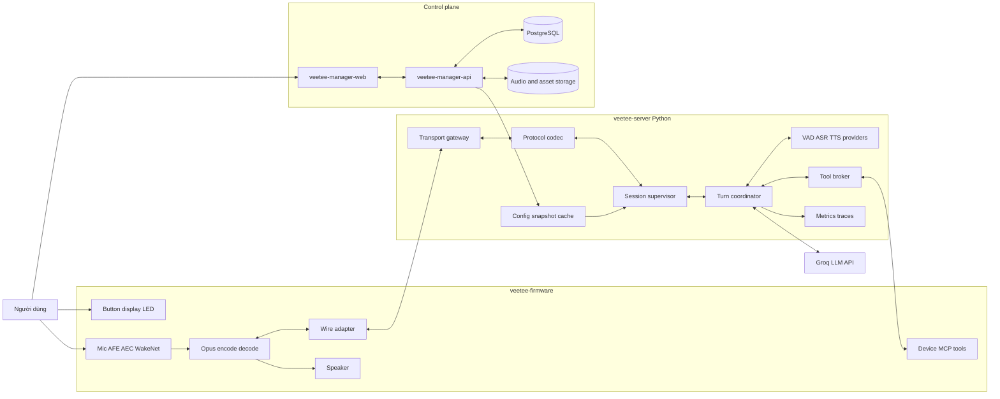
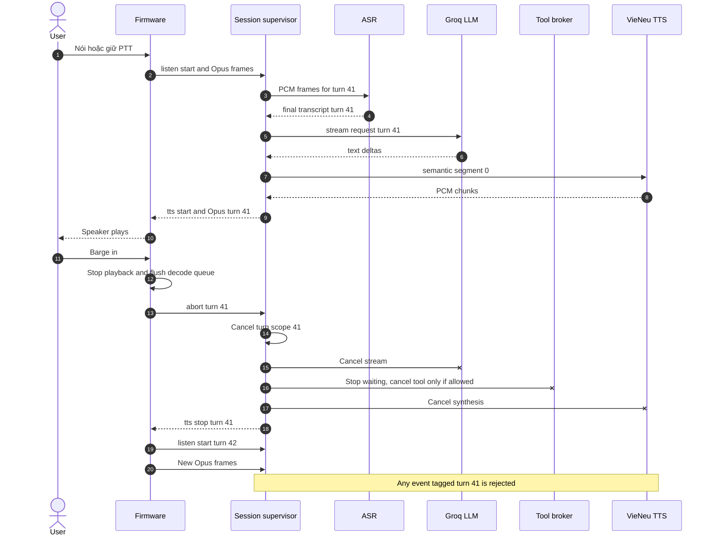
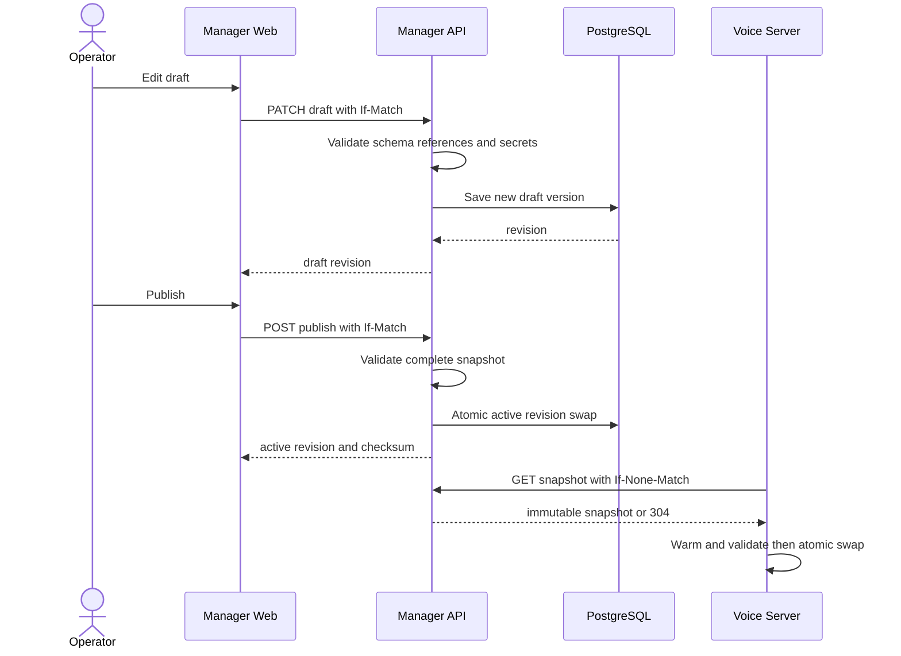

# Kiến trúc tổng thể Veetee

> Trạng thái: normative design cho Phase 1.  
> Các byte/message trên wire được định nghĩa tại [03-protocol-spec.md](./03-protocol-spec.md); nếu prose ở tài liệu này mâu thuẫn với protocol spec thì protocol spec thắng.

## 1. Architectural style

Veetee dùng hai plane và bốn deployable độc lập:

- **Realtime data plane**: `veetee-firmware` ↔ `veetee-server`; không gọi manager trên critical path của một turn.
- **Control plane**: `veetee-manager-web` ↔ `veetee-manager-api`; tạo versioned configuration snapshot để server đọc/cache.
- **External intelligence**: Groq chỉ nhận transcript/prompt/tool schema; raw microphone audio không đi tới Groq.
- **Local inference**: VAD, ASR và TTS chạy trên máy dev; wake/AFE/AEC chạy trên thiết bị.

Thiết kế kế thừa separation giữa realtime server và manager đã quan sát trong reference (`references/xiaozhi-esp32-server/main/README_en.md:78-94`). Veetee làm boundary mạnh hơn bằng immutable config revision: mỗi `SessionScope` pin đúng một revision khi mở và giữ revision đó đến khi session kết thúc; revision mới chỉ áp dụng cho session tạo sau atomic activation.

## 2. Component diagram

Mũi tên `API --> CFG` là pull theo ETag/revision hoặc event invalidation ngoài audio loop; không phải synchronous request mỗi turn.

## 3. Deployable boundaries

### 3.1 `veetee-firmware`

Chịu trách nhiệm:

- Audio I/O đúng cadence, AFE/AEC/noise suppression, WakeNet, Opus và playback.
- State machine, button semantics, display/LED feedback và local timeouts.
- WebSocket v1/v2/v3, MQTT control + UDP audio v3 và exact protocol events.
- Device MCP server, descriptor và safe hardware execution.

Không chịu trách nhiệm:

- Localized exit phrase matching, personality, prompt, provider selection hoặc LLM policy.
- Lưu conversation history dài hạn.
- Tự đổi transport khi một transport lỗi; OTA/config chọn profile rõ ràng.

Reference đã chứng minh giá trị của transport-neutral `Protocol` interface (`references/xiaozhi-esp32/main/protocols/protocol.h:41-66`) và owner-task state/hardware dispatch (`references/xiaozhi-esp32/main/application.cc:543-650`, `references/xiaozhi-esp32/main/mcp_server.cc:508-559`). Veetee giữ hai property này nhưng mọi event còn mang `session_id`, `turn_id` nội bộ và generation guard.

### 3.2 `veetee-server`

Chịu trách nhiệm:

- Terminate transport, validate wire frame và chuyển thành canonical internal events.
- Tạo `SessionScope` và `TurnScope`, mỗi scope có cancellation token và bounded task group.
- Decode Opus một lần, VAD/ASR, prompt/tool orchestration, Groq stream, text segmentation, TTS stream, Opus encode và pacing.
- Discover provider packages, validate manifests/config và quản lý lifecycle/resource lease.
- MCP routing, permissions, deadlines, audit events và stale result rejection.
- Metrics cho latency, queue, model resource và protocol error.

Không chịu trách nhiệm:

- CRUD configuration hoặc render dashboard.
- Chọn provider khác khi provider đang active lỗi.
- Lưu secret plaintext hoặc biến manager availability thành dependency của turn đang chạy.

Decode một lần trước VAD/ASR là điểm mạnh đã được kiểm chứng (`references/xiaozhi-esp32-server/main/xiaozhi-server/core/connection.py:365-380`); server mới chuẩn hóa output thành immutable `PcmFrame` thay vì truyền raw mutable buffers tùy module.

### 3.3 `veetee-manager-api`

Chịu trách nhiệm:

- System of record cho assistant, personality, device, pairing, provider manifests/config/selections, config revisions, history index, speaker profiles, extensions và firmware assets.
- Validate JSON Schema + cross-reference + secretRef trước khi publish revision.
- Auth, authorization, audit, optimistic concurrency và signed short-lived device operations.
- Cấp config/OTA response cho firmware và config snapshot cho voice server.

Manager API không push raw secret vào web hoặc conversation logs. Voice server chỉ nhận resolved secret trong process memory theo quyền machine identity; snapshot persisted chứa `secretRef`.

### 3.4 `veetee-manager-web`

Chịu trách nhiệm:

- Vue 3 route-level surfaces và typed API client.
- Draft/edit/validate/publish workflow; không giả vờ save thành công trước response.
- Realtime-ish status qua polling/SSE sau M1, nhưng không nối vào audio channel.
- Accessible keyboard/focus/error behavior và locale catalogs.

Web không tự suy diễn provider fields. Form được sinh từ versioned JSON Schema + UI hints do API cung cấp, sau đó vẫn được server validate.

## 4. Internal contracts

| Contract | Producer → consumer | Tối thiểu phải có | Quy tắc |
|---|---|---|---|
| `WireEvent` | Protocol codec → session | direction, message type, session, received time | Chỉ tạo sau full validation. |
| `EncodedAudioFrame` | Transport ↔ audio ingress/egress | sequence, timestamp optional, Opus bytes, duration | Bytes immutable; size bounded. |
| `PcmFrame` | Opus decoder → VAD/ASR | turn, sample rate, samples, capture time | Decode đúng một lần. |
| `TranscriptEvent` | ASR → turn | partial/final, confidence optional, locale, interval | Chỉ final transcript được mở LLM baseline. |
| `LlmEvent` | LLM → segmenter/tool broker | token, tool delta, finish reason, usage | Không block event loop bằng SDK sync. |
| `SpeechSegment` | segmenter → TTS | turn, segment index, normalized text, boundary reason | Ordered, cancellable, không rỗng. |
| `AudioChunk` | TTS → encoder | PCM, source rate, final flag | Resample về negotiated downlink rate. |
| `ConfigSnapshot` | manager → server | revision, checksum, selections, schemas, secretRefs | Immutable và validate-before-activate. |

Interface cụ thể nằm trong tài liệu module tương ứng; bảng này khóa ownership và không cho phép truyền dictionary tùy ý xuyên toàn pipeline.

## 5. Transport capability matrix

| Profile | Veetee firmware | Veetee server | Vai trò |
|---|---:|---:|---|
| Direct WebSocket v1 raw Opus | MUST | MUST | Chỉ compatibility/conformance với peer tham chiếu. |
| Direct WebSocket v2 header 16 byte | MUST parse/send | MUST parse/send | Server-side AEC/conformance, không phải default. |
| Direct WebSocket v3 header 4 byte | MUST, default | MUST, default | Veetee-to-Veetee từ vertical slice M0. |
| MQTT JSON + AES-CTR UDP v3 | MUST theo roadmap | MUST theo roadmap | Low-latency transport, promote sau loss/soak gate. |

Không có version negotiation trong server hello của reference (`references/xiaozhi-esp32/main/protocols/websocket_protocol.cc:224-249`). Vì vậy Veetee không âm thầm chọn version khác: `Protocol-Version`, `hello.version` và configured profile phải nhất quán; mismatch là protocol error. Capability extension chỉ được gửi sau khi có schema normative trong `03-protocol-spec.md`; baseline hiện không dựa vào field quảng bá riêng chưa được định nghĩa.

## 6. Một turn bình thường

1. Firmware mở/reuse audio channel theo interaction mode và gửi `listen`.
2. Uplink Opus được unwrap, decode một lần và stream qua VAD/ASR.
3. PTT release hoặc VAD endpoint tạo final ASR; noise-only/empty/low-evidence utterance kết thúc không gọi LLM.
4. Turn coordinator capture prompt/personality/provider revision, gọi Groq streaming.
5. Tool delta được assembler validate; tool broker thực hiện vòng gọi có deadline/audit rồi trả result về cùng LLM turn.
6. Text delta đi vào Vietnamese-aware semantic segmenter; segment đủ an toàn được gửi sang VieNeu.
7. First PCM được resample/Opus encode/push ngay; các frame sau được pace và giữ queue-age bounded.
8. Khi LLM, tools, TTS và egress đều drain, server gửi `tts.stop`; session tiếp tục hoặc về idle tùy mode.

Reference đã stream LLM delta vào TTS queue (`references/xiaozhi-esp32-server/main/xiaozhi-server/core/connection.py:1128-1200`) và dùng `tts.stop` sau drain (`references/xiaozhi-esp32-server/main/xiaozhi-server/core/handle/sendAudioHandle.py:287-312`). Veetee tổng quát hóa guard từ `sentence_id` thành `turn_id` cho mọi stage.

## 7. Sequence có barge-in

Abort luôn hủy việc **chờ** tool và chặn result cũ quay lại LLM. Tool hardware đã
bắt đầu chỉ nhận cancel khi descriptor/manifest khai báo cancellable; mutation
không thể hoàn tác có thể chạy xong nhưng outcome bị quarantine/audit và tuyệt
đối không được tiếp tục turn đã hủy.

Button interrupt là authority cao nhất và dừng speaker trước network round trip. Acoustic barge-in dùng on-device duplex AFE/AEC để bắt đầu uplink khi đang speaking; server xác nhận speech rồi áp dụng cùng cancellation barrier. Reference đã giữ realtime uplink khi speaking và có server abort cleanup (`references/xiaozhi-esp32/main/application.cc:951-960`, `references/xiaozhi-esp32-server/main/xiaozhi-server/core/handle/abortHandle.py:9-20`).

## 8. Tool architecture

Tool broker trình cho LLM một catalog thống nhất nhưng giữ namespace và trust boundary:

| Namespace | Executor | Ví dụ | Default permission |
|---|---|---|---|
| `device.*` | Firmware MCP server | LED, OLED, IR, mmWave | Theo assistant + bound device. |
| `service.*` | Server plugin | thời tiết, nhạc | Theo extension config. |
| `home.*` | Firmware/server bridge | MQTT, Home Assistant | Deny cho destructive action nếu thiếu confirmation policy. |
| `system.*` | Veetee runtime | status, time | Read-only allowlist. |

Reference unified tool layer đã gom nhiều nguồn tool (`references/xiaozhi-esp32-server/main/xiaozhi-server/core/providers/tools/unified_tool_handler.py:27-52`) và device tự discover schema/pagination (`references/xiaozhi-esp32/main/mcp_server.h:232-269`). Veetee bổ sung collision rejection, timeout, safety class, audit và exact executor identity.

## 9. Configuration publication

Nếu warm/validate fail, voice server giữ active snapshot cũ và báo `config_activation_failed`; đây là rollback của **config revision**, không phải provider fallback trong một turn.

## 10. Persistence và data ownership

| Data | Owner | Store baseline | Retention |
|---|---|---|---|
| Assistant/device/provider/config | Manager API | PostgreSQL | Cho đến khi xóa; audit append-only. |
| Secret value | Deployment secret store | Env/file permission hoặc OS keyring ở local | Không trả qua API; rotate explicit. |
| Active session/turn queues | Voice server | Memory | Hết session/cancel. |
| Transcript/tool/latency index | Manager API | PostgreSQL | Configurable policy. |
| Optional audio recording | Manager API/object writer | Local filesystem object store | Off mặc định; consent + retention bắt buộc. |
| Firmware/assets | Manager API | Local object store + metadata DB | Theo version và checksum. |

Từ M2, PostgreSQL là persistent source of truth. M0/M1 dùng immutable bootstrap
fixture cùng runtime snapshot schema và không có persistent control-plane source
of truth. Redis không deploy trong M0/M1/M2 baseline; chỉ thêm bằng ADR mới nếu
đo được nhu cầu cross-process cache/pub-sub.

## 11. Failure domains

| Failure | Behavior bắt buộc | Không được làm |
|---|---|---|
| Manager API down | Session dùng cached snapshot; health degraded. | Block audio turn để fetch config. |
| Groq timeout/429 | Cancel LLM stage, phát/hiển thị error theo config nếu channel còn hợp lệ. | Tự đổi key hoặc LLM provider trong product. |
| ASR/TTS provider fail | Turn kết thúc với typed error; release resource lease. | Giữ state speaking/listening vô hạn. |
| WebSocket disconnect | Cancel session tree, flush queues, firmware về recoverable state. | Cho background task tiếp tục gửi stale audio. |
| Queue full | Chính sách theo queue: drop-oldest realtime input hoặc backpressure text/output; increment metric. | Block mic/codec owner task vô hạn. |
| Tool timeout | Trả structured tool error cho LLM nếu turn còn active. | Retry destructive hardware mutation mù. |
| Config revision invalid | Không activate; giữ revision cũ và audit. | Partial apply theo từng field. |

## 12. Security boundaries

- Device identity/token ở transport boundary; user session ở Manager API boundary; machine credential giữa server và Manager API là loại riêng.
- MCP tool authorization dựa trên bound device + assistant + safety class, không dựa vào lời LLM tự khai.
- Raw audio recording off mặc định; UI phải hiển thị retention/consent khi bật.
- Log redaction cho authorization, cookies, secretRef resolution, Groq keys, prompt-sensitive fields.
- LAN service bind được cấu hình rõ; PostgreSQL/object storage không expose ra LAN mặc định.

## 13. Quyết định và tài liệu liên quan

| Chủ đề | Quyết định |
|---|---|
| Execution split | [ADR-002 Hybrid local-first](./ADR/ADR-002-hybrid-local-first.md) |
| Wire/transport | [ADR-001](./ADR/ADR-001-wire-transport-compatibility.md) |
| Streaming/cancel | [ADR-006](./ADR/ADR-006-streaming-turn-cancellation.md) |
| Provider lifecycle | [ADR-007](./ADR/ADR-007-provider-registry-lifecycle.md) |
| Manager API | [ADR-003](./ADR/ADR-003-fastify-manager-api.md) |
| Manager Web | [ADR-004](./ADR/ADR-004-vue-manager-web.md) |
| Manager user auth | [ADR-009](./ADR/ADR-009-local-manager-authentication.md) |
| Local deployment | [ADR-010](./ADR/ADR-010-host-native-local-deployment.md) |
| Wake word | [ADR-005](./ADR/ADR-005-on-device-wake-word.md) |
| Persistence | [ADR-008](./ADR/ADR-008-postgresql-without-redis-baseline.md) |
