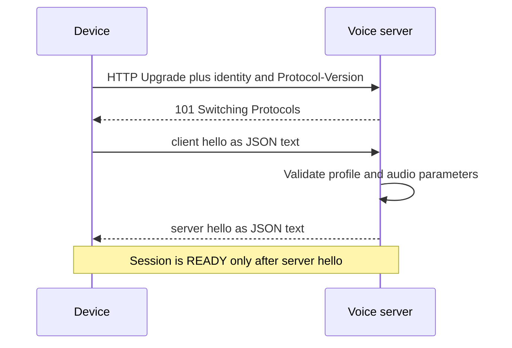
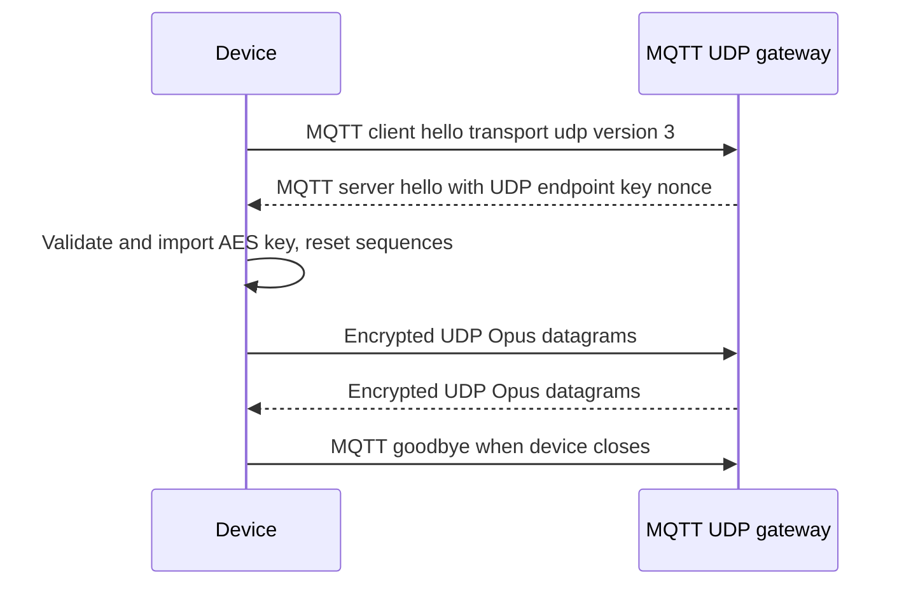
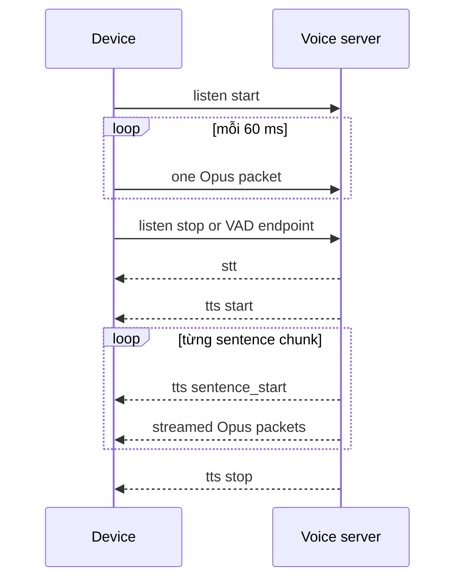

# Hợp đồng wire giữa firmware và voice server

> Trạng thái: thiết kế Phase 1, dùng làm executable specification.  
> Ngày: 2026-08-03.  
> Quyết định liên quan: [ADR-001](ADR/ADR-001-wire-transport-compatibility.md).

## 1. Phạm vi và từ khóa quy chuẩn

Tài liệu này là hợp đồng để hai nhóm có thể triển khai `veetee-firmware` và
`veetee-server` độc lập nhưng vẫn giao tiếp được. Nó đặc tả:

- HTTP/WebSocket handshake, JSON control plane và binary Opus framing v1/v2/v3;
- MQTT control + UDP audio v3 ở device boundary;
- `hello`, `listen`, `abort`, `tts`, `stt`, `llm`, legacy IoT và device MCP;
- validation, ordering, cancellation, liveness và conformance fixtures.

Các từ **MUST**, **MUST NOT**, **SHOULD**, **SHOULD NOT**, **MAY** có nghĩa bắt
buộc, cấm, nên, không nên và tùy chọn. “Bỏ qua” nghĩa là không thay state, không
gọi hardware và không gửi lại payload lỗi.

Các payload JSON trong tài liệu là ví dụ wire hoàn chỉnh tối thiểu. Field mới về
sau chỉ được thêm theo nguyên tắc:

1. field mới là optional và receiver cũ có thể bỏ qua;
2. message type mới phải được receiver không biết type bỏ qua;
3. không đổi nghĩa, kiểu hoặc required-ness của field hiện hữu;
4. không đổi binary header dưới cùng một `version`;
5. thay đổi không additive phải dùng protocol version mới.

## 2. Các profile bắt buộc

| Profile | Control | Audio | Version | Vai trò |
|---|---|---|---:|---|
| `ws-v3` | WebSocket text JSON | WebSocket binary, header 4 byte | 3 | **Mặc định Veetee-to-Veetee** trên LAN |
| `ws-v2` | WebSocket text JSON | WebSocket binary, header 16 byte có timestamp | 2 | Tùy chọn khi cần timestamp cho server-side AEC |
| `ws-v1-compat` | WebSocket text JSON | raw Opus, không header | 1 | Compatibility profile cho backend tham chiếu được cung cấp |
| `mqtt-udp-v3` | MQTT JSON | UDP header 16 byte + AES-CTR Opus | 3 | Đã đặc tả, triển khai sau khi `ws-v3` ổn định |

Firmware MUST chọn đúng một profile từ config đã activate. Server MUST mở các
adapter v1/v2/v3 theo cấu hình deployment. Không có automatic transport fallback:
không được âm thầm chuyển `ws-v3 → ws-v1`, `WebSocket → MQTT` hoặc ngược lại khi
kết nối lỗi. Lỗi phải hiện rõ profile, endpoint và phase thất bại nhưng MUST redact
token/key.

Ba framing WebSocket là hành vi có thật ở firmware tham chiếu; v1 là raw Opus,
v2 có header 16 byte và v3 có header 4 byte
(`references/xiaozhi-esp32/main/protocols/protocol.h:10-31`,
`references/xiaozhi-esp32/main/protocols/websocket_protocol.cc:24-53`). Backend
tham chiếu trực tiếp lại decode/send toàn bộ binary frame như raw Opus, vì vậy chỉ
`ws-v1-compat` nối trực tiếp được với snapshot đó
(`references/xiaozhi-esp32-server/main/xiaozhi-server/core/connection.py:365-380`,
`references/xiaozhi-esp32-server/main/xiaozhi-server/core/handle/sendAudioHandle.py:258-272`).

## 3. Bất biến chung

### 3.1 Kiểu frame và encoding

- Control message trên WebSocket MUST là text frame chứa đúng một JSON object
  UTF-8. Control message trên MQTT MUST là đúng một JSON object UTF-8 trong một
  MQTT payload.
- Audio MUST là Opus; mỗi WebSocket binary frame hoặc UDP datagram mang đúng một
  Opus packet.
- Direct WebSocket v1/v2/v3 dùng cùng ceiling
  `MAX_WS_OPUS_PAYLOAD_BYTES = 1.500` byte, không tính header v2/v3. Vì vậy tổng
  binary frame tối đa lần lượt là 1.500 byte ở v1, 1.516 byte ở v2 và 1.504 byte
  ở v3. Đây là safety ceiling của profile, không phải compressed frame size cố
  định; sender MUST NOT fragment một Opus packet qua nhiều WebSocket messages.
  UDP có ceiling riêng 1.400 byte tại §5.4.
- JSON number dùng cho integer MUST nằm trong safe integer range của receiver.
  Veetee sender phát MCP request ID là integer dương trong signed 32-bit range.
  Compatibility parser nhận mọi **integral** signed-32-bit JSON number để echo
  đúng peer cũ, nhưng reject fractional/out-of-range ID; string ID không thuộc
  profile tương thích này.
- Receiver MUST bỏ qua unknown JSON fields và unknown message types để giữ tính
  additive.
- JSON text frame lớn hơn 16 KiB bị đóng với WebSocket code `1009`, ngoại trừ MCP
  `tools/list` vẫn MUST tự phân trang dưới 8.000 byte payload ở firmware. Giới hạn
  8.000 byte được quan sát ở device MCP
  (`references/xiaozhi-esp32/main/mcp_server.cc:452-505`).
- MQTT control payload trong profile `mqtt-udp-v3` MUST không vượt 8.192 byte;
  đây cũng là ceiling gateway được nêu trong integration config snapshot
  (`references/xiaozhi-esp32-server/docs/mqtt-gateway-integration.md:50-68`).
- Binary frame rỗng, header thiếu, length mismatch, reserved/type không hợp lệ
  hoặc Opus decode lỗi MUST bị drop và tăng metric; receiver MAY đóng `1002` nếu
  peer tiếp tục vi phạm. Một frame lỗi không được tái sử dụng buffer cũ.

### 3.2 Audio theo chiều

| Thuộc tính | Device → server | Server → device |
|---|---:|---:|
| Codec | Opus | Opus |
| PCM trước/sau codec | signed 16-bit, mono | signed 16-bit, mono |
| Sample rate mặc định | **16.000 Hz** | **24.000 Hz** |
| Frame duration | **60 ms** | **60 ms** |
| Samples/frame | 960 | 1.440 ở 24 kHz |
| Compressed size | biến đổi | biến đổi |

Uplink encoder tham chiếu dùng 16 kHz mono, 60 ms, VBR và DTX
(`references/xiaozhi-esp32/main/audio/audio_service.h:39-43`,
`references/xiaozhi-esp32/main/audio/audio_service.h:65-76`). Downlink default của
firmware là 24 kHz/60 ms và được resample về native output rate khi cần
(`references/xiaozhi-esp32/main/protocols/protocol.h:77-80`,
`references/xiaozhi-esp32/main/audio/audio_service.cc:500-533`).

Veetee server MUST encode đúng `sample_rate` và `frame_duration` nó quảng bá trong
server `hello`; không được quảng bá 16 kHz nhưng gửi packet encode 24 kHz. Trong
mọi profile conformance, `format` MUST là `opus`, `channels` MUST là `1`, và
`frame_duration` MUST là `60`. Receiver có thể parse các duration 5, 10, 20, 40,
60, 80, 100, 120 ms để tương thích, nhưng config Veetee chỉ activate 60 ms cho đến
khi có benchmark riêng; firmware decoder tham chiếu chỉ map các giá trị đó
(`references/xiaozhi-esp32/main/audio/audio_service.h:55-63`,
`references/xiaozhi-esp32/main/audio/audio_service.cc:500-518`).

### 3.3 Session identity

- `Device-Id` là stable hardware identity dạng MAC canonical đọc từ STA/Ethernet
  hardware; provisioning chỉ đăng ký/bind identity này. Firmware tham chiếu đọc
  MAC trực tiếp từ hardware
  (`references/xiaozhi-esp32/main/system_info.cc:35-46`).
- `Client-Id` là UUID ổn định lưu qua reboot. Firmware tham chiếu tạo/lưu UUID
  trong NVS (`references/xiaozhi-esp32/main/boards/common/board.cc:15-45`).
- `session_id` là opaque UTF-8 string do server cấp trong server `hello`; device
  MUST echo nó trong `listen`, `abort`, `mcp` và MQTT `goodbye`.
- Veetee server MUST bỏ message state-changing có `session_id` khác session hiện
  tại. Vì peer cũ không enforce field này trong `listen`/`abort`/MCP
  (`references/xiaozhi-esp32-server/main/xiaozhi-server/core/handle/textHandler/listenMessageHandler.py:29-58`,
  `references/xiaozhi-esp32-server/main/xiaozhi-server/core/handle/textHandler/abortMessageHandler.py:15-16`,
  `references/xiaozhi-esp32-server/main/xiaozhi-server/core/handle/textHandler/mcpMessageHandler.py:18-21`),
  compatibility adapter MAY chấp nhận field vắng mặt nhưng MUST bind message vào
  đúng WebSocket connection, không tra session khác.
- Veetee firmware SHOULD bỏ S → C message có `session_id` hiện diện nhưng không
  match. Nó MUST chấp nhận field vắng mặt ở MCP request vì peer tham chiếu gửi MCP
  downlink không có `session_id`
  (`references/xiaozhi-esp32-server/main/xiaozhi-server/core/providers/tools/device_mcp/mcp_handler.py:103-115`).

### 3.4 Session admission và handover

- Sau khi client `hello` hợp lệ, Veetee server MUST giữ tối đa một active
  WebSocket session lease cho mỗi `Device-Id` đã qua lớp identity/authentication
  của deployment (fixture local MAY tắt auth). Lease này là
  ownership của audio/hardware, không phải giới hạn tổng số device đã pair.
- Connection mới cùng `Device-Id` MUST atomically thay lease cũ. Server MUST
  abort turn cũ với `reason:"session_replaced"`, gửi `tts/stop` nếu session cũ
  còn sống, rồi đóng WebSocket cũ với close code `4001` và reason ASCII
  `session_replaced`. Handover MUST không gọi provider thứ hai.
- Server MUST chờ cleanup task tree và generation lease của session cũ hoàn tất
  trước khi hoàn tất server `hello` cho connection mới. Late cleanup MUST NOT
  xóa lease đã trỏ sang connection mới.
- Một peer cũ không hiểu close code additive này vẫn chỉ thấy socket đóng và MAY
  reconnect theo reconnect policy; server MUST NOT sniff hoặc silent downgrade
  transport profile.
- Socket chưa qua client `hello` hoặc hello sai MUST NOT thay thế lease hợp lệ.
- Admission resource tổng host (`server_busy`) là policy riêng; per-device lease
  không được xem là bằng chứng đã đạt concurrency/VRAM gate.

## 4. Direct WebSocket v1/v2/v3

### 4.1 HTTP Upgrade

Route trung tính là:

```text
ws://<host>:<port>/veetee/v1/
wss://<host>:<port>/veetee/v1/
```

Route MUST đến từ config, không được compile-time hardcode. Compatibility fixture
có thể trỏ đến route do peer cũ yêu cầu. Firmware tham chiếu cũng đọc URL/token/
version từ settings thay vì cố định endpoint
(`references/xiaozhi-esp32/main/protocols/websocket_protocol.cc:79-86`).
M0 trên isolated development LAN MAY dùng `ws://`; mọi đường đi qua mạng không
tin cậy MUST dùng `wss://` với certificate validation, không dùng “skip verify”.

| Header | Required | Giá trị |
|---|---:|---|
| `Device-Id` | yes | identity của device |
| `Client-Id` | yes với Veetee; optional trong fixture cũ | stable UUID |
| `Protocol-Version` | yes | chuỗi decimal `1`, `2` hoặc `3` |
| `Authorization` | theo deployment | `Bearer <token>`; không gửi nếu token rỗng |

Firmware tham chiếu gửi đúng các header trên và tự thêm `Bearer ` nếu token không
có khoảng trắng (`references/xiaozhi-esp32/main/protocols/websocket_protocol.cc:97-106`).
Backend tham chiếu yêu cầu `device-id`, có compatibility path lấy identity/auth từ
query string, và khi auth bật thì validate bearer theo `client-id` + `device-id`
(`references/xiaozhi-esp32-server/main/xiaozhi-server/core/websocket_server.py:81-107`,
`references/xiaozhi-esp32-server/main/xiaozhi-server/core/websocket_server.py:206-227`).

Veetee server:

- MUST trả HTTP `400` nếu thiếu/sai `Device-Id` hoặc version không thuộc `{1,2,3}`;
- MUST trả `401` khi thiếu credential bắt buộc, `403` khi credential không hợp lệ;
- MUST không log `Authorization`;
- MUST rate-limit trước khi cấp session;
- MUST chỉ accept binary audio sau khi hoàn tất server `hello`.

### 4.2 Hello handshake



Client MUST gửi `hello` ngay sau upgrade và trước audio/control khác:

```json
{
  "type": "hello",
  "version": 3,
  "features": {
    "mcp": true,
    "glyph_push": false
  },
  "device_info": {
    "board": "ESP32-S3 N16R8",
    "firmwareVersion": "0.1.0"
  },
  "transport": "websocket",
  "audio_params": {
    "format": "opus",
    "sample_rate": 16000,
    "channels": 1,
    "frame_duration": 60
  }
}
```

Required: `type`, `version`, `transport`, toàn bộ bốn field trong `audio_params`.
`features` là object; `mcp`, `glyph_push`, `aec` là optional boolean.
`device_info` là optional additive object; nếu có, `board` và `firmwareVersion`
là non-empty strings và chỉ dùng cho Manager device presence, không tham gia
handshake compatibility hoặc audio routing. Peer cũ được phép bỏ qua field này.
`text_font`
chỉ được gửi khi `glyph_push:true`. Shape này được tạo ở firmware tham chiếu
(`references/xiaozhi-esp32/main/protocols/websocket_protocol.cc:198-221`,
`references/xiaozhi-esp32/main/protocols/protocol.cc:8-24`).

Capability semantics:

- `mcp:true`: device nhận MCP JSON-RPC request và trả response theo §8;
- `glyph_push:true`: device nhận optional glyph payload; nếu false/absent, server
  chỉ gửi Unicode text;
- `aec:true`: device yêu cầu **server-side AEC** và sẽ gửi playback timestamp.
  Veetee chỉ cho phép field này với `ws-v2` hoặc `mqtt-udp-v3`; device-side AEC
  trong default `ws-v3` không quảng bá field này.
- `text_font`, khi có, là object gồm string `bundle`, string `charset`, number
  `size`, number `bpp`; firmware tham chiếu tạo đúng shape đó
  (`references/xiaozhi-esp32/main/protocols/protocol.cc:8-24`).

Server response:

```json
{
  "type": "hello",
  "version": 3,
  "transport": "websocket",
  "audio_params": {
    "format": "opus",
    "sample_rate": 24000,
    "channels": 1,
    "frame_duration": 60
  },
  "session_id": "01JZ9R4GJ5M7Y0H2F6V3P8QKCE"
}
```

Validation và negotiation:

1. `hello.version` MUST bằng `Protocol-Version`; mismatch đóng `1002`.
2. Server MUST echo version đã chọn. Đây là xác nhận, không phải cơ chế tự downgrade.
3. `transport` MUST là `websocket` ở cả hai chiều.
4. Client audio MUST là Opus/16 kHz/mono/60 ms.
5. Server audio MUST là Opus/mono/60 ms; default Veetee là 24 kHz.
6. `session_id` MUST không rỗng ở Veetee-to-Veetee.
7. Firmware MUST timeout handshake sau 10 giây, đóng socket và báo lỗi profile;
   firmware tham chiếu cũng đợi event server hello tối đa 10 giây
   (`references/xiaozhi-esp32/main/protocols/websocket_protocol.cc:175-195`).
8. Unknown optional fields MUST bị bỏ qua.

Firmware tham chiếu chỉ yêu cầu `transport:"websocket"`, đọc optional session,
sample rate và duration; nó không check lại response version/format/channels
(`references/xiaozhi-esp32/main/protocols/websocket_protocol.cc:224-249`). Veetee
firmware validate chặt hơn nhưng vẫn nhận mọi response hợp lệ từ peer đó.

### 4.3 Binary framing chính xác

Tất cả multi-byte integer dùng network byte order (big-endian).

#### v1 — raw Opus

| Offset | Size | Field |
|---:|---:|---|
| 0 | N | một Opus packet, không header |

#### v2 — timestamp header

| Offset | Size | Field | Giá trị/rule |
|---:|---:|---|---|
| 0 | 2 | `version` | `0x0002` |
| 2 | 2 | `type` | `0` = Opus; `1` reserved JSON nhưng không dùng |
| 4 | 4 | `reserved` | `0` |
| 8 | 4 | `timestamp` | unsigned ms modulo 2^32; `0` nếu không có reference |
| 12 | 4 | `payload_size` | N |
| 16 | N | `payload` | một Opus packet |

#### v3 — lightweight header

| Offset | Size | Field | Giá trị/rule |
|---:|---:|---|---|
| 0 | 1 | `type` | `0` = Opus |
| 1 | 1 | `reserved` | `0` |
| 2 | 2 | `payload_size` | N |
| 4 | N | `payload` | một Opus packet |

Serializer/parser tham chiếu cho ba layout nằm tại
`references/xiaozhi-esp32/main/protocols/websocket_protocol.cc:24-53` và
`references/xiaozhi-esp32/main/protocols/websocket_protocol.cc:108-139`.

Golden framing fixture dưới đây dùng payload giả `DE AD BE EF` để test byte layout,
**không** đưa vào Opus decoder:

| Profile | Hex frame |
|---|---|
| v1 | `DE AD BE EF` |
| v2, timestamp `0x01020304` | `00 02 00 00 00 00 00 00 01 02 03 04 00 00 00 04 DE AD BE EF` |
| v3 | `00 00 00 04 DE AD BE EF` |

Receiver MUST kiểm tra `frame_length == header_length + payload_size` trước khi
copy. v2 MUST kiểm tra version/type/reserved; v3 MUST kiểm tra type/reserved. Parser
MUST đọc vào local value, không mutate buffer nhận. Payload rỗng hoặc lớn hơn
`MAX_WS_OPUS_PAYLOAD_BYTES` bị drop **trước** allocation lớn và trước Opus decoder.
Binary frame đến trước successful hello đóng `1002`.

### 4.4 Ordering audio downlink

Server MUST gửi `tts/start` trước binary packet đầu tiên. Firmware chỉ enqueue
downlink khi state là `speaking`; đây cũng là behavior tham chiếu
(`references/xiaozhi-esp32/main/application.cc:518-522`,
`references/xiaozhi-esp32/main/application.cc:550-569`). Sau packet cuối, server
gửi `tts/stop`. Firmware không được reset decoder ngay lúc nhận graceful stop; nó
chờ decode/playback queue drain rồi mới bật mic auto mode. Khi `abort`, firmware
MUST tăng playback generation và xóa ngay packet/PCM cũ.

## 5. MQTT control + UDP audio v3

### 5.1 Trạng thái triển khai

Profile này là normative ở device boundary nhưng được staged sau `ws-v3`. Lý do:
firmware snapshot cho biết chính xác MQTT hello, UDP datagram và crypto; backend
snapshot không terminate MQTT/UDP và yêu cầu gateway ngoài repo
(`references/xiaozhi-esp32-server/docs/mqtt-gateway-integration.md:3-10`,
`references/xiaozhi-esp32-server/docs/mqtt-gateway-integration.md:50-80`). Không
được suy ra topic routing hay key issuance của gateway ngoài từ Python bridge.

### 5.2 MQTT session và config

| Config | Required | Rule |
|---|---:|---|
| `endpoint` | yes | broker host và optional port; port mặc định 8883 |
| `client_id` | yes | stable device client ID |
| `username` / `password` | deployment | secret, không log |
| `keepalive` | no | default 240 giây |
| `publish_topic` | yes | opaque upstream control topic do gateway cấp |
| `subscribe_topic` | yes | opaque downstream control topic do gateway cấp |
| `control_qos` | no | Veetee dùng QoS 1, retain false; fixture cũ MAY dùng QoS 0 |

Endpoint, credential, keepalive default và `publish_topic` được firmware tham
chiếu đọc tại `references/xiaozhi-esp32/main/protocols/mqtt_protocol.cc:71-95`;
outbound JSON được publish vào đúng opaque topic
(`references/xiaozhi-esp32/main/protocols/mqtt_protocol.cc:168-178`). Integration
snapshot đã cấp `subscribe_topic` trong MQTT OTA response, và OTA firmware persist
mọi field string/number trong object MQTT
(`references/xiaozhi-esp32-server/docs/mqtt-gateway-integration.md:144-179`,
`references/xiaozhi-esp32/main/ota.cc:146-162`). Protocol class được cung cấp không
gọi subscribe trực tiếp; Veetee implementation MUST đọc field này và subscribe
tường minh. Không định nghĩa convention tên topic trong firmware.

Firmware MUST subscribe thành công trước khi mở audio channel. Mọi control JSON
trong §6 dùng nguyên shape, chỉ đổi carrier từ WebSocket text sang MQTT payload.
Veetee state-changing control dùng QoS 1/retain false và handler idempotent vì
delivery có thể lặp; QoS không tạo ordering với UDP nên vẫn cần §5.6.
Disconnect MQTT không được tự chuyển WebSocket; reconnect cùng profile có bounded
exponential backoff + jitter và chỉ mở session mới sau hello mới.

### 5.3 UDP hello



Client hello:

```json
{
  "type": "hello",
  "version": 3,
  "transport": "udp",
  "features": {"mcp": true, "glyph_push": false},
  "audio_params": {
    "format": "opus",
    "sample_rate": 16000,
    "channels": 1,
    "frame_duration": 60
  }
}
```

Firmware tham chiếu cố định shape/version này
(`references/xiaozhi-esp32/main/protocols/mqtt_protocol.cc:351-375`). Device chờ
server hello tối đa 10 giây
(`references/xiaozhi-esp32/main/protocols/mqtt_protocol.cc:239-263`).

Server hello:

```json
{
  "type": "hello",
  "version": 3,
  "transport": "udp",
  "session_id": "01JZ9R4GJ5M7Y0H2F6V3P8QKCE",
  "audio_params": {
    "format": "opus",
    "sample_rate": 24000,
    "channels": 1,
    "frame_duration": 60
  },
  "udp": {
    "server": "192.168.1.10",
    "port": 8884,
    "key": "00112233445566778899aabbccddeeff",
    "nonce": "01000000000000000000000000000000"
  }
}
```

Rules:

- `transport` MUST là `udp`; `server` MUST không rỗng; `port` thuộc 1..65535.
- `key` và `nonce` MUST là 32 hex characters và decode thành đúng 16 byte.
- `nonce[0]` MUST là `0x01`; `nonce[1]` là flags/template; bytes 4..7 là SSRC/
  template do gateway cấp.
- Key/nonce MUST mới cho mỗi session; không ghi log/NVS và xóa khi close.
- Sau khi import AES-128/CTR key, cả local/remote sequence reset `0`, rồi mới mở
  UDP socket. Validation/import/reset được quan sát tại
  `references/xiaozhi-esp32/main/protocols/mqtt_protocol.cc:377-466`.
- `audio_params` optional với peer cũ; nếu thiếu, device dùng downlink 24 kHz/
  60 ms. Veetee gateway SHOULD luôn gửi đủ để tránh ambiguity.
- `version` MAY vắng với peer cũ; Veetee-to-Veetee MUST gửi `3`. `session_id` MUST
  không rỗng trong Veetee profile. Nếu `audio_params` hiện diện, format/channels/
  rate/duration phải qua cùng validation ở §3.2.
- Sau MQTT hello không có application-level UDP hello/ack: device connect socket
  tới endpoint đã cấp và gửi/nhận datagram ngay. Firmware tham chiếu cũng chỉ tạo
  callback, connect endpoint rồi công bố channel opened
  (`references/xiaozhi-esp32/main/protocols/mqtt_protocol.cc:265-348`).

### 5.4 UDP datagram và AES-CTR

| Offset | Size | Field | Rule |
|---:|---:|---|---|
| 0 | 1 | `type` | `0x01` |
| 1 | 1 | `flags` | template byte |
| 2 | 2 | `payload_len` | N, big-endian |
| 4 | 4 | `ssrc` | template bytes |
| 8 | 4 | `timestamp` | unsigned ms, big-endian |
| 12 | 4 | `sequence` | unsigned, big-endian |
| 16 | N | `ciphertext` | AES-CTR(Opus), không tag |

Veetee đặt `payload_len` tối đa 1.400 byte để datagram audio không vượt Ethernet
MTU thông dụng khi cộng IPv4/UDP/header v3. Packet lớn hơn bị drop trước decrypt;
đây là safety envelope của Veetee, không phải fixed Opus frame size.

Algorithm gửi:

1. copy 16-byte nonce template thành header;
2. tăng local sequence rồi ghi bytes 12..15;
3. ghi `payload_len` ở bytes 2..3 và timestamp ở bytes 8..11;
4. dùng **toàn bộ header 16 byte sau khi ghi** làm AES-CTR IV;
5. chỉ mã hóa Opus payload; gửi clear header nối ciphertext.

`timestamp` uplink là timestamp modulo 2^32 của downlink frame gần nhất mà codec
output write/handoff đã trả về, để phục vụ server-side AEC; nếu không có reference
thì là `0`. Source compatibility không chứng minh DAC/acoustic playback. Một Veetee
board MAY dùng DMA-play callback mạnh hơn nhưng phải document cùng profile; sequence bắt đầu ở `1`.
Peer MUST đóng session và cấp key/nonce mới trước khi counter tăng từ
`0xFFFFFFFF` về `0`; không reuse IV/counter sau wrap.

Đó là đúng serialization tham chiếu
(`references/xiaozhi-esp32/main/protocols/mqtt_protocol.cc:180-211`). Receiver:

- MUST yêu cầu datagram length `== 16 + payload_len`, `type == 0x01` và
  `payload_len` thuộc `1..1400` trước allocation/decrypt;
- MUST dùng chính 16 header bytes nhận được làm IV và decrypt từng packet độc lập;
- MUST đưa packet đã decrypt vào reorder algorithm §5.6; arrival đơn thuần không
  được advance `remote_sequence`;
- Opus decode fail khi packet tới lượt release được tính là packet lost/consumed,
  advance sequence và tăng metric để một packet hỏng không giữ pipeline vô hạn.

Validation, IV và source sequence high-water behavior được quan sát tại
`references/xiaozhi-esp32/main/protocols/mqtt_protocol.cc:267-333`. Veetee giữ
wire bytes/IV nhưng thay drop-late ngay khi arrival bằng bounded reorder receiver
được đặc tả dưới đây. Vì AES-CTR
không có authentication tag, deployment MUST dùng authenticated MQTT provisioning,
key per-session và giới hạn UDP exposure vào LAN/firewall. Thay cipher sẽ cần
protocol version mới, không được đổi dưới v3.

Wrong key/ciphertext vẫn tạo ra bytes khi AES-CTR decrypt; crypto layer không thể
phân biệt packet hợp lệ. Opus decode fail MAY làm packet bị drop nhưng không phải
authentication oracle. Conformance MUST NOT kỳ vọng “wrong key bị reject”; nếu cần
integrity/authenticity phải tạo protocol version mới dùng AEAD.

### 5.5 Close và gateway bridge

Device-initiated close publish:

```json
{"session_id":"01JZ9R4GJ5M7Y0H2F6V3P8QKCE","type":"goodbye"}
```

Server `goodbye` chỉ đóng khi `session_id` match; device MUST không echo để tránh
ping-pong. Đây là behavior tham chiếu
(`references/xiaozhi-esp32/main/protocols/mqtt_protocol.cc:126-140`,
`references/xiaozhi-esp32/main/protocols/mqtt_protocol.cc:214-237`). WebSocket
direct close không dùng JSON `goodbye`.

Gateway → voice server là internal adapter, không phải device wire. Nếu bật fixture
tương thích Python được cung cấp, binary bridge có 16-byte header sau:

| Offset | Size | Field |
|---:|---:|---|
| 0 | 1 | `type = 1` |
| 1 | 1 | reserved `0` |
| 2 | 2 | payload length, big-endian |
| 4 | 4 | sequence, big-endian |
| 8 | 4 | timestamp, big-endian |
| 12 | 4 | Opus length, big-endian |
| 16 | N | Opus |

Shape server → gateway được tạo tại
`references/xiaozhi-esp32-server/main/xiaozhi-server/core/handle/sendAudioHandle.py:81-113`;
gateway → server snapshot chỉ đọc timestamp `[8:12]` và Opus `[16:]`
(`references/xiaozhi-esp32-server/main/xiaozhi-server/core/connection.py:382-407`).
Header bridge này MUST NOT được dùng làm UDP IV/header; offsets 4 và 12 có nghĩa
khác UDP. Veetee gateway adapter giữ JSON nguyên vẹn và biểu diễn audio nội bộ bằng
`{direction, sequence, timestamp, opus}` thay vì để hai header 16-byte lẫn nhau.

### 5.6 Bounded reorder và ordering barrier giữa MQTT/UDP

Mỗi chiều UDP trong một session giữ state riêng:

- `remote_sequence`: sequence cao nhất đã **release hoặc tuyên bố lost**, khởi tạo
  `0`; nó không phải sequence cao nhất vừa nhìn thấy;
- `next_sequence = remote_sequence + 1`;
- `reorder_slots`: map bounded tối đa `REORDER_WINDOW_PACKETS = 4` packet;
- `gap_started_at`: monotonic timestamp khi thấy packet cao hơn nhưng thiếu
  `next_sequence`;
- `MAX_FORWARD_SEQUENCE_JUMP = 256` và `REORDER_GAP_TIMEOUT_MS = 120`.

Sau header/session/stream validation và decrypt, receiver MUST xử lý theo thứ tự:

1. `sequence <= remote_sequence` hoặc sequence đã có trong `reorder_slots` là
   duplicate/late: drop và tăng metric, không decode lại;
2. forward jump lớn hơn 256 so với `next_sequence` là session protocol error:
   drop, xóa reorder state và yêu cầu session/key/nonce mới; không loop qua một
   range do peer cung cấp;
3. khi packet mới nằm ngoài cửa sổ bốn sequence, receiver advance từng sequence
   thấp nhất: release nếu slot đó đã có, nếu thiếu thì đánh dấu lost; lặp tới khi
   packet mới nằm trong cửa sổ;
4. insert packet, rồi release mọi packet contiguous bắt đầu từ `next_sequence`;
   mỗi release hoặc loss mới được advance `remote_sequence`;
5. nếu còn gap trước packet đã buffer, start timer đúng một lần. Sau 120 ms, đánh
   dấu toàn bộ sequence thiếu trước slot thấp nhất là lost, rồi release contiguous;
6. abort, session close hoặc key rotation MUST clear slots/timer trước khi sequence
   state mới được tạo.

Với frame 60 ms, cửa sổ bốn packet bao phủ tối đa 240 ms nhưng chỉ chờ một gap tối
đa 120 ms. Receiver không kéo dài timeout khi duplicate/newer packet tiếp tục đến.
Các giá trị này là Veetee `mqtt-udp-v3` profile constants; muốn đổi phải version
profile/fixture cùng nhau, không để firmware và gateway dùng default khác nhau.

MQTT và UDP là hai carrier độc lập; không được suy `tts/start → audio → tts/stop`
từ cross-carrier arrival order. Veetee thêm field optional mà peer cũ được phép bỏ:

```json
{
  "type": "tts",
  "state": "start",
  "session_id": "<session>",
  "audio_stream_id": 42,
  "start_sequence": 1201
}
```

```json
{
  "type": "tts",
  "state": "stop",
  "session_id": "<session>",
  "audio_stream_id": 42,
  "end_sequence": 1320
}
```

Trong Veetee `mqtt-udp-v3`:

1. gateway cấp nonzero `audio_stream_id` mỗi TTS stream và ghi cùng uint32
   big-endian vào UDP `ssrc` bytes 4..7;
2. sequence tăng theo UDP session; start/end sequence là inclusive;
3. UDP đến trước start được giữ tối đa 8 packet/480 ms trong pre-start buffer keyed
   `{session_id,audio_stream_id}`, chưa decode/play và chưa advance
   `remote_sequence`. Packet thứ chín hoặc timeout làm mark stream invalid, discard
   toàn pending buffer và tăng metric; receiver bỏ các packet còn lại của cùng
   `audio_stream_id` và reject matching start thay vì phát phần đầu bị thiếu;
4. start chỉ hợp lệ khi stream ID match, `start_sequence > remote_sequence` và
   forward jump không quá 256. Start là authoritative boundary: mark unresolved
   sequence trước start là lost, set `remote_sequence = start_sequence - 1`, discard
   buffered packet dưới start, rồi đưa packet còn lại theo thứ tự vào reorder
   algorithm và chỉ release từ `start_sequence`;
5. stop đến sớm chuyển stream sang `DRAINING`; chỉ complete sau khi play tới
   `end_sequence`. Timeout 1.200 ms thì mute/flush, tăng metric và abort;
6. packet sai stream, ngoài range hoặc hết hạn bị drop;
7. abort/session close xóa mọi stream buffer trước khi nhận stream mới.

Peer cũ vẫn chạy theo `tts` state/pacing nhưng không có cross-carrier ordering
guarantee này. MQTT chỉ được promote làm default sau barrier/reorder/loss fixtures.
Direct WebSocket không cần extension vì text/binary cùng ordered connection.

## 6. Control message catalog

### 6.1 Device → server

| Type | Required fields | Optional | Server action |
|---|---|---|---|
| `hello` | xem §4/§5 | additive capabilities | khởi tạo session |
| `listen` start | `session_id`, `state:"start"`, `mode` | — | reset VAD/ASR turn và nhận mic |
| `listen` stop | `session_id`, `state:"stop"` | — | finalize streaming/batch ASR |
| `listen` detect | `session_id`, `state:"detect"`, `text` | — | wake invocation bằng text |
| `abort` | `session_id` | `reason` | cancel toàn turn, clear queues, gửi `tts/stop` |
| `mcp` | `session_id`, object `payload` | — | route JSON-RPC response |
| `iot` | `descriptors` và/hoặc `states` | — | legacy capability/state ingest |
| `ping` | `type` | implementation metadata | optional application heartbeat |
| `server` | deployment-specific | — | management extension; disabled mặc định |
| `goodbye` | `session_id` | — | chỉ MQTT/UDP |

Registry inbound của backend tham chiếu gồm `hello`, `abort`, `listen`, `iot`,
`mcp`, `server`, `ping`
(`references/xiaozhi-esp32-server/main/xiaozhi-server/core/handle/textMessageType.py:4-12`,
`references/xiaozhi-esp32-server/main/xiaozhi-server/core/handle/textMessageHandlerRegistry.py:22-43`).

#### Listen

```json
{"session_id":"<session>","type":"listen","state":"start","mode":"auto"}
```

`mode` là enum:

- `auto`: server VAD tự endpoint utterance;
- `manual`: PTT; server MUST không finalize trước `listen/stop` và MUST không coi
  speech là barge-in tự động;
- `realtime`: full duplex AEC; server tiếp tục nhận mic khi đang nói.

PTT release:

```json
{"session_id":"<session>","type":"listen","state":"stop"}
```

Wake event:

```json
{"session_id":"<session>","type":"listen","state":"detect","text":"<configured wake phrase>"}
```

Firmware tạo ba shape này tại
`references/xiaozhi-esp32/main/protocols/protocol.cc:67-92`. Server tham chiếu
reset state ở `start`, chốt stream/batch ASR ở `stop` và route wake text ở `detect`
(`references/xiaozhi-esp32-server/main/xiaozhi-server/core/handle/textHandler/listenMessageHandler.py:29-58`).

#### Abort

```json
{"session_id":"<session>","type":"abort"}
```

Wake-word interrupt MAY thêm đúng field:

```json
{"session_id":"<session>","type":"abort","reason":"wake_word_detected"}
```

`reason` vắng mặt nghĩa là generic user interrupt. Unknown reason không đổi semantics
cancel. Firmware chỉ thêm literal trên cho wake interrupt
(`references/xiaozhi-esp32/main/protocols/protocol.cc:58-65`). Server MUST xử lý
abort idempotently: invalidate turn generation, cancel ASR/LLM/TTS và việc chờ tool
của turn, clear unsent audio, rồi gửi `tts/stop`. Hardware tool side effect đã
dispatch chỉ cancel khi manifest nói operation cancellable; kết quả muộn không được
đưa lại turn cũ. Reference chứng minh queue/status/stop cleanup, không chứng minh
cancel hardware side effect
(`references/xiaozhi-esp32-server/main/xiaozhi-server/core/handle/abortHandle.py:9-20`).

### 6.2 Server → device

| Type | Required fields | Optional | Device action |
|---|---|---|---|
| `hello` | xem §4/§5 | capabilities | complete handshake |
| `stt` | `text` | `session_id`, glyph | hiển thị user transcript |
| `tts` start | `state:"start"` | `session_id` | vào `speaking` trước audio |
| `tts` sentence_start | `state`, `text` | `session_id`, glyph | subtitle hiện tại |
| `tts` stop | `state:"stop"` | `session_id` | graceful drain / kết thúc turn |
| `llm` | `text`, `emotion` | `session_id` | cập nhật emotion/UI |
| `mcp` | `session_id`, object `payload` | — | dispatch device JSON-RPC server |
| `iot` | array `commands` | — | legacy-only hardware command |
| `system` | `command` | — | hiện chỉ compatibility `reboot` |
| `alert` | `status`, `message`, `emotion` | `code`, `retry_after_ms`, `session_id` | thông báo local; `SERVER_BUSY` giữ session idle để retry |
| `custom` | object `payload` | — | compile-time optional; không dùng core flow |
| `pong` | `type` | `timestamp` | optional heartbeat response |
| `goodbye` | `session_id` | — | MQTT/UDP only |

Firmware handler thực tế cho `tts`, `stt`, `llm`, `mcp`, `system`, `alert`,
`custom` nằm tại `references/xiaozhi-esp32/main/application.cc:543-650`.

Veetee server MUST thêm `session_id` vào mọi S → C message có thể đổi state hoặc
hardware: `stt`, `tts`, `llm`, `mcp`, `iot`, `system`, `alert`, `custom`, `goodbye`.
Direct WebSocket compatibility receiver MAY chấp nhận field thiếu và bind message
vào connection hiện tại. MQTT receiver MUST yêu cầu exact current `session_id`;
message thiếu/mismatch bị drop để control cũ không tác động audio session mới.

Ví dụ normal turn:

```json
{"type":"stt","text":"Thời tiết hôm nay thế nào?","session_id":"<session>"}
```

```json
{"type":"tts","state":"start","session_id":"<session>"}
```

```json
{"type":"tts","state":"sentence_start","text":"Hôm nay trời dịu mát.","session_id":"<session>"}
```

Sau đó là nhiều binary Opus frames, rồi:

```json
{"type":"tts","state":"stop","session_id":"<session>"}
```

Emotion có thể interleave:

```json
{"type":"llm","text":"🙂","emotion":"happy","session_id":"<session>"}
```

Server sender tham chiếu tạo `stt` rồi `tts/start`
(`references/xiaozhi-esp32-server/main/xiaozhi-server/core/handle/sendAudioHandle.py:315-343`),
`sentence_start`/audio/stop
(`references/xiaozhi-esp32-server/main/xiaozhi-server/core/handle/sendAudioHandle.py:21-55`),
và `llm` shape
(`references/xiaozhi-esp32-server/main/xiaozhi-server/core/utils/textUtils.py:84-105`).
`stt` không phải prerequisite tuyệt đối: wake greeting/cached audio MAY bắt đầu bằng
`tts/start`.

### 6.3 Control/management messages ngoài conversation core

Application heartbeat request/response tương thích:

```json
{"type":"ping"}
```

```json
{"type":"pong","timestamp":"2026-08-03 12:00:00"}
```

Peer tham chiếu chỉ trả `pong` khi config heartbeat bật và dùng timestamp string
local-time như trên
(`references/xiaozhi-esp32-server/main/xiaozhi-server/core/handle/textHandler/pingMessageHandler.py:18-42`).
Veetee SHOULD ưu tiên WebSocket protocol ping/pong; application shape này chỉ để
compatibility.

Management `server` không phải device conversation primitive và MUST disabled trên
public device endpoint. Compatibility shape đã quan sát:

```json
{
  "type": "server",
  "action": "update_config",
  "content": {"secret": "<redacted>"}
}
```

`action` còn có `restart`. Peer chỉ thực hiện khi runtime config lấy từ manager và
secret match; response dùng `type:"server"`, `status:"success"|"error"`,
`message`, optional `content.action`
(`references/xiaozhi-esp32-server/main/xiaozhi-server/core/handle/textHandler/serverMessageHandler.py:18-91`).
Veetee control plane dùng authenticated manager API riêng; firmware MUST NOT gửi
message này trong production.

Device compatibility controls:

```json
{"type":"system","command":"reboot"}
```

```json
{"type":"alert","status":"warning","message":"<localized text>","emotion":"neutral"}
```

Firmware MUST schedule reboot lên state owner và chỉ nhận đúng command đã allowlist.
`alert` cần đủ ba string; `custom` chỉ xử lý nếu build capability bật. Đây là
validation của firmware tham chiếu
(`references/xiaozhi-esp32/main/application.cc:613-646`). Veetee server không dùng
`system`/`custom` cho normal ASR → LLM → TTS flow.

Khi resource admission không còn slot, server MUST không tạo turn hoặc gọi
provider. Nó gửi additive `alert` với `code:"SERVER_BUSY"` và optional
`retry_after_ms`; firmware xử lý alert như abort/re-arm và giữ WebSocket để có
thể thử lại. `retry_after_ms` là hint, không phải queue guarantee. Capacity lấy
từ snapshot `admission.maxActiveTurns`; default tương thích an toàn là `1`.

Khi snapshot bật `autoTurn.enabled`, server có thể tự giải phóng một
`listen/start mode:"auto"` nếu chưa nhận speech được VAD xác nhận trong
`autoTurn.noSpeechTimeoutMs`. Server MUST không gọi ASR final/LLM/TTS cho lượt
rỗng; nó gửi:

```json
{
  "type": "alert",
  "status": "warning",
  "message": "<localized config text>",
  "emotion": "neutral",
  "code": "NO_SPEECH_TIMEOUT",
  "session_id": "<session>"
}
```

`code` là field additive optional; peer cũ bỏ qua field này nhưng vẫn xử lý ba
field alert bắt buộc và dừng capture/re-arm. Policy chỉ là first-speech watchdog,
không phải timeout của conversation đã bắt đầu.

`tts/sentence_end` không thuộc contract bắt buộc vì snapshot chỉ có browser client
nhận type đó mà không có producer tương ứng trong sender
(`references/xiaozhi-esp32-server/main/digital-human/js/core/network/websocket.js:172-202`,
`references/xiaozhi-esp32-server/main/xiaozhi-server/core/handle/sendAudioHandle.py:21-76`).

## 7. Legacy IoT contract

Veetee firmware mới dùng MCP. Veetee server vẫn MUST parse legacy IoT để nhận peer
cũ; firmware MAY build compatibility handler cho downlink commands. Legacy parser
không được tự quảng bá nếu board không bật capability.

### 7.1 Descriptor và state, device → server

```json
{
  "type": "iot",
  "descriptors": [
    {
      "name": "desk_lamp",
      "description": "Đèn bàn",
      "properties": {
        "power": {"description": "Trạng thái nguồn", "type": "boolean"},
        "brightness": {"description": "Độ sáng", "type": "number"}
      },
      "methods": {
        "set_power": {
          "description": "Bật hoặc tắt đèn",
          "parameters": {
            "value": {"description": "Trạng thái mới", "type": "boolean"}
          }
        }
      }
    }
  ]
}
```

`properties` và `methods` là object keyed by name, không phải arrays. Mỗi descriptor
MUST có `name`, `description`, object `properties` và object `methods`; một trong
hai object MAY rỗng. Sender luôn gửi cả hai keys vì handler tham chiếu chỉ tự tạo
`properties` khi thiếu nhưng sau đó dereference cả `properties` và `methods`
(`references/xiaozhi-esp32-server/main/xiaozhi-server/core/providers/tools/device_iot/iot_handler.py:31-56`).
Parser tạo property/method từ keyed maps
(`references/xiaozhi-esp32-server/main/xiaozhi-server/core/providers/tools/device_iot/iot_descriptor.py:9-46`).

```json
{
  "type": "iot",
  "states": [
    {"name": "desk_lamp", "state": {"power": true, "brightness": 70}}
  ]
}
```

Server MUST chỉ update property đã discover và đúng runtime type; reference kiểm
tra type trước update
(`references/xiaozhi-esp32-server/main/xiaozhi-server/core/providers/tools/device_iot/iot_handler.py:68-86`).

### 7.2 Command, server → device

```json
{
  "type": "iot",
  "commands": [
    {"name": "desk_lamp", "method": "set_power", "parameters": {"value": true}}
  ]
}
```

`parameters` MAY vắng khi method không có argument. Server sender shape nằm tại
`references/xiaozhi-esp32-server/main/xiaozhi-server/core/providers/tools/device_iot/iot_executor.py:111-133`.
Unknown device/method, missing required parameter hoặc wrong type MUST bị bỏ và
audit; không được đoán hardware action. Tài liệu firmware tham chiếu đánh dấu IoT
cũ deprecated và dùng MCP cho discovery/control
(`references/xiaozhi-esp32/docs/websocket.md:441-444`).

## 8. Device MCP contract

Đây là MCP server chạy **trong firmware**, khác external MCP endpoint do manager
quản lý.

### 8.1 Outer envelopes theo chiều

Compatibility-only: server → device request của peer tham chiếu không có
`session_id`:

```json
{
  "type": "mcp",
  "payload": {
    "jsonrpc": "2.0",
    "id": 1,
    "method": "initialize",
    "params": {}
  }
}
```

Device → server response có `session_id`:

```json
{
  "session_id": "<session>",
  "type": "mcp",
  "payload": {
    "jsonrpc": "2.0",
    "id": 1,
    "result": {
      "protocolVersion": "2024-11-05",
      "capabilities": {"tools": {}},
      "serverInfo": {"name": "veetee-firmware", "version": "0.1.0"}
    }
  }
}
```

Outer C → S envelope do firmware tạo tại
`references/xiaozhi-esp32/main/protocols/protocol.cc:94-97`; outer S → C envelope
do backend tạo tại
`references/xiaozhi-esp32-server/main/xiaozhi-server/core/providers/tools/device_mcp/mcp_handler.py:103-115`.
Veetee-to-Veetee thêm top-level `session_id` vào mọi S → C envelope; field additive
này bắt buộc ở cả `ws-v3` và `mqtt-udp-v3`. Chỉ explicit compatibility receiver
được chấp nhận field vắng mặt và bind request vào đúng connection hiện tại; firmware
peer cũ được phép bỏ qua field mới.

Veetee MCP request ID MUST bắt đầu từ một positive signed-32-bit integer, tăng đơn
điệu và không reuse trong cùng transport session, bao gồm `initialize`, mỗi page
`tools/list` và `tools/call`. Sender MUST mở session mới trước khi ID kế tiếp vượt
`2.147.483.647`; không wrap về `1`. Peer tham chiếu cũng cấp ID tăng dần
(`references/xiaozhi-esp32-server/main/xiaozhi-server/core/providers/tools/device_mcp/mcp_handler.py:73-77`,
`references/xiaozhi-esp32-server/main/xiaozhi-server/core/providers/tools/device_mcp/mcp_handler.py:312-315`).

### 8.2 Initialize và discovery

Sau server `hello`, server SHOULD gửi:

```json
{
  "session_id": "<session>",
  "type": "mcp",
  "payload": {
    "jsonrpc": "2.0",
    "id": 1,
    "method": "initialize",
    "params": {
      "protocolVersion": "2024-11-05",
      "capabilities": {"roots": {"listChanged": true}, "sampling": {}},
      "clientInfo": {"name": "veetee-server", "version": "1.0.0"}
    }
  }
}
```

Device response:

```json
{
  "session_id": "<session>",
  "type": "mcp",
  "payload": {
    "jsonrpc": "2.0",
    "id": 1,
    "result": {
      "protocolVersion": "2024-11-05",
      "capabilities": {"tools": {}},
      "serverInfo": {"name": "veetee-firmware", "version": "0.1.0"}
    }
  }
}
```

Firmware tham chiếu hardcode MCP version/capabilities shape và board/firmware info
(`references/xiaozhi-esp32/main/mcp_server.cc:384-395`). Veetee server MUST gửi
hello trước initialize để `session_id` đã biết. Veetee firmware vẫn MUST chịu được
peer cũ gửi initialize trước hello; response khi đó MAY có `session_id:""`, vì
ordering cũ không được bảo đảm
(`references/xiaozhi-esp32-server/main/xiaozhi-server/core/handle/helloHandle.py:50-63`).
Optional `params.capabilities.vision` có shape `{url,token}`; firmware chỉ áp nó khi
camera capability tồn tại
(`references/xiaozhi-esp32/main/mcp_server.cc:331-348`,
`references/xiaozhi-esp32-server/main/xiaozhi-server/core/providers/tools/device_mcp/mcp_handler.py:238-270`).

Tools list request:

```json
{"session_id":"<session>","type":"mcp","payload":{"jsonrpc":"2.0","id":2,"method":"tools/list"}}
```

Response page:

```json
{
  "session_id": "<session>",
  "type": "mcp",
  "payload": {
    "jsonrpc": "2.0",
    "id": 2,
    "result": {
      "tools": [
        {
          "name": "device.led.set",
          "description": "Đặt màu LED RGB",
          "inputSchema": {
            "type": "object",
            "properties": {
              "red": {"type": "integer", "minimum": 0, "maximum": 255},
              "green": {"type": "integer", "minimum": 0, "maximum": 255},
              "blue": {"type": "integer", "minimum": 0, "maximum": 255}
            },
            "required": ["red", "green", "blue"]
          }
        }
      ],
      "nextCursor": "device.display.show_text"
    }
  }
}
```

`nextCursor` vắng ở page cuối. Request tiếp theo dùng cùng method và
`params:{"cursor":"..."}`. Optional `withUserTools:true` yêu cầu liệt kê cả tool
có audience user; default false. Descriptor gồm `name`, `description`, `inputSchema`;
schema property tương thích hiện có boolean/integer/string, integer
minimum/maximum/default, optional `required`. Optional user-only annotation là
`annotations:{"audience":["user"]}`
(`references/xiaozhi-esp32/main/mcp_server.cc:396-409`,
`references/xiaozhi-esp32/main/mcp_server.h:123-155`,
`references/xiaozhi-esp32/main/mcp_server.h:232-269`). Annotation không phải access
control; authorization MUST được enforce riêng trước hardware mutation.

### 8.3 Tool call, result và error

```json
{
  "session_id": "<session>",
  "type": "mcp",
  "payload": {
    "jsonrpc": "2.0",
    "id": 1001,
    "method": "tools/call",
    "params": {
      "name": "device.led.set",
      "arguments": {"red": 16, "green": 80, "blue": 255}
    }
  }
}
```

Success:

```json
{
  "session_id": "<session>",
  "type": "mcp",
  "payload": {
    "jsonrpc": "2.0",
    "id": 1001,
    "result": {
      "content": [{"type": "text", "text": "true"}],
      "isError": false
    }
  }
}
```

Error compatibility shape:

```json
{
  "session_id": "<session>",
  "type": "mcp",
  "payload": {
    "jsonrpc": "2.0",
    "id": 1001,
    "error": {"message": "Missing valid argument: red"}
  }
}
```

Firmware MUST validate JSON-RPC `2.0`, integral signed-32-bit numeric ID, method,
params object, tool name, required/type/range trước schedule mutation lên
application owner task. Đây là
thứ tự validation/scheduling quan sát được
(`references/xiaozhi-esp32/main/mcp_server.cc:350-433`,
`references/xiaozhi-esp32/main/mcp_server.cc:508-559`). Method có prefix
`notifications` được ignore không response; method khác không hỗ trợ trả error
message. Tool call timeout phía server mặc định 30 giây ở peer tham chiếu
(`references/xiaozhi-esp32-server/main/xiaozhi-server/core/providers/tools/device_mcp/mcp_handler.py:296-315`,
`references/xiaozhi-esp32-server/main/xiaozhi-server/core/providers/tools/device_mcp/mcp_handler.py:377-403`).

Trong Veetee profile, firmware giữ `highest_seen_request_id` suốt session và cache
bounded 16 completed calls. Digest duplicate MUST được tính trên canonical
`{method, params.name, params.arguments}` sau schema validation:

- ID lớn hơn high-water được đăng ký trước khi dispatch;
- ID đang pending hoặc completed gần đây với cùng digest không dispatch mutation
  lần hai; completed entry trả cached result;
- ID trùng nhưng digest khác trả protocol error và không gọi HAL;
- ID nhỏ hơn/equal high-water nhưng entry đã evict trả `duplicate_expired`, không
  được thực thi lại;
- cache/high-water bị xóa khi session đóng, không dùng qua reconnect.

Compatibility parser vẫn echo integral signed-32-bit ID của peer cũ; strict
monotonic/dedup guarantee chỉ áp dụng Veetee profile. Server Tool Broker MUST
authorize bound `{assistantId, deviceId, tool, safetyClass, configRevision}` trước
khi gửi request. Firmware không tin assistant identity do LLM/request tự khai; nó
enforce authenticated session, matching `session_id`, signed local capability/policy,
tool schema và argument digest trước peripheral dispatch.

Image result giữ compatibility shape đặc biệt: field `image` là **JSON-encoded
string**, không phải nested object:

```json
{
  "content": [
    {
      "type": "image",
      "image": "{\"type\":\"image\",\"mimeType\":\"image/jpeg\",\"data\":\"<base64>\"}"
    }
  ],
  "isError": false
}
```

Shape được tạo tại `references/xiaozhi-esp32/main/mcp_server.h:16-45` và
`references/xiaozhi-esp32/main/mcp_server.h:272-310`. Không “chuẩn hóa” thành
nested object dưới cùng protocol profile.

## 9. State, ordering và cancellation trên wire

### 9.1 Session phases phía server

| Phase | Cho phép device gửi | Cho phép server gửi audio |
|---|---|---|
| `UPGRADED` | chỉ `hello` | no |
| `READY_IDLE` | listen/detect/MCP/ping; bounded wake pre-roll | no |
| `LISTENING` | audio, listen/stop, abort, MCP | no |
| `THINKING` | abort, MCP, optional realtime audio | no |
| `SPEAKING` | abort, MCP, realtime audio | yes, sau `tts/start` |
| `CLOSING` | không nhận work mới | no |

State là per connection. Mỗi new utterance tạo monotonic internal `turn_id`; field
này không bắt buộc trên wire để không phá peer cũ. Cancellation scope còn có
generation nội bộ để đóng producer atomically. Mọi ASR/LLM/tool/TTS queue item MUST
mang `turn_id`; `abort` hoặc utterance mới invalidate generation cũ trước khi clear
queue, nên stale worker không thể phát audio sau interrupt.

Wake pre-roll là ngoại lệ có bound: `READY_IDLE` MAY buffer tối đa 2 giây, 34 Opus
packet và 64 KiB uplink ngay trước `listen/detect`, nhưng MUST chưa đưa vào VAD/ASR.
Receiver giữ phần mới nhất trong các ceiling này và tăng overflow metric. Nếu
matching detect đến trong 500 ms sau packet cuối, buffer được prepend vào wake turn;
timeout hoặc control khác thì discard. Firmware tham chiếu gửi optional wake Opus trước detect
(`references/xiaozhi-esp32/main/application.cc:889-897`).

### 9.2 Normal turn



### 9.3 Barge-in

1. Device AEC/VAD hoặc button/wake event phát hiện interrupt.
2. Device tăng local playback generation, mute/flush decode + playback queue, gửi
   `abort` đúng một lần cho active turn.
3. Server đánh dấu generation cũ cancelled trước mọi `await` cleanup và gửi
   idempotent `tts/stop`.
4. PTT gửi `listen/start mode=manual`; voice barge-in gửi mode đã cấu hình, thường
   `realtime` khi có AEC.
5. Direct WebSocket dựa vào ordered connection + server generation guard để không
   emit old-turn frame sau barrier; MQTT/UDP dùng §5.6. Firmware local generation
   chỉ chặn work đã gắn local stream/generation, không thể tự nhận diện arbitrary
   stale control frame nếu peer vi phạm contract.

Reference realtime mode tiếp tục mic processing khi speaking và server AEC/VAD có
thể abort khi phát hiện voice
(`references/xiaozhi-esp32/main/application.cc:951-960`,
`references/xiaozhi-esp32-server/main/xiaozhi-server/core/handle/receiveAudioHandle.py:17-34`).

## 10. Validation và error rules

| Lỗi | Receiver action |
|---|---|
| auth/identity fail trước upgrade | HTTP 400/401/403, không cấp session |
| không có client hello trong 10 s | close `1002` |
| malformed UTF-8/JSON | close `1007` |
| JSON không phải object | ignore; integer echo chỉ thuộc fixture peer cũ |
| thiếu/invalid `type` | ignore + metric |
| unknown `type` hoặc unknown field | ignore để forward-compatible |
| known type thiếu required field/wrong enum | ignore + metric; không mutate state |
| session mismatch | ignore + security metric |
| binary trước hello | close `1002` |
| binary header/length/type/reserved sai | drop frame; MAY close `1002` khi lặp lại |
| Opus decode fail | drop frame, reset decoder only after bounded consecutive failures |
| queue full | áp dụng bounded policy của firmware, metric bắt buộc; normal soak test yêu cầu 0 drop |
| provider/server pipeline fail | gửi configurable `alert` nếu session còn sống, rồi `tts/stop`; không giả TTS success |

Firmware tham chiếu log/ignore missing message type
(`references/xiaozhi-esp32/main/protocols/websocket_protocol.cc:141-156`); backend
tham chiếu log unknown JSON type và echo malformed non-JSON text
(`references/xiaozhi-esp32-server/main/xiaozhi-server/core/handle/textMessageProcessor.py:17-44`).
Veetee không echo malformed input vì behavior đó không cần cho valid-wire
compatibility.

JSON application `ping`/`pong` là optional. WebSocket protocol-level ping/pong
SHOULD do library xử lý. Firmware tham chiếu coi channel timeout khi hơn 120 giây
không có inbound packet
(`references/xiaozhi-esp32/main/protocols/protocol.cc:100-109`); Veetee deployment
MUST cấu hình heartbeat ngắn hơn ngưỡng này nhưng không áp arbitrary conversation
duration limit.

## 11. Conformance hai chiều

### 11.1 Veetee firmware → backend tham chiếu được cung cấp

Fixture: `reference_server_ws_v1`. Đây là profile test, không phải default sản phẩm.

- [ ] OTA/config chọn explicit `ws-v1-compat`, version `1`; không thử v3 trước.
- [ ] Upgrade gửi `Device-Id`, `Client-Id`, `Protocol-Version: 1`, bearer khi có.
- [ ] Client hello đúng `version:1`, `transport:websocket`, Opus 16 kHz mono 60 ms.
- [ ] Uplink và downlink binary là raw Opus, không có 4/16-byte header.
- [ ] Config output của backend fixture đặt 16 kHz **hoặc** đã đo chứng minh advertised
      rate bằng encoder rate. Snapshot có đường ghi đè welcome audio params bằng
      client hello nhưng TTS encoder chụp default trước đó
      (`references/xiaozhi-esp32-server/main/xiaozhi-server/core/handle/helloHandle.py:42-63`,
      `references/xiaozhi-esp32-server/main/xiaozhi-server/core/connection.py:242-247`,
      `references/xiaozhi-esp32-server/main/xiaozhi-server/core/providers/tts/base.py:304-311`).
- [ ] `auto`, PTT `manual`, `listen/stop`, generic abort và wake abort đều chạy.
- [ ] Firmware nhận `stt → tts/start → sentence_start → audio → tts/stop`.
- [ ] Firmware chịu được MCP `initialize` đến trước server hello và trả envelope có
      thể chứa empty session; peer nhận được response.
- [ ] MCP `initialize`, paginated `tools/list`, `tools/call`, error message pass.
- [ ] Unknown additive field/type không reset hoặc reboot device.
- [ ] Hội thoại 10 phút không vượt queue, không timeout khi traffic còn chạy.

### 11.2 Firmware tham chiếu được cung cấp → Veetee server

- [ ] Với settings không có `version`, firmware default v1 được accept; default `1`
      được định nghĩa tại
      `references/xiaozhi-esp32/main/protocols/websocket_protocol.h:24-31`.
- [ ] Khi config explicit v2/v3, server chọn đúng parser theo header + hello, không
      sniff/downgrade.
- [ ] v1 raw, v2 header 16 byte và v3 header 4 byte pass golden fixtures hai chiều.
- [ ] Server hello gửi `transport:websocket`, non-empty session, audio params thực.
- [ ] Server gửi `tts/start` trước audio vì firmware chỉ nhận audio ở speaking.
- [ ] `tts/stop`: manual → idle; auto/realtime → listening, theo handler firmware
      (`references/xiaozhi-esp32/main/application.cc:550-569`).
- [ ] Server nhận listen/abort/MCP envelope có session; mismatched session bị bỏ.
- [ ] Server gửi MCP initialize **sau** hello; firmware trả version `2024-11-05`.
- [ ] Legacy IoT descriptor/state từ old fixture được parse; command shape đúng.
- [ ] Wake detect, button interrupt, realtime barge-in không phát audio stale sau
      `abort`.
- [ ] Server không gửi direct raw Opus khi connection đã chọn v2/v3.

### 11.3 Veetee-to-Veetee default

- [ ] Config mặc định mới là `ws-v3`; v1 không xuất hiện nếu không chọn fixture.
- [ ] Header version, hello version và parser version bằng nhau.
- [ ] Mọi example JSON trong tài liệu pass schema/golden test.
- [ ] Golden hex v1/v2/v3 serialize rồi parse round-trip không đổi payload/timestamp.
- [ ] Fuzz length `0`, truncated header, oversized length, reserved/type lạ không
      out-of-bounds, leak hoặc reboot.
- [ ] `tts/start` luôn precede first audio frame trong capture.
- [ ] Abort-to-speaker-silence p95 đạt budget trong `04-audio-pipeline.md`.
- [ ] 60 phút streamed response giữ RSS/heap bounded và phát đủ packet theo sequence.
- [ ] MQTT profile test riêng xác minh AES vector, duplicate/gap, stream barrier,
      goodbye và ghi nhận wrong-key **không thể được crypto layer xác thực**;
      failure không kích hoạt WebSocket fallback.

## 12. Golden test inventory

| ID | Input | Oracle |
|---|---|---|
| `WIRE-HELLO-001` | WS v3 client/server hello | READY, selected version 3 |
| `WIRE-HELLO-002` | header 3, hello 1 | close 1002 |
| `WIRE-BIN-001` | ba hex fixtures §4.3 | payload round-trip exact |
| `WIRE-BIN-002` | v3 declares 4 bytes, carries 3 | drop, no decoder call |
| `WIRE-BIN-003` | framing-only payload 1.500 rồi 1.501 byte ở v1/v2/v3 | parser accept boundary không decode payload giả; oversized drop trước decoder/allocation lớn |
| `WIRE-AUDIO-001` | `tts/start`, 20 packets, stop | 20 packets played in order |
| `WIRE-ABORT-001` | abort giữa packet 10 | queue stale empty, one stop, no stale playback |
| `WIRE-PTT-001` | manual start/audio/stop | ASR final only after stop |
| `WIRE-MCP-001` | initialize/list/call | matching numeric IDs and result |
| `WIRE-MCP-002` | missing required integer | error.message, no hardware mutation |
| `WIRE-MCP-003` | replay same ID/digest, same ID/different digest, evicted old ID | HAL called once; cached/error/duplicate-expired đúng contract |
| `WIRE-IOT-001` | descriptor/state/command examples | schema accepted, type mismatch rejected |
| `WIRE-UDP-001` | fixed key/nonce/plaintext | deterministic header/ciphertext fixture |
| `WIRE-UDP-002` | `N+1` đến trước `N` trong 120 ms | release đúng `N`, `N+1`; duplicate drop |
| `WIRE-UDP-003` | start/stop reorder với UDP | pre-start buffer và end-sequence drain đúng |
| `WIRE-UDP-004` | thiếu `N`, gap timeout và jump 257 | release sau 120 ms + loss metric; excessive jump reset session |
| `WIRE-WAKE-001` | 2 s Opus rồi listen/detect | attach đúng wake turn; timeout thì drop |
| `WIRE-CROSS-001` | Veetee FW → supplied backend | one complete spoken turn |
| `WIRE-CROSS-002` | supplied FW → Veetee server | one complete spoken turn |

Actual Opus fixtures MUST được tạo từ deterministic PCM (silence, sine, Vietnamese
speech sample) và lưu kèm SHA-256; payload giả trong §4.3 chỉ kiểm tra framing.
