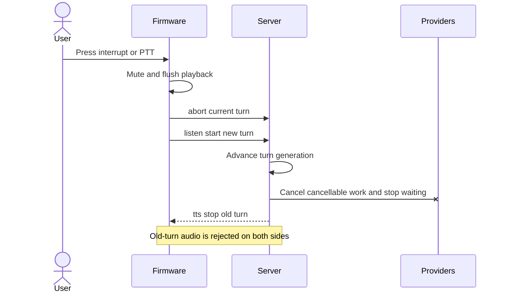

# Audio pipeline, streaming, barge-in và latency budget

> Mục tiêu chính: warm **Lab E2E TTFA** p95 **< 1.500 ms** trên LAN và GTX 1650Ti host.  
> Audio wire: uplink Opus mono 16 kHz/60 ms; downlink Opus mono 24 kHz/60 ms.  
> Provider/model/resource cụ thể: [05-provider-registry.md](./05-provider-registry.md).

## 1. Hai định nghĩa TTFA

Không dùng một timestamp mơ hồ cho mọi báo cáo:

| Tên | Công thức | Dùng ở đâu |
|---|---|---|
| **Lab E2E TTFA** | first playable speaker PCM − annotated last voiced sample | Acceptance chính; bao gồm endpointing. |
| **Operational TTFA** | first playable speaker PCM − server `speech_endpointed` | Dashboard production; không có ground truth annotation. |
| **PTT TTFA** | first playable speaker PCM − button release received | PTT acceptance. |
| **Cold TTFA** | cùng công thức nhưng model/session chưa warm | Báo riêng, không trộn warm SLO. |

`first_opus_sent` không phải first audio: firmware còn network receive, decode, prebuffer và codec output. Firmware phải emit/trace `first_pcm_playable` hoặc host test phải suy ra bằng playback callback.

## 2. End-to-end path

```mermaid
flowchart LR
    MIC[Mic native PCM]
    AFE[AFE AEC NS WakeNet]
    R16[Resample 16 kHz]
    F60[Frame 60 ms]
    OPU[Opus encode]
    NETU[WS or UDP uplink]
    UNWRAP[Validate and unwrap]
    DECODE[Opus decode once]
    VAD[Silero VAD]
    ASR[ASR ingress and recognition]
    FINAL[Final transcript]
    LLM[Groq token stream]
    SEG[Semantic segmenter]
    TTS[VieNeu audio stream]
    R24[Resample 24 kHz]
    OPD[Opus encode 60 ms]
    NETD[WS or UDP downlink]
    PLAY[Decode resample speaker]

    MIC --> AFE --> R16 --> F60 --> OPU --> NETU
    NETU --> UNWRAP --> DECODE --> VAD --> ASR --> FINAL
    FINAL --> LLM --> SEG --> TTS --> R24 --> OPD --> NETD --> PLAY
```



Firmware reference đọc audio theo block 10 ms rồi AFE gom frame 60 ms (`references/xiaozhi-esp32/main/audio/audio_service.cc:236-305`, `references/xiaozhi-esp32/main/audio/engines/afe_audio_engine.cc:416-445`). Veetee giữ wire frame 60 ms để tương thích nhưng xử lý AFE/VAD nội bộ theo chunk nhỏ hơn khi provider yêu cầu.

## 3. Uplink trên firmware

### 3.1 Idle và wake

- WakeNet chạy on-device trong AFE; idle microphone không stream tới server.
- Ring/pre-roll buffer nằm trong PSRAM, capacity cố định và chỉ giữ audio gần nhất.
- Wake detection tạo local interaction event; firmware mở channel, gửi hello/listen/detect theo contract và kèm pre-roll nếu build/profile hỗ trợ.
- Wake model/phrase là asset/config, không là literal trong application state machine.

Reference giữ wake cache khoảng 2 giây/64 KiB và upload có điều kiện theo build (`references/xiaozhi-esp32/main/audio/engines/afe_audio_engine.cc:93-107`, `references/xiaozhi-esp32/main/application.cc:869-903`). Veetee phải đo lại capacity sau khi pin AFE model; không tăng buffer không giới hạn.

### 3.2 AFE/AEC/noise suppression

- Một AFE owner task quản lý WakeNet, AEC, noise suppression và device-side VAD hints.
- ISR/I2S callback chỉ chuyển ownership của fixed buffer; không resample, encode, log hoặc gọi network trong ISR.
- AEC reference lấy từ frame sau codec output write/handoff; nếu board có DMA-play
  callback đã đo thì dùng marker mạnh hơn đó. Không lấy frame vừa nhận qua mạng và
  không gọi driver handoff là bằng chứng âm thanh đã phát acoustic.
- Toggle/reset AFE được gửi về owner task và diễn ra ở safe boundary.

Reference cũng defer AFE reset/toggle về fetch-owner task để tránh corrupt ring (`references/xiaozhi-esp32/main/audio/engines/afe_audio_engine.cc:282-307`, `references/xiaozhi-esp32/main/audio/engines/afe_audio_engine.cc:348-367`). Đây là timing invariant cần conformance/soak trước khi thay.
Reference snapshot tắt NSNet vì không kèm model; noise suppression ở Veetee là
capability mới chỉ activate khi asset/license/resource/listening test pass, không
phải behavior đã kế thừa sẵn (`references/xiaozhi-esp32/main/audio/README.md:22-24`,
`references/xiaozhi-esp32/main/audio/engines/afe_audio_engine.cc:135-150`).

### 3.3 Encode và upload

- PCM được chuẩn hóa signed 16-bit mono 16 kHz.
- Encoder tạo đúng một Opus packet cho 60 ms/960 samples; compressed byte length biến đổi.
- Uplink queue bounded; khi congestion buộc drop thì drop oldest realtime frame và gắn discontinuity metric.
- Transport task không giữ audio buffer sau khi send ownership hoàn tất.

Reference dùng VBR/DTX nên packet không có fixed byte size (`references/xiaozhi-esp32/main/audio/audio_service.h:65-76`) và drop oldest khi send queue đầy (`references/xiaozhi-esp32/main/audio/audio_service.cc:536-577`). Parser tuyệt đối không giả định byte length từ sample count.

## 4. Server ingress và noise gate

### 4.1 Decode once

1. Validate WebSocket/UDP envelope và declared payload size.
2. Decode một Opus packet thành PCM 16 kHz mono.
3. Gắn `session_id`, `turn_id`, sequence/timestamp, capture/receive monotonic time và discontinuity.
4. Fan-out immutable PCM view cho VAD + ASR; optional side sink có queue/deadline riêng.

Reference đã decode một lần trước VAD/ASR (`references/xiaozhi-esp32-server/main/xiaozhi-server/core/connection.py:365-380`).

### 4.2 Ba lớp lọc ngoại cảnh

| Lớp | Mục đích | Được phép quyết định | Không được phép |
|---|---|---|---|
| Device AFE | Echo/noise/level ở waveform | NS/AEC, clipping/energy telemetry | Bỏ câu theo từ khóa/ngôn ngữ. |
| Server VAD | Có speech và endpoint | Hysteresis, min speech, trailing silence | Đoán “câu này không liên quan”. |
| ASR evidence gate | Transcript có đủ bằng chứng | Empty/no-speech/confidence/garbage pattern theo capability | Hardcode danh sách câu tiếng Việt trong core. |

“Không liên quan” về nghĩa là Intent/LLM policy, không phải acoustic filter. Core không được bỏ một phát ngôn hợp lệ chỉ vì ngắn hoặc không khớp chủ đề.

### 4.3 Silero VAD

- ONNX CPU, process-resident, nhận PCM 16 kHz theo window provider yêu cầu.
- Profile có `speech_threshold`, `release_threshold`, `min_speech_ms`, `min_silence_ms`, `pre_roll_ms`, `max_pending_audio_ms` và calibration revision.
- Threshold theo microphone/device/acoustic environment; locale chỉ ảnh hưởng endpoint corpus, không nhánh code.
- Manual PTT bypass auto endpoint nhưng vẫn ghi VAD/quality metrics.

Reference Silero dùng 512 samples, dual threshold/sliding window và silence duration (`references/xiaozhi-esp32-server/main/xiaozhi-server/core/providers/vad/silero.py:12-35`, `references/xiaozhi-esp32-server/main/xiaozhi-server/core/providers/vad/silero.py:88-114`). Các con số Veetee phải benchmark thay vì sao chép mặc định.

## 5. Endpointing theo interaction mode

| Mode wire | Start authority | Stop authority | VAD role |
|---|---|---|---|
| `manual` | PTT press/listen start | PTT release/listen stop | Quality/noise metrics, không cắt utterance. |
| `auto` | Wake/click/listen start | Server VAD endpoint hoặc explicit stop | Quyết định speech start/end. |
| `realtime` | Duplex channel | Barge-in/new turn/explicit stop | Xác nhận user speech khi AI nói. |

Không áp max utterance vài giây. Có `max_buffered_audio_ms` để bảo vệ memory nhưng khi chạm ngưỡng server phải stream/segment ASR hoặc trả typed resource error, không âm thầm cắt transcript.

## 6. ASR ingress streaming và baseline final recognition

- PCM ingress/VAD/audio buffer luôn stream khi turn capture bắt đầu.
- Baseline `PhoWhisper-small` là offline sequence-to-sequence: stable transcript được suy luận/chốt sau endpoint; không quảng cáo là true partial-ASR.
- PTT release/VAD end gọi `finish()` và đo `asr_finalize_ms`; đây là stage quan trọng nhất cần GPU benchmark.
- Với utterance dài hơn model window, adapter dùng rolling window + overlap/stable-prefix stitching có memory bounded; không cắt im lặng và không gọi LLM trước final transcript baseline.
- Partial/provisional transcript chỉ tồn tại nếu provider khai báo capability; dùng cho UI/telemetry, không speculative answer.
- Provider phải trả locale, normalized text, optional confidence/no-speech evidence và timing.
- Provider không có confidence phải khai báo capability thiếu; core không bịa `1.0`.
- Discontinuity từ dropped packet được chuyển cho provider hoặc ghi vào result quality flags.

Reference có streaming ASR nhưng vẫn chờ final status trước chat (`references/xiaozhi-esp32-server/main/xiaozhi-server/core/providers/asr/xunfei_stream.py:188-227`). Veetee giữ baseline an toàn này; M1 bakeoff Zipformer là design-time selection, không chạy song song hoặc fallback runtime. Speculative LLM chỉ được xem xét bằng ADR sau.

## 7. Groq token stream và tool turns

### 7.1 Fast answer

Final transcript tạo Groq request ngay sau prompt snapshot assembly. Text delta chảy vào segmenter; first safe segment được gửi TTS dù LLM chưa complete.

### 7.2 Tool/reasoning chậm

Progress policy dùng deadline và explicit turn state:

- Nếu model bắt đầu tool call/reasoning dự kiến vượt `progress_ack_deadline_ms`, coordinator chọn một acknowledgment ID từ personality/locale config.
- Audio acknowledgment được pre-synthesize lúc config activation nếu có thể; nó vẫn mang current `turn_id` và bị cancel khi barge-in.
- Không phát acknowledgment khi đã có meaningful answer segment sắp tới hoặc tool kết thúc trước deadline.
- Sau tool result, LLM tiếp tục cùng turn và TTS đọc answer thật.
- Phrase, voice/style và threshold đều là config; code chỉ biết policy/event ID.

Runtime baseline thực hiện policy này bằng `progress.acknowledgementId` cùng map
`progress.acknowledgements` trong snapshot. Khi LLM chưa phát delta có nghĩa sau
deadline, server phát đúng text đã cấu hình như một `sentence_start`; không có
text map thì không tự chèn câu mặc định. Ack và câu trả lời dùng cùng
`turn_id`, cùng cancellation barrier và bị bỏ khi barge-in/abort.

Timer bắt đầu tại `speech_endpointed`; baseline
`progress_ack_deadline_ms = 900`. Config activation chỉ hợp lệ khi
`0 < progress_ack_deadline_ms < lab_ttfa_target_ms` và
`vad_endpoint_budget_p95 + progress_ack_deadline_ms +
measured_ack_playout_p95 < lab_ttfa_target_ms`.
`measured_ack_playout_p95` tính từ lúc chọn acknowledgment tới
`first_pcm_playable`, gồm TTS nếu clip chưa pre-synthesize. Như vậy deadline không
thể được cấu hình sát 1.500 ms rồi làm acknowledgment phát sau SLO. Ack path phải
được benchmark/pin cùng config revision; thiếu phép đo thì revision không được
promote cho tool-turn acceptance.

Không dùng progress phrase để che lỗi. Provider timeout/429 tạo typed failure và localized error policy riêng.

### 7.3 Tool delta safety

- Tool name/arguments delta được assemble riêng.
- Không gửi JSON/tool argument vào segmenter/TTS.
- Tool chạy sau schema/permission/deadline validation.
- Result cũ sau abort bị generation guard loại trước LLM resume.

## 8. Semantic text segmentation

Segmenter là provider-neutral, locale-aware component:

| Boundary | Hành vi |
|---|---|
| Strong punctuation | Emit nếu đủ context và không nằm trong quote/number/URL chưa đóng. |
| Clause punctuation | Emit khi đạt target latency/length và prosody rule cho phép. |
| No punctuation | Emit tại configurable maximum wait/length bằng safe token boundary. |
| Tool call delta | Không emit. |
| Final delta | Flush phần text có nghĩa còn lại. |

Inputs configuration gồm BCP-47 locale, tokenizer hints, abbreviation rules, minimum/target/maximum characters và maximum wait. Rules tiếng Việt nằm trong locale package/data, không trong conversation core.

Golden corpus phải có viết tắt, số thập phân, ngày/giờ, URL, emoji, dấu ngoặc, English code-switch, câu cực ngắn và đoạn không dấu câu.

## 9. VieNeu TTS streaming

- Selected VieNeu v3 Turbo `3.2.4`/pinned model revision nhận ordered `SpeechSegment` và yield PCM chunks bằng ONNX INT8 CPU; không trả full WAV cho answer dài.
- Mỗi segment có independent synthesis context nhưng voice/style/speaker embedding được reuse trong turn/session theo manifest.
- Current realtime candidate có frame streaming; output source rate được adapter khai báo. Nếu là 48 kHz, server resample streaming về negotiated 24 kHz trước Opus.
- Text normalization nằm ở locale/TTS adapter; core không thay từ tiếng Việt bằng rule hardcode.
- TTS cancel phải dừng generation và release queue/worker trong deadline.
- First segment có thể được warm/prepared; không lazy-download model trên user turn.

Reference base TTS đã synthesize theo sentence chunks (`references/xiaozhi-esp32-server/main/xiaozhi-server/core/providers/tts/base.py:483-520`) nhưng một segment có thể blocking. Veetee contract yêu cầu selected realtime adapter yield first PCM và khai báo `first_chunk_ms`, `rtf`, `supports_cancel`.

## 10. Downlink, pacing và playback

1. PCM source → streaming resampler → PCM 24 kHz mono.
2. Gom 1.440 samples/60 ms → Opus packet.
3. Wrap đúng active WS v1/v2/v3 hoặc UDP envelope.
4. Gửi startup prebuffer nhỏ được benchmark theo transport/jitter.
5. Pace bằng monotonic playback clock; không `sleep` cộng dồn gây drift.
6. Firmware unwrap/decode, resample nếu codec output rate khác và enqueue playback.
7. Normal completion đợi handed-off audio drain rồi gửi `tts.stop`; abort flush ngay.

Reference default downlink 24 kHz/60 ms và firmware resample nếu cần (`references/xiaozhi-esp32/main/protocols/protocol.h:77-80`, `references/xiaozhi-esp32/main/audio/audio_service.cc:375-440`). Reference pacing dùng virtual play position để giảm drift (`references/xiaozhi-esp32-server/main/xiaozhi-server/core/utils/audioRateController.py:91-151`).

Startup burst count không hardcode từ reference; promotion test chọn nhỏ nhất thỏa `underrun_rate` mà không làm TTFA vượt budget.

## 11. Latency budget

### 11.1 Warm auto-mode p95 budget

| Stage | Budget p95 | Marker đầu → cuối |
|---|---:|---|
| VAD endpoint | 200 ms | `annotated_last_voice` → `speech_endpointed` |
| ASR finalize | 350 ms | `speech_endpointed` → `asr_final` |
| Prompt/orchestration | 10 ms | `asr_final` → `llm_request_sent` |
| Groq first meaningful text | 220 ms | `llm_request_sent` → `llm_first_meaningful_text_delta` |
| Semantic segment accumulation | 100 ms | `llm_first_meaningful_text_delta` → `segment_first_emit` |
| VieNeu first PCM | 350 ms | `segment_first_emit` → `tts_first_pcm` |
| Resample/Opus/network/prebuffer | 170 ms | `tts_first_pcm` → `first_pcm_playable` |
| SLO headroom, không phải span | 80 ms | Phần dự phòng số học cho variance; không ghi thêm vào waterfall |
| **Tổng** | **1 480 ms** | last voice → speaker playable |

Bảy dòng stage đầu tạo một chuỗi marker liền nhau và **không overlap**;
`segment_first_emit` đồng thời là handoff `segment accepted`, còn first PCM của TTS
là marker đầu cho egress. Event-loop/OS wait được quy cho span đang giữ ownership,
không cộng lần hai thành một “scheduling span”. Dòng headroom chỉ là khoảng trống
giữa tổng stage budget 1.400 ms và budget 1.480 ms. Đây là budget cho utterance hội
thoại điển hình, không phải số đo đã đạt. Provider eligibility gate có thể rộng
hơn, nhưng combo được promote M1 vẫn phải đạt tổng end-to-end. Stage vượt budget
phải xuất span breakdown; không “bù” bằng bỏ đo endpointing. Long monologue được
báo ở bucket duration riêng.

### 11.2 PTT và cold path

- PTT release bỏ VAD trailing-silence budget nên target có thể thấp hơn auto-mode.
- Cold model load/download không nằm trong warm SLO; download chỉ diễn ra trước readiness.
- Cold-start report vẫn bắt buộc và có promotion gate riêng để restart không làm thiết bị treo.

### 11.3 Tool turn

Lab E2E TTFA của progress acknowledgment đo riêng với mục tiêu cùng 1,5 giây;
Operational TTFA vẫn được ghi để chẩn đoán phần sau endpoint. Time-to-final-answer
phụ thuộc tool và không có fixed cap, nhưng mỗi tool có deadline/progress/abort contract.

## 12. Barge-in

### 12.1 Button interrupt



Local mute/flush không đợi RTT; server cleanup vẫn bắt buộc.
`abort` không hứa hoàn tác hardware side effect đã bắt đầu: server bỏ quyền resume
turn ngay, chỉ gửi cancel tới tool khai báo cancellable, rồi quarantine/audit mọi
late result của tool không cancellable.

### 12.2 Acoustic barge-in

- Realtime mode giữ mic path chạy khi speaker phát.
- Device AEC loại echo; VAD evidence gửi uplink.
- Server acoustic gate yêu cầu speech evidence theo calibrated profile, không trigger chỉ vì speaker leakage.
- Khi confirmed, server cancel turn cũ và chấp nhận audio pre-roll cho turn mới.
- Nếu detection hóa ra false start, policy không được tự phát lại audio cũ đã hủy; session quay về listen/idle rõ ràng.

Reference realtime mode giữ uplink khi speaking (`references/xiaozhi-esp32/main/application.cc:951-960`) và timestamp AEC được gắn sau khi `OutputData` trả về; source không chứng minh DAC/acoustic playback (`references/xiaozhi-esp32/main/audio/audio_service.cc:324-349`).

### 12.3 Acceptance

- Button time-to-silence p95 ≤ 150 ms local, end-to-end cleanup p95 ≤ 250 ms.
- Acoustic time-to-silence p95 ≤ 250 ms sau `barge_in_confirmed`.
- 0 old-turn PCM frame tới codec sau local cancellation barrier.
- Echo-only corpus không vượt false-barge threshold đã chốt.

## 13. Long conversation và long answer

- Không giữ full PCM/Opus/WAV trong RAM.
- LLM, segment, TTS và egress queue đều bounded; backpressure đi ngược tới stream reader.
- Conversation context do Memory provider window/summarize; full history nằm ngoài prompt.
- Tool result có size limit + summarization/reference policy, không nhét blob vào LLM.
- Session keepalive độc lập với turn duration.
- Metrics/log/history batch flush ngoài audio loop và rotate.
- User abort luôn có priority; answer dài không khóa new turn.
- Normal completion chỉ khi LLM final, tool loop done, segment buffer flushed, TTS final và egress drained.

Baseline long-answer acceptance **không phụ thuộc Groq tạo một response rất dài**.
Một deterministic long-text fixture có checksum stream nội dung Unicode tiếng
Việt, punctuation/no-punctuation, số và code-switch qua đúng
`segmenter → VieNeu → resampler → Opus → paced egress` trong ít nhất 30 phút audio.
Oracle kiểm tra `segment_index`, text coverage/order, frame order, queue hard age,
RSS, abort priority và không materialize full text/WAV/audio.

Giới hạn một response Groq, support continuation và semantics ghép nhiều request
chưa có live capability evidence. Đây là capability question: chỉ đưa Groq vào
long-answer/continuation acceptance sau khi probe bằng model ID đã pin chứng minh
finish reason, token limit, tool state và continuation không mất/lặp nội dung.
Không dùng test key rotation để biến continuation thành product behavior.

## 14. Resource/overload behavior

| Tình huống | Behavior |
|---|---|
| Ingress frame cũ vì network stall | Drop oldest theo freshness; flag discontinuity. |
| ASR chậm hơn realtime lâu dài | Abort turn với `audio.asr_backlog`; không buffer vô hạn. |
| Groq reader bị TTS backpressure | Pause SSE consumption trong bounded window; cancel khi deadline/resource policy vượt. |
| TTS nhanh hơn speaker | Egress queue backpressure TTS; không synthesize full answer trước. |
| TTS chậm hơn playback | Small jitter buffer underrun metric; không gửi fake silence vô hạn. |
| GPU OOM risk | Resource arbiter từ chối load/admission trước CUDA call; process không retry loop. |

Capacity, hard age và metric bắt buộc của từng queue nằm trong
[07-server-design.md](./07-server-design.md); các default là candidate được tune
bằng benchmark trong schema range, không là magic constant bất biến.

## 15. Test corpus và test oracles

### Acoustic/VAD

- Ba miền giọng, nam/nữ, gần/xa mic, quạt/TV/đường phố, speaker echo và im lặng.
- Annotated speech intervals để tính missed speech, false start và endpoint delay.
- PTT dài, pause tự nhiên dài, câu một âm tiết và nói chen khi speaker lớn.

### ASR/segmenter

- WER/CER theo accent/noise, proper noun, số, English code-switch.
- Partial stability và finalization tail.
- Segment boundaries không làm thay đổi text normalized; không đọc tool JSON.

### TTS

- First chunk, RTF, underrun, tail completion, cancellation và answer dài.
- Human listening checklist: phát âm, prosody, khoảng nghỉ, giọng ổn định; metric tự động không thay nghe thật.

### End-to-end

- ≥ 100 scripted turns cho latency distribution; cold/warm tách riêng.
- Abort được inject ở mọi stage và mọi segment index.
- Deterministic long-text fixture tạo ≥ 30 phút audio qua segmenter/TTS/Opus/egress;
  test này không tuyên bố Groq hỗ trợ một response hoặc continuation dài tương ứng.
- 60 phút M1, 24 giờ M4; RSS/VRAM/task/fd/queue không tăng đơn điệu.

## 16. Telemetry schema tối thiểu

Mỗi span/event có `trace_id`, opaque `session_id`, `turn_id`, `config_revision`, transport/profile, provider implementation/version và monotonic timestamp. Transcript/prompt/audio không phải telemetry field mặc định.

Dashboard bắt buộc hiển thị waterfall:

```text
endpoint | ASR | prompt | Groq first meaningful text | segment accumulation | TTS first PCM | egress | playback
```

Nếu thiếu marker, turn bị gắn `latency_incomplete=true`; không điền `0 ms`.
