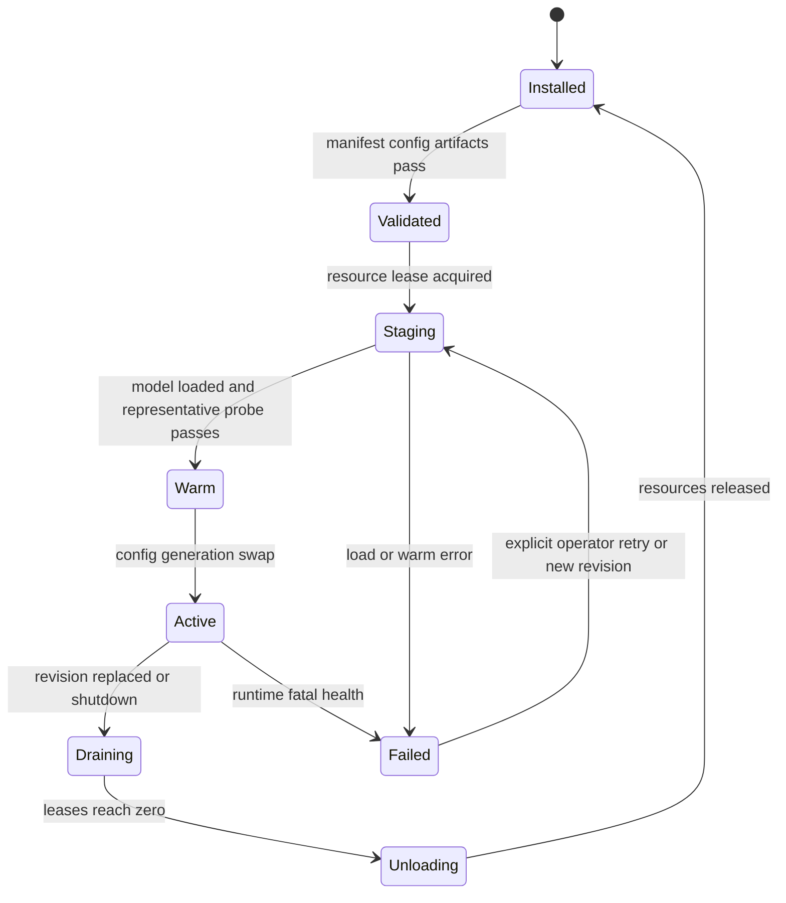

# Provider registry, lifecycle và baseline providers

> Quyết định: package discovery + manifest/JSON Schema; đúng một active selection mỗi kind; **không runtime fallback**.  
> ADR: [ADR-007](./ADR/ADR-007-provider-registry-lifecycle.md).  
> Hardware khảo sát: GTX 1650Ti 4.096 MiB VRAM, RAM 15 GiB usable.

## 1. Thuật ngữ normative

| Thuật ngữ | Nghĩa | Ví dụ |
|---|---|---|
| Provider kind | Capability chuẩn của core | `vad`, `asr`, `llm`, `tts`, `intent`, `memory` |
| Provider implementation | Code package implement một kind | PhoWhisper adapter |
| Provider manifest | Metadata/schema/capability immutable của implementation version | locales, formats, lifecycle |
| Provider installation | Implementation version đã được cài và allowlist | package + hash |
| Provider config | Giá trị cấu hình của một implementation, secrets bằng reference | model revision, compute type |
| Provider selection | Config active cho một assistant/kind | assistant A → ASR config 7 |
| Provider instance | Object/process đang loaded/warm | process singleton ASR |
| Model artifact | Files immutable mà provider load | converted CTranslate2 model |

Reference đã tách provider metadata và model config thành entity khác nhau (`references/xiaozhi-esp32-server/main/manager-api/src/main/java/xiaozhi/modules/model/entity/ModelProviderEntity.java:12-46`, `references/xiaozhi-esp32-server/main/manager-api/src/main/java/xiaozhi/modules/model/entity/ModelConfigEntity.java:14-64`). Veetee giữ separation này và thêm manifest/schema/artifact/lifecycle rõ ràng.

## 2. Provider kinds và activation

| Kind | Required baseline | Active M0/M1 | Nếu disabled |
|---|---:|---|---|
| VAD | yes | Silero VAD 6.2.1 | Chỉ được trong pure PTT test profile. |
| ASR | yes | PhoWhisper-small | Không thể tạo conversational turn. |
| LLM | yes | Groq OpenAI-compatible | Turn kết thúc `provider.unavailable`. |
| TTS | yes | VieNeu v3 Turbo | Text-only debug profile, không phải robot acceptance. |
| Intent | no | Config-pattern system intents | Mọi transcript đi thẳng LLM/tool policy. |
| Memory | no | Session window | Không có cross-session recall. |

“Disabled” là explicit config state, không phải null-object giả vờ thành công. Các milestone có thể không yêu cầu Intent/Memory, nhưng registry và API vẫn hiểu kind này.

## 3. Discovery contract

Provider implementation là Python distribution đã cài, đăng ký entry point theo kind. Core chỉ gọi registry:

```python
class ProviderRegistry:
    def discover(self) -> list[ProviderManifest]: ...
    def validate_config(self, manifest_id, values) -> ValidationResult: ...
    async def stage(self, selection, resources) -> ProviderInstance: ...
    async def activate(self, generation) -> None: ...
    async def drain(self, generation, deadline) -> None: ...
```

Quy tắc:

1. Package install/remove là deployment action có allowlist/hash; Manager UI không tự `pip install` code tùy ý.
2. Sau khi package đã cài, thêm config/chọn model/activate không cần sửa core hoặc web source.
3. Duplicate stable ID hoặc unsupported manifest major version làm readiness fail.
4. Package import không được download model, mở socket hay allocate GPU; side effect chỉ bắt đầu ở `stage()`.
5. Manifest là source cho manager form và runtime validation, nhưng server vẫn enforce schema/capabilities.

Reference dynamic-import theo config `type` (`references/xiaozhi-esp32-server/main/xiaozhi-server/core/utils/modules_initialize.py:30-98`). Entry point/manifest thay convention path ngầm bằng explicit registration.

## 4. Manifest schema

Ví dụ rút gọn, dưới 20 dòng:

```json
{
  "manifestVersion": "1.0",
  "id": "veetee.asr.phowhisper",
  "kind": "asr",
  "implementationVersion": "1.0.0",
  "lifecycle": "PROCESS_SINGLETON",
  "locales": ["vi-VN"],
  "inputs": [{"mediaType": "audio/pcm", "rate": 16000, "channels": 1}],
  "capabilities": {"partial": false, "cancel": "cooperative"},
  "configSchema": "provider://veetee.asr.phowhisper/config/1",
  "secretFields": [],
  "artifactPolicy": {"revisionRequired": true, "checksumRequired": true}
}
```

Required fields:

- Stable `id`, `kind`, semantic implementation version và supported manifest major.
- `lifecycle`: `PROCESS_SINGLETON`, `SESSION` hoặc `TURN`.
- Input/output media, sample rates, locale list và streaming/cancellation capability.
- JSON Schema URI + optional UI hints; schema có `additionalProperties: false` trừ map được định nghĩa rõ.
- Secret field paths, network egress domains và filesystem needs.
- Declared resource hints: resident RAM/VRAM, workspace, warm-up, concurrency; chỉ là preflight hint.
- Artifact/license metadata và provider contract test version.

## 5. Core capability interfaces

### 5.1 VAD

```python
class VadSession:
    def accept(self, pcm: PcmFrame) -> list[VadEvent]: ...
    def reset(self, turn_id: int) -> None: ...
    def close(self) -> None: ...
```

Events tối thiểu: `speech_started`, `speech_probability`, `speech_ended`; timestamp dùng source sample position, không wall-clock suy đoán.

### 5.2 ASR

```python
class AsrSession:
    async def accept(self, pcm: PcmFrame) -> list[TranscriptEvent]: ...
    async def finish(self, reason: str) -> FinalTranscript: ...
    async def cancel(self) -> None: ...
```

`supports_partial=false` là hợp lệ; core không giả partial. Final result có normalized text, locale, optional confidence/no-speech và audio interval.

### 5.3 LLM

```python
class LlmProvider:
    async def stream(self, request: LlmRequest) -> AsyncIterator[LlmEvent]: ...
    async def cancel(self, request_id: str) -> None: ...
```

Events phân biệt text delta, tool-call delta, usage và finish/error. Tool JSON chưa complete tuyệt đối không xuất thành text.

### 5.4 TTS

```python
class TtsSession:
    async def synthesize(self, segment: SpeechSegment) -> AsyncIterator[AudioChunk]: ...
    async def cancel(self, turn_id: int) -> None: ...
    async def close(self) -> None: ...
```

Manifest khai báo source sample rate/format, true frame stream hay segment result, voice/style controls, maximum frames/chunk và cancellation granularity.

### 5.5 Intent và Memory

```python
class IntentProvider:
    async def classify(self, transcript, context) -> IntentResult: ...

class MemoryProvider:
    async def recall(self, query, budget) -> MemoryContext: ...
    async def commit(self, turn_summary) -> None: ...
```

Memory commit là side task có deadline; không được giữ `tts.stop` hoặc session close vô hạn.

## 6. Lifecycle state machine



Đây là lifecycle của **một provider instance**, không phải toàn bộ activation
transaction. Không có cạnh `Failed → provider khác`. Operator/config publication
có thể chọn config mới ở generation sau; turn đang lỗi không đổi provider.

## 7. Config publication và one-selection invariant

Database constraint logic:

```text
UNIQUE active selection per assistant_id and provider_kind
selection.provider_config.kind equals selection.kind
provider_config.manifest_id resolves installed compatible package
all secret fields are secretRef, never inline secret value
```

### 7.1 Chọn activation mode

Manager validate JSON Schema/references/unique selection; Voice server fetch
immutable revision/checksum rồi registry verify package, artifact, license,
capability và measured resource plan. Resource arbiter chọn đúng một mode:

| Mode | Admission condition | Readiness và ảnh hưởng |
|---|---|---|
| `BLUE_GREEN` | Measured load/warm peak delta của generation mới ≤ `V_allocatable_headroom` | Old generation tiếp tục phục vụ; process vẫn ready. Warm/probe new, atomic swap, drain/unload old. Không có downtime dự kiến. |
| `QUIESCE_SWAP` | Không đủ dual residency, nhưng old và new **từng generation riêng lẻ** đều nằm dưới promotion limit | Đóng admission turn/session mới, readiness trả non-ready reason `provider_activation_quiescing`; liveness vẫn healthy. Drain/cancel lease theo bounded deadline, unload old rồi warm new. |
| Reject | New generation riêng lẻ cũng không vừa hoặc thiếu measured record | Không quiesce, không load; old revision tiếp tục active và activation fail typed. |

`allocatable_headroom`, promotion limit và các lớp VRAM được định nghĩa ở §11.
Resource hint trong manifest chỉ đủ cho preflight; mode chỉ được chọn bằng benchmark
record của exact artifact/runtime/hardware.

### 7.2 Transaction và rollback

`BLUE_GREEN` thực hiện `stage → warm → readiness probe → atomic activate → drain
old → unload old`. Load/warm/probe fail thì unload toàn bộ failed generation,
release lease và giữ old pointer/readiness; không có partial activation.

`QUIESCE_SWAP` thực hiện:

1. Đóng admission, ghi thời điểm bắt đầu degraded interval và drain active leases
   trong `activation_quiesce_deadline_ms` bounded.
2. Hết deadline thì cancel lease còn lại theo cancellation contract; chỉ tiếp tục
   khi generation cũ có zero lease và unload đã trả resource về expected baseline.
3. Load/warm/probe generation mới, atomic activate rồi mở admission/readiness.
4. Nếu load/warm/probe fail: unload failed generation trước, sau đó reload/warm/probe
   **exact pinned old generation** và chỉ mở admission khi old ready trở lại.
5. Nếu rollback reload old cũng fail, process giữ liveness nhưng remains non-ready,
   phát alert typed; tuyệt đối không chọn provider/config khác.

Mọi activation ghi `mode`, old/new revision, load/warm/unload duration,
`degraded_interval_ms`, peak RAM/VRAM, result và rollback result. Giữ old revision
trong blue-green hoặc reload old generation trong quiesce-swap là
**transactional config rollback**, không phải runtime provider fallback.

## 8. Secret contract

- Manifest đánh dấu secret paths; Manager API write nhận secret value hoặc existing `secretRef`, nhưng read chỉ trả `configured: true`, metadata và reference ID opaque.
- PostgreSQL provider config/audit diff không chứa plaintext.
- Voice server machine identity resolve secret vào process memory ngay trước provider stage.
- Structured logs redact auth headers, request bodies theo schema secret paths và SDK exception có thể echo key.
- Secret rotation tạo config revision mới, stage/warm rồi drain instance cũ.
- Web không giữ provider secret trong Pinia/localStorage sau submit.

## 9. Product baseline đã chọn

### 9.1 Wake/AFE

On-device ESP-SR/WakeNet + AFE/AEC/noise suppression. Đây không phải host provider kind ở baseline và dùng 0 host VRAM. Chi tiết tại [ADR-005](./ADR/ADR-005-on-device-wake-word.md).

### 9.2 VAD — Silero VAD 6.2.1

Pin candidate:

- Package `silero-vad==6.2.1`, upstream commit `7e30209a…`, MIT.
- Bundled ONNX model 2.327.524 bytes.
- 16 kHz wrapper nhận 512 samples, tức 32 ms; adapter phải reframe PCM từ Opus 60 ms qua stateful ring.
- Upstream công bố model khoảng 2 MB và xử lý một chunk 30+ ms dưới 1 ms trên một CPU thread; con số phải benchmark lại trên host.

Implementation hiện expose provider ID `veetee.vad.silero`; `modelPath`,
`sampleRate`, `windowSamples`, dual threshold và endpoint durations đều là config
schema. ONNX recurrent state được giữ bounded trong một provider instance; thiếu
artifact/dependency là typed activation error, không fallback sang energy VAD.

Nguồn: [Silero README](https://github.com/snakers4/silero-vad/blob/7e30209a3e901f9842f81b225f3e93d8199902b1/README.md), [wrapper 512 samples](https://github.com/snakers4/silero-vad/blob/7e30209a3e901f9842f81b225f3e93d8199902b1/src/silero_vad/utils_vad.py#L57-L67), [PyPI 6.2.1](https://pypi.org/project/silero-vad/6.2.1/).

### 9.3 ASR — PhoWhisper-small

Pin source:

- `vinai/PhoWhisper-small@a86b604c346caf7148c37512eafe783a16420adb`.
- BSD-3-Clause, 244M parameters, official FP32 checkpoint 967.102.729 bytes.
- Tự convert bằng pinned `faster-whisper==1.2.1`/CTranslate2; ghi converter/runtime/options/hash vào artifact manifest.
- Baseline CUDA FP16 để ưu tiên parity; `int8_float16` chỉ promote nếu WER gate pass.
- Upstream Whisper memory proxy cho size small khoảng 2 GiB VRAM; peak limit Veetee ≤ 2,5 GiB. Đây chưa phải phép đo trên Acer.

PhoWhisper được fine-tune trên 844 giờ nhiều accent tiếng Việt; official table báo WER small: CMV–Vi 11,08; VIVOS 6,33; VLSP2020 T1 15,93; T2 32,96. Nguồn: [model artifact](https://huggingface.co/vinai/PhoWhisper-small/tree/a86b604c346caf7148c37512eafe783a16420adb), [parameter/WER table](https://github.com/VinAIResearch/PhoWhisper/blob/b06f1937995cfee75b9e4ad3e2ae0798faf1a562/README.md#model-download--wer-results), [Whisper memory proxy](https://github.com/openai/whisper/blob/5f86d1d86363843179951550570367b37c5d6f78/README.md#available-models-and-languages), [conversion support](https://github.com/SYSTRAN/faster-whisper/blob/ed9a06cd89a93e47838f564998a6c09b655d7f43/README.md#model-conversion).

Giới hạn: PhoWhisper là offline sequence-to-sequence. Audio ingest/VAD stream trong lúc user nói, nhưng stable transcript chỉ có sau endpoint. Đây là lựa chọn quality/stability baseline; không được quảng cáo là true partial-ASR.

### 9.4 LLM — Groq OpenAI-compatible

- Provider dùng API streaming và tool calling.
- Model ID không hardcode: implementation capability-probe `/models`/test request, Manager chỉ cho activate model đã chứng minh streaming + tool calls.
- Active revision pin exact model ID, reasoning/temperature/token/tool policy.
- Một production `secretRef`; `429`, timeout hoặc model removal tạo typed error, không đổi key/model/provider.
- Khi chủ dự án cung cấp key, test suite ghi model list/capability/first-token data rồi mới chốt baseline model ID.
- Max output của một response, finish reason và continuation/multi-request semantics
  là capability chưa chứng minh. Không dùng Groq làm oracle cho acceptance answer
  dài cho tới khi live probe exact model ID xác nhận không mất/lặp text và tool state.

Danh sách nhiều free-tier key chỉ dành cho test harness. Nó không xuất hiện trong provider manifest/config schema production, Manager UI hoặc database.

### 9.5 TTS — VieNeu v3 Turbo streaming

Pin:

- Package `vieneu==3.2.4`, tag commit `a8c9fbf99749d5ce45c89111f71558d6ceef3424`.
- Model `pnnbao-ump/VieNeu-TTS-v3-Turbo@75ff82a72f54d55ed389e1eeb12041d3c4bac7d4`.
- Codec `OpenMOSS-Team/MOSS-Audio-Tokenizer-Nano-ONNX@ceff0d0749bfb3fa2d61149794ec6feef0d1e1ae`.
- Apache-2.0, ONNX INT8 CPU frame streaming; 0 VRAM.
- Download set 311,89 MiB; design estimate 0,5–0,9 GiB RSS, promotion target <1 GiB.

Upstream mô tả first audio khoảng 300 ms; codec 48 kHz/12,5 frame/s và first four frames tương đương khoảng 320 ms audio. Đây là upstream claim/derived estimate, không thay benchmark. Nguồn: [streaming guide](https://github.com/pnnbao97/VieNeu-TTS/blob/a8c9fbf99749d5ce45c89111f71558d6ceef3424/README.md#streaming-real-time-), [`infer_stream`](https://github.com/pnnbao97/VieNeu-TTS/blob/a8c9fbf99749d5ce45c89111f71558d6ceef3424/src/vieneu/v3turbo.py#L428-L470), [CPU execution provider](https://github.com/pnnbao97/VieNeu-TTS/blob/a8c9fbf99749d5ce45c89111f71558d6ceef3424/src/vieneu/_v3_turbo_engine/onnx_runtime_lite.py#L137-L165), [codec](https://huggingface.co/OpenMOSS-Team/MOSS-Audio-Tokenizer-Nano-ONNX/blob/ceff0d0749bfb3fa2d61149794ec6feef0d1e1ae/README.md).

Adapter requirements:

- Stateful streaming resample 48 → 24 kHz trước Opus; không buffer full segment/answer.
- Upstream `max_new_frames=300` tương đương khoảng 24 giây mỗi input segment; long answer phải là ordered segment queue, không một inference vô hạn.
- `infer_stream` chưa có cancellation token; wrapper dừng iterator/cooperatively close và generation guard loại mọi old-turn frame.
- Preset voice + `tu_nhien` baseline. Voice cloning/emotion vẫn deferred.
- Model card gọi v3 Turbo early access/preview: pin revision, không auto-update, bắt buộc soak/listening gate.

Manifest của Veetee cho phép `onnxDir`/`codecDir` (và các `*Repo` tương ứng)
để operator trỏ trực tiếp vào artifact đã cache trên host. Đây là field cấu hình
được validate, không phải đường dẫn nằm trong source; khi không khai báo, adapter
dùng repo ID đã pin và Hugging Face cache theo policy deployment.

### 9.6 Intent — config-pattern system intents

Selected optional provider là generic normalized pattern matcher:

- Patterns/aliases/locale nằm trong versioned config, không trong source.
- Chỉ xử lý system intents cần low latency như `conversation.exit`, `turn.cancel`, `confirmation.yes/no` khi enabled.
- Match result có confidence/evidence và threshold; ambiguous transcript đi LLM bình thường.
- Tool/business intent vẫn dùng Groq tool calling; không thêm một LLM classification RTT trước main LLM.

Alternative manual selection: Groq classifier hoặc embedding classifier package khi có corpus chứng minh nhu cầu. Không chain hai provider.

### 9.7 Memory — session window

M0/M1 selected optional provider:

- Bounded recent-turn window theo token budget, không persistent semantic memory.
- Full conversation history có thể lưu theo retention nhưng không tự đưa toàn bộ vào prompt.
- M2 candidate `postgres-summary` lưu summaries/facts có provenance và explicit delete.
- Vector memory/RAG deferred; knowledge base chưa có tài liệu.

## 10. Provider comparison

### 10.1 VAD

| Candidate | Free/license | Footprint | Streaming | Quyết định |
|---|---|---:|---:|---|
| Silero 6.2.1 ONNX | MIT | ~2,3 MB artifact | yes | **Selected**: mature, multilingual/noise coverage, simple CPU. |
| WebRTC VAD | permissive | rất nhỏ | yes | Challenger cho ultra-light; output/rules đơn giản hơn. |
| TEN VAD | license có restriction cạnh tranh | ~315 KB ONNX | yes | Deferred vì legal risk dù benchmark kỹ thuật hấp dẫn. |

TEN license có điều khoản bổ sung; chỉ reconsider sau legal sign-off: [README](https://github.com/TEN-framework/ten-vad/blob/22a3bcd4509d0faaa8eef4881e8af5f39c178950/README.md), [license](https://github.com/TEN-framework/ten-vad/blob/22a3bcd4509d0faaa8eef4881e8af5f39c178950/LICENSE).

### 10.2 ASR

| Candidate | Free/license | True partial stream | Resource/provenance | Quyết định |
|---|---|---:|---|---|
| PhoWhisper-small | BSD-3 | no | official Vietnamese WER; ~2 GiB VRAM proxy | **Selected baseline**. |
| Streaming multilingual Zipformer 2025 | license undeclared | yes | 324,4 MiB artifacts; không Vietnamese WER | Bakeoff chỉ sau license/provenance. |
| Vietnamese Zipformer offline 70k-hour claim | Apache declared | no | 69,8 MiB INT8; model card/benchmark mỏng | Challenger, không fallback. |
| Zipformer 30M 2026 | CC-BY-NC-ND-4.0 | model-dependent | nhỏ/benchmark tốt | Không chọn product vì license. |
| PhoWhisper-medium | BSD-3 | no | upstream proxy ~5 GiB VRAM | Loại trên GPU 4 GB. |

Streaming artifact tham khảo: [multilingual Zipformer](https://huggingface.co/csukuangfj/sherpa-onnx-streaming-zipformer-ar_en_id_ja_ru_th_vi_zh-2025-02-10/tree/c6726c1147387ad2a11148b33973135d92a55e6c). Vietnamese offline candidate: [artifact](https://huggingface.co/zzasdf/viet_iter3_pseudo_label/tree/e827965a37aab92a4455566fac49c0e80a23afef), [sherpa usage](https://k2-fsa.github.io/sherpa/onnx/pretrained_models/offline-transducer/zipformer-transducer-models.html#sherpa-onnx-zipformer-vi-2025-04-20-vietnamese).

### 10.3 TTS

| Candidate | Free/license | Native frame streaming | Rate | Quyết định |
|---|---|---:|---:|---|
| VieNeu v3 Turbo ONNX INT8 | Apache-2 | yes | 48 kHz | **Selected**, pin + soak vì preview. |
| VieNeu v2 | Apache-2 | không có contract đủ mạnh | 24 kHz | Stable quality challenger; không đáp ứng streaming bắt buộc tốt bằng v3. |
| VieNeu v2 Turbo | Apache-2 | roadmap card còn unchecked | 24 kHz | Không chọn baseline. |
| VALTEC-TTS | không xác định artifact/license | không xác định | không xác định | Deferred đến khi người dùng cung cấp URL/tài liệu. |

Không tìm thấy official/public artifact định danh chắc chắn cho `VALTEC-TTS` tại thời điểm khảo sát; ghi “không xác định” thay vì suy đoán.

### 10.4 LLM, Intent, Memory

| Kind | Candidate | Cost/weight | Speed/quality | Vai trò |
|---|---|---|---|---|
| LLM | Groq compatible model có tool+stream | Free-tier key do user cấp | Capability/latency probe bắt buộc | Selected provider; model ID pending live probe. |
| Intent | Config-pattern | Local, gần 0 model RAM | Nhanh/deterministic cho system intent | Selected optional. |
| Intent | Groq classifier | API call thêm | Linh hoạt hơn nhưng tăng TTFA | Manual alternative. |
| Memory | Session window | Local RAM bounded | Đủ M0/M1 | Selected optional. |
| Memory | PostgreSQL summary | Local DB + summarizer | Cross-session, có retention | M2 candidate. |

## 11. 4 GB VRAM feasibility

Không gọi mọi số dưới đây là “VRAM còn lại”; dùng năm lớp không trộn lẫn:

| Ký hiệu | Nghĩa | Cách dùng |
|---|---|---|
| `V_physical` | VRAM vật lý của GPU: 4.096 MiB | Thông tin hardware, không phải số được phép allocate. |
| `V_driver_runtime` | Driver/display/CUDA context/allocator reserve đo khi runtime đã init nhưng chưa load provider | Baseline môi trường; remeasure sau driver/runtime upgrade. |
| `V_warm_baseline` | Tổng `memory.used` đo khi selected generation đã warm và không có active turn | **Đã gồm** `V_driver_runtime`; không cộng driver lần hai. |
| `V_allocatable_headroom` | Phần còn có thể cấp sau warm baseline, active-session/workspace reserve và activation margin | Dùng chọn blue-green/admission, không suy từ parameter count. |
| `V_promotion_limit` | Trần total device usage mà candidate được phép chạm: 3.500 MiB baseline | Thấp hơn physical VRAM để giữ host/driver safety envelope. |

```text
V_allocatable_headroom = V_promotion_limit
                       - V_warm_baseline
                       - V_active_session_workspace_reserve
                       - V_activation_margin

projected_total = V_warm_baseline
                + V_new_operation_or_generation_peak_delta
                + V_active_session_workspace_reserve
                + V_activation_margin
```

Mọi đại lượng trừ `V_physical`/policy limit là peak đo lặp lại trên exact artifact,
precision, runtime và accepted concurrency. Activation margin lấy từ variance của
benchmark record và được pin cùng config revision; không thay bằng con số manifest
tự khai.

Snapshot khảo sát từng ghi `93 MiB used / 3.623 MiB free`; chênh lệch với 4.096 MiB
cho thấy physical, driver-reserved và API-visible free không thể bị đồng nhất. Đây
chỉ là một host observation, không phải warm baseline. Proxy upstream của
PhoWhisper-small khoảng 2 GiB cũng chưa phải phép đo PhoWhisper/CTranslate2 trên
Acer; ASR vẫn phải qua peak gate ≤ 2,5 GiB và total device gate ≤ 3,5 GiB.

Kết luận thiết kế: combo **Silero CPU + PhoWhisper-small CUDA + VieNeu CPU + WakeNet
on-device có khả năng vừa**, vì chỉ ASR dùng server GPU, nhưng chỉ benchmark mới
được phép promote thành “vừa”. Sau promotion, selected PhoWhisper/VieNeu giữ
resident để tránh cold TTFA; không unload theo turn/session. Alternative generation
không resident, ngoại trừ cửa sổ `BLUE_GREEN` đã qua headroom gate; nếu không đủ
thì activation bắt buộc dùng `QUIESCE_SWAP`.

## 12. Benchmark/promotion gates

### 12.1 ASR bakeoff

Corpus tối thiểu 120 utterance: Bắc/Trung/Nam, câu ngắn/dài, số/ngày/tên riêng, Vi–En code-switch, far-field, quạt/TV/đường, residual echo và utterance “ừ/có/không”.

| Metric | Gate |
|---|---:|
| End-of-speech → final, câu ≤ 8 giây | p50 ≤ 250 ms; p95 ≤ 500 ms |
| RTF | p95 ≤ 0,25 |
| Peak ASR VRAM | ≤ 2,5 GiB |
| 100-turn soak | Không OOM/leak tăng dần |
| Noise/blank hallucination | < 0,5% clips |
| Vietnamese WER | Không kém challenger tốt nhất > 1 điểm tuyệt đối |
| Short-utterance recall | ≥ 99% test set |
| FP16 → INT8 parity | WER tăng ≤ 0,5 điểm tuyệt đối |

Nếu PhoWhisper-small fail latency gate, bakeoff alternative permissive/provenance-complete; không tự chuyển trong runtime.

### 12.2 TTS

| Metric | Gate |
|---|---:|
| `infer_stream` first PCM, 30–100 chars | p50 ≤ 350 ms; p95 ≤ 600 ms |
| CPU RTF | p95 < 0,8 |
| TTS peak RSS | < 1 GiB |
| Abort → không tạo old-turn frame mới | p95 ≤ 100 ms |
| Deterministic long-text fixture tạo ≥ 30 phút speech qua segment queue | Không mất/đảo đoạn; RSS sau warm tăng < 10%; không giả định Groq continuation |
| 48→24 kHz + Opus | Không click/gap tại segment boundary |

Human listening acceptance theo accent, prosody, pause và pronunciation là bắt buộc; upstream demo/star rating không thay test.

### 12.3 VAD

- Speech onset p95 ≤ 100 ms, endpoint p95 ≤ 300 ms trên annotated corpus.
- Threshold profile theo device/acoustic environment.
- Recurrent state liên tục qua việc split/reframe Opus 60 ms thành window 512 samples.
- Echo-only/TV/noise false start và missed short speech có report riêng.

## 13. Error contract và no-fallback proof

| Stage | Typed errors tối thiểu | Cleanup |
|---|---|---|
| Discovery | manifest conflict/unsupported | Process not ready. |
| Config | schema/secret/artifact/license invalid | Revision not activated. |
| Resource | lease denied/OOM preflight | New turn/session rejected, no load retry loop. |
| Runtime | timeout/cancel/SDK/protocol | Current stage/turn cancelled, same provider cleanup. |
| Upstream LLM | auth/429/model removed/stream malformed | Turn error, no key/model/provider switch. |

Contract test cài một fake secondary provider với counter. Khi active provider fault được inject, counter secondary phải luôn bằng 0. Đây là test oracle trực tiếp cho yêu cầu không fallback.

## 14. Multilingual extension

- Locale dùng BCP-47 ở manifest/config/request/result.
- Registry chọn provider config theo assistant/kind, không tự chain dựa trên detected language.
- Provider có thể support nhiều locale; unsupported locale bị validation reject trước activation.
- Text normalization, segment rules, system intent patterns, prompt/progress/error text nằm trong locale/personality packages.
- Thêm locale mới cần corpus + provider capability + UI catalog + end-to-end acceptance, không cần sửa conversation core.

## 15. Provider Definition of Done

- [ ] Manifest/schema/version/hash/license đầy đủ và manager render được form không hardcode.
- [ ] Provider contract tests pass stream/final/cancel/timeout/cleanup theo capability khai báo.
- [ ] Artifact reproducible từ pinned source hoặc download immutable checksum.
- [ ] Resource/latency benchmark trên đúng host được attach config revision.
- [ ] Secrets không xuất hiện trong API response/log/trace/history.
- [ ] Fault test chứng minh không có runtime fallback.
- [ ] Unload/drain trả task/thread/fd/RAM/VRAM về expected baseline.
- [ ] Cả `BLUE_GREEN` và `QUIESCE_SWAP` fault injection chứng minh readiness,
  degraded interval và rollback reload đúng contract; rollback fail vẫn không gọi provider khác.
- [ ] Locale unsupported bị reject, không silently dùng ngôn ngữ khác.
