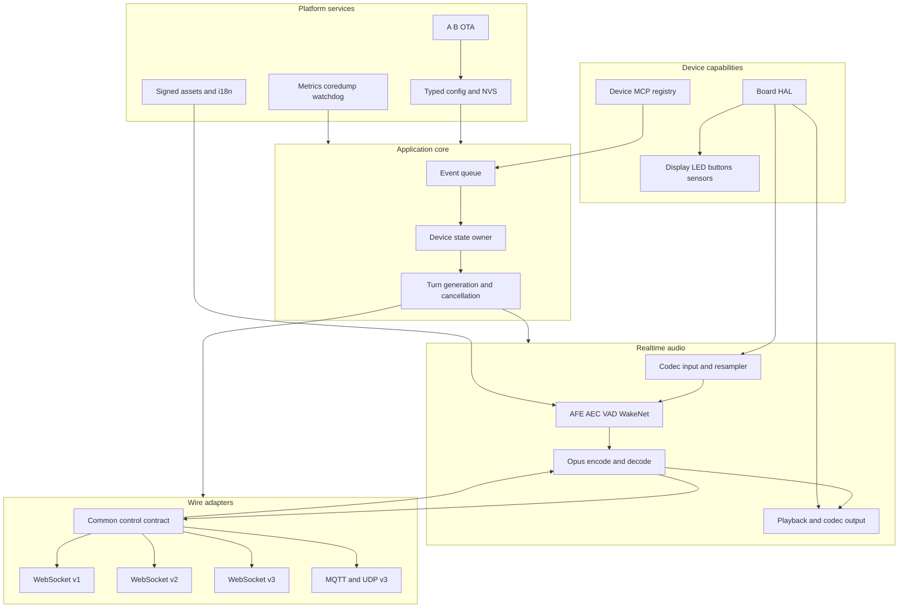
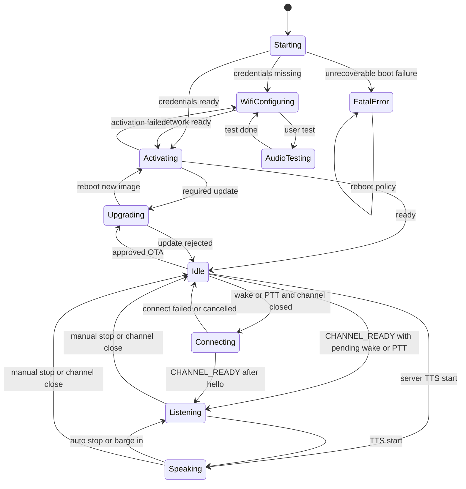

# Thiết kế `veetee-firmware`

> Trạng thái: thiết kế Phase 1, không phải product code.  
> Target: ESP32-S3 N16R8, ESP-IDF + FreeRTOS.  
> Hợp đồng wire: [03-protocol-spec.md](03-protocol-spec.md).  
> Quyết định wake word: [ADR-005](ADR/ADR-005-on-device-wake-word.md).

## 1. Mục tiêu và ranh giới

Firmware chịu trách nhiệm realtime audio I/O, local AFE/AEC/wake word, UI vật lý,
transport wire-compatible và device MCP tools. Firmware **không** chứa ASR, LLM,
TTS, personality/base prompt, câu “chào/bye” hay business logic ngôn ngữ.

Mục tiêu thiết kế:

- mic → AFE → Opus và Opus → speaker không bị block bởi UI, logging hoặc tool;
- PTT, interrupt, wake word và barge-in là event có thứ tự, idempotent;
- mọi queue/memory pool có bound và ownership rõ;
- `ws-v3` là profile mặc định; v1/v2/MQTT chỉ activate bằng config, không fallback;
- hardware capability được discover qua MCP, không hardcode vào server/LLM;
- config, locale và asset có schema/version/hash, activate atomically;
- mỗi requirement có test oracle đủ rõ để AI coding model triển khai và tự kiểm tra.

Non-goals trước M3:

- firmware conversation background và emoji collection;
- voice clone, knowledge base hoặc external MCP endpoint;
- general-purpose scripting trên device;
- arbitrary raw IR waveform hoặc arbitrary MQTT/Home Assistant destination do LLM
  tự đưa vào.

## 2. Hardware profile và nguyên tắc tài nguyên

| Thành phần | Target contract |
|---|---|
| MCU | ESP32-S3 dual core |
| Flash | 16 MiB, A/B OTA + assets |
| PSRAM | 8 MiB, speech models/UI/audio pools |
| Audio | mono mic + speaker; I2S/PDM/codec qua board HAL |
| Input logical | PCM S16 mono 16 kHz sau resample/AFE |
| Uplink codec | Opus, 60 ms, 960 samples |
| Network | Wi-Fi STA; provisioning AP chỉ khi chưa có config |
| Security | secure credentials in NVS, signed OTA/assets, TLS khi deployment hỗ trợ |

N16R8 là ceiling, không phải lý do cấp phát tùy ý. DMA buffer, ISR-shared data,
FreeRTOS kernel objects và critical task stacks MUST dùng internal RAM phù hợp
capability. Model/assets/ring buffers lớn SHOULD dùng PSRAM. Không gọi allocator
general-purpose trong ISR hoặc audio steady-state.

### 2.1 Initial resource gates

Các số sau là **budget ceiling** để implementation đo và siết lại, không phải số
đã benchmark:

| Pool | Ceiling/guard |
|---|---:|
| AFE + WakeNet/MultiNet model/runtime trong PSRAM | ≤ 3.0 MiB |
| display buffers + decoded UI working set | ≤ 2.0 MiB |
| audio packet/PCM/wake rings | ≤ 1.0 MiB |
| network/JSON/MCP temporary PSRAM | ≤ 0.75 MiB |
| PSRAM reserve ở worst-case steady state | ≥ 1.25 MiB |
| minimum-ever free internal heap sau 30 phút hội thoại | ≥ 64 KiB |
| mỗi task stack high-water remaining | ≥ max(1 KiB, 25% stack) |
| largest free internal block sau 8 giờ soak | không giảm liên tục qua từng giờ |

Reference đã dùng PSRAM cho AFE và optional two-second 64 KiB wake cache
(`references/xiaozhi-esp32/main/audio/engines/afe_audio_engine.cc:125-160`,
`references/xiaozhi-esp32/main/audio/README.md:26-30`). Veetee phải đo lại trên
đúng model/assets; budget fail là build/runtime diagnostic, không được lặng lẽ
allocate vào internal heap.

Flash layout MUST có hai app slots bằng nhau, NVS/OTA metadata, coredump và asset
partition. Acceptance gate:

- tổng partition + bootloader + partition table không vượt 16 MiB;
- mỗi app image còn tối thiểu 15% headroom trong slot;
- asset update có manifest/hash/signature riêng;
- bootloader rollback nếu image mới không đạt boot-health checkpoint.

## 3. Module boundaries



### 3.1 Stable interfaces

| Boundary | Trách nhiệm | Không được làm |
|---|---|---|
| `BoardHal` | codec, button, LED, OLED, IR, mmWave, network capability | parse conversation JSON |
| `AudioEngine` | AFE/AEC/VAD/wake, phát PCM frame/event | mở socket hoặc đổi device state |
| `AudioCodec` | Opus encode/decode với negotiated params | điều khiển UI |
| `WireAdapter` | hello/control, binary framing, connection lifecycle | ASR/LLM semantics |
| `ConversationController` | state/turn/cancel, map event ↔ wire action | block trên audio/tool I/O |
| `DeviceMcpRegistry` | descriptor, validation, dispatch, response | bypass hardware policy |
| `ConfigStore` | schema validation, revision, atomic activate | trả pointer mutable cho task khác |

Board variation dùng compile-time board selection nhưng core chỉ thấy interface nhỏ.
Reference cũng tách board factory/capabilities khỏi application
(`references/xiaozhi-esp32/main/boards/common/board.h:46-90`,
`references/xiaozhi-esp32/main/CMakeLists.txt:834-872`). Veetee chỉ ship một board
ở M0 nhưng không để pin/codec/display constant rò vào conversation core.

## 4. FreeRTOS execution model

### 4.1 Task table

Priority dưới đây là initial relative plan với `configMAX_PRIORITIES >= 25`; build
MUST assert range. Stack là initial ceiling và phải được chỉnh bằng high-water data.

| Task | Core | Priority | Stack budget | Owner / deadline |
|---|---:|---:|---:|---|
| `audio_capture` | 0 | 20 | 32 KiB | codec RX/resample/feed; không block quá 10 ms; measured nested Opus/transport path |
| `afe_fetch` | 0 | 19 | 8 KiB | duy nhất được fetch/reset/toggle AFE; output mỗi engine chunk |
| `audio_output` | 0 | 18 | 16 KiB | PCM → codec TX; không làm UI/log format; decoder/I2S path has nested stack use |
| `wire_dispatch` | 1 | 15 | 10 KiB | validate/copy WS/MQTT/UDP frame, route control/audio |
| `opus_codec` | 1 | 13 | 24 KiB | encode/decode công bằng theo queue watermark |
| `app_main` | 1 | 10 | 10 KiB | state, turn generation, config snapshot, hardware orchestration |
| `device_io` | 1 | 8 | 8 KiB | bounded slow IR/MQTT/HA operation do app_main cấp quyền |
| `display` | 1 | 5 | 8 KiB | OLED/frame rendering từ immutable UI event |
| `telemetry` | 1 | 2 | 6 KiB | aggregate counters, rate-limited log/health snapshot |

Wi-Fi/TCP/TLS driver tasks do ESP-IDF sở hữu không được repurpose. Socket callback
chỉ validate envelope tối thiểu, copy/move vào pool và notify `wire_dispatch`; không
parse MCP lớn, không gọi display/hardware. GPIO ISR chỉ timestamp + task notification,
không debounce/log/send network trong ISR.

Reference tách `AudioInputTask`, `AudioOutputTask`, `OpusCodecTask` và AFE fetch
task (`references/xiaozhi-esp32/main/audio/README.md:64-70`); task creation cũng đặt
input cao hơn output/codec
(`references/xiaozhi-esp32/main/audio/audio_service.cc:122-165`). Veetee giữ ranh
giới nhưng thêm owner/priority/resource gates rõ ràng.

### 4.2 Queue contracts

| Queue | Item | Capacity | Max nominal age | Overflow policy |
|---|---|---:|---:|---|
| `app_events` | fixed event record/handle | 32 | 250 ms | coalesce UI/VAD; cancel/button slot riêng, không drop |
| `afe_input` | 10 ms PCM block handle | 4 | 40 ms | drop oldest + discontinuity metric |
| `encode_pcm` | 60 ms PCM handle | 2 | 120 ms | drop oldest; producer không block |
| `uplink_opus` | Opus packet handle | 8 | 480 ms | drop oldest + congestion metric |
| `downlink_opus` | Opus packet handle | 20 | 1.2 s | local abort turn on full; không tiếp tục phát thiếu âm thầm |
| `playback_pcm` | 60 ms PCM handle | 3 | 180 ms | codec task đợi có bound; cancel luôn có quyền flush |
| `wire_control` | parsed small envelope/JSON handle | 24 | 250 ms | priority lane cho hello/abort/tts stop; coalesce subtitle |
| `mcp_requests` | request handle | 8 | per-tool timeout | reject busy, không block wire task |

Queue capacity là theo **số item**, payload đến từ fixed pool/slab có allocation
failure rõ. `std::vector`/heap allocation theo frame trong steady state không phải
target implementation.

Mic realtime phải drop-oldest thay vì block ngược AFE. Reference đã chỉ ra full
encode/send queue không được stall input pipeline
(`references/xiaozhi-esp32/main/audio/audio_service.cc:468-480`,
`references/xiaozhi-esp32/main/audio/audio_service.cc:536-577`). Downlink dài không
đòi queue dài: server pace theo playback rate; test 60 phút MUST giữ occupancy
bounded và 0 overflow.

### 4.3 Synchronization

- Task notification dùng cho one-owner wakeups; queue dùng khi cần payload.
- Mutex chỉ bảo vệ short shared metadata/pool free-list; không giữ mutex khi gọi
  codec, socket, display hoặc flash.
- State transition, active config pointer và `turn_generation` chỉ mutate ở
  `app_main`.
- `wire_dispatch` giữ một gate `tts_start_pending` riêng, không phải device state.
  Binary frame đứng sau `tts/start` theo wire order được phép vào downlink queue
  nhưng decoder chỉ consume sau khi `app_main` ack `PLAYBACK_ENABLED`. Nhờ vậy
  packet đầu không bị drop trong khoảng event đã enqueue nhưng state chưa đổi.
- AFE control command đi vào mailbox của `afe_fetch`; không gọi AFE reset/toggle từ
  main/network task. Reference đã defer reset/toggle về fetch owner để tránh corrupt
  ring state (`references/xiaozhi-esp32/main/audio/engines/afe_audio_engine.cc:282-307`,
  `references/xiaozhi-esp32/main/audio/engines/afe_audio_engine.cc:337-367`).
- I2C/SPI bus có priority-inheritance mutex và timeout; display không được giữ bus
  qua frame delay.
- Không dùng unbounded critical section; ISR chỉ dùng `FromISR` primitive.

## 5. Memory ownership

| Data | Allocator | Owner khi active | Transfer/release |
|---|---|---|---|
| DMA RX/TX blocks | codec init, internal DMA RAM | codec driver | fixed ring, không free runtime |
| 10 ms PCM blocks | audio pool | `audio_capture` rồi `afe_fetch` | move handle; trả pool sau feed |
| 60 ms PCM blocks | audio pool | `opus_codec` hoặc `audio_output` | unique handle qua queue |
| Opus packet blocks | packet pool | encoder/wire/decoder | unique handle; release sau send/decode |
| JSON text | wire pool | `wire_dispatch`; MCP request có own copy | bounded copy, release sau dispatch |
| config snapshot | config service | immutable shared snapshot | atomic pointer swap, revision refcount |
| model/assets | asset manager | AFE/display owner | chỉ thay khi subsystem stopped |
| MCP tool descriptor | registry | immutable sau boot/config activate | rebuild registry atomically |

Rules:

1. Không queue raw pointer không có lifetime contract.
2. Một mutable buffer chỉ có đúng một owner; fan-out dùng immutable view hoặc copy
   có bound.
3. Cancel tăng generation trước khi recycle buffer; worker hoàn thành trễ kiểm tra
   generation rồi drop.
4. Secret chỉ tồn tại trong secure config/connection object; diagnostic dùng
   redacted hash/ID.
5. JSON/MCP response lớn serialize vào bounded writer, không build nhiều full copies.
6. Malloc failure hook lưu coredump marker, mute speaker, đóng channel và về safe
   state; không tiếp tục với pointer null.

## 6. Device state machine

### 6.1 States và transitions



Mọi state MAY chuyển vào `FatalError` khi invariant phần cứng/memory owner không
thể khôi phục; các edge lặp lại này được lược khỏi sơ đồ cho dễ đọc. Transition vào
`FatalError` luôn mute output, chụp diagnostic tối thiểu rồi áp controlled reboot/
rollback policy; không tiếp tục conversation.

Full state set của firmware tham chiếu gồm starting, Wi-Fi configuring, idle,
connecting, listening, speaking, upgrading, activating, audio testing và fatal
error (`references/xiaozhi-esp32/main/device_state.h:4-16`). Reference cũng reject
transition ngoài bảng thay vì mutate state
(`references/xiaozhi-esp32/main/device_state_machine.cc:34-102`,
`references/xiaozhi-esp32/main/device_state_machine.cc:108-130`). Veetee dùng
transition table generated/tested từ spec này; self-transition là no-op idempotent.

### 6.2 Transition actions

| State/event | Ordered actions | Next |
|---|---|---|
| `Idle + wake` | snapshot phrase/pre-roll → nếu channel đóng thì `Connecting` + open/hello → `CHANNEL_READY` → gửi bounded cached Opus → `listen/detect` | `Listening` |
| `Idle + PTT press` | nếu channel đóng thì `Connecting` + open/hello → `CHANNEL_READY` → `listen/start manual` → enable AFE uplink | `Listening` |
| `Connecting + CHANNEL_READY` | resume đúng pending wake/PTT continuation một lần; wake luôn upload pre-roll trước detect | `Listening` |
| `Listening + PTT release` | `listen/stop` → stop uplink after final 60 ms frame | `Idle` while server thinks |
| `Listening + tts/start` | new playback generation → reset decoder → enable output | `Speaking` |
| `Idle + tts/start` | accept delayed response for current session → enable output | `Speaking` |
| `Speaking + graceful tts/stop` | mark `draining`; wait decode/output idle | manual: `Idle`; else `Listening` |
| `Speaking + button/wake/barge` | generation++ → mute/flush → send one abort → start new listen if requested | `Listening` or `Idle` |
| any conversational state + channel close | cancel turn → flush audio → redact session | `Idle` |
| any allowed + OTA request | close channel → stop audio owners → verify image | `Upgrading` |

`Connecting` chỉ được dùng khi channel chưa sẵn sàng. Cả fast path với channel đang
mở và callback sau successful hello đều phát cùng một serialized `CHANNEL_READY`
event cho state owner; pending trigger bị consume đúng một lần. Với wake, continuation
MUST gửi cached Opus trước `listen/detect`; với PTT, nó gửi `listen/start manual`
trước khi bật uplink. Không wake pre-roll nào được gửi trước successful hello.
Reference cũng resume wake continuation qua connecting state và gửi cache trước
detect (`references/xiaozhi-esp32/main/application.cc:845-897`).

`Speaking` có internal substate `ACTIVE` và `DRAINING`, không lộ thêm wire state.
`tts/start` là ordered barrier: wire task có thể nhận/copy các binary frame kế tiếp,
nhưng Opus decoder không chạy chúng trước `app_main` ack state `Speaking`. Reference
chỉ enqueue binary khi state đã là speaking
(`references/xiaozhi-esp32/main/application.cc:518-522`); barrier giữ semantics đó
mà không tạo race giữa network callback và scheduled state event.
Graceful `tts/stop` không được cắt audio đã nhận. Reference cũng defer auto listening
cho đến playback drained để tránh truncation do jitter
(`references/xiaozhi-esp32/main/application.cc:932-946`). Abort khác graceful stop:
abort flush ngay và stale decoder result bị generation guard loại bỏ; reference
decoder cũng dùng playback generation khi reset
(`references/xiaozhi-esp32/main/audio/audio_service.cc:375-439`,
`references/xiaozhi-esp32/main/audio/audio_service.cc:743-763`).

### 6.3 State ownership test oracle

- Chỉ `app_main` được ghi state; static analysis không thấy setter ở task khác.
- Mọi `(state,event)` có đúng một expected result: transition, no-op hoặc reject.
- Property test sinh mọi event permutation độ dài 8; không state nào ngoài bảng.
- Event cũ có `generation != active` không đổi state/UI/audio.
- Wake test bao phủ cả channel-ready và channel-closed path; mỗi path có đúng một
  `CHANNEL_READY`, Opus pre-roll đứng trước detect và không duplicate pending trigger.
- 1.000 vòng PTT/interrupt không deadlock và cuối mỗi vòng về `Idle`/`Listening`
  đúng mode.

## 7. Interaction behavior

### 7.1 Push-to-talk

Button ISR phát edge + timestamp; debounce ở task bằng config, không ISR. Press:

1. nếu speaking, local abort/mute trước;
2. đảm bảo channel ready;
3. gửi `listen/start mode=manual`;
4. bật AFE/uplink và UI listening.

Release gửi `listen/stop` đúng một lần sau final accumulated 60 ms frame, rồi tắt
uplink. Manual mode không để local/server VAD kết thúc sớm. Reference board release
gọi stop và server finalizes ASR theo mode
(`references/xiaozhi-esp32/main/boards/bread-compact-wifi/compact_wifi_board.cc:112-117`,
`references/xiaozhi-esp32-server/main/xiaozhi-server/core/handle/textHandler/listenMessageHandler.py:38-54`).

### 7.2 Nhấn để interrupt

Short press trong speaking là interrupt, không toggle-close session:

- mute output trong một audio callback period;
- generation++ và clear decoder/playback/timestamp queues;
- gửi generic `abort` một lần;
- nếu interaction mapping là PTT, tiếp tục `listen/start manual`.

Button mapping đến từ device config, không hardcode theo GPIO hoặc locale.

### 7.3 Wake word

WakeNet chạy on-device trong shared AFE; optional MultiNet asset cho custom phrase.
Detection event chứa phrase text từ asset manifest, không chứa literal trong C++.
Idle không stream mic liên tục. Sau detection, firmware bảo đảm channel đã ready;
nếu pre-roll bật thì gửi tối đa hai giây cached Opus rồi gửi ngay `listen/detect`.
Server giữ nó trong bounded pre-listen buffer theo protocol §9.1. Nếu pre-roll tắt,
gửi detect trực tiếp.
Thứ tự audio → detect giữ compatibility với firmware tham chiếu
(`references/xiaozhi-esp32/main/application.cc:889-897`). Chi tiết quyết định ở
ADR-005.

**Trạng thái bring-up (2026-08-03):** abstraction `vt_wake_*` đã được bật trong
default board build với model `wn9_computer_tts` và phrase do model manifest cung
cấp là `Computer`. Lần panic `StoreProhibited` ban đầu xảy ra vì firmware tắt
hoàn toàn Octal PSRAM trong khi ESP-SR/WakeNet cần PSRAM; đã sửa bằng cấu hình
Octal PSRAM 8 MiB (`CONFIG_SPIRAM`, `CONFIG_SPIRAM_MODE_OCT` và budget internal
reserve) rồi build/flash lại. Serial hiện xác nhận `Found 8MB PSRAM device`,
`Successfully load srmodels`, `veetee-wake: ready model=wn9_computer_tts` và
không panic. Đây mới là model-init/boot evidence; nhận dạng phrase bằng audio thật,
shared AFE/AEC/noise suppression, false-trigger và acoustic barge-in vẫn là physical
acceptance gate. Nếu model init lỗi ở runtime, firmware vẫn fail-safe giữ PTT và
báo diagnostic; không tự chuyển sang server-side wake để che lỗi.

**AEC implementation gate (2026-08-04):** module `veetee_aec.c` đã được thêm
theo [ADR-020](ADR/ADR-020-device-aec-adapter.md). Serial ESP32-S3 xác nhận
`afe_aec` input `MR`, 16 kHz, chunk 512 và reference ring 8000 samples; build và
flash không xoá NVS pass. Khi bật `CONFIG_VEETEE_WAKE_DURING_PLAYBACK`, fixture
physical flow đạt 2/2 smoke và 10/10 repetition với Groq test-only key pool,
không panic/queue/Opus error. Evidence này chỉ xác nhận lifecycle và resource
ổn định; echo-only false-accept, voice-onset barge-in và time-to-silence vẫn mở.

### 7.4 Barge-in khi AI đang nói

Default thiết kế là device AEC + local VAD/wake. `tts/start` không tự bật uplink:
firmware chỉ chuyển `duplex_capture=true` khi message có
`barge_in.enabled=true,mode="acoustic"`, interaction là `auto`, và AEC adapter
đã ready. Snapshot thiếu policy giữ half-duplex nhưng WakeNet vẫn có thể nhận
wake-word interrupt.
Voice onset vượt threshold/hysteresis từ config tạo `BARGE_IN_CANDIDATE`; server
chỉ commit sau `minSpeechFrames` liên tiếp để giảm false abort do residual echo.
Khi commit, server gửi `tts/stop(reason:"barge_in")`; firmware flush decoder,
playback queue và AEC reference tại barrier, chuyển sang `listening` và giữ
capture cho auto turn mới. Không gửi thêm `listen/start` từ firmware cho barrier
này vì turn ownership do server tạo lại.
`barge_in.cooldown_ms` là field additive; firmware hiện chỉ cần bảo toàn wire
compatibility, còn server bỏ qua uplink trong cửa sổ này để tránh đuôi echo/clip
được nhận thành turn mới. Physical promotion vẫn phải đo false-reject trong
cooldown và time-to-silence ngoài cooldown.

Reference giữ mic processing trong speaking ở realtime mode
(`references/xiaozhi-esp32/main/application.cc:951-960`) và dùng default realtime
khi AEC bật (`references/xiaozhi-esp32/main/application.cc:1022-1024`). Veetee thêm
generation/cancel oracle, không thêm field wire bắt buộc.

### 7.5 Voice exit

Firmware không so chuỗi “bye”, “chào” hoặc ngôn ngữ nào. Server intent/config phát
final answer rồi `tts/stop` và đóng/idle theo session policy. Reference firmware
cũng không diễn giải exit phrase trong inbound handler
(`references/xiaozhi-esp32/main/application.cc:543-650`).

## 8. Audio subsystem

### 8.1 End-to-end on device

```mermaid
flowchart LR
    MIC[Microphone] --> RX[Codec RX and resample]
    RX --> AFE[Shared AFE AEC VAD WakeNet]
    AFE --> ACC[Accumulate 60 ms PCM]
    ACC --> ENC[Opus encoder]
    ENC --> UP[Bounded uplink queue]
    UP --> NET[Selected wire adapter]
    NET --> DOWN[Bounded downlink queue]
    DOWN --> DEC[Opus decoder]
    DEC --> RS[Output resample if needed]
    RS --> TX[Codec TX and speaker]
```



Input codec native rate được resample về 16 kHz trước engine. Reference làm cùng
việc khi input rate khác 16 kHz
(`references/xiaozhi-esp32/main/audio/audio_service.cc:55-86`). AFE xử lý frame
engine nhỏ; encoder chỉ nhận đúng 960 mono samples/60 ms. Downlink decoder được
reconfigure theo server hello và resample về codec output khi rate khác
(`references/xiaozhi-esp32/main/audio/audio_service.cc:388-418`,
`references/xiaozhi-esp32/main/audio/audio_service.cc:500-533`). Trong firmware
Veetee hiện tại, `ws-v2/ws-v3` giữ negotiated rate bằng speaker config; riêng
`ws-v1-compat` cho phép peer cũ echo rate khác ở handshake nhưng vẫn dùng decoder
output config hiện hành. Chất lượng/resample của đúng peer v1 là một open physical
gate trong `docs/11-open-questions.md` và không được suy ra từ host CTest.

### 8.2 AFE profile

- Một AFE instance duy nhất cho AEC, VAD và WakeNet/MultiNet feed.
- Mic channel map/reference channel đến từ board descriptor.
- AEC, VAD threshold/hysteresis, wake model/threshold và locale đến từ validated
  asset/config profile.
- Noise suppression chỉ bật khi asset/model tương ứng tồn tại và resource benchmark
  pass; không giả định module có sẵn.
- VAD device dùng cho UI/barge-in và giảm irrelevant audio; server VAD vẫn là
  authoritative endpoint cho `auto` mode.
- Enable/disable AFE là command tới owner task; reset discards pre-generation PCM.

Reference AFE chọn input `M`/`R`, AEC/VAD/WakeNet và PSRAM allocation trong một
config (`references/xiaozhi-esp32/main/audio/engines/afe_audio_engine.cc:116-160`).
Veetee không copy profile constants; chúng là versioned asset/config và phải được
đo trên board.

### 8.3 Timestamp và AEC

Trong `ws-v2`/UDP, uplink `timestamp` là timestamp của downlink frame sau codec
output write/handoff, không phải lúc frame nhận qua network. Veetee MUST dùng
hard-bounded timestamp ring và drop/metric association stale. Reference chỉ push
timestamp sau `OutputData` hoàn tất; producer queue của snapshot không hard-bound,
còn uplink chỉ attach khi backlog ≤3 rồi pop một entry
(`references/xiaozhi-esp32/main/audio/audio_service.cc:324-349`,
`references/xiaozhi-esp32/main/audio/audio_service.cc:536-554`). Source không chứng
minh DAC/acoustic playback; board có DMA-play callback MAY quảng bá marker mạnh hơn.

Default `ws-v3` dùng device-side AEC và không có binary timestamp. Muốn server-side
AEC phải activate `ws-v2`; không đổi layout v3.

Slice alignment hiện tách timing reference thành module thuần C
[`veetee_aec_reference.c`](../veetee-firmware/main/veetee_aec_reference.c):
resample playback 24 kHz → 16 kHz, giữ bounded delay gate và saturating
producer/consumer/underflow/overflow counters. `CONFIG_VEETEE_AEC_REFERENCE_DELAY_MS`
đến từ board/Kconfig (profile hiện tại `80 ms`), không phải literal trong AEC
logic. Khi depth chưa vượt delay, AEC nhận zero reference và ring không bị pop
non-delayed; abort/reset xóa depth nhưng giữ counters trong cùng boot.
Diagnostics chỉ log số liệu khi `VEETEE_AUDIO_DIAGNOSTICS` bật; không log PCM.
Host CTest `aec_reference` kiểm tra resample, delay, overflow, underflow và reset.
Đây là instrumentation/alignment baseline, chưa phải echo-only hoặc
time-to-silence acceptance.

### 8.4 Long responses

Không có maximum response duration ở firmware. Firmware chỉ giữ sliding bounded
queues; server pace audio. `tts/stop` đến sau packet cuối và transition sau drain.
Acceptance soak 60 phút yêu cầu:

- every accepted Opus packet được decode/play đúng sequence;
- downlink queue p99 age ≤ 240 ms, emergency max < 1.2 s;
- zero queue overflow/abort do resource;
- heap/PSRAM không có downward trend;
- interrupt vẫn mute trong budget ở phút 1, 30 và 60.

## 9. Wire adapter và config

`WireContract` sở hữu JSON message builders/parsers chung. Adapter chỉ sở hữu
carrier/framing. Không duplicate listen/abort/MCP logic trong từng transport;
reference cũng đặt các message đó ở base protocol
(`references/xiaozhi-esp32/main/protocols/protocol.h:41-66`,
`references/xiaozhi-esp32/main/protocols/protocol.cc:58-97`).

Packet pool và parser dùng ceiling chung của protocol: Opus WebSocket payload tối
đa 1.500 byte; frame 1.501 byte bị reject trước copy/decoder. MQTT/UDP receiver
preallocate bốn reorder slots, tám pre-start slots và timer state theo §5.6 của
protocol spec; không allocate theo sequence gap do peer cung cấp.

Config shape minh họa, không chứa secret plaintext trong export/log:

```json
{
  "revision": 17,
  "transport": {
    "profile": "ws-v3",
    "url": "ws://192.168.1.10:8000/veetee/v1/",
    "protocol_version": 3,
    "secret_ref": "device-token/current",
    "connect_timeout_ms": 10000
  },
  "locale": "vi-VN",
  "audio_profile": "s3-default-v1",
  "wake_profile": "wakenet-vi-v1",
  "button_profile": "robot-rev-a"
}
```

Activation rules:

1. validate schema/version/ranges/profile consistency;
2. resolve secret internally, không copy vào immutable public snapshot;
3. verify asset hashes/capabilities;
4. write candidate revision atomically;
5. activate only ở safe state; giữ last-known-good revision cho reboot rollback;
6. connection failure báo lỗi cùng profile, **không** chọn profile khác.

Last-known-good rollback chỉ chạy khi candidate config không validate/activate hoặc
boot-health của revision mới fail. Network/auth/connect failure sau successful
activation không được rollback config, kể cả revision trước dùng transport khác;
operator phải sửa và activate revision mới một cách tường minh.

Mọi inbound binary/text tuân [03-protocol-spec.md](03-protocol-spec.md). Parser
tests MUST dùng cùng golden fixture với server implementation, không có hai bản
fixture tự sinh độc lập.

## 10. Device MCP tools

### 10.1 Registry và lifecycle

MCP registry được build từ capability thực của `BoardHal` + signed policy manifest.
Board thiếu IR/mmWave/OLED không quảng bá tool tương ứng. Tool descriptor immutable
theo `capability_revision`; config activate rebuild registry atomically rồi session
mới rediscover. Tool name unique; duplicate là boot/config error, không last-write-wins.

Flow:

1. server `initialize`;
2. firmware response MCP version `2024-11-05`;
3. paginated `tools/list`, mỗi payload dưới 8.000 byte;
4. `tools/call` validate schema + authorization + device state;
5. app owner dispatch sang peripheral owner;
6. result/error trả đúng numeric request ID.

Veetee server cấp request ID positive, tăng đơn điệu và không reuse trong một
transport session. Firmware giữ high-water để duplicate delivery không thể biến
thành hardware mutation thứ hai; compatibility peer vẫn được parse theo §8.3 của
protocol spec.

Reference đã có registry/list pagination và schedule hardware mutation lên main
task (`references/xiaozhi-esp32/main/mcp_server.cc:452-505`,
`references/xiaozhi-esp32/main/mcp_server.cc:508-559`). Veetee bổ sung policy,
idempotency cache và resource bounds; không đổi outer wire.

Implementation boundary hiện có:

- `veetee_mcp.[ch]` giữ registry/cache/idempotency thuần dữ liệu;
- `veetee_mcp_wire.[ch]` serialize response bounded;
- `veetee_mcp_dispatch.[ch]` parse/validate cJSON envelope và route tới registry.
- `veetee_board_hal.[ch]` giữ manifest capability revision, owner logical ID,
  safety class và timeout; activation validate toàn bộ trước khi swap snapshot,
  chỉ trả các tool có `enabled=true` cho registry.
- `veetee_mcp_task_init_from_board_hal()` copy enabled descriptors vào storage
  thuộc owner task trước khi tạo registry; API cũ nhận mảng tool tĩnh vẫn giữ
  nguyên để peer/runtime hiện tại không đổi.

Các lớp này đã có host CTest và ESP-IDF compile gate. Owner boundary
`veetee_mcp_task.[ch]` đã đưa envelope vào queue `mcp_requests` bounded và chạy
parser/dispatcher trong task riêng khi `CONFIG_VEETEE_MCP_ENABLED` được bật;
config mặc định vẫn tắt. Manifest hiện mới là boundary dữ liệu/validation;
chưa quảng bá descriptor phần cứng trong runtime và chưa được phép thực hiện
hardware mutation. Integration tiếp theo phải map descriptor thật và đưa
callback peripheral qua owner matrix §10.4; không gọi callback trực tiếp từ
parser hoặc transport callback.

### 10.2 Initial tool catalog

| Tool | Input contract | Output | Safety/policy |
|---|---|---|---|
| `device.status.get` | object rỗng | JSON text status | read-only; redact secret/MAC tùy policy |
| `device.led.set` | `red/green/blue` integer 0..255; optional `brightness` 0..100, `transition_ms` 0..5000 | effective RGB JSON/text | clamp chỉ theo schema; owner LED task |
| `device.display.show_text` | `text` string max 256 codepoints; optional `duration_ms` 0..60000, `style_id` string | accepted/effective style | style ID phải có trong asset manifest |
| `device.ir.transmit` | `profile_id`, `command_id` strings; optional `repeats` 1..5 | transmit status | chỉ signed allowlist; không nhận raw timings từ LLM |
| `device.presence.read` | object rỗng | presence, distance/confidence nếu sensor có | read-only; rate limit |
| `home.mqtt.publish` | `route_id` string, `payload_json` string | broker ack/status | route maps đến fixed broker/topic/ACL; không nhận credential/topic tùy ý |
| `home.assistant.call` | `action_id` string, optional `entity_id`, `arguments_json` | call status | action/entity allowlist; destructive action cần policy confirmation |

Không hardcode pin, broker URL, topic, Home Assistant token, IR waveform, locale text
hoặc UI style vào tool handler. Tool nhận stable logical ID; board/config layer resolve
ID thành hardware detail. JSON string inputs có byte/codepoint cap trước parse.

### 10.3 Tool execution rules

- `annotations.audience:["user"]` chỉ là discoverability hint, không phải auth;
  reference listing behavior cũng không ngăn `tools/call` lookup toàn registry
  (`references/xiaozhi-esp32/main/mcp_server.cc:471-474`,
  `references/xiaozhi-esp32/main/mcp_server.cc:508-518`).
- Trust boundary tách hai lớp: Server Tool Broker authorize bound
  `{assistantId, deviceId, tool, safetyClass, configRevision}` trước khi gửi;
  firmware không nhận/tin `assistantId` từ LLM payload mà enforce
  `{authenticated_session, session_id, local_capability_revision, tool,
  canonical_arguments_hash}` trước peripheral queue.
- Mỗi tool có timeout, concurrency `1` theo peripheral và queue bound. Busy trả MCP
  error, không block wire/audio.
- Session giữ `highest_seen_request_id` và cache bounded 16 completed calls keyed
  bởi `{id, method, tool_name, canonical_arguments_hash}`. Exact duplicate pending
  hoặc cached không dispatch lần hai; cùng ID khác digest trả error; ID cũ đã evict
  trả `duplicate_expired` thay vì chạy lại. Cache/high-water bị xóa khi reconnect.
  Quy tắc strict này chỉ áp dụng Veetee profile có ID monotonic.
- Tool đang chạy bị session abort chỉ cancel nếu tool manifest đánh dấu cancellable;
  safety-critical mutation không bị bỏ giữa chừng mà trả final audited result.
- MQTT/Home Assistant tool connection tách khỏi conversation transport; gọi tool
  không được mutate `ws-v3` connection config.
- External MCP endpoint không thuộc firmware/M0-M2; bổ sung sau tài liệu người dùng.

### 10.4 Hardware-owner matrix

| Peripheral | Owner | Call context |
|---|---|---|
| RGB LED | LED/display owner | queued animation command, no busy wait |
| OLED | display task | immutable render command |
| IR TX | `device_io` + timer/RMT driver | bounded async completion |
| mmWave | sensor driver/task | cached snapshot, polling cadence config |
| MQTT/HA client | `device_io` network client | allowlisted route, timeout/circuit state |
| codec volume | `app_main` → codec owner command | serialized với audio state |

## 11. Configuration, i18n và assets

### 11.1 Không hardcode behavior AI

Firmware code không chứa:

- wake phrase/display phrase theo ngôn ngữ;
- base prompt/personality/progress acknowledgment;
- provider/model name của ASR/LLM/TTS;
- exit phrase;
- device tool natural-language description theo một locale cố định.

Asset/config dùng BCP-47 locale, default deployment `vi-VN`. Tool descriptions,
status label, font/model mapping và wake text là localized resources có fallback
**locale resource** rõ ràng; đây không phải provider fallback.

### 11.2 Asset manifest

Manifest tối thiểu có:

| Field | Rule |
|---|---|
| `schema_version` | integer supported |
| `asset_revision` | monotonic/opaque immutable ID |
| `firmware_compat` | semver range |
| `locale` | BCP-47 |
| `files[]` | path, size, SHA-256, role |
| `wake_model` | engine, model ID, threshold, phrase IDs |
| `font/display` | dimensions, glyph/font capability |
| `tool_descriptions` | localized name/description keys |
| `signature` | verify before stage/activate |

Model list không được replace sau AFE init; reference cũng ignore replacement khi
engine đã initialized
(`references/xiaozhi-esp32/main/audio/audio_service.cc:798-820`). Veetee chỉ swap
asset khi audio owners stopped hoặc sau reboot.

## 12. OTA, provisioning và recovery

### 12.1 Provisioning

- Nếu thiếu Wi-Fi/identity, vào `WifiConfiguring`; captive portal không chạy cùng
  conversation channel.
- Credential/token write vào protected NVS namespace; UI/serial chỉ hiện masked ID.
- Provisioning payload validate length/schema trước write; atomic commit revision.
- Transport URL/version là config; default new device `ws-v3`.

### 12.2 OTA

1. manager cung cấp signed manifest + firmware/asset URLs;
2. firmware tải vào inactive slot/asset staging với bounded chunks;
3. verify size/hash/signature/board compatibility;
4. chỉ reboot khi không speaking/tool mutation;
5. boot mới mark healthy sau NVS, codec, audio pools, AFE policy và event loop init;
6. watchdog/reset trước checkpoint kích bootloader rollback;
7. không erase user NVS trừ explicit factory reset.

### 12.3 Fault policy

| Fault | Policy |
|---|---|
| wake model/AFE optional init fail | disable wake, preserve PTT, diagnostic |
| codec/packet pool/state owner fail | fatal-safe: mute, coredump marker, controlled reboot |
| transport/auth fail | idle/error UI, explicit retry same profile only |
| malformed peer data | apply protocol validation; never reboot |
| MCP tool busy/invalid | MCP error; audio continues |
| downlink overrun | mute/flush/abort active turn, visible diagnostic |
| internal heap below guard | stop new MCP/UI work, close session safely, persist marker |

## 13. Watchdog và observability

### 13.1 Watchdog

Task Watchdog monitors `audio_capture`, `afe_fetch`, `audio_output`, `wire_dispatch`
và `app_main`. Task chỉ feed sau observable progress, không feed trong wrapper timer.
Initial timeout 5 giây cho control tasks; audio deadline misses được phát hiện sớm
hơn bằng per-frame counters. ISR watchdog giữ ESP-IDF default.

Before controlled reset:

1. mute codec amp/output;
2. store compact reset reason, active state/profile/config revision, queue occupancy
   và last generation vào RTC/coredump-safe area;
3. không serialize secret hoặc full conversation text;
4. reboot/rollback theo boot health policy.

### 13.2 Required metrics

| Metric | Labels tối đa |
|---|---|
| task stack high-water | task |
| internal/PSRAM free, minimum, largest block | heap type |
| queue depth/high-water/drop/oldest age | queue |
| capture/AFE/encode/decode/output frame count | stage |
| audio underrun/overrun/Opus error | direction |
| wire connect/hello/parse/frame failure | profile, phase |
| wake detect/confidence/false-trigger feedback | model revision, không raw audio |
| state transition/reject | from, to, event |
| abort-to-mute latency | source |
| MCP call/deny/error/duration | logical tool name |

UART log trong audio path chỉ tăng counter; telemetry task rate-limit format/write.
Reference cũng chuyển slow UART log ra ngoài audio queue lock
(`references/xiaozhi-esp32/main/audio/audio_service.cc:568-576`).

## 14. Verification matrix

### 14.1 Host/unit tests

- exhaustive state transition table + generated invalid transitions;
- protocol JSON examples, v1/v2/v3 golden bytes, MQTT/UDP AES + reorder fixtures;
- fuzz JSON, binary lengths, MCP schemas/cursors/image string shape;
- queue/pool property tests: no double-free/use-after-free, cancel generation wins;
- config/asset schema, signature, revision and power-loss atomicity simulation;
- tool policy tests: invalid type/range/digest mismatch không gọi HAL; exact replay
  cùng ID/digest gọi HAL đúng một lần, kể cả cache entry đã evict.

### 14.2 Hardware-in-the-loop

| Test | Oracle |
|---|---|
| cold boot ×20 | 20/20 tới idle; không boot loop; same config revision |
| mic→server uplink | 16 kHz mono, exactly 960 samples per encoded frame |
| server→speaker | 24 kHz advertised/decoded; no rate distortion |
| PTT ×1.000 | one start/stop per press/release; no stuck state |
| button interrupt ×200 | p95 mute theo latency budget; zero stale packet after generation |
| wake in quiet/noise/playback | FAR/FRR report, no self-wake from speaker corpus |
| barge-in ×200 | abort once; new transcript excludes old TTS echo |
| response 60 phút | 0 overflow/drop, ordered complete playback, heap stable |
| MCP each tool ×100 | schema/policy/owner correct; audio deadline unaffected |
| Wi-Fi loss at each state | same-profile recovery or explicit idle error; no fallback |
| malformed wire soak 1 giờ | no crash/OOB/leak; counters bounded/rate-limited |
| full system soak 8 giờ | watchdog 0, stack/heap guards pass, no task starvation |
| OTA power-cut matrix | old hoặc new valid image boots; never partial active asset |

### 14.3 Physical acceptance boundary

CI/serial có thể chứng minh build, state, packets, timing và resource counters; người
test vẫn phải xác nhận bằng mắt/tai/tay:

- OLED/LED đúng trạng thái và không flicker bất thường;
- audio rõ, không pop/cắt đuôi/echo;
- button press/release/interrupt có cảm giác đúng;
- wake word ở khoảng cách/noise thực;
- IR, mmWave và Home Assistant tác động đúng thiết bị, không chỉ trả success JSON.

Không đánh dấu firmware Done nếu chỉ có log success mà thiếu physical checklist cho
capability phần cứng tương ứng.
