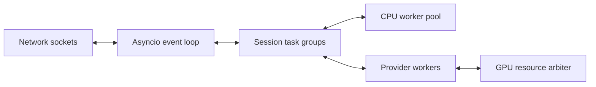
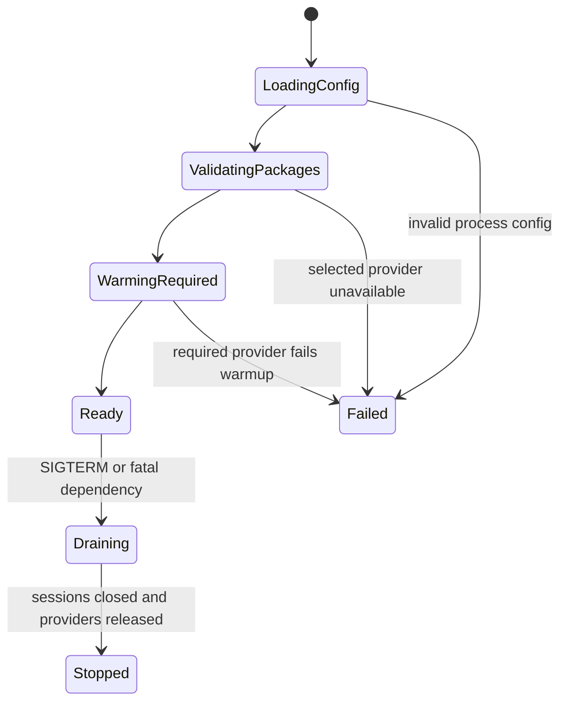

# Thiết kế `veetee-server`

> Runtime: Python 3.12 trên Ubuntu 24.04.  
> Vai trò: realtime data plane duy nhất; Manager API không nằm trên critical path.  
> Wire source of truth: [03-protocol-spec.md](./03-protocol-spec.md).

## 1. Design goals

- Một event loop không bị block bởi model SDK, filesystem hoặc HTTP sync.
- Mỗi connection có structured `SessionScope`; mỗi utterance có cancellable `TurnScope`.
- Audio queue bounded theo thời gian, không theo “đủ lớn chắc không đầy”.
- Decode Opus một lần, không copy mutable audio xuyên module.
- LLM text và TTS audio đều stream; answer length không quyết định memory peak.
- Provider discovery/config không hardcode vendor và không có cross-provider fallback.
- Mọi failure đóng đúng scope, release resource và để firmware quay về state hợp lệ.

Reference đã tách WebSocket connection/session state và provider initialization (`references/xiaozhi-esp32-server/main/xiaozhi-server/core/connection.py:150-249`, `references/xiaozhi-esp32-server/main/xiaozhi-server/core/connection.py:603-647`). Veetee giữ separation nhưng bỏ “connection object biết mọi thứ” bằng module contracts nhỏ dưới đây.

## 2. Logical module map

```text
veetee_server/
├── bootstrap/                 process config, lifecycle, health
├── transports/
│   ├── websocket/             HTTP upgrade, text/binary I/O
│   └── mqtt_udp/              MQTT control + encrypted UDP audio
├── protocol/                  hello/message schemas, v1/v2/v3 framing, fixtures
├── sessions/                  SessionScope, registry, liveness
├── turns/                     TurnScope, coordinator, cancellation, progress
├── audio/                     Opus, PCM frames, resample, pacing, queues
├── providers/                 SDK contracts, discovery, host, resource arbiter
├── tools/                     catalog, Groq tool loop, MCP/device executors
├── config/                    snapshot client, validation, atomic activation
├── history/                   async event sink; never blocks a turn
└── observability/             metrics, traces, structured logging
```

Ranh giới import bắt buộc:

- `protocol` không import providers, manager client hoặc hardware tool.
- `transports` chỉ biết `WireEvent`/`EncodedAudioFrame`, không gọi ASR/TTS.
- Provider package chỉ implement SDK contract; không nhận raw connection object.
- `history` nhận redacted immutable events; không giữ reference tới session queue.
- `turns` phụ thuộc interface của provider/tool, không dynamic-import implementation trực tiếp.

## 3. Process topology

Baseline chạy một Python process:



- Event loop: socket, timer, queue, cancellation và async Groq client.
- CPU pool: bounded blocking transforms nếu native library nhả GIL chưa được chứng minh.
- Provider worker: optional supervised process/thread cho SDK blocking hoặc không cancel được.
- GPU arbiter: cấp lease theo model/reservation; không để hai lazy-load cùng lúc gây OOM.

Không tạo một process cho mỗi session. Model weights có lifecycle `PROCESS_SINGLETON`; decoder/stream state có thể `SESSION`; request/tool state là `TURN`.

## 4. Canonical interfaces

Pseudo-signature dưới 20 dòng; implementation được phép dùng Protocol/ABC nhưng semantics không đổi.

```python
class SessionScope:
    session_id: str
    device: DeviceIdentity
    protocol: ProtocolProfile
    config: ConfigSnapshot

    async def start_turn(self, trigger: Trigger) -> TurnScope: ...
    async def abort_turn(self, turn_id: int, reason: str) -> None: ...
    async def close(self, reason: str) -> None: ...
```

```python
class TurnScope:
    turn_id: int
    cancel: CancellationToken

    async def accept_pcm(self, frame: PcmFrame) -> None: ...
    async def endpoint(self, reason: str) -> None: ...
    async def run_response(self, transcript: FinalTranscript) -> None: ...
```

```python
class TransportSession:
    async def receive(self) -> AsyncIterator[WireEvent | EncodedAudioFrame]: ...
    async def send_event(self, event: WireEvent) -> None: ...
    async def send_audio(self, frame: EncodedAudioFrame) -> None: ...
    async def close(self, code: int, reason: str) -> None: ...
```

Mọi call nhận cancellation token hoặc sống trong task group bị cancel. Interface không được trả background task “fire-and-forget” mà không đăng ký owner.

## 5. Bootstrap lifecycle



Readiness chỉ `200` khi:

- Protocol fixtures/schema registry load thành công.
- Active config snapshot hợp lệ và selected providers có implementation.
- Resident-required VAD/ASR/TTS selection đã warm theo deployment plan.
- Listening sockets sẵn sàng.

Trong `BLUE_GREEN`, old generation giữ readiness tới khi new probe pass và pointer
swap. Trong `QUIESCE_SWAP` hoặc rollback reload, liveness vẫn `200` nhưng readiness
phải non-ready với reason `provider_activation_quiescing` hoặc
`provider_activation_rollback`; admission mới bị đóng trong toàn degraded interval.

`ConfigSource` được chọn explicit khi boot và không tự chuyển nguồn:

- `fixture` (M0/M1 dev): đọc một immutable local snapshot dùng **cùng schema** với
  machine API, verify checksum, bind đúng acceptance device/assistant và resolve
  secret qua secret file riêng. Không có database hoặc inline Groq key trong fixture.
- `manager` (M2+): fetch published snapshot qua machine auth và giữ cache
  last-known-good có checksum/age.

Với source `manager`, Manager API unreachable lúc restart được phép dùng cache và
readiness báo `degraded_config_cache`; nếu chưa từng có snapshot hợp lệ thì không
nhận conversation. Với source `fixture`, thiếu/sai schema/checksum/device binding
làm readiness fail. Cache manager và fixture không thay thế lẫn nhau.

## 6. Session lifecycle

| State nội bộ | Entry | Allowed events | Exit |
|---|---|---|---|
| `HANDSHAKING` | HTTP/MQTT identity accepted | hello only | Valid hello → `READY`; timeout/error → close. |
| `READY` | hello response sent | listen, MCP, close; bounded encoded wake pre-roll | Listen hoặc matching detect → `CAPTURING`; pre-roll timeout vẫn `READY`; close → `CLOSING`. |
| `CAPTURING` | turn allocated | audio, listen stop, abort | endpoint → `THINKING`; abort → `READY`. |
| `THINKING` | final transcript accepted | LLM/tool results, abort, new barge-in | first TTS/audio → `SPEAKING`; abort → `CAPTURING` hoặc `READY`. |
| `SPEAKING` | `tts.start` sent | audio drain, abort, barge-in | `tts.stop` → `READY` ở manual, → `CAPTURING` ở auto/realtime; barge-in → new `CAPTURING`. |
| `CLOSING` | disconnect/goodbye/fatal | cleanup only | All owned tasks joined → closed. |

Wire device state và server internal state liên quan nhưng không đồng nhất. Server không ép firmware state bằng message ngoài contract.

`READY` có đúng một audio exception: tối đa 2 giây/34 packet/64 KiB Opus gần nhất
được giữ encoded trong pre-listen buffer, không decode, VAD, ASR hoặc tạo `TurnScope`.
Chỉ matching `listen/detect` đến trong cửa sổ 500 ms mới atomically allocate turn,
prepend buffer và vào `CAPTURING`; timeout, control khác hoặc overflow policy tại
protocol §9.1 discard buffer. Binary audio khác ở `READY` là protocol violation.

Ở `auto/realtime`, `tts.stop` tạo một fresh capture `TurnScope` rồi re-arm VAD ingress
cho lượt kế tiếp mà không đòi thêm `listen/start`; ASR provider stream chỉ bắt đầu
khi có speech evidence. Ở `manual`, server chờ PTT `listen/start` mới allocate turn
và vào `CAPTURING`. Vì vậy mọi entry `CAPTURING` đều đã có turn, còn wake pre-roll
trước detect thì chưa.

Một device chỉ có một active session lease baseline. Connection mới có cùng authenticated device ID đóng connection cũ với typed reason sau policy-defined handover; không để hai session điều khiển cùng speaker/hardware.

Published config revision được resolve/capture khi `SessionScope` được tạo và bất
biến tới khi session đóng. Publish/activation mới chỉ áp dụng connection/session
mới; không đổi personality, voice, provider hoặc tool policy ở turn boundary của
một conversation dài. Session cũ giữ lease trên generation cũ cho tới cleanup.

## 7. Turn pipeline

### 7.1 Ingress

1. Transport parser validate size/header/session before allocation lớn.
2. Nếu state là `READY`, chỉ wake pre-roll hợp lệ được unwrap rồi giữ dưới dạng
   encoded Opus trong fixed buffer §6; handler return trước decoder/VAD/ASR.
3. Trong `CAPTURING`, binary envelope được unwrap thành một Opus packet; invalid
   length không tới decoder.
4. Opus decoder tạo PCM signed 16-bit mono 16 kHz.
5. PCM frame immutable được fan-out tới VAD; manual mode đưa ngay vào active ASR,
   còn auto/realtime MAY lazy-start ASR khi có speech evidence rồi prepend bounded
   speech pre-roll thuộc `TurnScope`.
6. Optional history/voiceprint side sink nhận copy/reference bounded và có deadline riêng.

Reference decode một lần rồi đưa PCM vào ASR queue (`references/xiaozhi-esp32-server/main/xiaozhi-server/core/connection.py:365-380`). Queue mới không dùng unbounded `queue.Queue`; mỗi item có capture monotonic time và `turn_id`.

### 7.2 Endpoint và ASR

- `manual`: `listen.stop` là endpoint authority; VAD chỉ metrics/noise gate và không tự cắt PTT.
- `auto`: Silero hysteresis + minimum speech + trailing silence tạo endpoint;
  nếu snapshot bật `autoTurn.noSpeechTimeoutMs`, một watchdog bounded chỉ chờ
  speech đầu tiên và gửi `alert.code="NO_SPEECH_TIMEOUT"` khi wake không có lời.
- `realtime`: AEC-aware streaming vẫn nhận mic khi AI speaking; confirmed speech tạo barge-in.
- `auto`: chỉ nhận mic khi AI speaking nếu snapshot có
  `bargeIn.deviceDuplex=true`; server công bố capability qua `tts/start` và tạo
  turn `auto` mới sau `tts/stop(reason:"barge_in")`.
- Empty/non-speech/too-low-evidence turn emit typed `no_speech` và không gọi LLM.
  No-speech watchdog chỉ áp dụng trước speech đầu tiên; không phải max duration
  của một conversation đang chạy.
- Baseline chỉ dùng **final** transcript cho LLM. Partial transcript gửi UI/debug optional nhưng không speculative answer.

Reference manual mode đã bypass VAD endpoint (`references/xiaozhi-esp32-server/main/xiaozhi-server/core/providers/vad/silero.py:55-58`, `references/xiaozhi-esp32-server/main/xiaozhi-server/core/providers/asr/base.py:60-81`).

### 7.3 Prompt và Groq

Prompt assembly order là data contract, không nối chuỗi ad hoc:

1. System safety/tool policy do deployment quản lý.
2. Assistant base prompt revision.
3. Personality revision và locale/style variables.
4. Memory context đã lọc/giới hạn.
5. Tool catalog đã authorize cho assistant/device.
6. Conversation window và final user transcript.

Groq request bật streaming. Model ID, temperature, token policy và tool choice nằm trong provider config; server core không chứa model literal. Token/text delta và tool-call delta được parse thành hai channels; tool JSON chưa hoàn chỉnh không đi qua speech segmenter. Mỗi provider generation giữ một `httpx.AsyncClient` pool dùng chung cho các session, với `maxConnections`, `maxKeepaliveConnections`, `keepaliveExpirySeconds` và timeout do manifest cấu hình; pool đóng sau khi generation lease cuối drain để không bỏ connection đang dùng.

### 7.4 Tool loop

- Stable tool name gồm namespace; collision fail config activation.
- Arguments validate JSON Schema trước execute.
- Tool Broker authorize bound `{assistantId, deviceId, tool, safetyClass,
  configRevision}` từ immutable `SessionScope`; LLM text/arguments không được tự
  khai hoặc override identity/policy này.
- Executor lookup theo catalog entry, không theo string prefix tùy tiện.
- Tool có deadline, idempotency class và safety class.
- Result chỉ được đưa lại LLM nếu `turn_id` còn current.
- Tool chậm có thể kích hoạt progress acknowledgment theo policy/config; acknowledgment không thay result.
- Vòng tool call có configurable budget về số round/deadline nhưng không hardcode câu chữ hoặc domain tool.

Baseline `progress_ack_deadline_ms = 900`, tính từ `speech_endpointed`. Snapshot
activation phải chứng minh VAD endpoint budget cộng deadline và measured
acknowledgment playout p95 nhỏ hơn Lab E2E TTFA target; semantics chi tiết nằm ở
[04-audio-pipeline.md](./04-audio-pipeline.md).

Device MCP descriptor/pagination semantics được giữ theo wire contract. Reference device MCP expose schema động (`references/xiaozhi-esp32/main/mcp_server.h:232-269`) và unified layer gom nhiều source (`references/xiaozhi-esp32-server/main/xiaozhi-server/core/providers/tools/unified_tool_handler.py:27-52`).

### 7.5 LLM → TTS → egress

- Semantic segmenter giữ buffer nhỏ, emit ở safe punctuation/clause hoặc maximum-wait boundary cấu hình.
- Mỗi `SpeechSegment` có monotonically increasing `segment_index`.
- TTS stream PCM; adapter resample về negotiated 24 kHz rồi Opus encode 60 ms.
- Egress có small startup prebuffer và monotonic pacing; queue age vượt ngưỡng thì abort/degrade rõ, không phát audio cũ chậm dần.
- `tts.stop` chỉ gửi khi final audio đã được handed off/drained theo protocol policy; abort gửi stop sau cancellation barrier.

Reference gửi các frame đầu để prebuffer rồi pace (`references/xiaozhi-esp32-server/main/xiaozhi-server/core/handle/sendAudioHandle.py:15-18`, `references/xiaozhi-esp32-server/main/xiaozhi-server/core/handle/sendAudioHandle.py:227-255`). Veetee để burst count là measured transport parameter, không coi giá trị reference là hằng số tối ưu cho mọi LAN.

## 8. Queue và backpressure contract

Các số sau là **candidate baseline**, chưa phải benchmark đã đạt. Capacity và hard
age được pin trong config revision; promotion benchmark được phép tune trong schema
range. Giá trị ngoài range cần schema/ADR review, không sửa constant rải rác trong
code.

| Queue | Unit | Baseline capacity | Schema min–max | Baseline hard age | Khi đầy/quá age |
|---|---|---:|---:|---:|---|
| Network Opus ingress | ms audio | 600 | 180–1.200 | 600 ms | Drop oldest chưa decode, increment discontinuity và age/drop metric. |
| PCM → ASR | ms audio | 960 | 240–2.000 | 1.200 ms | Backpressure ngắn; quá age cancel turn `audio.asr_backlog`, không drop giữa transcript. |
| LLM delta → segmenter | events + chars | 128 + 8.192 | 16–512 + 1.024–32.768 | 1.000 ms | Pause stream read; quá age cancel turn, không bỏ text delta. |
| Segment → TTS | segments + chars | 4 + 2.048 | 1–16 + 512–8.192 | 60.000 ms | Backpressure segmenter/Groq reader; quá age cancel stale answer. |
| TTS PCM → Opus | ms audio | 720 | 180–2.400 | 1.200 ms | Backpressure TTS iterator; không drop synthesized speech. |
| Opus egress | ms audio | 600 | 180–1.800 | 900 ms | Backpressure encoder; peer chậm quá age thì abort turn thay vì phát trễ. |
| History events | events | 512 | 64–4.096 | 30.000 ms | Drop optional samples trước; mandatory backlog full tạo explicit data-loss health/counter, không block realtime. |

Capacity duration của Opus queue phải là bội số frame 60 ms. Queue có hai unit
phải enforce **cả hai** limit; chạm limit nào trước thì backpressure. `hard age` là
tuổi monotonic của item già nhất, không phải thời gian từ lúc session mở. Long-answer
không tăng capacity; backpressure dừng producer ở bounded boundary.

Mỗi queue bắt buộc xuất metrics có label `queue`/`reason` cardinality bounded:

- gauges `queue_depth`, `queue_capacity`, `queue_oldest_age_ms` và
  `queue_high_watermark_ratio` theo canonical unit;
- histograms `queue_item_age_ms` và `queue_put_wait_ms` để dashboard tính
  p50/p95/p99/max;
- counters `queue_dropped_total`, `queue_rejected_total`,
  `queue_hard_age_exceeded_total` và `queue_backpressure_total`;
- `queue_high_water_duration_ms` cho mỗi activation/soak record.

Không dùng `session_id`/`turn_id` làm metric label; trace có thể mang opaque IDs để
điều tra một turn. Promotion record lưu baseline/tuned values, high-water duration,
age percentiles, drop/reject count và lý do thay đổi.

Reference firmware dùng bounded queue và drop oldest ở uplink (`references/xiaozhi-esp32/main/audio/audio_service.cc:536-577`); policy server mới giữ cùng nguyên tắc freshness ở realtime ingress.

## 9. Cancellation algorithm

Abort là event idempotent:

1. Atomically mark `TurnScope` cancelled và advance current turn generation.
2. Stop accepting input/output item cho old `turn_id`.
3. Cancel Groq HTTP stream và TTS generator; dừng chờ tool ngay, nhưng chỉ gửi
   cancel tới tool có manifest `cancellable=true`.
4. Flush bounded segment/PCM/Opus queues của turn.
5. Await provider cleanup trong deadline; recycle worker nếu SDK không dừng.
6. Emit `tts.stop`/internal completion đúng một lần nếu transport còn mở.
7. Record time-to-silence và resource-release outcome.

Task callback luôn kiểm tra generation trước enqueue, kể cả sau cancellation đã return. Đây là defense bắt buộc chống race, không phải optimization.
Tool mutation đã bắt đầu và không cancellable có thể hoàn tất ngoài turn; outcome
phải được audit/quarantine, không được đưa lại LLM hoặc kích hoạt retry mù.

## 10. Provider host và resource arbiter

Provider host thực hiện:

- Discover installed entry points và validate manifest version.
- Resolve config + secretRefs trong memory, redact logging.
- Enforce lifecycle scope và max concurrency.
- Warm-up bằng representative input, không chỉ instantiate object.
- Acquire/release CPU thread, RAM và GPU lease.
- Expose health riêng `loaded`, `ready`, `activation_quiescing`,
  `rollback_warming`, `degraded`, `failed`, `unloading`.
- Idle unload chỉ theo policy explicit; turn đang giữ lease không bị preempt tùy tiện.

Cross-provider fallback không tồn tại. Config activation fail giữ last-known-good **revision**; runtime provider fail tạo typed turn error. Hai hành vi này không được gọi chung là fallback.

Resource arbiter dùng các số đo physical VRAM, driver/runtime reserve, warm
baseline, allocatable headroom và promotion limit theo
[05-provider-registry.md](./05-provider-registry.md). Đủ headroom mới chạy
`BLUE_GREEN`; thiếu dual residency nhưng từng generation vẫn vừa thì chạy
`QUIESCE_SWAP`. Failed new generation phải unload trước khi reload/warm exact old
generation. Rollback reload fail giữ server non-ready; không gọi secondary provider.

## 11. Config snapshot client

Ở mỗi connection mới, adapter Manager trước hết resolve cặp wire
`Device-Id + Client-Id` thành opaque internal `deviceId/assistantId/bindingRevision`;
raw identity không làm cache key persisted hoặc log field. Sau đó
`veetee-server` nhận snapshot gồm:

- `revision`, `checksum`, `issued_at`.
- Assistant/personality/locale/prompt revision.
- Provider selections/config IDs và resolved runtime secret handles.
- Tool permissions, progress policy, VAD/segmenter thresholds.
- Retention/observability policy.

Hai adapter `fixture`/`manager` phải trả cùng canonical `ConfigSnapshot`; phần còn
lại của server không branch theo nguồn. Fixture là bootstrap artifact có schema
version, revision, checksum và allowlisted device identity, không phải một cấu
hình code path đơn giản hóa.

Activation flow:

1. Read fixture đã verify hoặc fetch manager bằng machine auth + `If-None-Match`
   ngoài critical path.
2. Validate schema/references/package/resource feasibility.
3. Chọn `BLUE_GREEN`, `QUIESCE_SWAP` hoặc reject bằng exact measured resource
   record; manifest hint không đủ để cho phép dual residency.
4. Blue-green warm/probe new khi old còn active; quiesce-swap đóng readiness/admission,
   chỉ unload old sau khi lease đã về zero rồi mới warm new. Host slice hiện tại
   fail-closed nếu còn lease (không tự ép disconnect); bounded drain/cancel và
   readiness maintenance signal vẫn là hardening follow-up.
5. Chỉ atomic swap active pointer sau representative readiness probe, và chỉ cho
   `SessionScope` tạo sau swap; baseline không có per-turn live activation.
6. New warm/probe fail thì unload failed generation. Blue-green giữ old active;
   quiesce-swap reload/warm/probe exact pinned old generation trước khi ready lại.
7. Session đang pin generation cũ chỉ được drain bình thường ở blue-green; trong
   quiesce-swap, zero lease là precondition bắt buộc trước khi unload old.

Snapshot không được mutate per device trong connection object. Per-device/assistant result là một snapshot mới có checksum riêng.
Canonical transaction, degraded interval và rollback semantics nằm ở
[05-provider-registry.md](./05-provider-registry.md) và
[ADR-007](./ADR/ADR-007-provider-registry-lifecycle.md).

## 12. History event sink

Voice server emit event, không trực tiếp ghi nhiều bảng manager trong turn:

| Event | Payload tối thiểu |
|---|---|
| `session.started/ended` | IDs, device, assistant, config revision, reason. |
| `turn.started/ended/aborted` | turn, trigger, outcome, timestamps. |
| `transcript.final` | redacted/config-policy text, locale, confidence optional. |
| `tool.started/ended` | tool name, duration, status; args/result theo redaction policy. |
| `tts.segment` | segment index, chars, first PCM/duration; không bắt buộc text. |
| `latency.summary` | stage deltas và TTFA. |
| `protocol.error` | profile, code, safe detail. |

Sink có local spool bounded nếu Manager API unavailable. Khi full, ưu tiên lifecycle/error/summary; raw/high-volume optional events bị drop có counter. Audio recording off mặc định.

## 13. Liveness và long conversation

- Không có max turn duration hoặc max response duration nghiệp vụ trong baseline.
- WebSocket ping/pong, protocol inbound timeout và provider deadlines là các timer khác nhau.
- Transcript context được window/summarize theo Memory provider; không giữ toàn bộ history trong prompt/RAM.
- TTS/Opus stream không materialize full WAV.
- Metrics/log writer rotate; tool result và prompt có size limit trước LLM call.
- Session có admission lease; khi host thiếu resource, connection mới nhận `server_busy`, không làm OOM session đang chạy.
- `snapshot.bargeIn` là policy additive: `deviceDuplex` mặc định `false`,
  `minSpeechFrames` nằm trong `1..32`. Khi bật duplex, `tts/start` thêm
  `barge_in:{enabled:true,mode:"acoustic"}`; server yêu cầu đủ speech frame trước
  khi gửi `tts/stop(reason:"barge_in")`. Policy sai làm activation fail-closed,
  không provider fallback hoặc silent downgrade.
- Turn admission đọc `snapshot.admission.maxActiveTurns` (baseline `1`) và
  `retryAfterMs`; session vẫn được giữ alive nhưng `listen/start` vượt capacity
  nhận typed `alert.code="SERVER_BUSY"`, không queue vô hạn và không provider
  fallback. Lease được release sau cancellation, error, intent exit hoặc normal
  `tts.stop`.
- `snapshot.autoTurn` là policy additive, disabled nếu vắng mặt. Khi `enabled`
  và không nhận được speech trong `noSpeechTimeoutMs` (1–60 giây), server không
  finalize ASR hoặc gọi LLM/TTS; nó release turn lease, về `READY` và gửi
  configurable `alert` với `code="NO_SPEECH_TIMEOUT"`. Watchdog sở hữu bởi
  `(session_id, turn_id, generation)` và bị hủy khi có speech/abort/stop/endpoint/
  disconnect/turn mới.
- Disconnect luôn cancel task tree và join cleanup; soak test theo dõi live task count, file descriptor, RSS và VRAM.
- Baseline long-answer soak dùng deterministic long-text fixture có checksum để
  drive segmenter → VieNeu → Opus → paced egress trong ≥ 30 phút audio. Nó không
  phụ thuộc hoặc tuyên bố Groq hỗ trợ một response/continuation dài tương ứng.
- Groq max-output/finish-reason/continuation chỉ thành acceptance gate sau live
  capability probe của exact model ID; trước đó đây là open capability question.

## 14. Error taxonomy

| Code family | Ví dụ | Scope | Client-visible behavior |
|---|---|---|---|
| `protocol.*` | version mismatch, invalid frame length | Session | Close/error theo spec; không decode. |
| `auth.*` | device unknown, token invalid | Handshake | Reject trước audio allocation. |
| `audio.*` | Opus decode, queue stale | Turn/session tùy severity | Abort turn; session tiếp tục nếu safe. |
| `provider.*` | unavailable, timeout, resource exhausted | Turn hoặc readiness | Explicit error; không fallback. |
| `llm.*` | rate limited, tool delta invalid | Turn | Configured apology/error, then idle. |
| `tool.*` | denied, timeout, invalid result | Tool round | Structured result cho LLM hoặc abort policy. |
| `config.*` | stale/invalid revision | Activation | Giữ last-known-good revision. |
| `internal.*` | invariant broken | Session/process | Fail closed, trace + supervised restart. |

User-facing text được map từ error code qua locale/personality config. Wire không gửi Python exception/stack trace.

## 15. Observability

### Trace markers

Mỗi turn tối thiểu có:

`speech_started`, `speech_endpointed`, `asr_final`, `llm_request_sent`,
`llm_first_token`, `llm_first_meaningful_text_delta`, `segment_first_emit`,
`tts_first_pcm`, `first_opus_sent`, `first_pcm_playable`, `turn_cancelled`,
`speaker_silent`. `llm_first_token` là diagnostic; latency budget dùng meaningful
text marker để không tính whitespace/tool delta như speech-ready text.

### Metrics

- Lab E2E và Operational TTFA p50/p95 tách riêng theo warm/cold, device,
  transport, provider/config revision.
- VAD false start/missed start proxy và endpoint delay.
- ASR real-time factor/finalization tail.
- Groq first-token/tool round latency/429.
- TTS first-chunk/RTF, resample/encode cost.
- Queue age/depth/drop và event-loop lag.
- Session/task/fd count, CPU/RSS/VRAM/model state.
- Session handover/release và số turn bị abort khi transport disconnect; reconnect
  không được để lại model lease hoặc stale output.
- Barge-in time-to-silence và stale-frame rejection.

Không dùng raw `session_id`, `device_id`, prompt hoặc transcript làm metric label.

## 16. Security và privacy

- Device auth trước hello processing đầy đủ; frame/body/JSON depth/size bounded.
- Groq TLS; egress allowlist; tool endpoints deny by default.
- Secret resolver trả opaque handle/value scoped cho provider instance, không serialize lại snapshot/log.
- Test harness nhận key list từ ephemeral secret input; log chỉ key ordinal/hash prefix không đảo ngược. Production schema chỉ chấp nhận một Groq `secretRef`.
- Conversation/audio retention opt-in rõ; transcript redaction policy trước history sink.
- MQTT/UDP key có session scope, entropy đủ và không reuse; chi tiết tại protocol spec.

## 17. Test strategy

### Unit

- Framing/JSON validators, queue policy, segmenter, state transitions, error mapping.
- Cancellation tại từng await boundary bằng deterministic scheduler/fake clock.
- Config checksum/activation và provider lifecycle.

### Contract

- Provider compliance: stream, cancel, timeout, resource cleanup, locale, format.
- Groq fake server: fragmented SSE/tool delta, 429, disconnect, malformed response.
- MCP fake device: pagination, error, duplicate/collision, delayed result.

### Integration

- Recorded Opus fixtures → transcript → fake LLM → deterministic TTS frames.
- Deterministic Unicode long-text fixture → real segmenter/VieNeu/resampler/Opus/
  paced egress tạo ≥ 30 phút audio, kiểm tra coverage/order/bounded memory/abort;
  Groq continuation được test riêng sau capability probe.
- Real selected models trên host với benchmark corpus.
- Firmware/server cross-conformance và physical speaker acceptance.

### Soak/fault

- 60 phút M1, 24 giờ M4; reconnect, Manager restart, Groq reset, provider worker hang.
- Network latency/loss/reorder profile cho WebSocket và MQTT/UDP.
- Resource pressure/admission test; không swap-thrash hoặc CUDA OOM loop.

## 18. Definition of Done cho server baseline

- [ ] Không có unowned background task sau session close.
- [ ] Event-loop lag p99 và queue age nằm trong budget dưới acceptance load.
- [ ] 0 stale output sau abort race suite.
- [x] Provider fail không gọi provider khác: regression inject active TTS fault,
  kiểm tra typed `TTS_SYNTHESIS_FAILED`, alert và secondary counter bằng 0.
- [ ] Protocol v1/v2/v3 golden/conformance pass.
- [ ] Warm Lab E2E TTFA p95 < 1.500 ms trên đúng hardware/config đã ghi.
- [ ] 60 phút session không tăng live task/fd/RSS/VRAM đơn điệu.
- [ ] Queue baseline/tuned revision có capacity, hard age, percentile/high-water và
  drop/reject evidence; long-answer không mở rộng queue theo thời lượng.
- [ ] Activation fault suite pass cả blue-green và quiesce-swap, gồm failed-new
  unload, old-generation reload và non-ready behavior khi rollback fail.
- [ ] Secret canary scan sạch ở log, trace, error và history payload.
