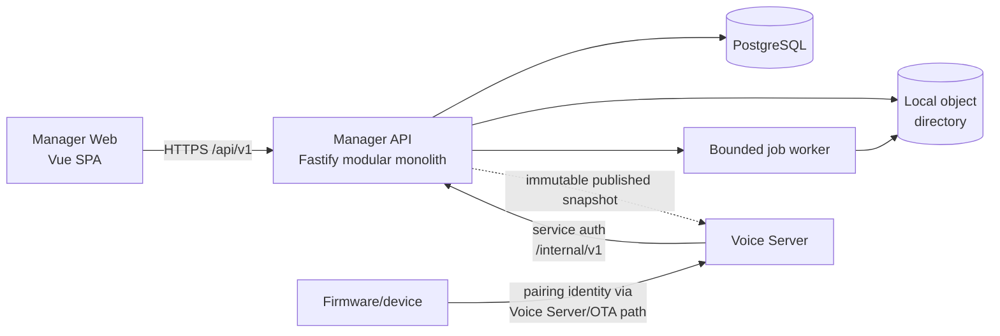
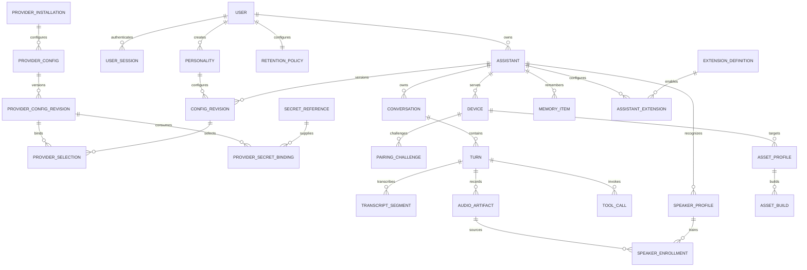
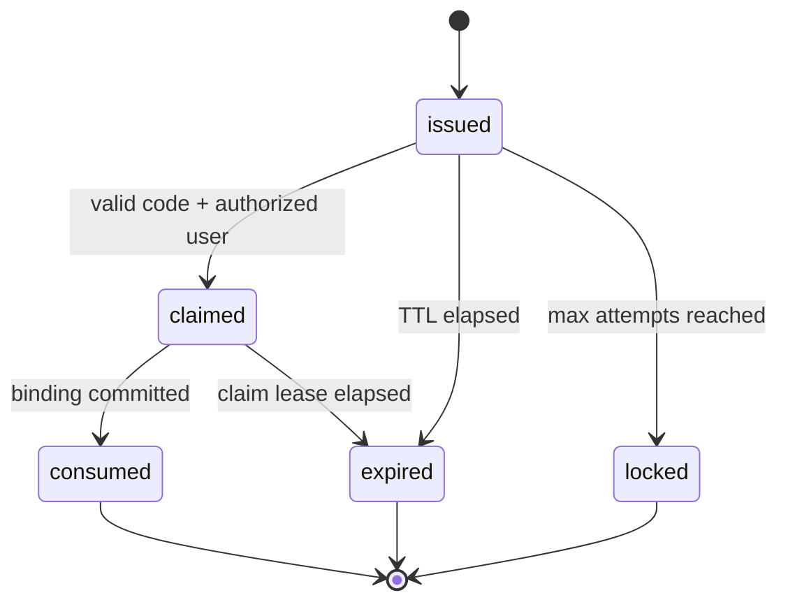

# Thiết kế Manager API và Manager Web

> **Status:** Phase 1 design baseline; riêng Manager Web mock UI preview đã được
> implement như explicit exception và visual foundation hiện tại đã được chủ dự
> án duyệt.  
> **Ngày:** 2026-08-03.  
> **Phạm vi:** executable specification cho full Manager API/Web; preview code
> không đồng nghĩa API, production integration hoặc M2 đã được implement.  
> **Stack:** Node.js + TypeScript + Fastify; Vue 3 + Vite + Tailwind CSS.

## 1. Mục tiêu và ranh giới

Manager là control plane của Veetee, gồm hai deployment độc lập:

- **Manager API** quản lý assistant, device, provider configuration, immutable
  configuration revision, history metadata, speaker profile, extension catalog và
  firmware asset job.
- **Manager Web** là dashboard cho người vận hành. Web chỉ giao tiếp qua contract
  HTTP versioned; không import source hoặc database model từ API.
- **Voice Server** là realtime data plane riêng. Nó chỉ đọc published snapshot
  và đẩy telemetry/history ngoài audio critical path. Manager restart không được
  làm rớt conversation đang chạy.
- **Firmware** không phụ thuộc dashboard. Device pairing/runtime config dùng
  machine endpoints riêng và credential riêng với user session.

Thiết kế ưu tiên một modular monolith cho API và một SPA static cho Web.
PostgreSQL là system of record; M0/M1 không yêu cầu Redis. Không tách
microservice, không thêm message broker và không thiết kế multi-region ở giai
đoạn đầu.

### 1.1 Chức năng trong scope

- Assistant cards/list, search, online state, create, rename, delete, configure,
  history và linked devices.
- Role configuration: BCP-47 language, voice + preview, base prompt,
  personality, speaking rate, pitch và response style.
- Model/memory: chọn provider config, bật/tắt memory, quản lý memory items.
- Provider catalog/config cho `VAD`, `ASR`, `LLM`, `TTS`, `Intent`, `Memory`.
- Speaker recognition: tạo profile từ một clean audio artifact gần đây, đặt tên,
  mô tả và quản lý enrollment.
- Extension catalog và per-assistant enable/config.
- Conversation sessions, transcript, audio play/download, tool-call detail,
  latency và retention notice.
- Device pairing bằng verification code, masked MAC, online/version/last
  conversation, OTA toggle, unlink, display/theme entry.
- Firmware asset wizard: chip, display dimensions, wake word, font, subtitle,
  preview, build và download `assets.bin`.

### 1.2 Deferred và excluded

Các feature sau **không có route, table hoặc placeholder action có thể bấm** cho
đến khi chủ dự án cung cấp tài liệu riêng:

- voice cloning;
- knowledge base;
- external MCP endpoint.

Emoji collection và conversation background bị loại khỏi scope. `display/theme`
trong device settings chỉ là entry tới firmware display configuration do Veetee
sở hữu, không kéo hai feature bị loại trừ trở lại.

Danh sách Groq free-tier keys chỉ được phép nằm trong test harness để test có thể
tiếp tục sau `429`. Nó không phải product feature: không có entity, API, UI,
rotation scheduler hoặc production fallback cho danh sách keys.

### 1.3 Trạng thái implementation hiện tại

Chủ dự án đã cho phép một ngoại lệ độc lập tại `veetee-manager-web/`: mock UI
preview của Core slice A. Code hiện có năm surface `/assistants`, role,
model/memory, devices và `/_preview/components`; data/mutation đi qua injectable
MockGateway và deterministic in-memory fixtures.

Ngoại lệ này **không** implement Manager API, PostgreSQL, auth/session, generated
OpenAPI client, publish transaction, Voice Server hoặc firmware. Vì thế:

- firmware, Voice Server và Manager API vẫn design-only;
- các API/production E2E oracle trong tài liệu này vẫn là future M2 gates;
- preview pass test không được dùng để đánh dấu Manager slice DoD hoặc M2 hoàn tất.

Evidence preview hiện tại được ghi tại
[implementation plan](superpowers/plans/2026-08-03-manager-web-ui-preview-implementation.md)
và không thay contract production trong các section dưới.

## 2. Kiến trúc control plane



Boundary bắt buộc:

- User API `/api/v1` và machine API `/internal/v1` không dùng chung auth
  audience.
- Manager API không terminate realtime WebSocket/MQTT/UDP của device.
- Provider probe, voice preview, speaker enrollment và asset build là bounded
  jobs; request handler chỉ validate, enqueue và trả job resource.
- Local object directory chỉ giữ binary; PostgreSQL giữ metadata, ownership,
  checksum và retention state.
- Mọi queue có `maxPending`, per-job deadline và cancellation. Khi đầy, API trả
  `429 JOB_QUEUE_FULL`; không tăng memory vô hạn.

## 3. Manager API: module và dependency rule

### 3.1 Logical module map

```text
apps/manager-api/src/
├── app/                    build/start, graceful shutdown
├── plugins/                config, log, errors, database, auth, OpenAPI
├── modules/
│   ├── assistants/         lifecycle, role config, publish/revisions
│   ├── personalities/      reusable prompt/personality templates
│   ├── providers/          installations, configs, selections, probes
│   ├── secrets/            write-only secret references
│   ├── devices/            pairing, binding, status, OTA preference
│   ├── conversations/      session/turn/transcript/artifact/tool read model
│   ├── speakers/           profile and enrollment jobs
│   ├── extensions/         catalog and assistant bindings
│   ├── firmware-assets/    profile, preview metadata, build jobs
│   └── runtime-config/     published snapshot for Voice Server
├── shared/                 IDs, clock, problem details, pagination
└── workers/                asset, preview, provider-probe, enrollment
```

Mỗi feature module có bốn boundary logic:

1. `routes`: HTTP schema, auth policy, status mapping;
2. `application`: use case và transaction boundary;
3. `domain`: invariant/state transition thuần;
4. `repository` port + infrastructure adapter.

Không module nào đọc table của module khác trực tiếp. Cross-domain use case gọi
application port, hoặc dùng một transaction coordinator nhỏ khi invariant thực sự
trải qua hai aggregate. Không dùng import side effect để đăng ký provider hay
route.

### 3.2 Fastify lifecycle

Thứ tự plugin normative:

1. validate environment config;
2. khởi tạo structured logger và central problem handler;
3. database/artifact/job adapters;
4. user, service và device auth policies;
5. shared JSON Schemas + OpenAPI 3.1;
6. encapsulated feature plugins;
7. readiness sau khi migration state và required adapters đã healthy.

Shutdown dừng nhận request mới, ngừng dequeue job, chờ bounded grace period, trả
job đang dở về `queued` nếu safe hoặc đánh dấu `failed` với retryability rõ, đóng
pool và logger. Không dùng process exit giữa transaction.

### 3.3 Schema và contract source of truth

- JSON Schema dùng cho request validation **và** response allow-list
  serialization.
- TypeScript types được derive từ schema; không viết một interface DTO song song.
- OpenAPI 3.1 được export từ runtime schemas, lint trong CI và version cùng API.
- Web client được generate từ OpenAPI artifact. API source không được publish như
  một frontend package.
- Mọi route định nghĩa `operationId`, tags, auth, examples, mọi response status và
  stable error code.
- Field không được khai báo bị reject với `400 VALIDATION_ERROR`; API không âm
  thầm bỏ field cấu hình sai.

## 4. Data model

### 4.1 Entity relationship

Sơ đồ chỉ thể hiện ownership/cardinality quan trọng; physical index và partition
không được suy ra từ sơ đồ.



### 4.2 Entity dictionary

| Entity | Trường cốt lõi | Invariant/retention |
|---|---|---|
| `User` | `id`, `email`, `passwordHash`, `credentialVersion`, `displayName`, `role`, `uiLocale`, timestamps | Email normalized unique; password hash không serialize; role không được client tự nâng. |
| `UserSession` | `id`, `userId`, `tokenHash`, `credentialVersion`, `csrfSecret`, `issuedAt`, `lastSeenAt`, `idleExpiresAt`, `absoluteExpiresAt`, `revokedAt?` | Chỉ opaque token hash; expiry/revoke enforced; bounded cleanup; cookie value không log. |
| `RetentionPolicy` | `ownerUserId`, `captureTranscript`, `transcriptDays?`, `captureAudio`, `audioDays?`, `effectiveAt`, `revision` | Luôn có effective policy; capture/retention được hiển thị rõ, không dùng hidden default. |
| `Assistant` | `id`, `ownerUserId`, `name`, `status`, `draftRevisionId`, `publishedRevisionId`, timestamps | Name 1–80 ký tự; delete bị chặn khi còn linked device; public online count là derived state. |
| `Personality` | `id`, `ownerUserId`, `name`, `description`, `promptTemplate`, `variableSchema`, `revision` | Template dùng biến khai báo; không chứa secret; delete bị chặn nếu revision đang tham chiếu. |
| `ConfigRevision` | `id`, `assistantId`, `revision`, `state`, `schemaVersion`, `snapshot`, `checksum`, `createdBy`, `createdAt`, `publishedAt?`, `supersededAt?` | Immutable snapshot; `(assistantId, revision)` unique; không chứa plaintext secret. |
| `ProviderInstallation` | `id`, `providerId`, `kind`, `displayNameKey`, `packageName`, `packageVersion`, `packageHash`, `schemaVersion`, `configSchema`, `manifest`, `installState` | Catalog manifest versioned; exact package/hash phải tồn tại ở Voice Server trước activate. |
| `ProviderConfig` | `id`, `installationId`, `ownerUserId`, `name`, `enabled`, `currentRevisionId`, `lastProbe` | Stable config identity; probe status là diagnosis, không kích hoạt fallback. |
| `ProviderConfigRevision` | `id`, `providerConfigId`, `revision`, `config`, `packageVersion`, `createdAt` | Immutable; `config` chỉ non-secret; published assistant snapshot pin revision này. |
| `ProviderSecretBinding` | `providerConfigRevisionId`, `field`, `secretReferenceId`, `secretReferenceVersion` | Field phải được manifest đánh dấu secret; unique theo config revision/field; exact secret version được pin. |
| `ProviderSelection` | `configRevisionId`, `kind`, `mode`, `providerConfigRevisionId?` | Unique theo assistant config revision/kind; required kind luôn `selected`; không có array/priority. |
| `SecretReference` | `id`, `ownerUserId`, `name`, `store`, `locator`, `version`, `status`, `lastRotatedAt` | Public response chỉ metadata; secret value write-only; delete bị chặn khi còn binding. |
| `VoiceProfile` | `id`, `providerConfigId`, `externalVoiceId`, `nameKey`, `locales`, `capabilities`, `previewArtifactId?` | Catalog item, không phải cloned voice; rate/pitch support lấy từ capabilities. |
| `Device` | `id`, `assistantId?`, `identityHash`, `clientIdHash`, `identityCiphertext`, `displayName`, `board`, `firmwareVersion`, `lastSeenAt`, `otaEnabled`, `reportedStateVersion` | Composite `(identityHash,clientIdHash)` unique; machine lookup bind cả hai; public serializer chỉ trả `maskedMac`; unlink không xóa history; online là TTL-derived. |
| `PairingChallenge` | `id`, `deviceId`, `codeHash`, `state`, `expiresAt`, `attempts`, `claimedBy?` | Không lưu raw code; single-use; TTL và max attempts bắt buộc. |
| `Conversation` | `id`, `assistantId`, `deviceId?`, `startedAt`, `endedAt?`, `locale`, `configRevision`, `status`, aggregate latency | Không có duration cap; retention policy quyết định delete; config revision được pin. |
| `Turn` | `id`, `conversationId`, `sequence`, `state`, timing markers, `finishReason` | Sequence tăng đơn điệu; aborted turn vẫn được lưu với finish reason. |
| `TranscriptSegment` | `id`, `turnId`, `speaker`, `text`, `locale`, `confidence?`, `startedAtMs`, `endedAtMs`, `isFinal` | Thứ tự stable; partial có thể bị compact sau final. |
| `AudioArtifact` | `id`, `turnId`, `direction`, `objectKey`, `codec`, `sampleRate`, `channels`, `durationMs`, `byteSize`, `sha256`, `retentionUntil?` | Ownership check trước stream; metadata và binary delete nhất quán/idempotent. |
| `ToolCall` | `id`, `turnId`, `toolName`, `source`, `status`, `startedAt`, `endedAt`, `latencyMs`, redacted input/output/error | Không lưu credential; payload bị size limit/redaction; ID hỗ trợ trace. |
| `MemoryItem` | `id`, `assistantId`, `kind`, `content`, `sourceConversationId?`, `enabled`, timestamps | Memory có thể disabled mà không xóa items; content thuộc retention/security policy. |
| `SpeakerProfile` | `id`, `assistantId`, `name`, `description`, `purpose`, `consentPolicyVersion`, `consentedAt`, `status`, `modelVersion`, timestamps | Name unique trong assistant; baseline purpose chỉ `personalization`; vector/template không trả qua public API. |
| `SpeakerEnrollment` | `id`, `speakerProfileId`, `sourceAudioArtifactId`, `state`, `quality`, `failureCode?` | Chỉ audio thuộc cùng owner/assistant; quality gate fail không tạo active template. |
| `ExtensionDefinition` | `id`, `code`, `displayNameKey`, `configSchema`, `capabilities`, `installState` | Catalog manifest versioned; no arbitrary executable upload qua UI. |
| `AssistantExtension` | `assistantId`, `extensionDefinitionId`, `enabled`, `config`, `revision` | Config schema validated; credential vẫn qua `secretRef`. |
| `AssetProfile` | `id`, `deviceId?`, `name`, `inputSchemaVersion`, `input`, `revision`, timestamps | Input immutable theo revision; không chứa secret hoặc conversation background. |
| `AssetBuild` | `id`, `assetProfileId`, `inputRevision`, `state`, `progress`, `artifactId?`, `errorCode?`, timestamps | Build pin input revision; output phải có checksum; retry tạo attempt mới. |
| `AuditEvent` | `id`, `actorType`, `actorId`, `action`, `resourceType`, `resourceId`, `requestId`, redacted diff, `createdAt` | Append-only; secret value/audio/transcript body không nằm trong diff. |

Raw hardware identity là dữ liệu nhạy cảm dùng cho machine matching. Ingest
normalize rồi tạo keyed `identityHash` và `clientIdHash`; raw value nếu cần cho mask/support được
encrypt thành `identityCiphertext`. Public API chỉ trả `maskedMac` như
`A4:**:**:**:9C:2F`; full-identity lookup chỉ dành service endpoint và không log
raw value.

### 4.3 Assistant config snapshot

Snapshot là contract immutable mà Voice Server tiêu thụ. Hình dạng tối thiểu:

```json
{
  "schemaVersion": 1,
  "assistantId": "uuid",
  "revision": 12,
  "locale": "vi-VN",
  "basePrompt": "...",
  "personality": { "id": "uuid", "revision": 3 },
  "speech": { "voiceId": "uuid", "rate": 1, "pitch": 0, "style": "natural" },
  "progress": { "enabled": true, "acknowledgementId": "processing", "deadlineMs": 900 },
  "segmentation": { "minimumCharacters": 1, "maximumCharacters": 180 },
  "bargeIn": { "minSpeechFrames": 2 },
  "toolPolicy": { "maxRounds": 3, "timeoutMs": 30000 },
  "tools": [],
  "providers": {
    "vad": { "providerConfigId": "uuid", "configRevision": 2 },
    "asr": { "providerConfigId": "uuid", "configRevision": 4 },
    "llm": { "providerConfigId": "uuid", "configRevision": 3 },
    "tts": { "providerConfigId": "uuid", "configRevision": 5 },
    "intent": { "mode": "disabled" },
    "memory": { "mode": "selected", "providerConfigId": "uuid", "configRevision": 1 }
  }
}
```

`basePrompt` trong snapshot là kết quả resolve deterministic từ system policy,
personality template và assistant override. Thứ tự merge phải được version hóa;
không nối prompt theo điều kiện hardcode trong request handler.

Các field policy (`progress`, `segmentation`, `bargeIn`, `toolPolicy`) và
`tools` là optional additive fields của role snapshot. Manager giữ nguyên chúng
qua draft/publish để Voice Server áp dụng atomically; peer/phiên bản cũ không
hiểu field thì bỏ qua. Progress acknowledgement cho tác vụ lâu là configuration
theo locale/personality, ví dụ policy chứa threshold và translation/prompt key.
Không hardcode câu “đợi chút” vào pipeline hoặc UI.

### 4.4 Provider invariant: một lựa chọn, không fallback

Capability set ở schema version 1:

`vad | asr | llm | tts | intent | memory`

- Mọi kind có đúng một explicit selection: `mode=selected` cùng
  `providerConfigId`, hoặc `mode=disabled`; không được vắng mặt mơ hồ.
- Production robot profile yêu cầu `vad`, `asr`, `llm`, `tts` đều selected. Pure
  PTT test profile có thể disable VAD; text-only debug profile có thể disable TTS,
  nhưng hai profile này không đạt robot acceptance.
- `intent`, `memory` là optional và được phép explicit disabled.
- Selection không có `priority`, `fallbackIds`, `next`, `weight` hoặc ordered list.
- Provider config fail ở runtime trả stable error chứa provider/kind và
  retryability. Runtime không lookup provider khác.
- Same-provider bounded retry chỉ được provider manifest khai báo và chỉ dùng cho
  lỗi retryable; nó không đổi provider/credential.
- Health/probe status phục vụ vận hành và publish validation, không tự đổi selection.
- Groq test key rollover nằm ngoài product package và không được serialize vào
  ProviderConfig.

## 5. Revision, publication và consistency

### 5.1 Optimistic concurrency

Mọi mutation ảnh hưởng assistant draft nhận:

```http
If-Match: "rev-12"
```

Nếu match, transaction tạo immutable revision 13, cập nhật
`Assistant.draftRevisionId` và audit event. Response trả:

```http
ETag: "rev-13"
```

Nếu không match, trả `409 REVISION_CONFLICT` cùng `currentRevision` và
`currentEtag`; không merge hoặc overwrite tự động. UI cho ba lựa chọn an toàn:
reload, copy draft ra clipboard/file, hoặc hủy. “Force save” không có ở v1.

Revision state transition duy nhất được phép:

| From | To | Trigger |
|---|---|---|
| none | `candidate` | Save thành công tạo immutable snapshot mới. |
| `candidate` | `published` | Publish transaction pass toàn bộ validation. |
| `candidate` | `abandoned` | Một candidate mới thay pointer hoặc assistant bị archive. |
| `published` | `superseded` | Revision mới được publish atomically. |

`abandoned`/`superseded` là terminal metadata state; snapshot/checksum không đổi.
Không có transition quay lại `candidate` hoặc sửa tại chỗ.

### 5.2 Publish transaction

`POST /assistants/{id}/publish` thực hiện trong một transaction:

1. verify `If-Match` và quyền owner/operator;
2. validate required providers, package installation state, locale/voice capability,
   extension schema và secret reference status; provider draft có thể tạm
   `secretRefs: []` trong lúc rotation, nhưng selected provider phải đủ binding
   theo `manifest.secretFields` ở bước publish;
3. canonicalize snapshot rồi tính checksum;
4. pin provider-config revision/package version, đánh dấu revision published và
   atomically đổi `publishedRevisionId`;
5. ghi audit event và invalidation marker.

Validation fail trả `422 CONFIG_NOT_PUBLISHABLE` với danh sách path/code. Không
có partial publish. Voice Server đang hội thoại tiếp tục dùng revision đã pin;
revision mới chỉ áp dụng khi mở `SessionScope` mới. Baseline không hot-swap
prompt, personality, voice hoặc provider giữa các turn trong cùng conversation.

### 5.3 Runtime config read

Khi mở connection, Voice Server gọi `device-identities:resolve` bằng normalized
`hardwareIdentity + clientId`. Manager tính keyed hashes, constant-time lookup và
trả opaque internal `deviceId`, `assistantId` cùng `bindingRevision`; raw identity
không xuất hiện trong URL, log hoặc response. Sau đó Voice Server gọi runtime-config
bằng `deviceId` và optional known ETag. Response là một resolved snapshot có
reference tới secret bằng opaque resolver token/service-side handle; plaintext
provider secret không nằm trong snapshot. `304` nghĩa published revision chưa đổi.
Nếu Manager tạm unavailable, Voice Server chỉ dùng last-known-good snapshot đã
cache theo internal device ID và binding revision; đây là config cache, **không
phải provider fallback**.

### 5.4 Web-published runtime apply (không cần restart)

Mọi trường vận hành mà UI cho phép chỉnh đều đi qua draft → validate/probe →
publish revision. Sau publish, Manager phát invalidation marker (poll fallback
được phép ở transport config) và Voice Server gọi lại runtime-config bằng ETag.
Provider host warm generation mới trong bounded activation job; chỉ sau khi
representative probe, resource lease và capability check pass mới atomic swap.

- Session/turn đã mở giữ nguyên snapshot revision đã pin, không đổi provider giữa
  chừng và không bị cắt chỉ vì có publish.
- Session mới dùng revision published mới mà không restart process.
- Firmware nhận runtime snapshot theo device binding và áp dụng ở safe boundary;
  các field bị board manifest khóa sẽ bị API reject, không gửi GPIO tuỳ ý xuống
  thiết bị.
- Lỗi validate/probe/warm giữ revision đang active, tạo `CONFIG_ACTIVATION_FAILED`
  có path/code và hiển thị trong Web; đây là config rollback, không phải runtime
  provider fallback.
- `.env` chỉ bootstrap process. UI không sửa bind/port/secret file path trực tiếp;
  những giá trị đó cần operator/service change có audit và restart có chủ ý.

## 6. API conventions

### 6.1 Common rules

| Rule | Contract |
|---|---|
| Base URL | `/api/v1` cho user; `/internal/v1` cho machine. |
| Media type | JSON UTF-8; problem response là `application/problem+json`; binary dùng content type cụ thể. |
| Naming | JSON `camelCase`; URL plural kebab-case; ID là opaque UUID. |
| Time | RFC 3339 UTC; duration/latency dùng integer milliseconds. |
| Locale | BCP-47; `Accept-Language` chỉ chọn API message, không đổi assistant locale. |
| Correlation | Mỗi response có `X-Request-Id`; caller-provided ID chỉ được nhận nếu format hợp lệ. |
| Pagination | Cursor-based, default 25, max 100; response `{items,nextCursor,hasMore,meta?}`. Cursor opaque và filter-bound. |
| Sorting | Allow-list theo route; luôn thêm `id` làm stable tie-breaker. |
| Concurrency | Config mutation dùng `If-Match`; thiếu header trả `428 PRECONDITION_REQUIRED`. |
| Mutable view | Mọi mutable resource trả `revision`; write response còn trả `ETag`. List item revision đủ để dựng `If-Match` cho đúng resource URL. |
| Idempotency | Non-idempotent create/action nhận `Idempotency-Key`; cùng actor+route+key+body hash trả cùng result trong retention window. Body khác trả `409 IDEMPOTENCY_KEY_REUSED`. |
| Delete | Logical/archive trước; binary cleanup async và idempotent. Response `204` khi đã absent nếu ownership từng hợp lệ. |
| Limits | JSON body mặc định ≤1 MiB; upload dùng dedicated streaming endpoint với per-kind limit. |

### 6.2 Auth policies

| Ký hiệu | Principal | Quyền điển hình |
|---|---|---|
| `Public` | Chưa đăng nhập | Login và health liveness; có strict rate limit. |
| `User:R` | Owner/operator/viewer | Read resource được scope theo ownership/membership. |
| `User:W` | Owner/operator | Mutate assistant/device/history theo policy. |
| `Owner` | Owner | Secret, provider config, retention, destructive delete. |
| `Service` | Voice Server/worker bearer có audience riêng | Runtime config, telemetry ingest, pairing challenge/status. |
| `Pair` | One-time pairing assertion | Chỉ claim đúng challenge/device, TTL ngắn. |

Baseline theo [ADR-009](ADR/ADR-009-local-manager-authentication.md): browser chỉ
có opaque server-side session cookie `HttpOnly`, `SameSite=Lax`, `Secure` ngoài
explicit isolated dev mode. SPA không giữ access/refresh token. Unsafe operation
phải pass exact Origin + per-session CSRF header; authentication failure không
tiết lộ email tồn tại.

Baseline M2 provision đúng một local `Owner`. `operator`/`viewer`, membership và
sharing chỉ là reserved authorization vocabulary; không có runtime/UI mời/chia
sẻ. Chỉ ADR tương lai supersede [ADR-009](ADR/ADR-009-local-manager-authentication.md)
mới được mở multi-user.

### 6.3 Error envelope

```json
{
  "type": "https://veetee.local/problems/revision-conflict",
  "title": "Configuration changed",
  "status": 409,
  "code": "REVISION_CONFLICT",
  "detail": "Reload the latest revision before saving.",
  "instance": "/api/v1/assistants/uuid/role-config",
  "requestId": "uuid",
  "fields": [{ "path": "speech.voiceId", "code": "VOICE_UNSUPPORTED" }],
  "currentRevision": 13
}
```

`code` và `fields[].code` ổn định, không localized. `title/detail` có thể localized
theo `Accept-Language`. Response 5xx không chứa stack, SQL, provider raw body,
prompt nội bộ hoặc secret.

Common status:

- `400 VALIDATION_ERROR`, `401 UNAUTHENTICATED`, `403 FORBIDDEN`;
- `404 RESOURCE_NOT_FOUND`, `409 REVISION_CONFLICT|RESOURCE_IN_USE`;
- `422 CONFIG_NOT_PUBLISHABLE|UNSUPPORTED_CAPABILITY|ENROLLMENT_QUALITY_LOW`;
- `428 PRECONDITION_REQUIRED`, `429 RATE_LIMITED|JOB_QUEUE_FULL`;
- `502 PROVIDER_ERROR`, `503 PROVIDER_UNAVAILABLE|SERVICE_UNAVAILABLE`.

### 6.4 Async job contract

Mọi `*Job` response có cùng envelope: `id`, `type`, `state`, `progress?`,
`createdAt`, `startedAt?`, `finishedAt?`, `deadlineAt`, `attempt`, `result?` và
`failure? {code,retryable,safeDetail}`. State transition chỉ là
`queued → running → succeeded|failed|cancelled`; terminal state không đổi và
`progress` không giảm. Retry tạo job/attempt mới bằng explicit action, không tự
loop vô hạn. Job payload/result không chứa secret value.

## 7. Public API surface

Ký hiệu bảng: `IK` = `Idempotency-Key`; `IM` = `If-Match`; `C` = cursor
pagination. Mọi route còn có `400/401/403/429/500` theo common contract; cột lỗi
chỉ liệt kê lỗi domain bổ sung.

### 7.1 Auth và current user

| Method/path | Auth | Request | Success response | Domain errors | Retry/idempotency/page |
|---|---|---|---|---|---|
| `POST /auth/login` | Public | `{email,password}` | `200 {user,sessionExpiresAt,csrfToken}` + opaque session cookie | `401 INVALID_CREDENTIALS`; `429 LOGIN_THROTTLED` | Rate-limit theo IP+keyed identity; rotate session ID. |
| `POST /auth/logout` | User:R | none | `204` | — | Idempotent. |
| `GET /me` | User:R | none | `200 {user,sessionExpiresAt,csrfToken}` | — | Safe/idempotent; bootstrap lại memory state sau reload. |

### 7.2 Assistants, role và personality

| Method/path | Auth | Request | Success response | Domain errors | Retry/idempotency/page |
|---|---|---|---|---|---|
| `GET /assistants` | User:R | `search,status,online,limit,cursor,sort` | `200 Page<AssistantCard>` | — | `C`; search normalized; stable sort. |
| `POST /assistants` | User:W | `{name,locale,personalityId?}` | `201 Assistant` + `ETag` | `409 NAME_CONFLICT`; `422 PERSONALITY_INVALID` | `IK` required. |
| `GET /assistants/{assistantId}` | User:R | none | `200 AssistantDetail` + `ETag` | `404` | Safe. |
| `PATCH /assistants/{assistantId}` | User:W | `{name?}` | `200 Assistant` + new `ETag` | `409 REVISION_CONFLICT` hoặc `NAME_CONFLICT` | `IM` required; patch idempotent for same value. |
| `DELETE /assistants/{assistantId}` | Owner | none | `204` | `409 DEVICES_STILL_LINKED` | `IM` required; repeat is `204`. |
| `GET /assistants/{assistantId}/role-config` | User:R | none | `200 {locale,voice,basePrompt,personality,speech,progress,segmentation,bargeIn,toolPolicy,tools}` + `ETag` | `404` | Safe. |
| `PATCH /assistants/{assistantId}/role-config` | User:W | Partial role config; policy/tool fields are schema-validated JSON | `200 RoleConfig` + new `ETag` | `409`; `422 VOICE_UNSUPPORTED` hoặc `LOCALE_UNSUPPORTED` | `IM` required. |
| `GET /assistants/{assistantId}/revisions` | User:R | `limit,cursor` | `200 Page<RevisionSummary>` | `404` | `C`. |
| `GET /assistants/{assistantId}/revisions/{revision}` | User:R | none | `200 redacted snapshot` | `404` | Secret refs only. |
| `POST /assistants/{assistantId}/publish` | User:W | none | `200 PublishedRevision` + `ETag` | `409`; `422 CONFIG_NOT_PUBLISHABLE` | `IM` + `IK` required. |
| `GET /personalities` | User:R | `search,limit,cursor` | `200 Page<Personality>` | — | `C`. |
| `POST /personalities` | User:W | `{name,description,promptTemplate,variableSchema}` | `201 Personality` + `ETag` | `409 NAME_CONFLICT`; `422 TEMPLATE_INVALID` | `IK` required. |
| `PATCH /personalities/{id}` | User:W | Partial personality | `200 Personality` + `ETag` | `409 REVISION_CONFLICT`; `422` | `IM` required. |
| `DELETE /personalities/{id}` | Owner | none | `204` | `409 RESOURCE_IN_USE` | `IM`; repeat `204`. |

`AssistantCard` gồm `id`, `name`, `locale`, voice/personality summary,
`onlineDeviceCount`, `deviceCount`, `lastConversationAt`, `publishedRevision` và
`configurationState`. Nó không trả transcript hoặc provider secret.

### 7.3 Provider, voice, model/memory và secret

| Method/path | Auth | Request | Success response | Domain errors | Retry/idempotency/page |
|---|---|---|---|---|---|
| `GET /provider-installations` | User:R | `kind,locale,installed,limit,cursor` | `200 Page<ProviderInstallationView>` | — | `C`; read-only catalog. |
| `GET /provider-installations/{id}` | User:R | none | `200 installation + configSchema + manifest` | `404` | Safe. |
| `GET /provider-configs` | User:R | `kind,enabled,search,limit,cursor` | `200 Page<ProviderConfigView>` | — | `C`; secret status only. |
| `POST /provider-configs` | Owner | `{installationId,name,config,secretRefs}` | `201 ProviderConfigView` + `ETag` | `422 PACKAGE_NOT_INSTALLED`, `CONFIG_INVALID` hoặc `SECRET_INVALID` | `IK` required; draft có thể chưa bind đủ secret và được hiển thị unavailable. |
| `PATCH /provider-configs/{id}` | Owner | `{name?,config?,enabled?,secretRefs?}` | `200 ProviderConfigView` + `ETag` | `409 REVISION_CONFLICT`; `422` | `IM` required; tạo config revision immutable; publish mới strict đủ secret. |
| `DELETE /provider-configs/{id}` | Owner | none | `204` | `409 RESOURCE_IN_USE` | `IM`; repeat `204`. |
| `POST /provider-configs/{id}/probes` | Owner | `{probeProfileId?}` | `202 ProviderProbeJob` | `409 JOB_ALREADY_RUNNING` | `IK`; provider failure nằm trong terminal job; no fallback. |
| `GET /provider-probes/{jobId}` | Owner | none | `200 ProviderProbeJob` | `404` | Safe/pollable. |
| `GET /assistants/{id}/provider-selections` | User:R | none | `200 ProviderSelection[6]` + `ETag` | `404` | Luôn trả đủ 6 kind. |
| `PUT /assistants/{id}/provider-selections/{kind}` | User:W | `{mode,providerConfigId?}` | `200 ProviderSelection[6]` + new `ETag` | `409`; `422 KIND_MISMATCH` hoặc `PROVIDER_DISABLED` | `IM`; đúng một selection. |
| `GET /voices` | User:R | `providerConfigId,locale,search,limit,cursor` | `200 Page<VoiceProfile>` | — | `C`. |
| `POST /voices/{voiceId}/previews` | User:R | `{text,locale}` | `202 VoicePreviewJob` | `422 LOCALE_UNSUPPORTED` | `IK`; provider failure nằm trong terminal job; same selected provider only. |
| `GET /voice-previews/{jobId}` | User:R | none | `200 job + audioArtifactId?` | `404` | Safe/pollable. |
| `GET /assistants/{id}/memory-settings` | User:R | none | `200 {enabled,providerSelection,itemCount}` + `ETag` | `404` | Safe. |
| `PATCH /assistants/{id}/memory-settings` | User:W | `{enabled}` | `200 MemorySettings` + new `ETag` | `409`; `422 MEMORY_PROVIDER_REQUIRED` | `IM`. |
| `GET /assistants/{id}/memory-items` | User:R | `enabled,kind,search,limit,cursor` | `200 Page<MemoryItem>` | `404` | `C`. |
| `POST /assistants/{id}/memory-items` | User:W | `{kind,content,enabled}` | `201 MemoryItem` | `422 CONTENT_INVALID` | `IK`. |
| `PATCH /memory-items/{id}` | User:W | `{content?,enabled?}` | `200 MemoryItem` + `ETag` | `409` | `IM`. |
| `DELETE /memory-items/{id}` | User:W | none | `204` | — | `IM`; repeat `204`. |
| `POST /secret-references` | Owner | `{name,store,locator,secretValue?}` | `201 SecretReferenceView` | `422 SECRET_STORE_INVALID` | `IK`; `secretValue` write-only. |
| `PATCH /secret-references/{id}` | Owner | `{name?,locator?}` | `200 SecretReferenceView` + `ETag` | `409`; `422` | `IM`; chỉ sửa metadata/locator. |
| `POST /secret-references/{id}/rotations` | Owner | `{secretValue}` | `202 SecretRotationJob` | `409 ROTATION_RUNNING`; `422 SECRET_INVALID` | `IK`; value write-only. |
| `GET /secret-rotations/{jobId}` | Owner | none | `200 SecretRotationJob` | `404` | Safe/pollable; response không chứa value. |
| `DELETE /secret-references/{id}` | Owner | none | `204` | `409 RESOURCE_IN_USE` | `IM`; repeat `204`. |

Provider installation không cho upload executable code qua API. Package được cài
bởi deployment, tự khai báo versioned manifest rồi machine-sync catalog. Sau khi
package tồn tại, người vận hành thêm/sửa config và selection hoàn toàn bằng config,
không sửa core code.

Public serializer của secret chỉ trả:

```json
{
  "id": "uuid",
  "name": "Groq primary",
  "store": "encrypted-local",
  "locator": "masked",
  "version": 2,
  "status": "available",
  "lastRotatedAt": "2026-08-03T10:00:00Z"
}
```

`SecretRotationJob` không trả hoặc log secret mới. Job tạo secret version và các
dependent `ProviderConfigRevision`, sau đó dùng cùng publication/staging contract
để thay generation đang active. Old secret version chỉ bị retire khi không còn
published snapshot hoặc runtime generation giữ lease. Nếu validation/warm fail,
active revision cũ được giữ và job fail rõ; đây là config activation rollback,
không phải chuyển sang key/provider dự phòng.

### 7.4 Devices và pairing



Verification code có cryptographically random entropy phù hợp, hiển thị theo
nhóm dễ đọc nhưng server chỉ lưu keyed hash. Baseline TTL và max attempts là
deployment config có schema; không hardcode trong route/UI. Claim lock và device
binding nằm trong một transaction để hai user không claim cùng device.

| Method/path | Auth | Request | Success response | Domain errors | Retry/idempotency/page |
|---|---|---|---|---|---|
| `GET /devices` | User:R | `assistantId,online,search,limit,cursor,sort` | `200 Page<DeviceCard>` | — | `C`; search không lộ raw MAC. |
| `GET /devices/{deviceId}` | User:R | none | `200 DeviceDetail` + `ETag` | `404` | Safe. |
| `POST /pairing-claims` | User:W | `{verificationCode,assistantId,displayName?}` | `201 DeviceDetail` | `404 CODE_INVALID`; `409 DEVICE_ALREADY_BOUND`; `410 CODE_EXPIRED`; `423 CODE_LOCKED` | `IK` required. |
| `PATCH /devices/{deviceId}` | User:W | `{displayName?,assistantId?,otaEnabled?,displayProfileId?,themeId?}` | `200 DeviceDetail` + `ETag` | `409 REVISION_CONFLICT`; `422 PROFILE_INCOMPATIBLE` | `IM`. |
| `DELETE /devices/{deviceId}/binding` | User:W | none | `204` | `409 ACTIVE_SAFETY_OPERATION` | `IM`; repeat `204`. |
| `GET /devices/{deviceId}/conversations` | User:R | Conversation filters | `200 Page<ConversationSummary>` | `404` | `C`. |
| `GET /firmware-releases` | User:R | `board,channel,limit,cursor` | `200 Page<FirmwareRelease>` | — | `C`. |
| `POST /devices/{deviceId}/ota-jobs` | Owner | `{firmwareReleaseId}` | `202 OtaJob` | `409 DEVICE_OFFLINE` hoặc `JOB_ALREADY_RUNNING`; `422 INCOMPATIBLE_BOARD` | `IK`; requires `otaEnabled=true`. |
| `GET /ota-jobs/{jobId}` | User:R | none | `200 OtaJob` | `404` | Safe/pollable. |

`DeviceCard/Detail` chỉ hiển thị masked MAC, firmware version, board, last seen,
derived online state, last conversation, OTA toggle và linked assistant. Online
TTL do config quyết định; UI không tự suy ra từ màu/icon.

### 7.5 Conversation history, audio và tool observability

| Method/path | Auth | Request | Success response | Domain errors | Retry/idempotency/page |
|---|---|---|---|---|---|
| `GET /assistants/{id}/conversations` | User:R | `deviceId,from,to,status,search,limit,cursor,sort` | `200 Page<ConversationSummary>` | `404` | `C`. |
| `GET /conversations/{id}` | User:R | none | `200 ConversationDetail` | `404`; `410 RETENTION_EXPIRED` | Safe. |
| `GET /conversations/{id}/turns` | User:R | `afterSequence,limit,cursor` | `200 Page<TurnDetail>` | `404` | `C`; stable sequence. |
| `GET /turns/{id}/tool-calls` | User:R | `status,limit,cursor` | `200 Page<ToolCallView>` | `404` | `C`; redacted payload. |
| `GET /audio-artifacts/{id}` | User:R | none | `200 AudioArtifactMetadata` | `404` hoặc `410` | Safe. |
| `GET /audio-artifacts/{id}/content` | User:R | optional `Range` | `200/206` binary + content headers | `404` hoặc `410`; `416 INVALID_RANGE` | Stream, no full-file buffer. |
| `DELETE /conversations/{id}` | User:W | none | `202 RetentionDeleteJob` | `409 LEGAL_HOLD` | `IK`; job deletion idempotent. |
| `GET /retention-delete-jobs/{jobId}` | User:R | none | `200 RetentionDeleteJob` | `404` | Safe/pollable. |
| `GET /history-retention-policy` | User:R | none | `200 {captureTranscript,transcriptDays?,captureAudio,audioDays?,effectiveAt,noticeKey}` + `ETag` | — | Safe; effective policy luôn tồn tại. |
| `PATCH /history-retention-policy` | Owner | Explicit policy | `200 RetentionPolicy` + `ETag` | `409`; `422 POLICY_INVALID` | `IM`; luôn persist effective policy. |

Conversation detail hiển thị ít nhất:

- session start/end, device, locale và pinned config revision;
- ordered user/assistant transcript segments và confidence khi provider có;
- audio artifact play/download theo direction;
- `ttfaMs`, ASR endpoint/inference, LLM first-token, TTS first-audio và total turn
  timing khi telemetry có;
- từng tool call: tool/source/status/start/end/latency, input/output đã redacted,
  error code và correlation ID;
- finish reason: completed, user abort, barge-in, provider error, device disconnect
  hoặc policy stop.

Không đặt hard limit vài giây/phút cho conversation hoặc response. Storage/list
dùng cursor, duration dùng integer đủ lớn và audio stream dùng Range. Bounded
ingest batch/queue bảo vệ memory nhưng không cắt nội dung theo một arbitrary turn
duration.

### 7.6 Speakers và extensions

| Method/path | Auth | Request | Success response | Domain errors | Retry/idempotency/page |
|---|---|---|---|---|---|
| `GET /assistants/{id}/speaker-profiles` | User:R | `status,search,limit,cursor` | `200 Page<SpeakerProfile>` | `404` | `C`. |
| `POST /assistants/{id}/speaker-profiles` | User:W | `{name,description,sourceAudioArtifactId,consent:{accepted,policyVersion}}` | `202 {profile,enrollmentJob}` | `409 NAME_CONFLICT`; `422 CONSENT_REQUIRED`, `AUDIO_NOT_CLEAN` hoặc `AUDIO_WRONG_OWNER` | `IK`. |
| `PATCH /speaker-profiles/{id}` | User:W | `{name?,description?}` | `200 SpeakerProfile` + `ETag` | `409` | `IM`. |
| `DELETE /speaker-profiles/{id}` | User:W | none | `204` | `409 ENROLLMENT_RUNNING` | `IM`; repeat `204`. |
| `GET /speaker-enrollments/{jobId}` | User:R | none | `200 SpeakerEnrollment` | `404` | Safe/pollable. |
| `GET /extension-definitions` | User:R | `installed,search,limit,cursor` | `200 Page<ExtensionDefinition>` | — | `C`. |
| `GET /assistants/{id}/extensions` | User:R | none | `200 AssistantExtension[]` + `ETag` | `404` | Safe. |
| `PUT /assistants/{id}/extensions/{extensionId}` | User:W | `{enabled,config,secretRefs?}` | `200 AssistantExtension[]` + new `ETag` | `409`; `422 EXTENSION_NOT_INSTALLED` hoặc `CONFIG_INVALID` | `IM`. |

Recent audio picker chỉ list artifact thỏa ownership, retention, minimum quality
metadata và không bị xóa. Enrollment worker re-check toàn bộ điều kiện khi chạy;
UI filtering không phải security/quality boundary.

Speaker recognition baseline chỉ dùng personalization, không phải authentication
hoặc authorization cho hardware/tool action. Enrollment yêu cầu explicit consent
gắn policy version và delete phải xóa template/vector theo retention job.

Extension catalog v1 bao gồm weather/music hoặc service tương đương khi adapter
được cài. Tên, fields và locale label đến từ manifest; UI không branch theo
vendor/code cụ thể.

### 7.7 Firmware asset wizard

Input schema version 1:

| Group | Fields |
|---|---|
| Target | `boardProfileId`, `chip`, `flashMb`, `psramMb`; chip detect result có confidence/source và luôn cho manual override. |
| Display | `controllerId`, `width`, `height`, `rotation`, `colorDepth`, safe-area; compatibility validate theo board profile. |
| Wake word | `mode=off/default/custom`; default/custom model được tham chiếu bằng asset/model ID, không nhét binary vào JSON. |
| Font | `source=preset/custom`, preset/upload ID, glyph locales, size budget. |
| Subtitles | `enabled`, `locale`, placement/style token hỗ trợ bởi firmware. |
| Preview | Derived layout/device shell; không phải bằng chứng binary chạy đúng trên hardware. |

| Method/path | Auth | Request | Success response | Domain errors | Retry/idempotency/page |
|---|---|---|---|---|---|
| `GET /hardware-profiles` | User:R | `chip,board,limit,cursor` | `200 Page<HardwareProfile>` | — | `C`; catalog read-only. |
| `POST /hardware-detections` | User:W | `{source,deviceId?,observed}` | `200 HardwareDetectionResult` | `422 SOURCE_INVALID` hoặc `OBSERVATION_INVALID` | Safe validation; không tạo job. |
| `POST /asset-input-artifacts` | User:W | Streamed multipart `{kind=font/wake-model,file,sha256}` | `201 AssetInputArtifact` | `409 CHECKSUM_MISMATCH`; `413 FILE_TOO_LARGE`; `415 FORMAT_UNSUPPORTED` | `IK`; stream, không buffer toàn file. |
| `DELETE /asset-input-artifacts/{id}` | User:W | none | `204` | `409 RESOURCE_IN_USE` | `IM`; repeat `204`. |
| `GET /asset-profiles` | User:R | `deviceId,search,limit,cursor` | `200 Page<AssetProfile>` | — | `C`. |
| `POST /asset-profiles` | User:W | Versioned wizard input | `201 AssetProfile` + `ETag` | `422 INPUT_INCOMPATIBLE` hoặc `SIZE_BUDGET_EXCEEDED` | `IK`. |
| `PATCH /asset-profiles/{id}` | User:W | Partial wizard input | `200 AssetProfile` + new `ETag` | `409`; `422` | `IM`. |
| `POST /asset-profiles/{id}/preview` | User:R | optional viewport | `200 PreviewModel` | `422 INPUT_INCOMPLETE` | Pure derived response; no artifact. |
| `POST /asset-profiles/{id}/builds` | User:W | `{inputRevision}` | `202 AssetBuild` | `409 BUILD_ALREADY_RUNNING`; `422 INPUT_INCOMPLETE` hoặc `SIZE_BUDGET_EXCEEDED` | `IK`; pins revision. |
| `GET /asset-builds/{jobId}` | User:R | none | `200 AssetBuild` | `404` | Safe/pollable. |
| `POST /asset-builds/{jobId}/cancel` | User:W | none | `202 AssetBuild` | `409 JOB_TERMINAL` | `IK`; cooperative cancellation. |
| `GET /asset-builds/{jobId}/assets.bin` | User:R | optional `Range` | `200/206 application/octet-stream` | `404`; `409 BUILD_NOT_READY`; `410 ARTIFACT_EXPIRED` | Checksum + filename headers. |

Build state machine là
`queued → running → succeeded|failed|cancelled`. `progress` tăng đơn điệu từ 0 đến
100; terminal state không đổi. Build log được sanitize và giới hạn kích thước.
Artifact phải có SHA-256, byte size, schema/build tool version và input checksum.

Chip detect không chạy âm thầm ở API. Với linked device, Web lấy signed reported
hardware metadata; với board cắm USB, một client-side detector dùng Web Serial
hoặc WebUSB sau explicit user gesture rồi gửi normalized observation để API
validate. Nếu browser/permission không hỗ trợ, manual selection luôn khả dụng.
User-agent string không được coi là bằng chứng về chip/display.

## 8. Machine API surface

Machine endpoints không được gọi từ browser. Service bearer có scope nhỏ theo
operation; response schema cũng redacted.

| Method/path | Auth | Request | Success response | Domain errors | Idempotency |
|---|---|---|---|---|---|
| `POST /pairing-challenges` | Service | `{hardwareIdentity,clientId,board,firmwareVersion}` | `201 {deviceId,challengeId,verificationCode,expiresAt}` | `409 ACTIVE_CHALLENGE_EXISTS` | `IK`; tạo/reuse provisional device; code chỉ trả một lần cho device path. |
| `POST /device-identities:resolve` | Service | `{hardwareIdentity,clientId}` | `200 {deviceId,assistantId,bindingRevision}` | `404 DEVICE_UNKNOWN`; `409 DEVICE_NOT_BOUND` | Safe; normalize + keyed-hash lookup; raw identity không log/echo. |
| `POST /device-status:batch` | Service | `{events:[{eventId,deviceIdentity,seenAt,state,version}]}` | `202 {accepted,duplicates,rejected}` | `422 EVENT_INVALID` | Dedupe theo `eventId`; bounded batch. |
| `GET /devices/{deviceId}/runtime-config` | Service | `If-None-Match?` | `200 ResolvedRuntimeConfig` + `ETag`, hoặc `304` | `404 DEVICE_NOT_BOUND`; `409 NO_PUBLISHED_CONFIG` | Safe/cacheable private. |
| `PUT /conversations/{conversationId}` | Service | Conversation header/upsert | `200 ConversationIngestAck` | `409 IMMUTABLE_FIELD_CHANGED` | Natural idempotency theo ID. |
| `POST /conversation-events:batch` | Service | Ordered events với `eventId` | `202 {accepted,duplicates,rejected}` | `422 EVENT_INVALID` | Dedupe; partial status per event. |
| `POST /audio-artifacts` | Service | Streaming metadata + binary | `201 AudioArtifactMetadata` | `409 CHECKSUM_MISMATCH`; `413` | `IK` + SHA-256 dedupe. |
| `PUT /provider-installations/{providerId}` | Service registry | Signed/versioned manifest | `200 ProviderInstallation` | `409 MANIFEST_VERSION_CONFLICT`; `422 MANIFEST_INVALID` | Upsert theo provider+package version. |
| `PUT /extension-definitions/{adapterId}` | Service registry | Signed/versioned manifest | `200 ExtensionDefinition` | `409`; `422` | Upsert theo adapter+version. |

Event ingest không nhận arbitrary nested object không schema. Tool input/output có
redaction policy và byte limit trước khi persist. Duplicate event trả ack, không
tạo turn/tool/audio record thứ hai.

## 9. Secret, privacy và observability

### 9.1 Secret rules

- Provider config schema đánh dấu field secret; API biến field đó thành
  `secretRef`, không giữ value trong JSON config.
- Write-only `secretValue` được đưa thẳng tới configured secret store, clear khỏi
  application object sớm nhất có thể và không xuất hiện trong response.
- Logger redact `authorization`, cookie, password, token, api key, secret value,
  provider raw request/response và nested fields theo schema annotations.
- Audit chỉ ghi secret reference ID/version/status, không ghi locator đầy đủ hoặc
  value.
- Config/history export dùng response allow-list; không serialize ORM row trực
  tiếp.
- Secret rotation tạo secret version và dependent ProviderConfigRevision mới;
  affected assistant revision phải qua cùng validate/stage/activate flow trước khi
  old version được retire. Rotation không tạo fallback key list.

### 9.2 Metrics và traces

Manager API tối thiểu xuất:

- request count/latency/error theo normalized route, không label theo user/device;
- database pool saturation/query duration, event-loop lag;
- job queue depth, wait/run time, terminal result theo job type;
- config publish count/failure reason, revision conflict count;
- pairing issued/claimed/expired/locked;
- artifact bytes/count/delete lag;
- service config read hit/`304`/error.

Mọi log có `requestId`; machine ingest thêm `conversationId`, `turnId`, `eventId`
khi có. Không đặt transcript, raw MAC, audio, prompt hoặc tool payload vào metric
label/log message.

### 9.3 Retention

Retention policy phải được người vận hành nhìn thấy rõ và UI luôn hiển thị
effective notice. Provisional baseline trong Q-009 là transcript 30 ngày và audio
capture off; nó phải được seed thành một explicit policy record, không ẩn trong
route code. Khi audio capture tắt, history hiển thị “không được ghi” thay vì broken
player. Sweep gồm hai phase: mark metadata expired rồi idempotently xóa binary;
failed delete được retry bounded. Conversation trả `410 RETENTION_EXPIRED` trong
tombstone window, sau đó `404`.

## 10. Manager Web information architecture

### 10.1 Route map

| Route | View | Primary actions |
|---|---|---|
| `/login` | `LoginView` | Authenticate, localized error, session recovery. |
| `/assistants` | `AssistantListView` | Search/filter, online state, create assistant, add device, card actions. |
| `/assistants/new` | `AssistantCreateView` | Name, language, personality baseline, create. |
| `/assistants/:id/config/role` | `AssistantRoleView` | Language, voice preview, prompt/personality, rate/pitch/style, save/publish. |
| `/assistants/:id/config/model-memory` | `AssistantModelMemoryView` | Six provider selections, memory toggle/items, probe state. |
| `/assistants/:id/config/speakers` | `AssistantSpeakersView` | List/add/edit/delete speaker, choose recent clean sample. |
| `/assistants/:id/config/extensions` | `AssistantExtensionsView` | Browse installed catalog, enable/config extension. |
| `/assistants/:id/history` | `ConversationListView` | Session filters, retention notice, open conversation. |
| `/conversations/:id` | `ConversationDetailView` | Transcript, audio, timing and tool-call inspection. |
| `/assistants/:id/devices` | `AssistantDevicesView` | Add/pair, online/version/last conversation, unlink. |
| `/devices/:id` | `DeviceDetailView` | Rename/reassign, OTA, display/theme, firmware and asset entry. |
| `/providers` | `ProviderConfigsView` | Catalog/filter, create/edit config, secret reference, probe. |
| `/firmware-assets` | `AssetProfileListView` | List profiles/builds, create wizard. |
| `/firmware-assets/new` | `AssetWizardView` | Target → display → wake → font/subtitle → preview → build. |
| `/firmware-assets/:id` | `AssetProfileDetailView` | Edit revision, preview, build progress, download `assets.bin`. |
| `/settings/history` | `RetentionSettingsView` | Effective retention policy and impact preview. |

Rename/delete/config/history/devices actions từ assistant card dùng cùng route và
API operation ở bảng trên; không tạo duplicate hidden endpoint. Deferred/excluded
feature không có nav item hoặc disabled teaser ở v1.

### 10.2 Shell và responsive behavior

- Desktop: application dùng **top navigation + centered page container**.
  Assistant index không có permanent sidebar; khi vào một Assistant, contextual
  `AssistantWorkspaceNav` xuất hiện trong workspace và có deep-link URL.
- Tablet/mobile: top navigation thành compact menu; contextual navigation thành
  horizontal tabs hoặc drawer; card/table chuyển sang stacked rows; primary
  action vẫn nhìn thấy nhưng không dùng sticky overlay che form.
- Content giữ readable max width cho form; history/tool data có full-width mode.
- Online/status luôn có text + icon, không chỉ color.
- Motion ngắn và có mục đích; `prefers-reduced-motion` tắt non-essential
  transition.

Visual system dùng Veetee semantic tokens (`surface`, `text`, `muted`, `primary`,
`success`, `warning`, `danger`, `focus`) qua CSS variables/Tailwind mapping. Ảnh
tham khảo quyết định chức năng, information density và tỷ lệ component chung như
radius/border/control height; không sao chép brand, logo, icon asset hoặc dùng ảnh
làm pixel oracle. Baseline chi tiết nằm trong
[UI preview design](superpowers/specs/2026-08-03-manager-web-ui-preview-design.md).

Primitive regression rules từ owner review:

- Toast là neutral bordered surface; tone nằm ở semantic icon/text, không có
  accent stripe/bar màu ở bất kỳ cạnh nào.
- Select trigger đóng giữ một dòng với ellipsis và chiều cao ổn định; label dài
  không wrap, còn listbox option mở giữ full accessible label.

## 11. Vue component map và state ownership

### 11.1 App/shared components

| Component/composable | Single responsibility | Contract chính |
|---|---|---|
| `AppShell` | Top navigation, route outlet, user menu | Props `navigation`; emits `logout`. |
| `AssistantWorkspaceNav` | Contextual navigation trong một Assistant | Props `assistantId`, `activeSection`; emits section navigation. |
| `PageHeader` | Title/breadcrumb/primary actions | Slots/props nội dung; không fetch data. |
| `ResourceState` | Loading/empty/error/stale shell | Props state/error/empty action; emits `retry`. |
| `FormField` | Label, hint, control association, validation | Props IDs/messages/required; slot control. |
| `ConfirmDialog` | One destructive confirmation flow | Props target/action/pending; emits `confirm/cancel`. |
| `RevisionConflictDialog` | Bảo toàn draft khi `409` | Props local draft/current revision; emits `reload/copy/cancel`. |
| `AudioPlayer` | Accessible play/seek/download cho artifact | Props metadata/source; emits playback error/download. |
| `StatusBadge` | Text+icon semantic status | Props normalized status; không chứa domain fetch. |
| `useApiProblem` | Map stable error code/field path sang UI state | Input problem; output localized summary/field errors. |
| `useRevisionedForm` | Draft/dirty/ETag/save/conflict lifecycle | Input query/mutation; output state/actions. |
| `useCursorList` | URL filters + cursor navigation | Typed filter codec; không giữ duplicate global list. |

### 11.2 Assistant surfaces

| Component | Single responsibility | Props down / events up |
|---|---|---|
| `AssistantListFeature` | Orchestrate card query/filter/actions | Props route filters; emits navigation only. |
| `AssistantSearchBar` | Search/online/status filter | Props model; emits typed filter update. |
| `AssistantCard` | Summary and action menu for one assistant | Props `AssistantCard`; emits rename/delete/config/history/devices. |
| `AssistantCreateDialog` | Minimal create flow mở từ `Tạo trợ lý` | Props initial locale; emits created/cancel. |
| `RoleConfigFeature` | Load/save revisioned role form | Props assistant ID; child events update draft. |
| `VoicePicker` | Search/select voice and request preview | Props locale/current/capabilities; emits select/preview. |
| `PersonalityEditor` | Select template, edit base prompt and variables | Props templates/draft; emits update. |
| `SpeechControls` | Rate/pitch/style with capability guards | Props limits/value; emits update. |
| `ProviderSelectionGrid` | Exactly six kind rows | Props selections/installations; emits one selection change. |
| `MemoryPanel` | Toggle and CRUD memory items | Props settings/items; emits toggle/create/update/delete. |
| `ProviderConfigList` | Filter/list configs and probe status | Props page/filter; emits create/open/probe/archive. |
| `SchemaDrivenConfigForm` | Render config from JSON Schema + safe UI hints | Props schema/value/errors; emits typed update/submit, không import vendor component. |
| `SecretReferenceField` | Select/create/rotate an opaque secret reference | Props field schema/status; write-only value gửi trực tiếp rồi clear, chỉ emits new reference ID. |
| `ProviderProbePanel` | Show one bounded probe job/result | Props config/job; emits start/cancel/retry where supported. |

### 11.3 Device/history/speaker/extension/assets

| Component | Single responsibility | Props down / events up |
|---|---|---|
| `PairDeviceDialog` | Verification code claim flow | Props assistant ID; emits paired/cancel. |
| `DeviceList` / `DeviceCard` | Paginated device presentation | Props items/status; emits open/unlink. |
| `DeviceSettingsForm` | Rename/assistant/OTA/display/theme draft | Props detail/ETag/catalog; emits save. |
| `ConversationListFeature` | Filters, retention notice and sessions | Props assistant ID/query; emits open. |
| `TranscriptTimeline` | Ordered transcript/turn rendering | Props turns; emits audio/tool selection. |
| `TurnTimingPanel` | Stage latency visualization | Props normalized timing; no data fetch. |
| `ToolCallDrawer` | Redacted tool input/output/error/timing | Props tool call; emits close/copy-safe-fields. |
| `SpeakerProfileList` | Speaker profile CRUD presentation | Props profiles; emits add/edit/delete. |
| `SpeakerEnrollmentDialog` | Select clean audio, metadata and explicit consent | Props candidate artifacts/policy version; emits enroll/cancel. |
| `ExtensionCatalog` | Installed extension cards/config entry | Props definitions/bindings; emits configure/toggle. |
| `AssetWizardFeature` | Multi-step draft orchestration | Props catalogs/initial draft; emits save/build/cancel. |
| `TargetStep` | Chip/board detect + manual override | Props candidates/value; emits update/detect. |
| `useHardwareDetector` | Explicit-permission Web Serial/WebUSB detection and normalization | Returns supported/permission/result/error; không tự chạy khi mount. |
| `DisplayStep` | Display dimension/controller config | Props constraints/value; emits update. |
| `WakeFontSubtitleStep` | Wake/font/subtitle inputs and budgets | Props manifests/value; emits update/upload. |
| `DevicePreview` | Derived preview only | Props preview model; no mutation. |
| `AssetBuildPanel` | Job progress/cancel/download | Props build; emits cancel/download/retry. |

Route views chỉ compose các feature trên. Component không vừa fetch resource,
quản lý multi-section form, render dialog và điều khiển navigation trong cùng một
file.

### 11.4 Client state

- Vue Router sở hữu assistant/device/resource ID, tab, filter, sort và cursor có
  thể bookmark.
- Query layer sở hữu server resource/cache/invalidation. Mutation success cập
  nhật hoặc invalidate theo resource key và ETag.
- Pinia chỉ sở hữu auth identity, UI preferences và asset-wizard draft xuyên
  route. Không copy assistant/provider/conversation lists vào Pinia.
- Derived state dùng `computed`; `watch` chỉ cho side effect như URL sync hoặc
  autosave draft cục bộ có debounce/cancellation.
- Provider secret field chỉ là component-local value, không vào Pinia, query
  cache, local/session storage hay analytics.
- Rare route/component được lazy-load. Không virtualize list trước khi metric cho
  thấy cần; history dài dùng server pagination trước.

Assistant/device status response kèm `statusAsOf` và bounded `refreshAfterMs`.
Query layer chỉ poll khi tab visible, refetch khi focus và backoff khi lỗi; UI
không hardcode một online interval riêng. SSE có thể thêm additive sau M1 nhưng
không thay HTTP read contract và không dùng audio channel.

## 12. UI state, error và accessibility contract

### 12.1 Mandatory states

| State | Required behavior |
|---|---|
| Initial loading | Skeleton giữ layout; disable action phụ thuộc resource; không giả dữ liệu. |
| Background refresh | Giữ dữ liệu cũ với subtle stale indicator; không thay toàn trang bằng spinner. |
| Empty | Nói rõ chưa có gì và một action hợp lệ: create/pair/configure; filter-empty có “clear filters”. |
| Validation error | Focus field đầu tiên, associate error bằng `aria-describedby`, giữ toàn bộ draft. |
| API error | Map stable `code`; chỉ show retry khi operation retryable; luôn có request ID cho support. |
| Unauthorized/forbidden | `401` thử `/me` một lần để xác nhận session rồi về login; `403` không loop login và giải thích thiếu quyền. |
| Revision conflict | Không overwrite; mở conflict dialog và giữ local draft. |
| Offline | Read cache có stale label; mutation bị chặn/queue **không** tự động ở v1. |
| Long job | Progress khi có, otherwise indeterminate + elapsed time + cancel nếu supported. |
| Terminal job failure | Error code, safe detail, retry creates new attempt; không reset input. |

### 12.2 Accessibility gates

- Tất cả action chạy bằng keyboard; focus order theo visual order.
- Dialog trap focus, có accessible title/description, Escape policy rõ và trả
  focus về trigger.
- Tabs dùng đúng ARIA pattern, arrow key và deep-link URL; không dùng tab cho
  navigation không liên quan.
- Input có visible label; placeholder không thay label. Required/error/status
  không chỉ biểu đạt bằng màu.
- Minimum target size và focus ring thấy rõ trên light/dark theme.
- Audio player có play/pause, seek, current/duration text và transcript liên kết;
  autoplay bị cấm.
- Async save/build/pair result announce qua polite live region; destructive error
  dùng assertive khi cần.
- Table/card responsive vẫn giữ header/label semantics cho screen reader.
- Contrast đạt WCAG 2.2 AA; chart latency có text/table equivalent.
- Animation tôn trọng reduced motion; không dùng flashing status.

## 13. i18n và AI-first configuration

- UI locale, assistant conversation locale, transcript segment locale và provider
  supported locales là bốn field khác nhau.
- Lưu locale dạng BCP-47. Translation catalog dùng stable keys; component không
  chứa business decision dựa trên chuỗi đã dịch.
- API enum/error/provider/extension/personality fields trả stable code hoặc
  `displayNameKey`; Web resolve qua catalog và có generic label an toàn cho plugin
  mới.
- Provider/extension form được render từ versioned JSON Schema + UI hints; không
  viết form riêng theo vendor trong core Web.
- Personality/base prompt/progress acknowledgement/response style đều là data có
  revision. User có thể thêm personality mới không sửa source.
- Missing translation key fail CI cho built-in catalog. Plugin key thiếu hiển thị
  neutral fallback label từ signed manifest, không crash route.
- Vietnamese là locale sản phẩm đầu tiên; thêm locale không cần branch core code
  hoặc đổi database schema.

## 14. Test oracle cho AI coding workflow

### 14.1 API contract tests

Mỗi operation phải có Fastify injection test tối thiểu cho success, unauthorized,
invalid schema và domain conflict. Các oracle bắt buộc:

1. OpenAPI export lint pass; generated client typecheck với Web.
2. Response chỉ chứa field trong schema; unknown input bị `400`.
3. Hai concurrent update dùng cùng ETag: chính xác một `200`, một
   `409 REVISION_CONFLICT`; draft thua không biến mất.
4. Publish thiếu bất kỳ required provider trả `422`, không đổi
   `publishedRevisionId`.
5. Provider lỗi chỉ call selected provider một lần/theo same-provider retry policy;
   spy xác nhận không resolve provider khác.
6. Secret canary không xuất hiện trong response, error, audit, log, snapshot,
   OpenAPI example hoặc job payload persisted.
7. Pairing code: single-use, expired/locked behavior, concurrent claim chỉ một
   thành công; public device response chỉ masked MAC.
8. Replayed machine event/audio/idempotency key không tạo duplicate row/artifact.
9. Range audio/assets request trả đúng `206`, invalid range `416`, không buffer
   toàn artifact trong handler.
10. Asset build pin input revision; sửa profile giữa build không đổi checksum input
    của job đang chạy.
11. Speaker enrollment thiếu consent/policy version trả `422`; delete profile xóa
    template bằng retention job và profile không được dùng làm authorization.

### 14.2 Web component/E2E tests

- Component tests cho form field/error, conflict dialog, provider selection grid,
  audio player, tabs và every wizard step.
- E2E happy paths: create assistant → configure role/providers → publish; pair
  device; inspect transcript/audio/tool latency; enroll speaker; enable extension;
  build và download `assets.bin`.
- E2E failure paths: provider unavailable không hiện fallback; wrong/expired
  pairing code; revision conflict; thiếu speaker consent; asset size overflow;
  audio capture off/retention-expired audio.
- Keyboard-only và automated accessibility scan cho login, assistant config,
  pairing dialog, history detail và wizard.
- Locale test đổi UI locale không đổi assistant locale; đổi assistant locale không
  đổi chrome UI.
- Browser storage/devtools-visible state scan không chứa provider secret canary.
- Visual regression ở desktop/tablet/mobile cho assistant cards, form tabs,
  transcript và wizard preview; không dùng screenshot reference làm pixel oracle.

#### Evidence của mock UI preview exception

Evidence này chỉ bao phủ Core slice A mock preview, không thay thế production E2E
oracle ở trên:

- `npm test` pass typecheck, lint, 4 unit files/15 tests và Vite production build;
- `npm run test:e2e` pass 8 Chromium tests cho create/reset, role select/save,
  pairing, history detail keyboard `Enter`/`Space`, no-fallback + revision
  conflict, mobile overflow/context navigation và axe scan năm surface không có
  violation `serious`/`critical`;
- build emit self-host Be Vietnam Pro WOFF2 Latin/Vietnamese 400/500/600/700;
- Reka UI chỉ nằm sau Veetee primitives và mọi route dùng mock/in-memory state.

Chủ dự án đã duyệt visual foundation của preview hiện tại. Full keyboard-only
checklist, complete component-gallery inventory, demo/catalog cleanup và snapshot
matrix mọi surface/viewport là promotion work cho một Manager Web/M2 task được
cấp quyền sau này. API/auth/publish/history/speaker/extension/assets gates vẫn
chưa có implementation evidence.

### 14.3 Definition of Done cho Manager slice

- [ ] Node.js + TypeScript + Fastify modular monolith đúng
  [ADR-003](ADR/ADR-003-fastify-manager-api.md).
- [ ] Vue 3 + Vite + Tailwind CSS, Composition API đúng
  [ADR-004](ADR/ADR-004-vue-manager-web.md).
- [ ] OpenAPI 3.1 có operation, schema, auth, errors, examples và generated web
  client; CI không drift.
- [ ] Immutable revision, `If-Match`, publish validation và runtime ETag được test.
- [ ] Sáu kind luôn có một selected/disabled selection hợp lệ; không có
  product fallback hoặc Groq key rotation.
- [ ] Secret leak canary suite pass.
- [ ] Pairing, device masking, history/audio/tool timing, speaker enrollment,
  extensions và asset wizard có API + UI flow + failure states.
- [ ] Deferred/excluded features không có active route/action.
- [ ] Mermaid trong tài liệu render; accessibility/i18n/E2E gates pass.

## 15. Quyết định cần được chốt ở tài liệu khác

Thiết kế này cố định logical contract nhưng không âm thầm chốt các lựa chọn còn
nhiều phương án hợp lý sau; chúng phải được ghi ở ADR/open questions tương ứng
trước implementation production:

- PostgreSQL ORM/query layer và migration tool;
- encrypted-local secret store hay external secret manager;
- backup RPO/RTO/destination cho local object directory (Q-020; manifest/restore contract ở `09-deployment.md`);
- external IdP chỉ khi một ADR tương lai mở multi-user/public access; local auth
  và private baseline đã chốt ở ADR-009 cùng `11-open-questions.md`;
- effective conversation/audio retention period;
- hardware asset compiler/toolchain và custom wake-word model pipeline.

Các lựa chọn này không được làm thay đổi public invariants: no plaintext secret,
one-provider-per-kind, immutable revision, scoped auth, bounded jobs và
stable API errors.

Persistence baseline đã được chốt tại
[ADR-008](ADR/ADR-008-postgresql-without-redis-baseline.md); provider terminology,
package discovery và lifecycle được chốt tại
[ADR-007](ADR/ADR-007-provider-registry-lifecycle.md); local owner/session auth
được chốt tại [ADR-009](ADR/ADR-009-local-manager-authentication.md). Database
isolation và immutable revision implementation được chốt tại
[ADR-014](ADR/ADR-014-isolated-postgres-immutable-control-plane.md): database
`veetee_vubq`, instance loopback riêng và schema `veetee_manager`.
