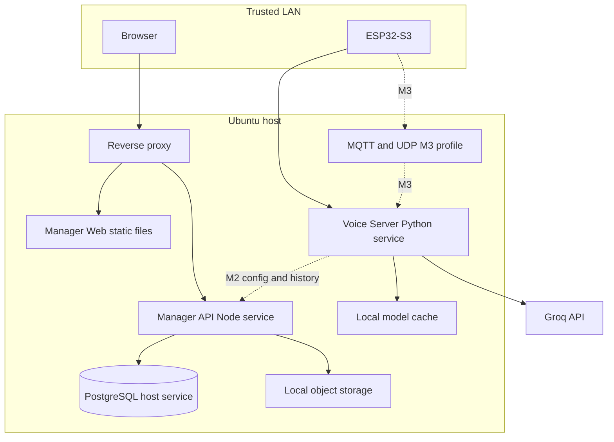
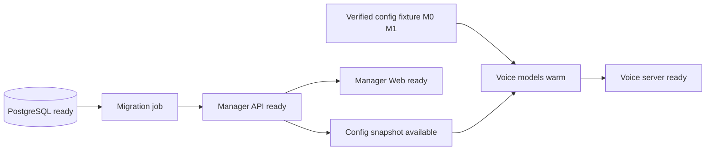

# Deployment local, LAN và resource budget

> Target host đã đo ngày 2026-08-03: Ubuntu 24.04, Intel i5-10300H 4C/8T, RAM 15 GiB usable, swap 4 GiB, GTX 1650Ti 4.096 MiB VRAM, compute capability 7.5.  
> Mục tiêu là tối ưu TTFA và ổn định, không tối đa phần trăm GPU bằng mọi giá.

## 1. Deployment decision

Baseline dùng **host-native deployment trên cùng Ubuntu host**, theo
[ADR-010](ADR/ADR-010-host-native-local-deployment.md):

- `veetee-server`: pinned Python environment dùng host CUDA/ONNX runtime.
- `veetee-manager-api`: Node LTS release artifact chạy bằng service supervisor.
- `veetee-manager-web`: immutable static build do host reverse proxy phục vụ.
- PostgreSQL và reverse proxy: host services, chỉ expose đúng interface cần thiết.
- MQTT broker/UDP listener: host services optional từ M3.

Không dùng Docker, Compose hoặc container runtime trong baseline. Bốn component
vẫn là deployable độc lập; host-native không có nghĩa chạy source tùy ý. Mỗi service
pin artifact/lockfile, env schema, absolute data paths và service unit riêng.

### 1.1 Runtime contract xuyên suốt quá trình

M0 trở đi, các server process được dựng và health-check trong cùng host-native
runtime harness; không chờ đến cuối mới khởi động control plane. Voice Server là
critical data plane và có thể tiếp tục giữ session khi Manager API/Web restart.
Manifest runtime (đường dẫn qua `VEETEE_RUNTIME_MANIFEST`) mô tả command,
working directory, env allow-list, dependency và health URL. Supervisor không nhận
shell string từ UI, không sinh container, không tự đổi provider/model và không log
secret. Readiness report ghi service, config revision, pid, version và lỗi đã
redact.

| Service | Health/readiness | Dependency |
|---|---|---|
| `veetee-server` | `/health/live`, `/health/ready` | model fixture/manager snapshot |
| `veetee-manager-api` | `/health/live`, `/health/ready` | PostgreSQL |
| `veetee-manager-web` | configured static HTTP probe | Manager API (runtime config) |
| PostgreSQL | configured SQL probe | host service |

## 2. Topology



PostgreSQL và model/object directories không bind ra LAN. Browser đi qua reverse proxy; ESP chỉ được mở các port bootstrap/voice cần thiết.

## 3. Service and port plan

| Service | Bind baseline | Port | Exposure | Health |
|---|---|---:|---|---|
| Voice WebSocket + HTTP health | LAN interface | 8000/TCP | ESP subnet | `/health/live`, `/health/ready` |
| Manager API | loopback | 8001/TCP | Qua reverse proxy | `/health/live`, `/health/ready` |
| Manager Web | static directory | n/a | Reverse proxy phục vụ | static asset probe |
| Reverse proxy | LAN interface | 80/443 | Browser subnet | proxy health |
| PostgreSQL | loopback | 5432/TCP | Không expose LAN | `pg_isready` |
| MQTT broker M3 | LAN interface | 1883/8883 TCP | ESP subnet | broker probe |
| UDP audio M3 | LAN interface | 8884/UDP | ESP subnet | protocol synthetic probe |

Port là deployment default có schema, được phép override bằng env; endpoint path public của Veetee dùng `/veetee/v1/`. Compatibility fixtures có thể cấu hình path khác nhưng không được rò vào package/domain/UI naming.

## 4. Host-native service profiles

| Profile | Services | Khi dùng |
|---|---|---|
| `voice-dev` | Voice server host-native + immutable config fixture; không DB/Manager | M0/M1 bring-up và protocol/model benchmark. |
| `core` | PostgreSQL, Manager API, Manager Web, reverse proxy | M2 trở đi, luôn bật cho control plane. |
| `mqtt` | MQTT broker + UDP adapter | M3 sau protocol/loss gate. |
| `observability` | Metrics collector/dashboard | Dev profiling và M4; không bắt buộc M0. |

Service requirements:

- Versioned release directory + atomic `current` pointer; không chạy unpinned
  dependency từ global environment.
- Dependency dựa vào readiness, không dùng fixed sleep.
- Supervisor restart có bounded burst/backoff; không restart loop khi CUDA OOM hoặc
  migration fail.
- Dedicated non-root identity nơi phù hợp; writable directory allowlist và backup
  policy rõ.
- Secret đọc từ owner-only file hoặc OS credential facility; không commit vào env
  file/source/service unit.
- Graceful stop cancel session, drain audit và đóng provider trong deadline; không
  đợi answer vô hạn khi shutdown.
- Foreground dev command chỉ dùng bring-up; M1 soak/M2 daily use phải chạy qua
  service supervisor và journal.

## 5. Environment contract

### 5.1 Voice server

| Variable | Required | Ý nghĩa |
|---|---:|---|
| `VEETEE_VOICE_HOST` | no | Interface bind; default phải explicit theo dev/LAN profile. |
| `VEETEE_VOICE_PORT` | no | Default 8000. |
| `VEETEE_CONFIG_SOURCE` | yes | Enum `fixture|manager`; không auto-switch khi lỗi. |
| `VEETEE_CONFIG_FIXTURE_FILE` | khi `fixture` | Immutable snapshot cùng runtime schema, checksum bắt buộc; M0/M1 only. |
| `VEETEE_MANAGER_API_URL` | khi `manager` | Loopback/private URL của control plane. |
| `VEETEE_MACHINE_TOKEN_FILE` | khi `manager` | Read-only path, không phải token literal. |
| `VEETEE_ALLOW_INSECURE_LOCAL_CONFIG` | dev-only | Chỉ cho phép manager snapshot không bearer khi target là loopback; production MUST để false và dùng machine token. |
| `VEETEE_CONFIG_CACHE_DIR` | khi `manager` | Last-known-good immutable snapshot. |
| `VEETEE_MODEL_CACHE_DIR` | yes | Pinned model artifacts/checksums. |
| `VEETEE_GROQ_SECRET_FILE` | yes khi Groq active | Một production key/secretRef resolution. |
| `VEETEE_LOG_LEVEL` | no | Enum validated. |
| `VEETEE_METRICS_BIND` | no | Loopback mặc định. |

### 5.2 Manager API

| Variable | Required | Ý nghĩa |
|---|---:|---|
| `VEETEE_API_HOST`, `VEETEE_API_PORT` | no | Bind/port. |
| `VEETEE_DATABASE_URL_FILE` | yes | PostgreSQL DSN secret file. |
| `VEETEE_MACHINE_TOKEN_FILE` | yes với PostgreSQL/internal routes | Shared machine bearer file, owner-only `0600`; không đặt token literal trong env. |
| `VEETEE_AUTH_SECRET_FILE` | yes | Session-token hash pepper + CSRF/key derivation material; không phải JWT key baseline. |
| `VEETEE_SECRET_MASTER_KEY_FILE` | khi encrypted-local active | Owner-read master material cho encrypted secret file; không lưu trong DB/browser. |
| `VEETEE_SECRET_STORE_FILE` | khi encrypted-local active | Ciphertext-only local secret file, atomic write, permission 0600. |
| `VEETEE_SESSION_TTL_SECONDS` | no | Absolute session TTL đã validate; cleanup/revoke ở PostgreSQL. |
| `VEETEE_LOGIN_MAX_ATTEMPTS` | no | Số lần login sai tối đa trong một cửa sổ; mặc định 5. |
| `VEETEE_LOGIN_WINDOW_SECONDS` | no | Cửa sổ throttle login; mặc định 300 giây. |
| `VEETEE_LOGIN_LOCKOUT_SECONDS` | no | Thời gian khóa sau khi đạt ngưỡng; mặc định 60 giây. |
| `VEETEE_LOGIN_MAX_BUCKETS` | no | Giới hạn bucket throttle trong process; mặc định 4096. |
| `VEETEE_MACHINE_TOKEN_FILE` | yes khi PostgreSQL/internal runtime | Bearer machine token trong file owner-only `0600`; host supervisor có thể tạo idempotent, không ghi token vào manifest/log. |
| `VEETEE_OBJECT_DIR` | yes | Audio/assets root, path tuyệt đối. |
| `VEETEE_PUBLIC_BASE_URL` | yes | URL qua proxy, không suy từ untrusted Host. |
| `VEETEE_ALLOWED_ORIGINS` | yes | Exact origins, không wildcard với credential. |

Mọi process validate env bằng schema trước bind socket. Không có per-environment config branch; dev/prod khác nhau ở values/profile.
`fixture` và `manager` chỉ là hai adapter của cùng snapshot schema. Release M2+
không được chạy `fixture`; source mismatch/thiếu input làm startup fail, không
fallback sang source còn lại.

`.env` chỉ chứa bootstrap: bind/port, process paths, database/secret-store
locations, machine-auth bootstrap và feature gates. Provider/model/voice/locale,
prompt/personality, endpoint policy, VAD thresholds, device capability và các
selection vận hành không được thêm vào `.env`; chúng được chỉnh trên Manager Web,
validate/probe rồi publish thành snapshot revision.

### 5.3 Groq test keys

Test-only contract:

- Test runner có thể nhận `VEETEE_TEST_GROQ_KEYS_FILE` từ ephemeral secret mount.
- File chứa ordered keys chỉ tồn tại trong test job và permission owner-read.
- Khi key hiện tại trả `429`, **test harness** ghi sanitized event rồi thử ordinal kế tiếp.
- Production binary/config schema không đọc variable này và chỉ nhận một `secretRef`.
- Key không lưu PostgreSQL, browser, artifact, log, trace hoặc test report.

## 6. Model artifact management

Mỗi artifact record phải có:

- Canonical model ID, upstream revision/commit và immutable URL.
- File list, byte size, SHA-256 và license snapshot.
- Conversion tool/version/options nếu tạo ONNX/CTranslate2/TensorRT artifact.
- Supported execution providers, precision, locale, sample rate và stream/cancel capability.
- Benchmark record gắn hardware/driver/runtime version.
- Promotion state: `candidate`, `benchmarked`, `active`, `retired`.

Download/convert diễn ra bằng explicit admin job trước readiness; conversation request không trigger model download. Cache không tự cập nhật theo upstream `main`.

## 7. Baseline resource plan

### 7.1 Nguyên tắc

- Physical VRAM là 4.096 MiB; promotion/admission limit là **total device usage
  ≤ 3.500 MiB**, để lại policy envelope 596 MiB. Không gọi 4.096 MiB là allocatable.
- Steady state chỉ một ASR selection và một TTS selection được load; temporary
  dual generation chỉ được phép trong `BLUE_GREEN` đã qua measured headroom gate.
- VAD chạy CPU, wake word chạy ESP32; không chiếm server VRAM.
- VieNeu realtime path ưu tiên ONNX/CPU nếu benchmark first-audio tốt hơn GPU cho short interactive text.
- GPU chỉ dùng khi **wall-clock TTFA/RTF** tốt hơn và resource peak qua gate; “GPU utilization cao” không phải SLI.
- Model warm trước readiness; không load/unload giữa từng turn.

Resource report phải tách và ghi cùng driver/runtime manifest:

| Lớp | Định nghĩa |
|---|---|
| Physical VRAM | 4.096 MiB phần cứng; không phải budget cấp phát. |
| Driver/runtime reserved | Usage/reservation đo sau display/driver/CUDA allocator init, trước provider load. |
| Measured warm baseline | Total device `memory.used` khi active generation đã warm, idle; đã bao gồm driver/runtime reserved. |
| Allocatable headroom | Promotion limit trừ warm baseline, active-session/workspace reserve và activation margin. |
| Promotion/admission limit | 3.500 MiB total device usage cho exact acceptance profile. |

Không cộng driver/runtime reserve lần hai vào warm baseline. Snapshot một thời điểm
hoặc manifest resource hint không đủ để tính headroom; benchmark phải sample peak
qua repeated warm/turn/activation runs.

### 7.2 Resource envelope

Các số dưới là **reservation để thiết kế**, không phải benchmark đã đạt; measured peak sẽ thay thế trong model manifest trước M0/M1 promotion.

| Hạng mục | Device | Reservation | Lifecycle |
|---|---|---:|---|
| Silero VAD ONNX | CPU/RAM | 64 MiB RAM | Process resident. |
| PhoWhisper-small selected | CUDA FP16 | ~2.000 MiB VRAM proxy; gate ≤ 2.500 MiB, 1.500 MiB RAM reserve | Process resident; tự convert pinned CTranslate2 artifact. |
| Zipformer challenger | CPU hoặc CUDA EP | ≤ 1.000 MiB RAM/VRAM design reserve | Unloaded; design-time bakeoff, chưa đủ license/Vi benchmark để select. |
| VieNeu v3 Turbo ONNX INT8 | CPU/RAM | 0,5–0,9 GiB estimate; reserve 1.000 MiB RAM, 0 VRAM | Process resident cho realtime. |
| Speaker encoder/denoiser | CPU/RAM | 512 MiB RAM | Lazy cho enrollment/cloning workflow, không nằm turn baseline. |
| Opus/resampler/queues | CPU/RAM | 256 MiB RAM | Bounded per admitted sessions. |
| Python runtime/providers | CPU/RAM | 1.000 MiB RAM | Process resident. |
| Manager API + Web + proxy | CPU/RAM | 768 MiB RAM | Host services/static assets; process pools bounded. |
| PostgreSQL | CPU/RAM | 768 MiB RAM | Host service; pool/shared buffers bounded và benchmark. |
| OS/desktop | RAM | ≥ 5 GiB RAM | Không cấp cho Veetee. |
| GPU policy envelope | VRAM | 596 MiB giữa physical 4.096 và promotion limit 3.500 MiB | Không cấp cho model; driver/runtime vẫn được đo trong total usage. |

### 7.3 Runtime promotion gate (đã có host-side)

Một published snapshot có thể mang `resourceBudget` như một **benchmark
artifact** (không phải provider hint và không phải giá trị tự đo trong lúc hội
thoại):

```json
{
  "resourceBudget": {
    "physicalVramMiB": 4096,
    "promotionLimitMiB": 3500,
    "measuredWarmBaselineMiB": 1200,
    "candidatePeakDeltaMiB": 900,
    "candidateWarmPeakMiB": 1800,
    "sessionWorkspaceReserveMiB": 256,
    "activationMarginMiB": 128
  }
}
```

`veetee_server.resources` validate toàn bộ record trước khi tạo
`ProviderRegistry`. `allocatableHeadroomMiB` được tính bằng promotion limit
trừ warm baseline, session workspace reserve và activation margin. Nếu peak delta
của candidate nằm trong headroom, runtime chọn `BLUE_GREEN`; nếu không nhưng
generation mới đứng riêng vẫn vừa budget, runtime chỉ chọn `QUIESCE_SWAP` sau khi
mọi session lease của generation cũ đã về zero. Candidate không vừa cả hai mode bị
từ chối typed trước CUDA/model allocation và giữ last-known-good generation.

Quiesce failure đóng candidate, rồi reload đúng snapshot cũ; nếu rollback cũng
thất bại, readiness vẫn failed thay vì tự chọn provider khác. Snapshot không có
`resourceBudget` vẫn được parse để giữ compatibility với fixture cũ, nhưng không
được coi là bằng chứng promotion VRAM. Manager/API chưa hiển thị field này như một
form owner-facing; operator chỉ publish benchmark record đã đo cho exact
artifact/runtime/hardware profile.

Baseline preferred combination là Silero CPU + PhoWhisper-small CUDA FP16 + VieNeu v3 Turbo ONNX CPU + on-device wake. Zipformer chỉ có thể thay selection sau license/provenance/accuracy/latency bakeoff; không là runtime fallback. Vì vậy ASR có toàn bộ GPU headroom; TTS không tranh 4 GB VRAM trong short-turn path.

### 7.4 Admission

Resource arbiter tính trước:

```text
allocatable_headroom = promotion_limit
                     - measured_warm_baseline
                     - admitted_session_workspace_reserve
                     - activation_margin

projected_total = measured_warm_baseline
                + new_operation_or_generation_peak_delta
                + admitted_session_workspace_reserve
                + activation_margin
```

`measured_warm_baseline` là total device usage và đã gồm driver/runtime; công thức
không cộng cùng usage hai lần. `activation_margin` lấy từ repeat-run variance và
pin trong benchmark/config record. Nếu `projected_total > 3.500 MiB`, session mới
nhận `server_busy` có retry hint hoặc activation bị reject trước CUDA allocation;
không thử OOM rồi retry. Concurrency ban đầu là một active speaking/thinking turn;
tăng chỉ sau capacity benchmark.

## 8. Model load/unload policy

| Model/component | Default policy | Lý do |
|---|---|---|
| WakeNet/AFE | Firmware resident | Luôn sẵn wake, không dùng network/host GPU. |
| Silero VAD | Host resident | Nhỏ, cold load không đáng đổi lấy complexity. |
| Selected ASR | Host resident sau warm | Nằm TTFA critical path. |
| VieNeu realtime core | Host resident sau warm | First PCM nằm TTFA critical path. |
| Alternative ASR/TTS | Unloaded | Không fallback; chỉ load khi config revision activate. |
| Speaker enrollment/denoise | Lazy admin job | Không được tranh resource với live turn. |
| Local LLM | Không cài baseline | Groq đã được chọn; 4 GB dành cho audio/headroom. |

Config switch có hai mode, do resource arbiter chọn từ exact measured record:

| Mode | Flow | Availability |
|---|---|---|
| `BLUE_GREEN` | Validate → reserve headroom → load/warm/probe new khi old còn active → atomic activate → drain/unload old | Old generation giữ readiness; expected downtime bằng 0. New fail thì unload new và giữ old active. |
| `QUIESCE_SWAP` | Validate → đóng admission/readiness → drain hoặc cancel old leases trong bounded deadline → unload old → verify release baseline → load/warm/probe new → atomic activate | Có measured degraded/downtime interval; connection/turn mới nhận maintenance/retry behavior thay vì vào provider chưa ready. |

Blue-green chỉ hợp lệ khi measured candidate load/warm peak delta
`≤ V_allocatable_headroom`. Headroom đã trừ old warm baseline, active-session
reserve và activation margin nên không cộng các phần này lần hai.
Nếu không đủ dual residency nhưng old và new riêng lẻ đều dưới promotion limit,
phải dùng quiesce-swap; nếu new riêng lẻ cũng không vừa thì reject trước quiesce.

Trong quiesce-swap, load/warm/probe new fail kích hoạt rollback theo đúng thứ tự:

1. Unload failed new generation và verify task/thread/fd/RAM/VRAM release.
2. Reload/warm/probe exact pinned old generation từ immutable artifact/checksum.
3. Chỉ mở readiness/admission khi old probe pass; ghi toàn bộ degraded interval.
4. Nếu old reload fail, giữ liveness nhưng readiness non-ready và alert operator;
   không load provider/config thứ hai.

Không hot-switch provider giữa một turn. Activation record bắt buộc có mode,
old/new revision, readiness transitions, quiesce/load/warm/unload duration, peak
resource, downtime/degraded interval và rollback result. Đây là transactional
config rollback, không phải runtime provider fallback; canonical lifecycle ở
[ADR-007](ADR/ADR-007-provider-registry-lifecycle.md).

## 9. Host-native runtime installation

### 9.1 Host-native voice

- Pinned Python interpreter/environment lock.
- ONNX Runtime/CUDA/TensorRT build phải ghi exact version và execution provider list khi boot.
- Process chạy dưới dedicated user, read-only model cache sau provision, write access chỉ config cache/spool.
- User service/supervisor đặt `Restart=on-failure`, bounded burst và graceful stop.
- CPU affinity/thread count benchmark trên i5 4C/8T; không để ONNX + BLAS oversubscribe toàn bộ threads.

### 9.2 Manager API host service

- Current supported Node LTS, exact lockfile và compiled release artifact; stable
  service không chạy TypeScript source/watch mode.
- Service bind loopback, chạy non-root, có explicit working directory/env schema,
  journal log và graceful shutdown.
- DB migration chạy one-shot command trước API readiness; lock bảo đảm chỉ một
  migrator, failure giữ API non-ready.
- Job worker concurrency/CPU priority có bound để không tranh realtime voice.

### 9.3 Manager Web và reverse proxy

- Vue/Vite production build là immutable static directory có content hash; publish
  bằng atomic release switch và giữ previous release để rollback.
- Host reverse proxy phục vụ SPA fallback, proxy `/api/v1` và `/internal` không
  được public; secret-bearing API response không cache.
- Web không cần Node SSR process. Proxy config được syntax-check trước reload.

### 9.4 PostgreSQL và data directories

- PostgreSQL của Veetee dùng host-native binary với pinned supported major/minor
  policy, bind loopback `127.0.0.1:55432`, database `veetee_vubq` và data
  directory riêng của project. Không dùng listener `5432`, database hoặc data
  directory của project khác.
- DB data, object store, model cache, config cache và release artifact là các
  absolute directory riêng; source tree không phải data directory.
- Object directory tách DB data để backup manifest/checksum rõ; permission test
  chứng minh API chỉ ghi đúng path cần thiết. File DSN bootstrap là owner-read
  và không được commit.

## 10. LAN exposure

### 10.1 Addressing

- DHCP reservation/static lease cho host; không nhúng IP vào firmware source.
- OTA/bootstrap trả endpoint từ deployment config.
- Có thể dùng local DNS/mDNS name, nhưng firmware vẫn có resolved-IP/reconnect tests.
- Firewall allow voice TCP từ ESP subnet, web proxy từ trusted user subnet; deny DB/metrics/model ports.

### 10.2 TLS rollout

- M0/M1 cho phép `ws://` trên isolated trusted dev LAN để giảm certificate bring-up risk; token vẫn bắt buộc khi auth mode bật.
- Trước remote/untrusted LAN, chuyển `wss://` với certificate chain/pin được firmware tin cậy và reverse proxy terminate TLS.
- Không expose public Internet chỉ bằng router port-forward. Public access cần threat model, rate limit và explicit deployment ADR.
- MQTT M3 ưu tiên TLS control; UDP audio giữ exact session AES-CTR contract và firewall scope.

### 10.3 Connectivity acceptance

Từ cùng ESP subnet phải chứng minh:

1. DNS/name hoặc IP resolve đúng.
2. TCP WebSocket upgrade tới host và headers được giữ nguyên qua proxy nếu dùng proxy.
3. Firewall không làm idle connection timeout sớm.
4. MQTT TCP + UDP hai chiều hoạt động ở M3; test cả NAT/reorder/loss profile.
5. Reconnect không tạo hai active device session.

## 11. Health, readiness và startup order



`FIX` và `SNAP` là hai explicit `ConfigSource`, không chạy fallback qua lại. M0/M1
chỉ cần nhánh fixture → models → voice; M2+ dùng nhánh control plane.

- Liveness chỉ nói process/event loop còn sống.
- Readiness nói có thể nhận **new** work, gồm DB/model/config checks liên quan.
- Degraded status giữ structured reasons; HTTP 200 liveness không đồng nghĩa provider ready.
- Voice server có thể start từ last-known-good snapshot khi Manager API tạm down, nhưng báo cache age/revision.
- Blue-green giữ ready bằng old generation tới atomic swap. Quiesce-swap và
  rollback reload trả non-ready trong toàn interval; không mở admission chỉ vì
  model object đã load trước khi representative probe pass.

## 11.1 Tailscale Serve private HTTPS

Tailscale là lớp truy cập riêng cho việc kiểm tra, không phải cách đổi Wi-Fi hay
route của máy. Người dùng phải cài/đăng nhập Tailscale trước; AI không tự chạy
`tailscale up`, không tạo AP/captive portal và không dùng Funnel/public exposure.

Sau khi operator xác nhận `tailscale status` đã có tailnet, reverse proxy hoặc
configured web listener được expose bằng `tailscale serve`. Port và local target
đọc từ environment, còn hostname thật phải lấy từ output `tailscale serve status`:

```bash
tailscale serve --https=${VEETEE_TAILSCALE_PORT} http://${VEETEE_BIND_HOST}:${VEETEE_WEB_PORT}
tailscale serve status
```

Runtime canonical hiện tại dùng **một private origin**, sau khi operator yêu cầu
loại bỏ hostname/mapping cũ:

| Public URL trong tailnet | Local target | Vai trò |
|---|---|---|
| `https://veetee.tail52a635.ts.net/` | `127.0.0.1:18181` | Manager Web |
| `https://veetee.tail52a635.ts.net/api/v1/...` | Vite proxy → `127.0.0.1:18101` | Manager API |
| `https://veetee.tail52a635.ts.net/openapi.json` | Vite proxy → `127.0.0.1:18101` | Manager API contract |
| `wss://veetee.tail52a635.ts.net/veetee/v1/` | Vite WebSocket proxy → `127.0.0.1:18100` | Voice Server |

Đây là phân bổ URL cố định để người dùng và các client không phải tự đoán port:

| Môi trường | Manager Web | Manager API | Voice Server |
|---|---|---|---|
| Local trên host | `http://127.0.0.1:18181/` | `http://127.0.0.1:18101/api/v1/` | `ws://127.0.0.1:18100/veetee/v1/` |
| Tailnet private | `https://veetee.tail52a635.ts.net/` | `https://veetee.tail52a635.ts.net/api/v1/` | `wss://veetee.tail52a635.ts.net/veetee/v1/` |

`/` là UI; `/api/v1/` và `/openapi.json` đi qua proxy tới Manager API;
`/veetee/v1/` là WebSocket tới Voice Server. Không mở trực tiếp API/Voice
port ra tailnet, không tạo subdomain `api.*`/`voice.*`, và không dùng
hostname cũ trong client hoặc runtime config. API production phải đưa cả hai
origin local và origin tailnet ở trên vào `VEETEE_ALLOWED_ORIGINS`; không dùng
wildcard khi credentials/cookie được bật.

Hostname hiện tại lấy từ `tailscale status`: `veetee.tail52a635.ts.net`; hostname
và Serve/Funnel mapping cũ đã được loại bỏ, không còn
public Funnel. `/veetee/v1/` là route tương thích ổn định; profile wire mặc
định vẫn là WebSocket v3 (`Protocol-Version: 3`) và server không silent
downgrade. Probe từ chính host có userspace Tailscale không tự route được tới
địa chỉ tailnet của chính nó và có thể timeout; cần một peer tailnet khác để
xác nhận TLS/HTML/API/WebSocket thực tế. Không coi self-route timeout là lỗi
Manager Web. ESP32 không có Tailscale client nên vẫn dùng endpoint LAN
`ws://<host-lan-ip>:18100/veetee/v1/`, không dùng dashboard HTTPS hostname.

Không tạo hostname con kiểu `api.veetee.tail52a635.ts.net` hoặc
`voice.veetee.tail52a635.ts.net`: MagicDNS/Tailscale certificate hiện chỉ cấp
cho node `veetee`. Path routing cùng origin giữ cookie/CORS đơn giản và không
phải mở thêm port trên tailnet.

Không hard-code `tail*.ts.net` trong firmware, UI hoặc docs runtime. Checklist:

1. `tailscale status` chỉ ra interface/peer trong tailnet dự kiến.
2. `tailscale serve status` chỉ có HTTPS Serve, không có Funnel.
3. `curl -fsS https://<domain-tu-status>/<health-path>` trả readiness.
4. Chỉ đổi endpoint ESP32 khi người dùng yêu cầu; không sửa NetworkManager,
   Wi-Fi, default route hoặc interface host.

Nếu binary chưa cài hoặc tailnet chưa enable, giữ LAN/loopback deployment và ghi
trạng thái blocked trong runtime note; không cài tự động để tránh thay đổi mạng.

## 12. Observability trên host

### Bắt buộc

- Process/service CPU, RSS, fd, restart count.
- GPU memory/utilization/temperature/power và CUDA errors.
- Physical/driver-runtime/warm-baseline/allocatable/promotion VRAM measurements;
  không gộp chúng thành một “free VRAM” metric.
- Model load/unload/warm time, active revision, activation mode, readiness
  transition, degraded interval và rollback result.
- Event-loop lag, session/task count, queue age/drop.
- TTFA waterfall, TTS RTF, ASR finalization, Groq 429/first token.
- Disk free, DB/object size, retention job và backup age.

Metric label không chứa device MAC đầy đủ, transcript, prompt, secret hoặc raw session UUID. Log dùng correlation ID opaque và Pino/Python JSON redaction tương đương.

### Resource verification commands

Các command dưới chỉ là acceptance probes, không phải service implementation:

```bash
nvidia-smi --query-gpu=name,memory.used,memory.total,utilization.gpu --format=csv
free -h
ps -o pid,rss,%cpu,cmd -C python3 -C node
ss -lntup
```

Benchmark runner phải sample theo thời gian và lưu peak/p50/p95; một ảnh chụp `nvidia-smi` không chứng minh budget.

## 13. Backup và restore

Backup generation gồm:

1. PostgreSQL consistent dump/snapshot.
2. Object store manifest: key, byte size, checksum, retention class.
3. Active config revision/checksum và model artifact manifest, nhưng không copy secrets vào bundle thường.
4. Firmware/assets release manifest.

Restore test phải chạy trên clean namespace, verify foreign keys/checksums, boot Manager API và cho voice server load đúng revision. Backup chưa restore thử không được coi là backup đạt chuẩn.

## 14. Upgrade và rollback

- Bốn deployable version độc lập nhưng publish compatibility matrix.
- Database migration forward-only kèm restore rehearsal; breaking API cần new `/api/vN`.
- Protocol extension additive; server giữ parsers đã công bố trong support window.
- Model update là config/artifact revision, không tự follow upstream.
- Firmware OTA giữ last-known-good partition và không erase NVS trừ explicit migration.
- Rollback app không rollback user data mù; migration/data compatibility phải ghi trong release manifest.

## 15. Security and secret checklist

- [ ] Service users không chạy root; file/directory permission tối thiểu.
- [ ] PostgreSQL/metrics/model server không bind LAN.
- [ ] Exact CORS origins; auth cookie/token flags đúng transport.
- [ ] Authorization, cookies, API keys, secretRefs và provider config fields được redact.
- [ ] Device token và machine token là hai trust domains.
- [ ] Groq production chỉ một key; test list không tồn tại ngoài test job.
- [ ] Audio recording off mặc định, retention/consent hiển thị khi bật.
- [ ] UDP session keys không log/reuse; packet size/sequence validate trước decrypt/decode.
- [ ] Public exposure chưa được phép ở baseline.

## 16. Promotion gates

### Model/provider revision

- Exact artifact/runtime/hardware record có warm baseline, activation peak,
  per-session workspace, variance-derived margin và projected total ≤ 3.500 MiB.
- `BLUE_GREEN` fault test unload failed candidate mà old generation vẫn ready;
  `QUIESCE_SWAP` fault test reload exact old generation và đo downtime/degraded interval.
- Failed rollback giữ non-ready và chứng minh secondary-provider call count bằng 0.
- Deterministic long-text fixture tạo ≥ 30 phút audio qua
  segmenter → VieNeu → resampler → Opus → paced egress, không mất/đảo dữ liệu và
  không tăng queue/RSS đơn điệu.
- Groq single-response/continuation là capability gate riêng chỉ được bật sau live
  probe exact model ID; deterministic pipeline soak không được dùng để suy ra
  capability này.

### Host runtime/driver upgrade

- Python/Node/PostgreSQL/CUDA/ONNX candidate được stage trong versioned environment,
  không upgrade in-place giữa acceptance run.
- Build/contract tests pass; Lab E2E TTFA/RTF không regression quá 5%.
- Cancellation cleanup, peak VRAM, cold start và restore rehearsal không xấu hơn.
- Driver/runtime manifest reproducible sau reboot; rollback không cần xóa data.

### WebSocket v3 → MQTT/UDP v3 default

- Protocol conformance và crypto fixtures pass.
- TTFA/jitter/loss recovery tốt hơn có ý nghĩa.
- 24 giờ soak không leak/reconnect storm.
- Operator error rate và firewall setup chấp nhận được.
- ADR mới ghi measured data; nếu không đạt, MQTT vẫn optional.

### Tăng concurrency

- Peak resource + safety margin nằm trong budget.
- p95 TTFA và time-to-silence không regression quá threshold đã duyệt.
- Admission từ chối sạch thay vì OOM/thrash.
