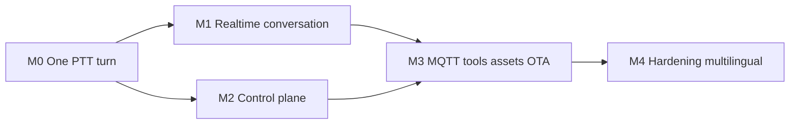

# Lộ trình M0 → M4

> Milestone là vertical slice có thể chạy và đo, không phải danh sách module “đã viết”. Có thể báo % tiến độ nếu hữu ích, nhưng % không thay Definition of Done và không được gắn lịch/ngày hoàn thành cho từng phần. Mọi mốc tạo evidence bundle gồm config revision, model hashes, logs đã redact, metrics và test report; commit ID chỉ để truy vết nếu operator muốn, không yêu cầu branch/PR.

## 1. Quy tắc chung

- Không kéo tính năng M3/M4 vào critical path của M0.
- Không pass chỉ vì unit test xanh; mỗi milestone có physical acceptance trên ESP32 thật.
- Host/serial/network evidence và điều người dùng phải nghe/nhìn/chạm được ghi thành hai nhóm riêng.
- Protocol fixture, schema và ADR đã duyệt là source of truth cho AI coding workflow.
- Provider/model chỉ được promote sau license, artifact hash, resource và latency gate; không automatic fallback.
- Lỗi acceptance phải có reproduction + artifact; không sửa timing/hardware workaround bằng suy đoán.

## 2. M0 — ESP32 nói được một câu qua server tự viết

**Scope gate:** đây là vertical slice nhỏ nhất của sản phẩm; milestone chỉ pass
bằng DoD/evidence bên dưới và không gắn estimate theo ngày hoặc tuần.

### Chạy được cái gì

> **ESP32 nói được 1 câu qua server tự viết.**

Vertical slice duy nhất:

```text
Giữ PTT → mic → Opus → Direct WS v3 → VAD/ASR
→ Groq streaming → một semantic segment → VieNeu
→ Opus → ESP32 speaker
```

M0 dùng direct WS v3 ngay từ đầu vì đây là product default đã chọn trong
[ADR-001](ADR/ADR-001-wire-transport-compatibility.md): header 4 byte có type và
payload length để validate, trong khi vẫn chỉ cần một connection trên LAN. Firmware
tham chiếu đã định nghĩa framing v3 (`references/xiaozhi-esp32/main/protocols/protocol.h:10-31`,
`references/xiaozhi-esp32/main/protocols/websocket_protocol.cc:24-53`). `ws-v1-compat`
được implement/test bằng adapter riêng để nối peer tham chiếu; nó không nằm trên
vertical slice Veetee-to-Veetee và không được dùng làm silent fallback.

### Scope

- Một board/codec/mic/speaker đã chốt pin map.
- PTT manual start/stop; không wake, barge-in acoustic, manager UI hoặc MQTT.
- `hello`, binary Opus v3, `listen`, `stt`, `tts`, `llm`, `abort` tối thiểu.
- Một immutable config fixture local dùng đúng runtime snapshot schema + checksum,
  bind acceptance device; một active provider mỗi VAD/ASR/LLM/TTS.
- Groq key duy nhất trong production-like run; test key sequence chỉ ở test harness.
- Timestamp TTFA stage cơ bản, queue bounded và cleanup khi disconnect.

### Definition of Done

- [ ] `veetee-firmware` build sạch cho ESP32-S3 N16R8 và flash không xóa NVS ngoài ý muốn.
- [ ] Protocol golden tests xác nhận WS v3 header/type/length và exact JSON semantics.
- [ ] Serial cho thấy `idle → connecting → listening → speaking → idle` không có invalid transition.
- [ ] Transcript tiếng Việt đúng nội dung câu acceptance đã định trước.
- [ ] Speaker phát được câu trả lời đầu tiên, không cắt đầu/đuôi và người dùng xác nhận nghe được.
- [ ] 30 turn liên tiếp không reboot, deadlock, queue growth hoặc stale audio sau abort.
- [ ] Có baseline TTFA p50/p95, cold/warm tách riêng; M0 chưa bị fail chỉ vì chưa đạt target cuối.
- [ ] Không có secret/token/raw authorization trong evidence logs.

### Explicitly deferred

Wake word, acoustic barge-in, tools, history, database, Manager API/Web, MQTT/UDP,
OTA và multi-language UI. `ws-v1-compat` conformance có thể hoàn thiện trong M1;
không được thay product default để rút ngắn M0.

## 3. M1 — Realtime conversation tự nhiên

### Chạy được cái gì

- Direct WebSocket v3 Veetee-to-Veetee được harden; server pass conformance v1/v2/v3.
- WakeNet on-device, PTT, click interrupt, voice exit và acoustic barge-in.
- Groq tool calling loop với ít nhất một safe device MCP tool.
- VieNeu frame/segment streaming; không đợi full LLM response.
- Configurable base prompt, personality, locale, voice và progress acknowledgment.
- Answer dài và session ≥ 60 phút với keepalive/backpressure/cancellation.

### Definition of Done

- [ ] Cross-conformance matrix trong `03-protocol-spec.md` pass hai chiều cho profile tương ứng.
- [ ] Warm Lab E2E TTFA p95 < 1.500 ms, p50 ≤ 900 ms trên LAN corpus đã version hóa; Operational TTFA báo riêng.
- [ ] Button và acoustic barge-in time-to-silence p95 ≤ 250 ms.
- [ ] Fault injection tại mọi stage cho 0 stale audio frame sau cancellation barrier.
- [ ] Wake false accept/false reject và endpoint latency được báo theo test corpus; threshold lưu config.
- [ ] 60 phút conversation soak không có monotonic RSS/VRAM/queue growth.
- [ ] Deterministic long-text fixture được phát thành ≥ 30 phút audio hoặc bị user
  abort, không tăng memory/queue theo thời lượng. Giới hạn output/continuation của
  Groq chỉ pass sau Q-005 probe exact model; output thật không được silent truncate.
- [ ] Core scan không có literal localized progress/exit/personality.

## 4. M2 — Control plane dùng được hằng ngày

### Chạy được cái gì

- Fastify Manager API + PostgreSQL migrations + OpenAPI 3.1.
- Vue dashboard: assistant cards/search/status/create; pair/add/unlink device;
  role/model/memory cùng speaker/extensions deferred-state tabs. Speaker
  enrollment và extension activation thật vẫn thuộc M3 hoặc tài liệu riêng.
- Provider installation/config/selection từ manifest + JSON Schema; một active selection/kind, không fallback.
- Versioned draft/publish config, secretRef redaction, voice preview.
- Conversation/session list, transcript, tool/latency detail và retention notice; audio recording vẫn off mặc định.

### Definition of Done

- [ ] OpenAPI lint/contract tests pass; mọi route có request/response/error schema.
- [ ] Stale `If-Match` không overwrite config; publish là atomic revision.
- [ ] Voice server tiếp tục turn khi Manager API restart và áp revision mới ngoài critical path.
- [ ] Provider fault test không gọi provider thứ hai.
- [ ] Secret canary không xuất hiện trong API response, browser storage, log hoặc audit diff.
- [ ] Keyboard-only, focus, label, contrast và error summary pass accessibility acceptance cho critical flows.
- [ ] UI có loading/empty/error/stale/offline state cho mọi route chính.

## 5. M3 — Transport, hardware và provisioning nâng cao

### Chạy được cái gì

- MQTT control + AES-CTR UDP audio v3, không qua silent protocol conversion.
- So sánh WebSocket v3 và MQTT/UDP v3 bằng latency/loss/soak; chỉ promote default nếu gate tốt hơn.
- MCP tools: RGB LED, OLED, IR blaster, mmWave, MQTT/Home Assistant với safety/permission/audit.
- Firmware asset wizard: chip/display, wake mode, font/subtitle, preview và `assets.bin` generation.
- Device firmware metadata, OTA policy/toggle và signed artifact checks.
- Speaker enrollment từ recent clean sample.

### Definition of Done

- [ ] Golden byte fixtures pass cho MQTT topics/control JSON và UDP header/encryption/sequence.
- [ ] Test 0%, 1%, 5% packet loss + reorder/duplicate không crash, leak key hoặc deadlock.
- [ ] Transport promotion ADR có TTFA, jitter, recovery và operational error data; nếu không thắng thì WebSocket vẫn default.
- [ ] MCP descriptor phản ánh đúng phần cứng; unavailable peripheral không được quảng bá.
- [ ] Destructive/high-risk tool yêu cầu policy/confirmation; duplicate request không lặp mutation ngoài idempotency contract.
- [ ] `assets.bin` checksum/reproducibility test pass cho cùng input revision.
- [ ] OTA interrupted/corrupt image quay về firmware hợp lệ.

## 6. M4 — Hardening và mở rộng

### Chạy được cái gì

- Locale thứ hai đi xuyên config, ASR/LLM/TTS capability và UI catalog.
- Backup/restore, retention jobs, metrics dashboard, alerting và resource regression gates.
- Multi-device concurrency theo capacity đã chốt; admission control thay vì OOM.
- Release/rollback firmware, server, manager và config revision độc lập.
- Security hardening cho LAN/TLS, device token rotation, audit export và privacy controls.
- Các tính năng deferred chỉ bắt đầu sau tài liệu riêng được duyệt.

### Definition of Done

- [ ] Locale conformance chứng minh core không branch theo Vietnamese literals.
- [ ] Capacity test đạt số session đồng thời đã chốt trong `11-open-questions.md` mà không vượt budget.
- [ ] Backup restore rehearsal khôi phục DB/object checksums/config active revision.
- [ ] Dependency/model vulnerability/license inventory được pin trong release evidence.
- [ ] 24 giờ soak không có leak, stuck session hoặc unbounded metric cardinality.
- [ ] Rollback từng deployable không buộc xóa user data/NVS.

## 7. Dependency map



Roadmap chỉ định dependency và acceptance gate; model có thể thực hiện tuần tự hoặc
phối hợp các phần độc lập khi contract đã khóa. Không cần chia branch/worktree;
% tiến độ là optional và không có lịch ngày theo milestone. M3 không được đưa vào M0 chỉ để “đủ feature”, vì
gateway/UDP/assets/OTA làm tăng failure surface mà không chứng minh vertical slice
đầu tiên.

## 8. Evidence bundle chuẩn

Mỗi milestone phải xuất một thư mục hoặc CI artifact có:

1. `manifest.json`: board, firmware build, model/provider revisions, config checksum (commit ID nếu operator muốn truy vết).
2. `tests/`: unit, contract, conformance, integration và physical checklist.
3. `metrics/`: TTFA stages, time-to-silence, queue age/drop, CPU/RAM/VRAM.
4. `logs/`: structured và redact; correlation `session_id`/`turn_id`, không chứa secret.
5. `media/`: optional short audio/video evidence có consent; không thay physical sign-off.
6. `known-limitations.md`: failure còn mở và milestone được phép chấp nhận hay không.
