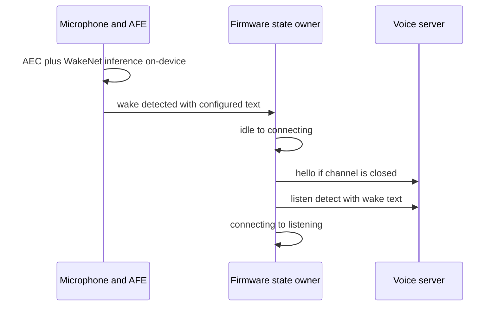

# ADR-005: Wake word chạy on-device bằng ESP-SR

## Status

Accepted — 2026-08-03.

## Context

Robot phải thức bằng wake word, phản hồi nhanh, không stream microphone liên tục
lên server và vẫn cho phép interrupt khi loa đang phát. ESP32-S3 N16R8 có 8 MiB
PSRAM; thiết kế dành budget cho một AFE chung với WakeNet và chỉ accept khi resource
gate đo thực tế đạt. Custom phrase có thể dùng MultiNet asset.

Firmware tham chiếu trên S3 dùng một `AfeAudioEngine`: WakeNet/MultiNet và uplink
voice cùng chia sẻ một FD AFE instance
(`references/xiaozhi-esp32/main/audio/README.md:8-30`). AFE được cấu hình dựa trên
mic/reference channels, bật AEC khi có reference, đặt model memory vào PSRAM và
tạo fetch task riêng
(`references/xiaozhi-esp32/main/audio/engines/afe_audio_engine.cc:110-177`). Khi
đang phát, AEC có thể tiếp tục để giữ speaker reference và wake detection
(`references/xiaozhi-esp32/main/audio/README.md:47-50`).

Backend snapshot không suy luận acoustic wake word cho ESP32; nó chỉ nhận
`listen/detect` đã thành text và xử lý như wake invocation
(`references/xiaozhi-esp32-server/main/xiaozhi-server/core/handle/textHandler/listenMessageHandler.py:55-115`).

## Decision drivers

- Wake latency không phụ thuộc Wi-Fi/server/GPU.
- Không gửi ambient microphone 24/7.
- Không chiếm server session khi device đang idle.
- Barge-in khi speaker đang phát phải có AEC reference gần hardware.
- Wake phrase/language/threshold đến từ signed asset/config, không hardcode.
- PTT vẫn hoạt động độc lập nếu wake model lỗi.

## Options considered

### Option A — WakeNet on-device, optional MultiNet asset

Ưu điểm:

- Latency và privacy tốt nhất; không cần network ở idle.
- Tích hợp trực tiếp AFE/AEC và speaker reference.
- Server chỉ nhận event wake và audio sau khi đã đánh thức.

Nhược điểm:

- Tốn flash/PSRAM/CPU trên S3.
- Cần tune false accept/false reject trên giọng Việt và môi trường thực.
- Custom phrase bị giới hạn bởi model/toolchain hỗ trợ trên device.

### Option B — Wake word server-side

Ưu điểm:

- Có thể dùng model lớn và cập nhật không cần OTA asset.
- Firmware đơn giản hơn ở phần detector.

Nhược điểm:

- Phải stream mic liên tục, tốn băng thông và tạo privacy/availability dependency.
- Wake latency phụ thuộc Wi-Fi, queue server và model load.
- Server phải giữ session cho mọi device idle.

### Option C — Chạy đồng thời on-device và server-side

Ưu điểm:

- Có thể dùng server làm secondary detector/analytics.

Nhược điểm:

- Gấp đôi lifecycle, dễ duplicate wake và vẫn chịu privacy/bandwidth của Option B.
- Khó xác định detector nào sở hữu state transition và interrupt.

## Decision

Chọn **Option A**.

1. Default detector là WakeNet trong một AFE on-device duy nhất.
2. Custom wake word MAY dùng MultiNet được đóng gói trong signed assets; model,
   BCP-47 locale, display text và threshold đến từ asset manifest/config.
3. Idle mode không stream microphone. Sau detection, firmware mở/kiểm tra audio
   channel; nếu optional wake pre-roll được bật thì gửi cached Opus có bound trước,
   rồi gửi ngay `listen/detect`. Server chỉ attach buffer khi detect đến đúng cửa sổ.
4. Khi speaking, AFE giữ speaker reference/AEC và detector cần thiết để wake word
   có thể tạo `abort reason=wake_word_detected` trước turn mới.
5. Detector init/model validation fail sẽ disable wake feature, báo diagnostic và
   giữ PTT; **không** tự chuyển sang server-side wake.
6. Câu wake, localized status và response không nằm trong product code.
7. Không có provider fallback trong scope hiện tại.

### Implementation gate (2026-08-03)

Lựa chọn on-device đã qua gate model-init trên ESP32-S3. Panic
`StoreProhibited` ở probe đầu tiên được truy nguyên về việc firmware tắt hoàn toàn
Octal PSRAM trong khi ESP-SR/WakeNet cần PSRAM; không phải do phrase hay threshold.
Sau khi bật `CONFIG_SPIRAM`, `CONFIG_SPIRAM_MODE_OCT`, tốc độ 80 MHz và reserve
internal phù hợp, build/flash model `wn9_computer_tts` đã khởi tạo thành công.
Serial xác nhận 8 MiB PSRAM, `Successfully load srmodels`, manifest phrase
`Computer`, `veetee-wake: ready model=wn9_computer_tts`, LCD 240x280, Wi-Fi profile
từ NVS và WebSocket v3/server hello; không có panic. Evidence chi tiết nằm ở
`docs/implementation-notes/M1.md`.

Gate còn lại là physical recognition: phát audio phrase, đo false reject/accept,
shared AFE/AEC/noise suppression và acoustic barge-in. Cho tới khi gate này pass,
PTT vẫn là đường fallback; nếu runtime model init lỗi, firmware disable wake có
kiểm soát và báo diagnostic, không tự chuyển sang server-side wake. Flash không
erase NVS và không đổi Wi-Fi host.

## Runtime contract

Owner rules:

- Audio/AFE task chỉ phát event `{model_id, phrase_id, confidence, monotonic_ts}`;
  application main task sở hữu state transition và network command.
- AFE enable/disable/reset chỉ chạy trong fetch-owner task. Reference defer reset
  và WakeNet/AEC toggles để tránh concurrent fetch làm corrupt ring buffer
  (`references/xiaozhi-esp32/main/audio/engines/afe_audio_engine.cc:282-307`,
  `references/xiaozhi-esp32/main/audio/engines/afe_audio_engine.cc:337-367`).
- Mỗi detection có debounce/cooldown từ config; event trùng trong cùng generation
  không mở thêm session.
- Barge-in tăng playback generation và flush audio trước khi gửi abort.

## Consequences

### Positive

- Wake path vẫn hoạt động khi server offline và không phát tán ambient audio.
- Latency wake ổn định hơn, không tranh 4 GB GPU budget của server.
- AEC reference nằm gần codec, phù hợp interrupt trong lúc loa phát.
- Server chỉ cần xử lý wire event, không quản lý per-device wake stream.

### Negative

- Asset/model trở thành một phần OTA compatibility matrix.
- AFE + detector giảm PSRAM headroom cho UI/audio buffers.
- Vietnamese environment cần dataset/physical test riêng; không thể chỉ unit test.

### Risks and mitigations

| Risk | Mitigation |
|---|---|
| False wake do TV/loa | corpus tiếng Việt + playback echo, tune per asset, cooldown |
| Missed wake trong noise | mic calibration, AFE profile, measured FAR/FRR by device revision |
| AFE reset race | single fetch owner, deferred control commands, generation guard |
| PSRAM allocation fail | boot-time budget check; disable wake only; keep PTT |
| Model/locale mismatch | signed manifest, hash/version/BCP-47 validation before activate |
| Wake during playback phát audio cũ | flush decoder/playback generation before new listen |

Reference có optional 2-second, 64 KiB PSRAM wake-audio ring thay vì nhiều
allocation SRAM (`references/xiaozhi-esp32/main/audio/README.md:26-30`). Veetee chỉ
bật buffer này khi upload pre-roll được cấu hình; không coi nó là điều kiện để wake.

## Verification

- Boot fail model: PTT vẫn hoàn thành một turn; UI/telemetry báo wake unavailable.
  Đường `model_create` lỗi phải trả về có kiểm soát; panic ban đầu đã được khắc
  phục ở lớp PSRAM nhưng vẫn giữ bài kiểm tra fail-safe như một regression gate.
- 1.000 negative clips gồm speech/TV/music/noise: report false accepts theo model.
- 200 positive clips, nhiều speaker/khoảng cách/noise: report false rejects và p95
  detection latency.
- Playback echo test: AI đang nói không tự đánh thức; user wake word làm speaker
  im lặng trong time-to-silence budget rồi vào listening.
- Network offline: wake event đổi UI sang connecting, timeout rõ ràng, không bật
  server-side streaming.
- Sau 8 giờ soak: không giảm minimum free heap, không tăng AFE queue/drop counter
  ngoài budget.

## Revisit criteria

Viết ADR mới nếu ESP-SR không đạt FAR/FRR đã duyệt trên hardware/corpus tiếng Việt,
hoặc một device revision không đủ PSRAM/CPU. Server-side wake chỉ được xem lại khi
người dùng chấp nhận continuous audio upload, privacy policy và bandwidth budget;
không bật như fallback ngầm.
