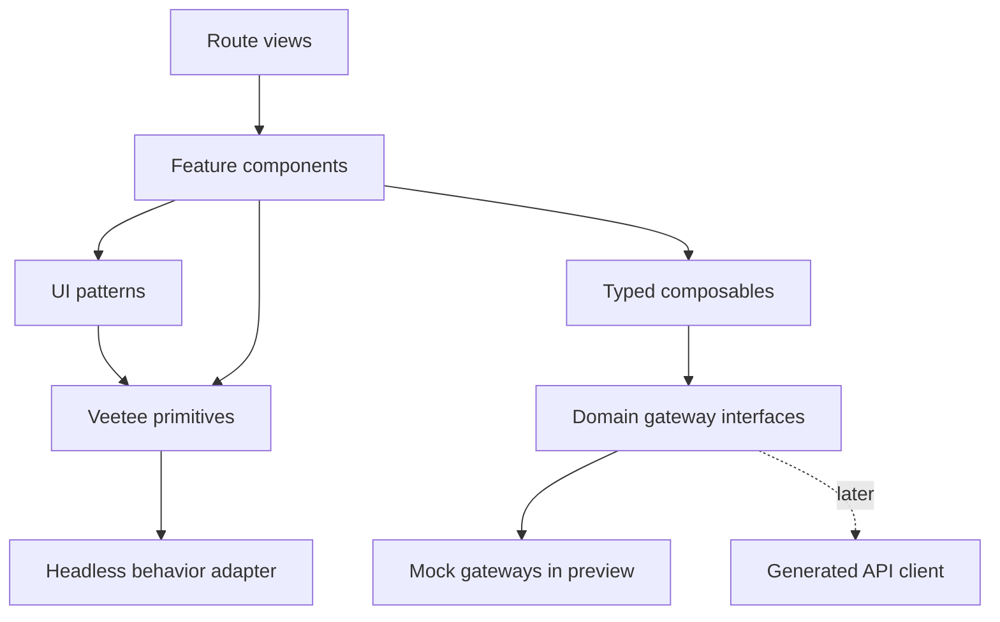

# Veetee Manager Web — UI preview design

- **Status:** Completed cho approved mock-only visual-preview scope; automated
  verification pass và current visual foundation đã được chủ dự án duyệt. Full
  primitive/keyboard/catalog coverage cùng complete snapshot matrix là promotion
  gates cho một Manager Web task được cấp quyền sau này, không phải current scope.
- **Ngày:** 2026-08-03
- **Scope:** UI preview ngoại lệ trước khi implementation toàn dự án được duyệt.
- **Stack đã chốt:** Vue 3, Vite, TypeScript, Tailwind CSS.
- **Tài liệu cha:** [Manager design](../../08-manager-design.md),
  [ADR-004](../../ADR/ADR-004-vue-manager-web.md),
  [Project map](../../../PROJECT.md), [AI workflow](../../../AGENTS.md).

## 1. Mục đích

UI preview cho phép chủ dự án đánh giá trực tiếp:

- visual direction và information hierarchy;
- component boundary và khả năng tái sử dụng;
- trạng thái tương tác của button/input/select/dialog/card;
- Assistant index và Assistant configuration workspace;
- responsive behavior ở desktop, tablet và mobile;
- chất lượng hiển thị tiếng Việt.

Đây là ngoại lệ explicit đã được phép tạo code và hiện nằm trong
`veetee-manager-web/`. Preview không kéo theo backend, database, firmware, Voice
Server hoặc production integration và không được dùng để tuyên bố M2/full Veetee
đã bắt đầu hay hoàn thành.

## 2. Scope và non-goals

### 2.1 Trong scope

Đây là **Core slice A** đã được chủ dự án chọn từ ba phương án preview. Slice A
ưu tiên một vertical UI flow đủ sâu để đánh giá component architecture; nó không
cố dựng nông toàn bộ sitemap.

UI preview gồm năm surface:

1. `/assistants`: Assistant index, search, status, create/add-device entry và
   Assistant cards.
2. `/assistants/:id/config/role`: role, locale, voice, base prompt, personality
   và speech controls.
3. `/assistants/:id/config/model-memory`: sáu provider selections, memory toggle
   và memory item sample states.
4. `/assistants/:id/devices`: device cards/list và Pair Device dialog.
5. `/_preview/components`: inventory của mọi primitive/pattern cùng interaction
   states để chủ dự án review. Route này chỉ được đăng ký trong preview/dev build,
   không xuất hiện trong production route manifest.

Các route dùng mock data nhưng navigation, form state, dialog, dropdown, filter,
loading và error behavior phải hoạt động thật trong browser.

| Entry | UI đích | Kết quả bắt buộc |
|---|---|---|
| `Tạo trợ lý` tại `/assistants` | `AssistantCreateDialog` | Validate name/locale, tạo mock resource, đóng dialog và đưa card mới vào list. |
| `Thêm thiết bị` hoặc action từ Assistant card | `PairDeviceDialog` | Validate verification code, mô phỏng fail/success và cập nhật device list. |
| `Cấu hình` trên Assistant card | Role workspace | Deep-link đúng Assistant, giữ top navigation và contextual workspace nav. |
| `Mô hình & bộ nhớ` | Model/memory workspace | Đúng sáu provider kind, một selection/kind và memory states. |
| `/_preview/components` | Component gallery | Xem và thao tác mọi primitive/scenario; không phải product route. |

### 2.2 Ngoài scope

- Không gọi Manager API hoặc Voice Server thật.
- Không login/auth thật, PostgreSQL, secret store hoặc persistence production.
- Không viết firmware, protocol adapter, ASR/LLM/TTS hoặc MCP runtime.
- Không implement voice cloning, knowledge base hoặc external MCP endpoint.
- Không có emoji collection hoặc conversation background.
- Không dùng UI preview làm bằng chứng rằng business workflow/backend đã chạy.
- Không render nav item hoặc button giả cho feature deferred. Mọi control nhìn
  thấy trong preview phải có interaction hợp lệ hoặc được ghi rõ là specimen
  trong component gallery.

## 3. Evidence và visual direction

Ảnh UI do chủ dự án cung cấp là evidence cho:

- information density và nhóm chức năng;
- top navigation của Assistant index;
- card hierarchy, toolbar, split action và status;
- cấu trúc form/modal, tabs, select/dropdown, textarea, switch, accordion;
- radius, border, spacing, control height và focus treatment.

Ảnh không cấp quyền sao chép brand, logo, tên sản phẩm, source code hoặc visual
asset. Preview dùng tên và nội dung Veetee.

### 3.1 Evidence manifest

Ảnh gốc được cung cấp trong chat và không được copy vào product repository. Spec
dùng các neutral evidence ID sau để tránh phụ thuộc tên brand/path tạm:

| Evidence ID | Surface quan sát | Điều được phép kế thừa | Manual review oracle |
|---|---|---|---|
| `UI-REF-ASSISTANT-INDEX` | Top navigation, page header, search/split action, Assistant cards | Density, grouping, thin border, card action hierarchy | Card/toolbar có cùng nhịp gọn, không pixel-match hoặc copy logo/text. |
| `UI-REF-ROLE-FORM` | Role configuration form khi voice list đóng | Modal/form section, select row, textarea, switch, accordion, footer | Control height/radius/border theo §4; form vẫn rõ ở Vietnamese content dài. |
| `UI-REF-VOICE-LISTBOX` | Voice select mở | Search field, listbox rows, selected/hover state, preview action | Custom listbox có keyboard parity và visual hierarchy tương đương. |

Chủ dự án đã duyệt visual direction của current preview. Visual regression phải
khóa baseline Veetee này bằng snapshot coverage đầy đủ; ba ảnh trên chỉ là manual
design evidence, không phải pixel-diff oracle.

### 3.2 Layout đã chọn: hybrid Workspace B

- **Application level:** top navigation và centered content container. Assistant
  index không có permanent sidebar.
- **Assistant index:** page header surface + search/split action + responsive card
  grid, theo information rhythm đã quan sát trong ảnh.
- **Assistant detail:** top navigation vẫn tồn tại; một contextual navigation chỉ
  xuất hiện bên trong Assistant workspace.
- **Mobile:** top navigation thu gọn thành trigger/menu; contextual navigation
  trở thành tabs/drawer; main form giữ một cột.
- **Modal:** chỉ dùng cho task bounded như create, pair, confirm hoặc voice picker;
  không nhét toàn bộ workspace nhiều section vào modal.

Thiết kế này giữ ưu điểm của ảnh tham khảo ở index/form controls nhưng tránh đưa
mọi cấu hình dài vào một modal khó deep-link và khó responsive.

## 4. Visual tokens

Các giá trị dưới là baseline của preview; chỉ thay đổi qua token, không viết cục
bộ trong feature component.

### 4.1 Color

| Token | Giá trị baseline | Vai trò |
|---|---:|---|
| `page` | `#F7FAFC` | Nền ứng dụng |
| `surface` | `#FFFFFF` | Card, form, header, modal |
| `surface-muted` | `#F1F5F8` | Tab group, muted control, inner metric |
| `border` | `#D5DFE9` | Border control/card mặc định |
| `border-hover` | `#A9B8C7` | Hover border |
| `text` | `#1F2937` | Heading/body chính |
| `text-muted` | `#667085` | Hint, caption, metadata |
| `primary` | `#2F6BFF` | Primary action, focus, selected |
| `primary-hover` | `#265CE0` | Primary hover |
| `success` | `#178965` | Online/success |
| `warning` | `#B7791F` | Warning |
| `danger` | `#D64550` | Destructive/error |
| `focus-ring` | `rgba(47,107,255,.20)` | Keyboard focus ring |

Status không được chỉ biểu đạt bằng màu; luôn có text và/hoặc icon.

### 4.2 Radius, border và shadow

| Element | Radius | Border/shadow |
|---|---:|---|
| Modal shell | `6px` | border mảnh + shadow bounded |
| Form section/accordion | `8px` | `1px border` |
| Assistant card/page header | `10px` | `1px border`, shadow chỉ khi hover |
| Input/select/textarea | `6px` | `1px border`; blue focus border |
| Button/tab/badge | `4–5px` | `1px border` khi secondary |
| Dropdown/listbox | `2–4px` | border + dropdown shadow |

Không dùng radius lớn hoặc shadow mềm trên mọi surface. Shadow chỉ xuất hiện khi
cần mô tả elevation thật: modal, popover/dropdown hoặc hovered interactive card.

Toast dùng một surface có border trung tính bao quanh và icon/tone semantic bên
trong; **không dùng accent stripe/bar màu** ở cạnh trái, phải, trên hoặc dưới.
Tone success/warning/error vẫn phải có icon và text, không chỉ đổi màu.

### 4.3 Sizing và spacing

- Input/select: `39–40px`.
- Footer/compact button: `34px`; primary toolbar button có thể `36px`.
- Click/tap target đạt tối thiểu theo accessibility rule, có padding ngoài icon.
- Spacing scale: `4, 8, 12, 16, 20, 24, 32`.
- Form label → control: `6–8px`; section padding: `14–20px`.
- Motion duration: `120–150ms`; không animate width/height làm layout giật.
- Select trigger giữ đúng một dòng và không tăng chiều cao theo label. Value dùng
  `min-width: 0`, `overflow: hidden`, `white-space: nowrap` và ellipsis; full label
  vẫn xuất hiện trong option/listbox accessible khi control mở.

## 5. Typography

### 5.1 Font đã chọn

**Be Vietnam Pro** là font chính vì:

- coverage và hình dáng dấu tiếng Việt rõ ở cỡ nhỏ;
- có weight phù hợp dashboard: 400, 500, 600, 700;
- giữ cảm giác thân thiện nhưng không làm form mất tính kỹ thuật;
- license SIL OFL phù hợp self-host.

Ngay cả preview cũng dùng font asset self-host/pinned; implementation artifact
phải:

- self-host WOFF2; không phụ thuộc Google Fonts lúc runtime;
- pin version, source và checksum;
- chỉ ship Latin + Vietnamese subset và weight cần thiết;
- dùng `font-display: swap`;
- fallback `Noto Sans`, `Segoe UI`, sans-serif.

Component không tự đặt `font-family`.

### 5.2 Type scale

| Role | Size/line-height | Weight |
|---|---|---:|
| Page title | `20/28` | 600–700 |
| Section title | `16/24` | 600 |
| Card title | `14/21` | 600 |
| Body/control | `13–14/20` | 400–500 |
| Label | `12–13/18` | 600 |
| Caption/metadata | `10–12/16` | 400–500 |

Không dùng font size nhỏ để nhồi dữ liệu; truncation phải có accessible full
label qua title/tooltip/detail view phù hợp.

### 5.3 Iconography

- Dùng một outline icon family có license rõ ràng; baseline là **Lucide** qua
  `VtIcon` wrapper.
- Stroke, size và alignment do token/variant của `VtIcon` quyết định.
- Không dùng emoji, ký tự Unicode ngẫu nhiên hoặc trộn nhiều icon family làm
  product icon.
- Icon-only button bắt buộc có accessible name và tooltip khi ý nghĩa không hiển
  nhiên.

### 5.4 Dependency provenance gate

Design spec không đoán package version hiện hành. Trước lần install đầu tiên,
implementation plan phải thực hiện read-only registry/upstream probe rồi ghi vào
lockfile/evidence manifest:

| Dependency/artifact | Gate trước install |
|---|---|
| Reka UI | Stable major, package integrity, license, Vue/browser support matrix và keyboard smoke test. |
| Be Vietnam Pro | Immutable source/revision, SIL OFL snapshot, WOFF2 checksums, Vietnamese glyph corpus. |
| Lucide | Pinned package/version/integrity, MIT license và icon wrapper smoke test. |

Không dùng `latest`, CDN runtime hoặc upstream branch không pin.

## 6. Component architecture



### 6.1 Directory responsibility

| Vùng | Trách nhiệm | Không được chứa |
|---|---|---|
| `app/` | boot, router, dependency injection, app providers | Feature markup |
| `layouts/` | `AppTopNav`, page shell, `AssistantWorkspaceNav` | Domain mutation |
| `ui/primitives/` | Visual tokens + complete interaction states | Assistant/device knowledge |
| `ui/patterns/` | Reusable composition như header/form/resource state | API fetch và feature rules |
| `features/assistants/` | Assistant list/config behavior | Global shell CSS |
| `features/devices/` | Device list/pair behavior | Provider/assistant internals |
| `features/providers/` | Provider selection/config presentation | Vendor-specific form hardcode |
| `views/` | Route-level composition | Primitive implementation |
| `mocks/` | Fixtures, mock gateways, scenario controls | Component markup |
| `i18n/` | Locale catalogs và typed keys | Business branching theo copy |

Route view chỉ compose feature. Một file không đồng thời fetch resource, quản lý
multi-section draft, render dialog và điều khiển navigation.

## 7. Primitive layer

### 7.1 Primitive inventory

- `VtButton`, `VtIconButton`, `VtSplitButton`.
- `VtInput`, `VtSearchInput`, `VtTextArea`, `VtFormField`.
- `VtSelect`, `VtListbox`, `VtVoiceOption`, `VtCheckbox`, `VtSwitch`.
- `VtTabs`, `VtAccordion`, `VtPopover`, `VtMenu`, `VtTooltip`.
- `VtDialog`, `VtConfirmDialog`, `VtDrawer`.
- `VtCard`, `VtBadge`, `VtStatus`, `VtAvatar`.
- `VtToast`, `VtLiveRegion`, `VtSpinner`, `VtSkeleton`, `VtEmptyState`.

### 7.2 Không dùng browser-default visual

Browser-default visual của `select`, checkbox, switch, dialog, dropdown, tooltip,
file input và date picker không được xuất hiện.

Semantic HTML/ARIA vẫn được giữ để browser, keyboard và assistive technology hiểu
control. Behavior phức tạp dùng **Reka UI stable major** bên trong Veetee wrapper.
Feature không import Reka UI trực tiếp và không được biết implementation bên dưới.

Primitive layer áp dụng CSS reset/`appearance` phù hợp, CSS variables và Tailwind
semantic mapping. Feature không dùng arbitrary color/radius/shadow để vượt token.
Scrollbar vẫn giữ native scroll semantics nhưng track/thumb được style đồng bộ,
có contrast và kích thước đủ thao tác.

Hai primitive rule đã được chủ dự án phản hồi trực tiếp và là regression contract:

- `VtToast` không render accent stripe; tone nằm ở icon, text và semantic token.
- `VtSelect` đóng luôn là single-line ellipsis; text dài không wrap hoặc đổi control
  height, còn option mở vẫn cung cấp label đầy đủ.

Lựa chọn này cân bằng:

- full visual control để bám ảnh;
- focus/keyboard/ARIA đáng tin hơn tự viết hoàn toàn;
- không bị visual lock-in như full component suite.

Quyết định phải được ghi thành ADR trước khi implementation production được
promote; UI preview chỉ dùng boundary đã nêu trong spec này.

### 7.3 State contract bắt buộc

Mọi interactive primitive phải có:

| State | Behavior |
|---|---|
| Default | Border/text/background theo token |
| Hover | Feedback nhẹ, không dịch layout |
| Focus-visible | Ring rõ cho keyboard; không dựa riêng vào border |
| Active/pressed/open | State bền và có `aria-*` phù hợp |
| Loading | Chặn double-submit; giữ kích thước; có accessible label |
| Disabled | Không action/hover; contrast và explanation hợp lệ |
| Read-only | Phân biệt disabled; vẫn selectable/copyable khi phù hợp |
| Error | Text/icon/association; không chỉ màu đỏ |
| Success | Feedback có text, không giữ vĩnh viễn nếu không cần |

Feature component không được tự định nghĩa radius, border, hover, focus hoặc
animation cho primitive.

## 8. Pattern và feature components

### 8.1 Shared patterns

- `PageHeader`: icon/title/count/actions.
- `SearchToolbar`: search, filters, split primary action.
- `ResourceState`: loading, empty, error, stale, offline.
- `FormSection`: title, hint, optional trailing control, body/footer.
- `RevisionState`: dirty/saving/saved/conflict marker.
- `RevisionConflictDialog`: giữ local draft và chỉ cho `reload`, `copy draft`
  hoặc `cancel`; không có silent merge/force overwrite.
- `ResponsiveCardGrid`: card/list presentation cùng semantics.
- `ConfirmAction`: destructive confirmation contract.

### 8.2 Assistant feature

- `AssistantIndexFeature`.
- `AssistantSearchToolbar`.
- `AssistantCard` và `AssistantMetricStrip`.
- `AssistantCreateDialog`.
- `AssistantWorkspaceHeader` và `AssistantWorkspaceNav`.
- `RoleConfigFeature`, `VoicePicker`, `PersonalityEditor`, `SpeechControls`.
- `ProviderSelectionGrid`, `MemoryPanel`.

### 8.3 Device feature

- `DeviceListFeature`, `DeviceCard`.
- `PairDeviceDialog`.
- `DeviceStatus`, `FirmwareSummary`.

Mỗi feature nhận typed data xuống và emit typed intent lên. Nó không biết mock
hay API gateway đang được inject.

## 9. Data flow và state ownership

```text
Route/View → Feature → Typed composable → Domain gateway
                                      ↘ MockGateway (preview)
                                      ↘ Generated client (later)
```

- Vue Router sở hữu route, Assistant ID, active section, search/filter/query.
- Pinia chỉ giữ UI preference và draft cần dùng xuyên route; không mirror toàn bộ
  Assistant/Device/Provider resources.
- Mock fixtures nằm trong `mocks/fixtures/`, không nằm trong SFC.
- Mock gateway trả Promise và typed result giống API boundary, có configurable
  delay để loading state quan sát được.
- Mock mutation cập nhật in-memory state. Reload hoặc `Reset demo` khôi phục
  deterministic fixture.
- Không persist provider secret hoặc sensitive prompt vào localStorage.
- `useRevisionedForm` dùng state:
  `clean → dirty → saving → saved | conflict | error`.
- Conflict mock phải cung cấp current revision + local draft và mở
  `RevisionConflictDialog`. `reload` thay draft bằng revision mới; `copy draft`
  sao chép nội dung local an toàn trước reload; `cancel` đóng dialog và giữ draft.
- Provider form/schema về sau đi qua schema renderer; feature core không hardcode
  vendor form.

## 10. Preview scenarios

`/_preview/components` và scenario selector phải cho xem:

- default populated state;
- initial loading và background refresh;
- empty list và filter-empty;
- offline/stale resource;
- validation error;
- revision conflict;
- provider unavailable;
- long-running action/loading;
- disabled/read-only controls;
- success và destructive confirmation.

Mỗi scenario phải kích hoạt được bằng control trong component gallery hoặc typed
MockGateway preset và tạo behavior thật, không chỉ đổi ảnh/text tĩnh. Scenario là
preview/test input, không phải product feature.

## 11. i18n

- `vi-VN` là locale mặc định của preview.
- Component dùng translation keys; không branch business logic theo Vietnamese
  string.
- UI locale và Assistant conversation locale là hai state khác nhau.
- Built-in catalog phải có key parity trước production build.
- Nội dung mock tiếng Việt phải đủ dấu và chứa tên/chuỗi giúp phát hiện lỗi font.

## 12. Error và accessibility contract

- Field validation hiện cạnh field, liên kết bằng `aria-describedby`, giữ draft
  và focus field lỗi đầu tiên.
- Toast không thay thế field error hoặc error summary.
- Mutation button có loading state và chặn double-submit.
- `VtLiveRegion`/`useAnnouncer` phát `polite` announcement cho save/pair/job
  success hoặc non-critical failure; destructive/focus-blocking error dùng
  `assertive` có kiểm soát. Announcement không lặp khi state không đổi.
- Dialog/popover/listbox quản lý focus, Escape, outside interaction và trả focus
  về trigger.
- Custom select hỗ trợ Arrow keys, Enter, Escape, Home/End và type-ahead.
- Tab có đúng tab/tabpanel semantics và keyboard behavior.
- Status luôn có text/icon; chart phải có text/table equivalent.
- Contrast và focus đạt WCAG 2.2 AA.
- `prefers-reduced-motion` tắt animation không thiết yếu.
- Responsive card/table không làm mất label semantics.

## 13. Testing contract

### 13.1 Static/build

- TypeScript strict typecheck.
- Lint và formatting check.
- Production Vite build.
- Translation key parity.

### 13.2 Unit/component

- Vitest + Vue Test Utils cho primitive props/events/states.
- Testing Library cho user behavior, không test implementation detail.
- axe-core cho automated accessibility checks.
- Contract test cấm feature import headless library trực tiếp.
- Contract test cấm native-default control xuất hiện ngoài primitive internals.

### 13.3 Browser/E2E

Playwright phải chạy các flow preview:

1. Search Assistant và clear filter.
2. Mở Assistant workspace.
3. Mở custom voice select, keyboard-select và preview option.
4. Sửa base prompt, thấy dirty state và save mock revision.
5. Chuyển Model & Memory section.
6. Mở Pair Device dialog, validation fail rồi success mock.
7. Tạo Assistant qua `AssistantCreateDialog` và thấy card mới.
8. Kích hoạt revision conflict; kiểm tra `reload`, `copy draft`, `cancel` không
   làm mất draft ngoài lựa chọn explicit.
9. Chạy offline/stale, provider unavailable và long-running action scenarios;
   xác nhận UI/action/announcement đúng contract.
10. Chạy destructive confirmation rồi cancel/confirm riêng.
11. Reset demo về fixtures.

Visual regression chụp:

- `/_preview/components` ở mọi primitive state;
- `/assistants`;
- role workspace;
- model/memory workspace;
- devices + Pair Device dialog;
- desktop, tablet và mobile viewport.

Visual snapshot contract cố định:

- Chromium managed version đã pin, device scale factor `1`;
- viewport desktop `1440×900`, tablet `1024×768`, mobile `390×844`;
- chờ `document.fonts.ready`, mock data/network idle và stable layout marker;
- fixed clock/timezone/locale, tắt caret và animation, bật reduced motion;
- current visual foundation đã được chủ dự án duyệt; snapshot matrix vẫn phải tạo
  theo coverage trên. `maxDiffPixelRatio` mặc định `0.002`; mọi diff vượt gate cần
  review thay vì auto-update snapshot.

## 14. Acceptance checklist

Evidence đã chạy từ `veetee-manager-web/` trên host Ubuntu, không container:

| Gate | Evidence hiện tại |
|---|---|
| Static/build | `npm test` pass typecheck, lint, 3 unit files/12 tests và production Vite build. |
| Browser | `npm run test:e2e` pass 6 Chromium tests: search/create/reset, custom select/save, pair validation/success, provider error + revision conflict, mobile overflow/context nav và axe. |
| Accessibility | Axe quét cả năm surface; không có violation impact `serious` hoặc `critical`. |
| Font | Build emit self-host WOFF2 Latin + Vietnamese cho weight 400/500/600/700; không dùng runtime font CDN. |
| Boundary | Năm route dùng injectable MockGateway/in-memory fixtures; không có Manager API, database, auth, Voice Server hoặc firmware integration. |

- [x] Chạy host-native bằng documented npm commands; không Docker/Compose.
- [x] Năm surface trong §2.1 navigate và tương tác được bằng mock data.
- [x] Không có backend/firmware/product runtime code ngoài Manager Web preview.
- [x] Assistant index dùng top navigation; contextual navigation chỉ ở workspace.
- [x] Component dùng token §4, Reka chỉ qua `Vt*` wrappers và không lộ browser-default UI.
- [x] Be Vietnam Pro hiển thị đúng Vietnamese corpus; font được self-host/pin.
- [ ] Mọi primitive state ở §7.3 xem được trong component preview.
- [ ] Keyboard-only hoàn thành core flows.
- [x] Typecheck/lint/build, 12 unit tests, 6 E2E, axe và responsive overflow checks pass.
- [x] Chủ dự án đã duyệt visual foundation hiện tại: hierarchy, layout,
  typography, token/component styling và responsive direction.
- [ ] Visual-regression snapshot matrix bao phủ mọi surface liệt kê ở §13.3 tại
  1440×900, 1024×768 và 390×844; visual approval hiện tại không thay coverage này.
- [ ] Toàn bộ mock/demo catalog không hardcode trong component; core
  Assistant/device/provider resources đã qua gateway và có Reset demo, nhưng một
  số locale/personality/speech option vẫn còn khai báo tại feature.
- [x] `references/` không bị sửa; product naming chỉ dùng Veetee/trung tính.

Các ô chưa đạt là promotion evidence được defer có chủ ý. Visual-review objective
của preview đã đóng; không viết thêm UI code trong current docs-only scope. Một
Manager Web task được cấp quyền sau này phải hoàn thành chúng trước production/M2
promotion; chúng không được tự động coi là pass.

## 15. Handoff boundary

Implementation preview đã đi theo boundary sau:

1. tạo implementation plan chỉ cho `veetee-manager-web` preview;
2. scaffold host-native Vue/Vite/Tailwind app;
3. dựng token + font + primitive layer trước;
4. dựng `/_preview/components` để review primitives;
5. dựng Assistant index, workspace, model/memory và devices;
6. chạy quality gates và mở local URL cho chủ dự án review.

Owner visual review của current preview đã hoàn tất. Manager API, Voice Server và
firmware vẫn design-only; approval này không cấp quyền implementation toàn dự án
hoặc M2. Yêu cầu hiện tại chỉ cho phép hoàn thiện docs/plans.
